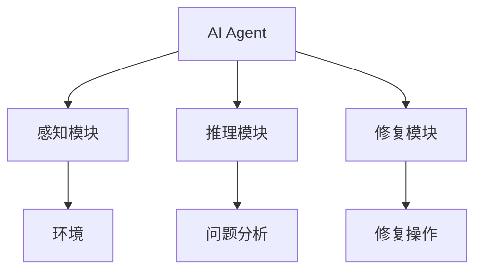
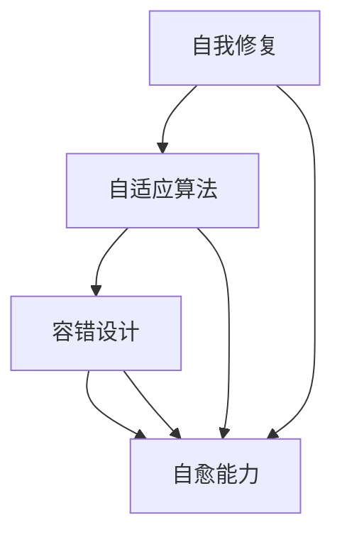

                 

# 构建具有自我修复能力的AI Agent

> 关键词：AI Agent，自我修复，自适应算法，容错设计，自愈能力

> 摘要：  
随着人工智能技术的快速发展，AI Agent（智能体）在各个领域的应用越来越广泛。然而，AI Agent在实际应用中常常面临复杂多变的环境和不可预见的问题，传统的被动响应方式已无法满足需求。本文将深入探讨如何构建具有自我修复能力的AI Agent，从核心概念、算法原理、系统架构到项目实战，全面解析其实现方法和应用场景。通过本文的分析，读者将能够理解并掌握如何设计和实现一个能够在复杂环境中自我检测、自我修复的智能系统。

---

# 第一部分: 自我修复AI Agent的背景与概念

## 第1章: 自我修复AI Agent的背景与问题描述

### 1.1 问题背景

#### 1.1.1 AI Agent的基本概念  
AI Agent（人工智能智能体）是指在特定环境中能够感知环境、自主决策并执行任务的智能系统。它可以是一个软件程序、机器人或其他智能设备，通过与环境交互来实现预定目标。AI Agent的核心能力包括感知、推理、规划和执行。

#### 1.1.2 自我修复能力的重要性  
在实际应用中，AI Agent可能会面临各种意外情况，例如环境变化、任务目标调整、硬件故障或数据错误等。传统AI Agent通常依赖外部监控和人工干预来解决问题，这种方式不仅效率低下，还可能导致系统崩溃或任务失败。因此，具备自我修复能力的AI Agent能够主动识别问题、分析原因并采取修复措施，从而提高系统的稳定性和可靠性。

#### 1.1.3 当前AI Agent的局限性  
当前大多数AI Agent缺乏自我修复能力，主要依赖外部监控和人工干预。这种设计在复杂多变的环境中表现不佳，尤其是在需要快速响应和持续运行的任务中，可能会导致严重的后果。例如，在自动驾驶系统中，AI Agent必须能够实时检测和修复传感器故障或算法错误，以确保行驶安全。

---

### 1.2 问题描述

#### 1.2.1 自我修复AI Agent的目标  
本文的目标是设计和实现一个能够自我修复的AI Agent，使其能够在复杂环境中自动检测问题、分析原因并采取修复措施，从而提高系统的稳定性和适应性。

#### 1.2.2 自我修复能力的定义与范围  
自我修复能力是指AI Agent在运行过程中，能够主动识别异常情况、错误或故障，并通过内部机制进行修复的能力。它包括自我检测、自我诊断、自我修复和自我优化四个环节。自我修复能力的范围涵盖硬件、软件、数据和算法等多个方面。

#### 1.2.3 自我修复AI Agent的应用场景  
自我修复AI Agent的应用场景广泛，例如自动驾驶、智能机器人、工业自动化、智能安防等领域。在这些场景中，AI Agent需要能够在复杂环境中自主运行，及时发现并修复问题，以确保任务的顺利执行。

---

### 1.3 问题解决思路

#### 1.3.1 自我修复机制的设计原则  
- **主动性**：AI Agent应主动监控自身的状态和环境，及时发现潜在问题。
- **智能化**：通过机器学习和推理能力，AI Agent能够分析问题原因并制定修复方案。
- **模块化**：系统设计应模块化，便于问题定位和修复。

#### 1.3.2 自我修复能力的实现路径  
- **自我检测**：通过传感器、日志分析等方式，实时监控系统状态。
- **自我诊断**：基于检测结果，分析问题原因并生成修复建议。
- **自我修复**：执行修复操作，例如调整参数、重新初始化或调用外部服务。

#### 1.3.3 自我修复与传统AI Agent的区别  
- **主动性**：传统AI Agent依赖外部指令，而自我修复AI Agent能够主动发现问题。
- **智能化**：传统AI Agent通常基于规则，而自我修复AI Agent具备学习和推理能力。
- **适应性**：自我修复AI Agent能够根据环境变化进行自适应调整。

---

### 1.4 边界与外延

#### 1.4.1 自我修复能力的边界  
- **范围限制**：自我修复能力仅针对系统内部问题，无法解决外部环境中的不可抗力因素。
- **能力限制**：AI Agent的自我修复能力依赖于其设计和算法，无法超越设计范围。

#### 1.4.2 自我修复AI Agent的外延  
- **智能化提升**：通过不断学习和优化，AI Agent的自我修复能力可以逐步增强。
- **多领域应用**：自我修复能力可以在多个领域中应用，例如医疗、金融、交通等。

#### 1.4.3 相关概念的对比与区分  
| 概念       | 定义                           | 特点                     | 应用场景                 |
|------------|--------------------------------|--------------------------|--------------------------|
| AI Agent   | 智能体，能够感知环境并执行任务 | 主动性、智能性             | 自动驾驶、智能机器人     |
| 自我修复   | 主动检测并修复问题的能力       | 主动性、智能化             | 复杂环境中的自主运行     |
| 自适应算法 | 根据环境变化调整算法           | 灵活性、动态性             | 动态环境中的任务执行     |

---

### 1.5 核心要素与概念结构

#### 1.5.1 自我修复AI Agent的核心要素  
- **感知模块**：用于感知环境和系统状态。
- **推理模块**：用于分析问题并制定修复方案。
- **修复模块**：用于执行修复操作。
- **学习模块**：用于优化修复策略。

#### 1.5.2 概念结构图  

#### 1.5.3 核心要素的相互关系  
- 感知模块与环境交互，提供实时数据。
- 推理模块基于感知数据进行问题分析。
- 修复模块根据分析结果执行修复操作。
- 学习模块通过反馈优化修复策略。

---

## 第2章: 自我修复AI Agent的核心概念与联系

### 2.1 自我修复机制的原理

#### 2.1.1 自我检测与诊断  
自我检测是自我修复的第一步，通过传感器、日志分析或状态监控等方式，实时检测系统中的异常情况。例如，AI Agent可以通过温度传感器检测设备过热，或通过日志分析发现算法错误。

#### 2.1.2 自动修复与恢复  
在检测到问题后，AI Agent需要通过推理和分析确定问题原因，并制定修复方案。例如，当检测到传感器故障时，AI Agent可以尝试切换到备用传感器或重新初始化设备。

#### 2.1.3 自适应调整  
自我修复不仅包括问题修复，还包括根据环境变化进行自适应调整。例如，在任务目标发生变化时，AI Agent可以动态调整其行为策略。

---

### 2.2 自我修复与自适应算法

#### 2.2.1 自我修复算法的分类  
- **基于规则的修复算法**：根据预定义的规则进行修复。
- **基于机器学习的修复算法**：通过机器学习模型进行问题分析和修复。

#### 2.2.2 自适应算法的核心原理  
自适应算法通过实时感知环境变化，动态调整算法参数或行为策略。例如，AI Agent可以通过强化学习优化其决策策略，以适应不同的环境条件。

#### 2.2.3 自我修复与自适应算法的对比  
| 对比维度 | 自我修复         | 自适应算法       |
|----------|-----------------|-----------------|
| 目标     | 修复问题         | 适应环境变化     |
| 方法     | 主动检测与修复   | 动态调整参数     |
| 应用场景 | 系统故障修复     | 动态环境中的任务执行 |

---

### 2.3 容错设计与自愈能力

#### 2.3.1 容错设计的基本原则  
容错设计是指在系统设计阶段，通过冗余、备份和容错机制，提高系统的健壮性和可靠性。例如，AI Agent可以通过冗余传感器或备份系统确保任务的连续性。

#### 2.3.2 自愈能力的实现方式  
自愈能力是指系统在发生故障后，能够自动恢复到正常状态。例如，AI Agent可以通过故障切换、自愈算法或冗余机制实现自愈。

#### 2.3.3 容错设计与自愈能力的关系  
容错设计是实现自愈能力的基础，而自愈能力是容错设计的具体体现。通过容错设计，系统能够在故障发生时快速恢复，从而实现自愈能力。

---

### 2.4 核心概念对比表

| 概念       | 定义                           | 特点                     | 应用场景                 |
|------------|--------------------------------|--------------------------|--------------------------|
| 自我修复   | 主动检测并修复问题的能力       | 主动性、智能化             | 复杂环境中的自主运行     |
| 自适应算法 | 根据环境变化调整算法           | 灵活性、动态性             | 动态环境中的任务执行     |
| 容错设计   | 系统设计中预防和处理错误       | 健壮性、可靠性             | 系统稳定性和可靠性       |
| 自愈能力   | 系统在故障后自动恢复的能力     | 自主性、恢复性             | 系统故障修复和连续性     |

---

### 2.5 概念关系图

---

## 总结  
通过以上分析，我们可以看到，构建具有自我修复能力的AI Agent需要综合运用多种技术手段，包括自我检测、自适应算法、容错设计和自愈能力。接下来，我们将从算法原理、系统架构到项目实战，详细探讨如何实现这一目标。

