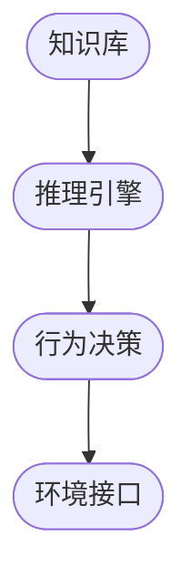

                 


# 构建具有认知计算能力的AI Agent

> 关键词：认知计算，AI Agent，算法原理，系统架构，项目实战

> 摘要：本文详细探讨了构建具有认知计算能力的AI Agent的各个方面，从背景介绍到系统架构设计，再到项目实战。通过逐步分析和逻辑推理，本文揭示了认知计算的核心原理、算法实现、系统设计以及实际应用案例。旨在帮助读者全面理解AI Agent的设计与实现过程，并掌握相关技术的关键点。

---

## 目录大纲

### 第一章：认知计算与AI Agent的背景介绍

#### 1.1 问题背景
- 1.1.1 传统AI的局限性
- 1.1.2 认知计算的提出与目标
- 1.1.3 AI Agent在认知计算中的作用

#### 1.2 问题描述
- 1.2.1 AI Agent的基本定义
- 1.2.2 认知计算的核心问题
- 1.2.3 问题解决的路径与方法

#### 1.3 问题解决
- 1.3.1 AI Agent的设计原则
- 1.3.2 认知计算的关键技术
- 1.3.3 AI Agent的实现框架

#### 1.4 边界与外延
- 1.4.1 AI Agent的边界条件
- 1.4.2 认知计算的适用范围
- 1.4.3 与其他技术的区分与联系

#### 1.5 概念结构与核心要素
- 1.5.1 AI Agent的核心要素
- 1.5.2 认知计算的层次结构
- 1.5.3 问题解决的逻辑流程

### 第二章：认知计算的核心概念与联系

#### 2.1 核心概念原理
- 2.1.1 认知模型的构建
- 2.1.2 知识表示与推理
- 2.1.3 学习与自适应机制

#### 2.2 概念属性特征对比表
| 概念       | 属性       | 特征                                                                 |
|------------|------------|----------------------------------------------------------------------|
| AI Agent   | 输入       | 感知数据                                                           |
|            | 输出       | 行为决策                                                           |
|            | 核心       | 知识库、推理引擎                                                   |
| 认知计算   | 方法       | 逻辑推理、机器学习                                                 |

#### 2.3 ER实体关系图
```mermaid
er
  entity(Agent) {
    id: string
    knowledge: string
    goals: string
    actions: string
  }
  entity(Environment) {
    state: string
    events: string
  }
  relationship(Agent, Environment) {
    - Agent感知Environment的状态和事件
    - Environment对Agent的行为做出反应
  }
```

### 第三章：认知计算的算法原理

#### 3.1 认知计算的关键算法
- 3.1.1 逻辑推理算法
  - 基于知识图谱的推理
  - 逻辑规则的动态推理
  - 概率推理与贝叶斯网络

#### 3.2 学习算法
- 3.2.1 增量学习算法
  - 在线学习机制
  - 知识库的动态更新
  - 自适应推理引擎

#### 3.3 算法实现
- 3.3.1 算法流程图
```mermaid
flow
    st => start
    op => operation
    end => end
    st --> op1
    op1 --> op2
    op2 --> end
```

- 3.3.2 Python实现示例
  ```python
  def cognitive_computation_algorithm(knowledge_base, inputs):
      # 更新知识库
      updated_kb = update_knowledge_base(knowledge_base, inputs)
      # 推理过程
      result = infer_from_kb(updated_kb)
      return result
  ```

### 第四章：认知计算的数学模型

#### 4.1 逻辑推理模型
- 4.1.1 基本逻辑运算
  - 与、或、非运算
  - 命题逻辑与谓词逻辑

#### 4.2 概率计算模型
- 4.2.1 贝叶斯网络
  - 联合概率公式：$$ P(A|B) = \frac{P(B|A)P(A)}{P(B)} $$
  - 条件概率的应用

#### 4.3 知识表示模型
- 4.3.1 概念网络
- 4.3.2 知识图谱
  - 实体与关系表示
  - 知识图谱的构建与推理

### 第五章：系统架构设计

#### 5.1 问题场景介绍
- 复杂决策系统的构建
- 知识驱动的智能系统设计

#### 5.2 系统功能设计
- 功能模块划分
  - 知识表示模块
  - 推理引擎模块
  - 学习与自适应模块

#### 5.3 系统架构设计
- 组件交互关系


#### 5.4 系统接口设计
- 标准接口定义
  - 输入接口
  - 输出接口
  - 知识库接口

#### 5.5 系统交互流程
- 交互流程图
```mermaid
sequence
    participant Agent
    participant Environment
    Agent -> Environment: 感知环境状态
    Environment -> Agent: 返回状态反馈
    Agent -> Agent: 内部推理与决策
    Agent -> Environment: 执行行为
```

### 第六章：项目实战

#### 6.1 环境安装
- 开发环境配置
- 依赖库安装
  - Python库：numpy, pandas, scikit-learn
  - 知识库构建工具：Ubergraph, GraphDB

#### 6.2 核心实现
- 代码实现
  ```python
  class CognitiveAgent:
      def __init__(self, knowledge_base):
          self.kb = knowledge_base

      def update_knowledge(self, new_data):
          # 更新知识库
          pass

      def infer(self, query):
          # 推理过程
          return result
  ```

#### 6.3 实际案例分析
- 应用场景分析
- 系统实现细节解读

#### 6.4 项目小结
- 项目总结
- 经验与教训

### 第七章：最佳实践与扩展阅读

#### 7.1 小结
- 本章总结
- 关键点回顾

#### 7.2 注意事项
- 实践中的常见问题
- 优化建议

#### 7.3 扩展阅读
- 推荐阅读资料
- 相关领域最新进展

---

通过以上目录大纲，我们可以看到，文章将从认知计算与AI Agent的背景介绍开始，逐步深入探讨其核心概念、算法原理、数学模型、系统架构设计、项目实战以及最佳实践，最终帮助读者全面理解和掌握构建具有认知计算能力的AI Agent的方法与技巧。

