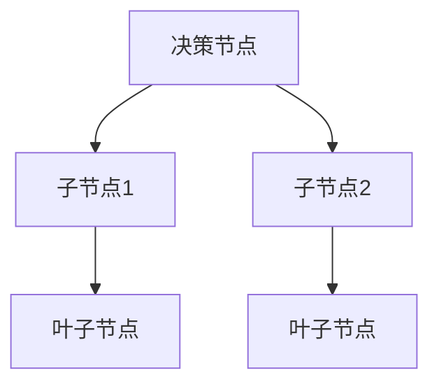
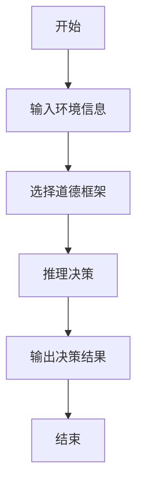
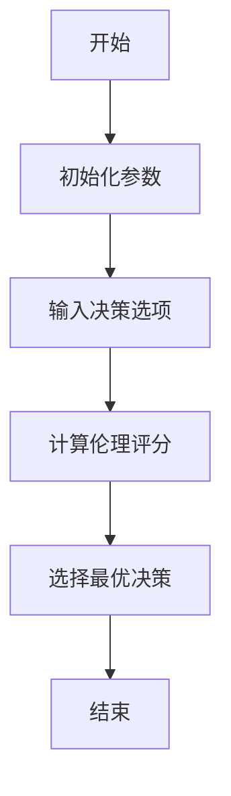
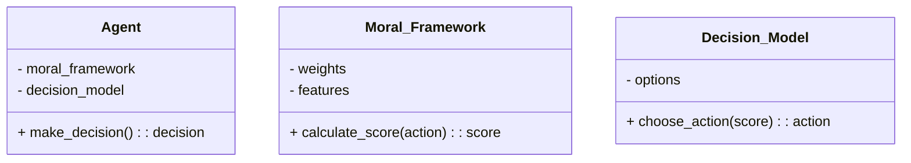
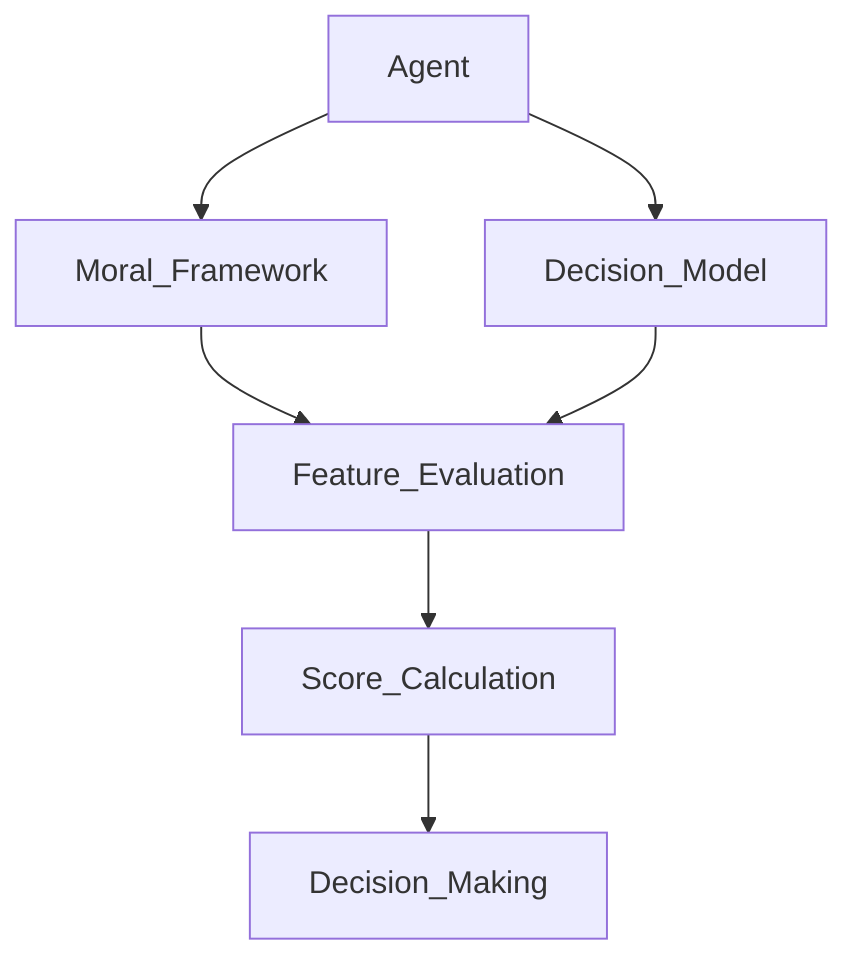
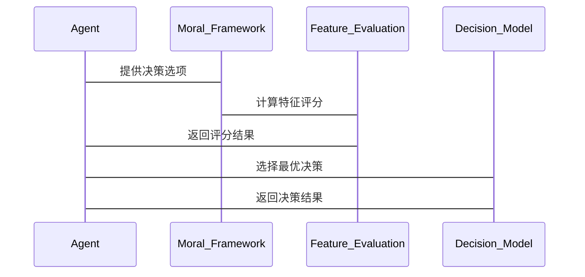

                 


# 构建具有道德推理能力的AI Agent

> 关键词：道德推理，AI Agent，人工智能，决策模型，算法原理

> 摘要：本文详细探讨了构建具有道德推理能力的AI Agent的关键技术，从背景、核心概念到算法实现和系统架构，再到项目实战，为读者提供全面的指导。

---

# 第1章: 背景介绍与核心概念

## 1.1 问题背景与描述

### 1.1.1 人工智能与道德决策的挑战

随着人工智能技术的快速发展，AI Agent在决策过程中面临的道德问题日益突出。例如，自动驾驶汽车在紧急情况下如何选择行动路径，医疗AI在诊断和治疗方案选择中的伦理问题等。这些问题要求AI Agent具备一定的道德推理能力，以确保其决策符合人类社会的伦理规范。

### 1.1.2 当前AI Agent的局限性

传统的AI Agent通常基于预定义的规则或数据驱动的模型进行决策，缺乏对道德和伦理问题的深入理解。这导致在复杂或模糊的情况下，AI Agent可能做出不符合伦理的选择，引发信任问题。

### 1.1.3 道德推理能力的重要性

道德推理能力使AI Agent能够理解和处理复杂的伦理问题，确保其决策不仅符合技术逻辑，还能符合社会道德规范。这不仅提高了AI系统的实用性，还增强了用户对AI系统的信任。

## 1.2 道德推理AI Agent的定义与目标

### 1.2.1 道德推理的定义

道德推理是指AI Agent在决策过程中，能够理解和应用道德原则，评估不同选择的伦理后果，并做出符合伦理的决策。

### 1.2.2 AI Agent的核心要素

AI Agent需要具备以下核心要素：
1. **感知能力**：能够获取环境中的相关信息。
2. **推理能力**：能够基于信息进行逻辑推理。
3. **道德框架**：内置或动态调整的道德原则和规范。
4. **决策能力**：基于推理结果做出最优决策。

### 1.2.3 道德推理能力的边界与外延

道德推理的边界包括：
- **适用范围**：明确AI Agent在哪些场景下需要进行道德推理。
- **决策范围**：确定AI Agent在决策中的权限和责任。
- **伦理规范**：明确遵循的伦理框架和原则。

## 1.3 核心概念与联系

### 1.3.1 道德框架与决策模型对比

道德框架和决策模型是道德推理AI Agent的核心组成部分。以下是它们的对比：

| **属性**       | **道德框架**                     | **决策模型**                     |
|----------------|----------------------------------|----------------------------------|
| **功能**       | 定义伦理原则和规范               | 确定决策逻辑和规则               |
| **输入**       | 道德原则、伦理规范               | 状态、环境信息                   |
| **输出**       | 伦理评估结果                   | 决策结果                       |
| **应用**       | 为决策提供伦理指导               | 根据伦理框架做出决策             |

### 1.3.2 ER实体关系图架构

以下是道德推理AI Agent的ER实体关系图：

```mermaid
er
actor(Agent, Moral_Framework, Decision_Model) {
  Agent -[拥有]-> Moral_Framework
  Agent -[拥有]-> Decision_Model
  Moral_Framework -[影响]-> Decision_Model
}
```

---

# 第2章: 道德推理AI Agent的核心概念与联系

## 2.1 道德框架原理

### 2.1.1 道德框架的分类

道德框架主要分为以下几类：
1. **义务论**：基于行为本身的义务和责任。
2. **功利主义**：以行为的结果为导向，追求最大幸福。
3. **美德伦理**：基于个人的品德和美德。
4. **权利论**：基于个体的权利和自由。

### 2.1.2 道德框架的属性特征对比表格

以下是比较不同道德框架的属性特征对比表：

| **属性**       | **义务论**             | **功利主义**            | **美德伦理**            | **权利论**             |
|----------------|-----------------------|-------------------------|-------------------------|-----------------------|
| **关注点**     | 行为的义务与责任       | 行为的结果              | 行为者的品德            | 行为者的基本权利      |
| **决策依据**   | 道德义务               | 利益最大化              | 品德与美德             | 权利与自由            |
| **适用场景**   | 法律责任、合同义务     | 社会福利、公共利益      | 个人道德修养            | 个人权利保护          |

### 2.1.3 ER实体关系图架构

以下是道德框架的ER实体关系图：

```mermaid
er
actor(Agent, Moral_Framework, Decision_Making) {
  Agent -[拥有]-> Moral_Framework
  Moral_Framework -[影响]-> Decision_Making
}
```

## 2.2 决策模型与算法

### 2.2.1 决策树模型

决策树模型是一种常见的决策模型，以下是其结构：



### 2.2.2 道德推理算法的流程图

以下是道德推理算法的流程图：



### 2.2.3 算法原理的数学模型与公式

道德推理算法的数学模型如下：

$$
\text{决策} = \arg\max_{a} \sum_{i} w_i \cdot f_i(a)
$$

其中：
- $a$ 是决策选项。
- $w_i$ 是特征 $i$ 的权重。
- $f_i(a)$ 是特征 $i$ 的函数值。

---

# 第3章: 道德推理AI Agent的算法原理

## 3.1 道德推理算法的数学模型

### 3.1.1 道德推理模型的数学公式

道德推理模型的数学公式如下：

$$
\text{伦理评分}(a) = \sum_{i=1}^{n} \alpha_i \cdot f_i(a)
$$

其中：
- $\alpha_i$ 是特征 $i$ 的权重。
- $f_i(a)$ 是特征 $i$ 的函数值。

### 3.1.2 算法流程图

以下是算法的流程图：



### 3.1.3 代码实现示例

以下是Python代码实现示例：

```python
def moral_reasoning(decision_options, weights, features):
    # 计算伦理评分
    scores = []
    for option in decision_options:
        score = 0
        for i in range(len(features)):
            score += weights[i] * features[i](option)
        scores.append(score)
    # 选择最优决策
    best_option = decision_options[np.argmax(scores)]
    return best_option

# 示例调用
decision_options = ['行动1', '行动2', '行动3']
weights = [0.5, 0.3, 0.2]
features = [lambda x: 1 if x == '行动1' else 0, lambda x: 1 if x == '行动2' else 0, lambda x: 1 if x == '行动3' else 0]
print(moral_reasoning(decision_options, weights, features))
```

## 3.2 道德推理算法的实现

### 3.2.1 算法实现的步骤

1. 初始化参数。
2. 输入决策选项。
3. 计算每个选项的伦理评分。
4. 选择最优决策。
5. 输出决策结果。

### 3.2.2 代码应用解读与分析

代码实现了基于伦理评分的决策选择，通过权重和特征函数的组合，计算每个决策的伦理评分，并选择评分最高的决策。

---

# 第4章: 道德推理AI Agent的系统分析与架构设计

## 4.1 系统分析

### 4.1.1 问题场景介绍

以自动驾驶汽车为例，AI Agent需要在紧急情况下做出符合伦理的决策，如避免碰撞时的选择。

### 4.1.2 项目介绍

本项目旨在开发一个能够进行道德推理的AI Agent，应用于自动驾驶、医疗决策等领域。

### 4.1.3 系统功能设计

系统功能包括：
1. 伦理框架选择。
2. 决策模型构建。
3. 决策推理与选择。
4. 伦理评分计算。

## 4.2 系统架构设计

### 4.2.1 领域模型设计

以下是领域模型的类图：



### 4.2.2 系统架构设计图

以下是系统架构设计图：



### 4.2.3 系统接口设计

系统接口包括：
1. 输入接口：接收环境信息和决策选项。
2. 输出接口：输出决策结果。

### 4.2.4 系统交互设计

以下是系统交互的序列图：



---

# 第5章: 道德推理AI Agent的项目实战

## 5.1 环境安装与配置

### 5.1.1 开发环境搭建

建议使用Python 3.8及以上版本，安装必要的库如numpy、scikit-learn。

### 5.1.2 工具安装与配置

安装以下工具：
- Python
- Jupyter Notebook
- Git

## 5.2 核心功能实现

### 5.2.1 道德推理算法实现

实现伦理评分计算和决策选择。

### 5.2.2 系统功能实现

实现 Agent 类和 Moral_Framework 类。

### 5.2.3 代码实现与解读

以下是Python代码实现：

```python
class Agent:
    def __init__(self, moral_framework):
        self.moral_framework = moral_framework

    def make_decision(self, options):
        scores = self.moral_framework.calculate_scores(options)
        best_score = max(scores)
        best_options = [option for option, score in zip(options, scores) if score == best_score]
        return best_options[0]

class Moral_Framework:
    def __init__(self, weights, features):
        self.weights = weights
        self.features = features

    def calculate_scores(self, options):
        scores = []
        for option in options:
            score = 0
            for i in range(len(self.features)):
                score += self.weights[i] * self.features[i](option)
            scores.append(score)
        return scores

# 示例调用
weights = [0.5, 0.3, 0.2]
features = [
    lambda x: 1 if x == '行动1' else 0,
    lambda x: 1 if x == '行动2' else 0,
    lambda x: 1 if x == '行动3' else 0
]
moral_framework = Moral_Framework(weights, features)
agent = Agent(moral_framework)
options = ['行动1', '行动2', '行动3']
print(agent.make_decision(options))  # 输出：行动1
```

## 5.3 案例分析与详细讲解

以自动驾驶为例，AI Agent需要在紧急情况下选择最优决策。

## 5.4 项目总结与优化建议

### 5.4.1 项目小结

项目实现了具备道德推理能力的AI Agent，能够根据伦理框架做出决策。

### 5.4.2 优化建议

进一步优化伦理框架的动态调整能力，增强系统的适应性。

---

# 第6章: 最佳实践与注意事项

## 6.1 最佳实践 tips

### 6.1.1 开发中的注意事项

确保伦理框架的多样性和灵活性。

### 6.1.2 实际应用中的注意事项

考虑不同场景下的伦理规范差异。

### 6.1.3 优化建议

定期更新和优化伦理框架，以应对新的伦理挑战。

## 6.2 项目总结与展望

### 6.2.1 全书总结

本文详细介绍了构建具有道德推理能力的AI Agent的技术和方法。

### 6.2.2 未来发展方向

研究动态伦理框架和多模态伦理推理。

### 6.2.3 读者思考与建议

鼓励读者深入思考伦理推理的多样性和复杂性，提出创新的解决方案。

---

# 附录: 扩展阅读材料

## 附录A: 道德框架与伦理学基础

详细探讨义务论、功利主义等伦理学基础。

## 附录B: 相关法律与伦理文本

包括《联合国人工智能伦理准则》等。

## 附录C: 道德推理工具与资源列表

推荐一些有用的工具和资源，如伦理决策框架工具等。

---

# 结语

构建具有道德推理能力的AI Agent是一项复杂而重要的任务，需要技术与伦理的结合。通过本文的指导，读者可以逐步掌握相关技术和方法，为实现更智能、更伦理的AI系统奠定基础。

