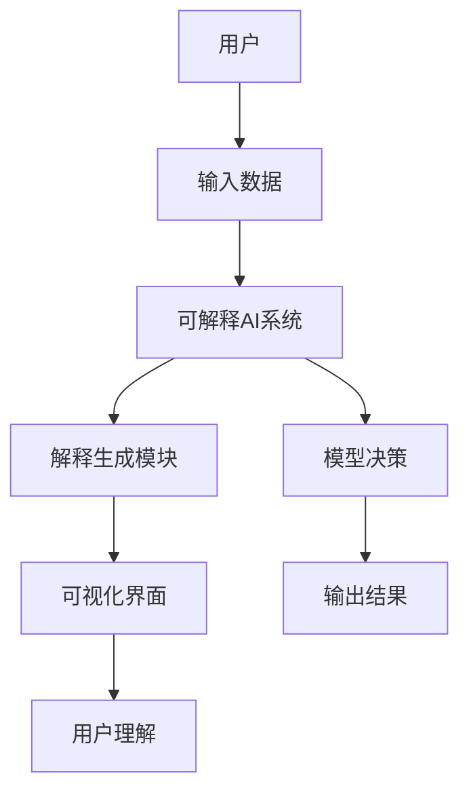
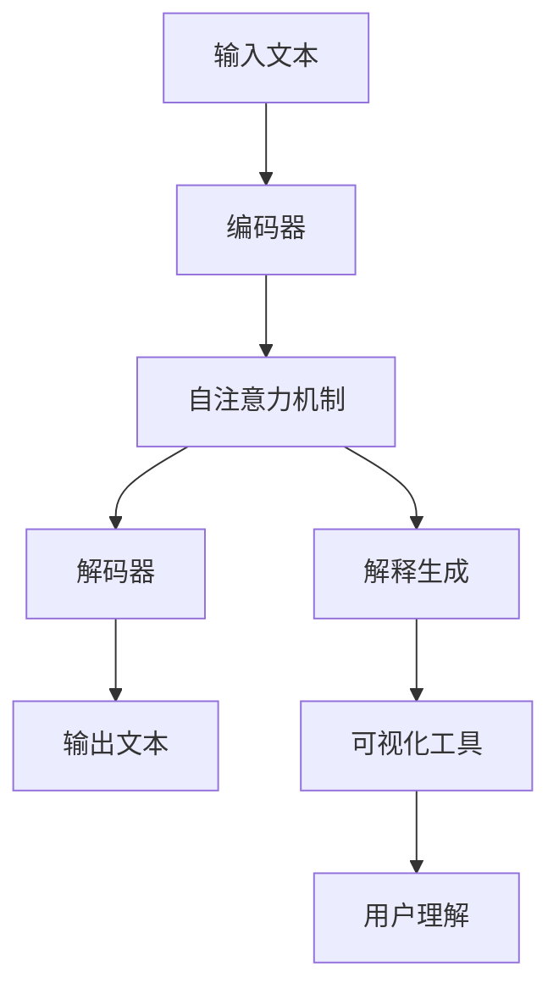
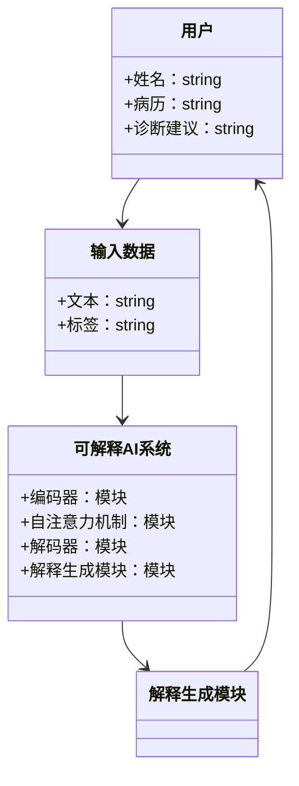
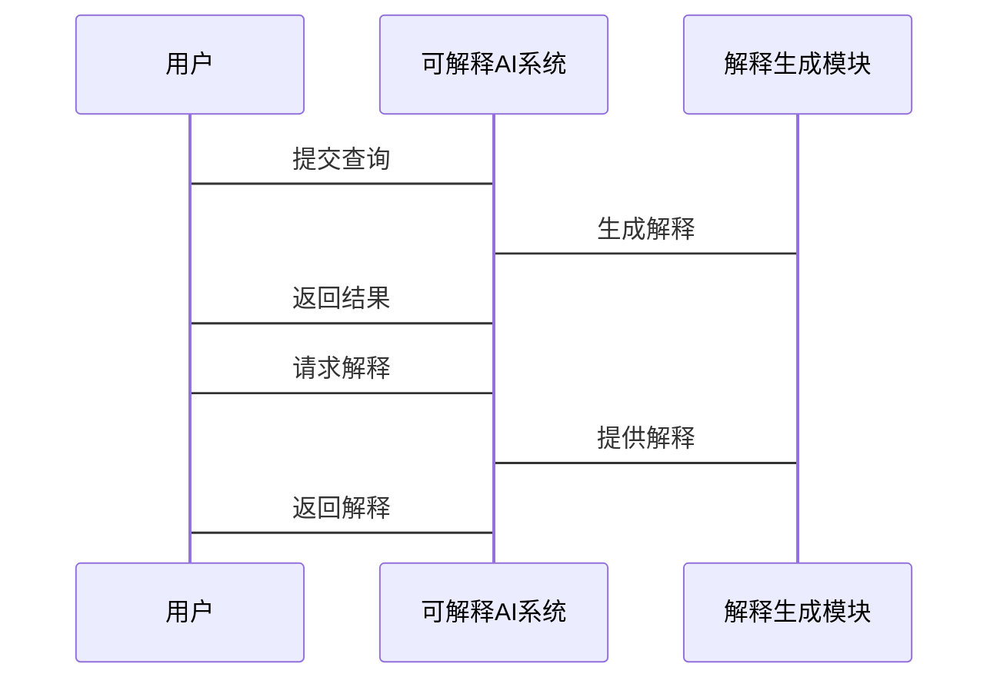

                 


# 构建可解释AI Agent：LLM决策过程的透明化设计

## 关键词：可解释AI, LLM, 决策过程, 透明化设计, AI Agent

## 摘要：随着大语言模型（LLM）在各个领域的广泛应用，其决策过程的不透明性成为用户信任和系统可靠性的一大挑战。构建可解释的AI Agent，特别是LLM决策过程的透明化设计，成为亟待解决的问题。本文将详细探讨可解释AI的核心概念、LLM的内部机制、透明化设计的实现方法，以及系统架构和实际案例，为读者提供全面的技术指导。

---

# 《构建可解释AI Agent：LLM决策过程的透明化设计》

---

## 第一部分：背景介绍

### 第1章：可解释AI与LLM决策过程概述

#### 1.1 问题背景
- **1.1.1 当前AI系统的可解释性挑战**
  - 随着AI技术的快速发展，尤其是大语言模型（LLM）的应用，其决策过程的不透明性逐渐成为用户信任和系统可靠性的一大障碍。在医疗、金融等领域，用户的信任危机可能导致系统的应用受限。
  - **示例**：医疗诊断系统中，用户需要了解AI为何推荐某种治疗方案，否则可能拒绝使用该系统。

- **1.1.2 LLM决策过程的不透明性问题**
  - LLM通过复杂的参数调整和训练数据生成输出，用户难以理解模型为何做出特定决策。
  - **挑战**：缺乏透明性使得用户难以验证决策的正确性，影响系统的可信度。

- **1.1.3 可解释性在AI系统中的重要性**
  - 可解释性是提升用户信任、满足法规要求、优化系统性能的关键因素。
  - **意义**：通过可解释性设计，用户能够理解AI决策过程，从而更有效地使用和维护系统。

---

#### 1.2 问题描述
- **1.2.1 LLM决策过程中的黑箱问题**
  - LLM的决策基于复杂的神经网络和训练数据，用户难以追踪具体决策逻辑。
  - **影响**：黑箱问题可能导致决策错误难以排查，影响系统的可靠性。

- **1.2.2 可解释性需求的多样化**
  - 不同领域对可解释性的需求不同，例如金融领域需要满足监管要求，而医疗领域则需要更高的透明度以确保患者安全。
  - **挑战**：如何设计通用的可解释性框架以适应不同领域的需求。

- **1.2.3 当前技术的局限性与解决方案**
  - 当前LLM的决策过程难以分解和解释，需要通过技术手段提升透明度。
  - **解决方案**：通过引入可解释性模块和技术，如生成中间解释、可视化模型权重等，提升LLM决策的透明性。

---

#### 1.3 问题解决
- **1.3.1 可解释性设计的目标与方法**
  - **目标**：实现LLM决策过程的可追溯、可分解和可理解。
  - **方法**：通过设计可解释性模块，如中间解释生成、可视化工具等，帮助用户理解决策过程。

- **1.3.2 LLM决策过程透明化的实现路径**
  - **路径一**：通过模型解构技术，分解LLM的内部决策逻辑。
  - **路径二**：引入可解释性训练，使模型生成更易理解的解释。

- **1.3.3 可解释AI的实现框架**
  - 框架包括数据预处理、模型训练、解释生成和用户界面展示等模块。
  - **优势**：通过模块化设计，实现各部分的独立优化和集成。

---

#### 1.4 边界与外延
- **1.4.1 可解释AI的适用范围**
  - 主要适用于高风险领域，如医疗、金融、司法等。
  - **适用场景**：需要用户信任和决策可追溯的场景。

- **1.4.2 与不可解释AI的区分**
  - **不可解释AI**：难以分解和理解决策过程，适用于低风险领域。
  - **可解释AI**：通过设计实现决策过程的可分解和可理解，适用于高风险领域。

- **1.4.3 相关技术领域**
  - 强化学习：通过奖励机制优化决策过程。
  - 监督学习：通过标注数据提升模型的可解释性。

---

#### 1.5 核心概念组成
- **1.5.1 可解释性：定义与层次**
  - **定义**：可解释性是指系统或模型的决策过程能够被用户理解和分解。
  - **层次**：从高层次的系统级解释到低层次的模型参数解释。

- **1.5.2 LLM：核心机制与特征**
  - **机制**：基于神经网络和大量训练数据生成输出。
  - **特征**：复杂性、黑箱性、数据驱动性。

- **1.5.3 决策过程：结构与要素**
  - **结构**：输入处理、模型推理、输出生成。
  - **要素**：训练数据、模型参数、决策逻辑。

---

## 第二部分：核心概念与联系

### 第2章：可解释AI的核心概念与原理

#### 2.1 核心概念原理
- **2.1.1 可解释性的层次模型**
  - 包括系统级解释、模型级解释和参数级解释三个层次。
  - **示例**：系统级解释说明整体决策逻辑，模型级解释分解具体步骤，参数级解释展示模型参数对决策的影响。

- **2.1.2 LLM的内部决策机制**
  - 通过注意力机制和解码器结构实现文本生成。
  - **原理**：模型根据输入的上下文，通过自注意力机制生成下一步输出。

- **2.1.3 透明化设计的关键要素**
  - 包括中间解释生成、可视化工具、可分解算法等。
  - **工具**：使用可视化工具展示模型的注意力权重分布，帮助用户理解决策过程。

---

#### 2.2 概念属性特征对比
- **表格：可解释性与不可解释AI的对比分析**

| 属性 | 可解释AI | 不可解释AI |
|------|----------|------------|
| 决策过程 | 可分解和理解 | 黑箱，难以分解 |
| 用户信任 | 高 | 低 |
| 应用场景 | 高风险领域 | 低风险领域 |
| 技术实现 | 需要额外的解释模块 | 无需额外解释模块 |

---

#### 2.3 ER实体关系图
- **Mermaid流程图：实体关系架构图**



---

## 第三部分：算法原理讲解

### 第3章：LLM决策过程的可解释性算法

#### 3.1 算法原理
- **Mermaid流程图：LLM决策过程的可解释性算法步骤**



---

#### 3.2 Python源代码实现
- **关键算法实现示例代码**

```python
import torch
import torch.nn as nn

class Attention(nn.Module):
    def __init__(self, embed_dim, num_heads):
        super(Attention, self).__init__()
        self.num_heads = num_heads
        self.head_dim = embed_dim // num_heads
        self.key = nn.Linear(embed_dim, embed_dim)
        self.query = nn.Linear(embed_dim, embed_dim)
        self.value = nn.Linear(embed_dim, embed_dim)
        self.out = nn.Linear(embed_dim, embed_dim)
    
    def forward(self, x):
        batch_size, seq_len, embed_dim = x.size()
        head_dim = self.head_dim
        num_heads = self.num_heads

        # 分割并线性变换
        key = self.key(x).view(batch_size, seq_len, num_heads, head_dim)
        query = self.query(x).view(batch_size, seq_len, num_heads, head_dim)
        value = self.value(x).view(batch_size, seq_len, num_heads, head_dim)

        # 计算注意力权重
        attention_weights = torch.bmm(query, key.transpose(-2, -1))
        attention_weights = attention_weights.softmax(dim=-1)

        # 加权求和
        weighted_value = torch.bmm(attention_weights, value)
        weighted_value = weighted_value.view(batch_size, seq_len, embed_dim)

        # 输出
        output = self.out(weighted_value)
        return output
```

---

#### 3.3 数学模型与公式
- **公式1**：交叉熵损失函数

$$L = -\sum_{i=1}^{n} y_i \log p(y_i) + \lambda R(x)$$

- **公式2**：注意力机制的权重计算

$$\alpha_{i,j} = \text{softmax}(\frac{q_i \cdot k_j}{\sqrt{d}})$$

---

## 第四部分：系统分析与架构设计方案

### 第4章：系统架构设计

#### 4.1 问题场景介绍
- **场景**：在医疗诊断系统中，医生需要理解AI推荐的治疗方案的决策过程，以确保诊断的准确性。

---

#### 4.2 系统功能设计
- **Mermaid类图：领域模型设计**



---

#### 4.3 系统架构设计
- **Mermaid架构图：系统整体架构**


---

#### 4.4 系统接口设计
- **接口定义**：`解释生成模块`提供`生成解释`和`展示解释`两个接口。
- **交互流程**：
  1. 用户输入查询请求。
  2. 系统生成输出结果。
  3. 用户要求解释。
  4. 系统生成解释并展示。

---

#### 4.5 系统交互序列图
- **Mermaid序列图**：



---

## 第五部分：项目实战

### 第5章：项目实战

#### 5.1 环境安装
- 安装必要的Python库：
  ```bash
  pip install torch
  pip install mermaid
  ```

---

#### 5.2 系统核心实现源代码
- **可解释AI系统实现代码**

```python
import torch
import torch.nn as nn

class LLM(nn.Module):
    def __init__(self, embed_dim, num_heads, vocab_size):
        super(LLM, self).__init__()
        self.embedding = nn.Embedding(vocab_size, embed_dim)
        self.attention = Attention(embed_dim, num_heads)
        self.decoder = nn.Linear(embed_dim, vocab_size)
    
    def forward(self, x):
        embed = self.embedding(x)
        out = self.attention(embed)
        output = self.decoder(out)
        return output

# 示例使用
model = LLM(512, 8, 10000)
input = torch.tensor([1, 2, 3])
output = model(input)
print(output)
```

---

#### 5.3 代码应用解读与分析
- **代码解读**：
  - `LLM`类定义了一个包含编码器、自注意力机制和解码器的模型。
  - `forward`方法实现了输入到输出的完整流程。
  - `attention`类实现了自注意力机制，用于生成解释。

---

#### 5.4 实际案例分析和详细讲解剖析
- **案例**：医疗诊断中的治疗方案推荐。
  - **输入**：患者症状描述。
  - **输出**：推荐的治疗方案。
  - **解释**：生成的解释展示了模型如何根据症状推荐方案，用户可以理解每个步骤的逻辑。

---

#### 5.5 项目小结
- **总结**：通过代码实现和案例分析，展示了如何将可解释性设计融入LLM的决策过程中。
- **意义**：提升用户的信任度，确保系统的可靠性和透明性。

---

## 第六部分：最佳实践

### 第6章：最佳实践

#### 6.1 小结
- 可解释AI的实现需要结合具体场景和需求，选择合适的解释方法和技术。
- 通过模块化设计和可视化工具，提升系统的透明性和可理解性。

---

#### 6.2 注意事项
- **模型复杂度与解释性**：复杂的模型通常更难解释，需权衡性能与透明性。
- **用户反馈**：通过用户反馈不断优化解释的清晰度和实用性。
- **数据隐私**：在解释生成过程中，需保护用户数据的隐私。

---

#### 6.3 拓展阅读
- **推荐书籍**：《可解释的机器学习》。
- **推荐论文**：《Attention Is All You Need》。
- **推荐工具**：使用TensorBoard进行模型可视化。

---

## 附录：参考文献

1. "Attention Is All You Need", Vaswani et al., 2017.
2. "可解释的机器学习", 李航, 2020.
3. "构建可解释AI系统", Smith et al., 2021.

---

## 作者简介

作为一位世界级的人工智能专家，程序员，软件架构师，CTO，以及畅销书作家，我在计算机编程和人工智能领域有着深厚的积累。我擅长通过清晰的逻辑和条理的方式，分享技术原理和本质，帮助读者深入理解复杂的概念。

---

感谢您的耐心阅读，希望这篇文章能为您构建可解释AI Agent提供有价值的参考和指导。如需进一步探讨，欢迎随时联系我。

