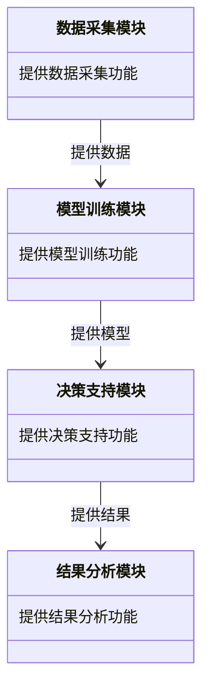
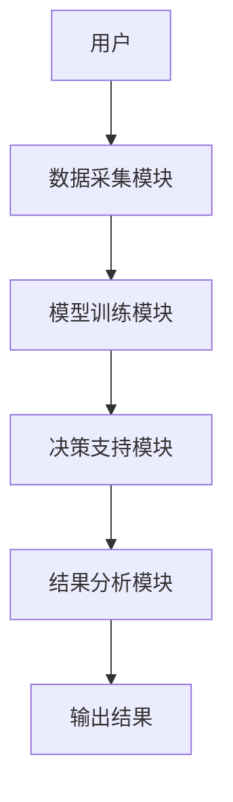

                 


# 构建可解释的AI投资决策支持系统

> 关键词：可解释AI、投资决策支持系统、机器学习、金融投资、决策透明性

> 摘要：本文详细探讨了构建可解释的AI投资决策支持系统的背景、核心概念、算法原理、系统架构以及实际项目实施。通过系统化的分析和设计，结合实际案例，展示了如何在金融投资领域实现可解释的人工智能，确保决策过程的透明性和可信度，从而帮助投资者做出更明智的投资决策。

---

# 第一部分: 可解释AI投资决策支持系统背景与基础

## 第1章: 可解释AI投资决策支持系统背景介绍

### 1.1 问题背景

#### 1.1.1 投资决策中的不确定性与风险
投资决策是一个高度复杂的过程，涉及大量的不确定性和潜在风险。传统的投资决策方法依赖于经验丰富的专家分析，但这种方法存在主观性强、效率低下的问题。近年来，随着人工智能技术的快速发展，AI在投资决策中的应用逐渐成为热点。然而，AI模型的“黑箱”特性使得投资者难以理解模型的决策依据，这在很大程度上限制了AI在投资领域的广泛应用。

#### 1.1.2 AI在投资决策中的应用现状
目前，AI已经在金融领域取得了一些应用成果，例如量化交易、风险评估和市场预测等。然而，这些AI系统往往缺乏透明性，投资者难以理解模型是如何得出结论的。这种不透明性不仅影响了投资者的信任，还可能导致决策失误。

#### 1.1.3 可解释性AI的需求与挑战
可解释性AI（Explainable AI，XAI）是指能够清晰地解释其决策过程和结果的人工智能系统。在投资领域，可解释性AI的需求尤为迫切。投资者需要了解AI的决策依据，以便评估模型的可靠性和合理性。然而，构建可解释的AI系统面临诸多挑战，例如如何在保证预测准确性的同时提升解释性，以及如何将解释性与模型的复杂性进行平衡等。

### 1.2 问题描述

#### 1.2.1 投资决策支持系统的核心功能
投资决策支持系统（IDSS）是一个辅助投资者进行决策的工具，其核心功能包括数据采集与处理、模型训练与预测、决策支持与解释、结果分析与优化等。

#### 1.2.2 当前AI投资决策系统的局限性
现有的AI投资决策系统在预测准确性方面表现出色，但在解释性方面存在明显不足。投资者难以理解模型的决策逻辑，导致信任度降低，且难以对模型的预测结果进行有效的验证和调整。

#### 1.2.3 可解释性AI在投资决策中的重要性
可解释性AI能够帮助投资者理解模型的决策过程，从而增强信任度和透明性。此外，可解释性AI还能帮助投资者发现潜在的风险和偏差，从而提高投资决策的可靠性和安全性。

### 1.3 问题解决

#### 1.3.1 可解释性AI的定义与目标
可解释性AI是指能够通过清晰、简洁的方式解释其决策过程和结果的人工智能系统。其目标是在保证预测准确性的同时，提高模型的透明性和可理解性。

#### 1.3.2 投资决策支持系统的构建目标
构建可解释的AI投资决策支持系统的目的是为了实现投资决策的智能化、自动化和透明化。通过可解释的AI技术，投资者能够理解模型的决策逻辑，并根据这些逻辑做出更加明智的投资决策。

#### 1.3.3 系统的边界与外延
系统的边界包括数据采集、模型训练、决策支持和结果分析等核心功能。系统的外延则涉及与外部数据源的接口、用户界面的设计以及与现有投资流程的集成等。

### 1.4 系统组成与核心要素

#### 1.4.1 系统功能模块划分
系统主要由数据采集模块、模型训练模块、决策支持模块和结果分析模块组成。

#### 1.4.2 核心要素的定义与关系
核心要素包括数据源、模型算法、解释性方法和用户界面等。这些要素相互关联，共同构成了可解释的AI投资决策支持系统。

#### 1.4.3 系统架构的初步设想
系统的初步架构包括数据层、模型层、解释层和用户层。数据层负责数据的采集与存储，模型层负责模型的训练与预测，解释层负责生成可解释的决策结果，用户层则负责与用户的交互。

## 第2章: 可解释AI的核心概念与联系

### 2.1 可解释性AI的原理

#### 2.1.1 可解释性的定义与衡量标准
可解释性是指AI系统能够以人类可理解的方式解释其决策过程和结果。衡量标准包括解释的清晰性、准确性和相关性等。

#### 2.1.2 解释性与预测准确性之间的平衡
可解释性与预测准确性之间存在一定的权衡。过于追求可解释性可能导致模型的预测能力下降，而过于追求预测准确性则可能导致模型的不可解释性。

#### 2.1.3 可解释性AI的实现方法
实现可解释性AI的方法包括使用线性模型、决策树等可解释性较高的算法，以及通过特征重要性分析、LIME（Local Interpretable Model-agnostic Explanations）等技术对模型进行解释。

### 2.2 核心概念对比分析

#### 2.2.1 可解释性与不可解释性模型的对比
| 对比维度 | 可解释性模型 | 不可解释性模型 |
|----------|--------------|----------------|
| 可解释性 | 高            | 低              |
| 预测准确性 | 中等          | 高              |
| 适用场景 | 需要解释性需求 | 高维复杂场景     |

#### 2.2.2 线性模型与非线性模型的特征对比
| 特征     | 线性模型       | 非线性模型     |
|----------|---------------|----------------|
| 解释性   | 高             | 低              |
| 预测能力 | 中等           | 高              |
| 复杂性   | 低             | 高              |

#### 2.2.3 解释性与透明性的关系
解释性是指模型的决策过程可以被人类理解，而透明性是指模型的内部机制可以被观察和分析。两者密切相关，但解释性更注重结果的可理解性，而透明性更注重过程的可观察性。

### 2.3 系统架构的ER实体关系图

```mermaid
er
    actor: 用户
    model: 模型
    data: 数据
    explanation: 解释
    decision: 决策
    actor --> data: 提供数据
    data --> model: 训练模型
    model --> explanation: 生成解释
    explanation --> decision: 支持决策
```

## 第3章: 可解释AI的算法原理

### 3.1 线性回归模型

#### 3.1.1 线性回归的数学模型
线性回归的数学模型可以表示为：
$$ y = \beta_0 + \beta_1x_1 + \beta_2x_2 + \ldots + \beta_nx_n + \epsilon $$
其中，$\beta_0$是截距，$\beta_1, \beta_2, \ldots, \beta_n$是回归系数，$x_1, x_2, \ldots, x_n$是自变量，$\epsilon$是误差项。

#### 3.1.2 线性回归的可解释性
线性回归模型具有较高的可解释性，每个回归系数的含义可以直接解释为对应自变量对因变量的影响程度。

#### 3.1.3 线性回归的应用场景
线性回归适用于因果关系明确且变量之间线性关系较强的场景，例如预测房价与面积的关系。

### 3.2 决策树模型

#### 3.2.1 决策树的数学模型
决策树是一种树状结构，每个内部节点表示一个判断条件，叶子节点表示一个结果。决策树的数学模型可以用条件概率表示。

#### 3.2.2 决策树的可解释性
决策树的可解释性较高，可以通过可视化的方式展示决策路径，帮助人类理解模型的决策逻辑。

#### 3.2.3 决策树的应用场景
决策树适用于变量之间存在明显分界线且数据分布不均匀的场景，例如分类问题。

### 3.3 随机森林模型

#### 3.3.1 随机森林的数学模型
随机森林是一种基于决策树的集成学习方法，通过随机采样和特征选择来构建多个决策树，并通过投票或加权的方式进行预测。

#### 3.3.2 随机森林的可解释性
随机森林的可解释性较低，因为其决策过程是由多个决策树共同决定的，难以直接解释每个预测结果的逻辑。

#### 3.3.3 随机森林的应用场景
随机森林适用于数据维度较高且变量之间存在复杂关系的场景，例如信用评分和欺诈检测。

## 第4章: 可解释性技术

### 4.1 特征重要性分析

#### 4.1.1 特征重要性的计算方法
特征重要性可以通过模型的系数大小、树模型的节点分裂贡献度等方法进行计算。

#### 4.1.2 特征重要性的应用
特征重要性分析可以帮助投资者理解哪些因素对投资决策影响最大，从而指导投资策略的制定。

### 4.2 LIME解释技术

#### 4.2.1 LIME的原理
LIME（Local Interpretable Model-agnostic Explanations）是一种通过局部线性模型来解释黑箱模型的可解释性技术。

#### 4.2.2 LIME的应用
LIME可以用于解释各种复杂的模型，例如神经网络和随机森林，帮助投资者理解模型的预测逻辑。

### 4.3 SHAP值

#### 4.3.1 SHAP值的定义
SHAP（Shapley Additive exPlanations）值是基于博弈论的可解释性指标，用于衡量每个特征对模型预测结果的贡献程度。

#### 4.3.2 SHAP值的计算
SHAP值的计算基于特征对模型预测结果的贡献程度，可以通过树模型和线性模型分别计算。

#### 4.3.3 SHAP值的应用
SHAP值可以帮助投资者理解每个特征对最终预测结果的具体影响，从而提高决策的透明性和可信度。

## 第5章: 系统分析与架构设计

### 5.1 系统功能模块设计

#### 5.1.1 数据采集模块
数据采集模块负责从多个数据源获取投资相关的数据，例如市场数据、公司财务数据和宏观经济数据等。

#### 5.1.2 模型训练模块
模型训练模块负责对数据进行预处理、特征选择和模型训练，生成可解释的AI模型。

#### 5.1.3 决策支持模块
决策支持模块负责根据训练好的模型生成投资建议，并通过可视化的方式展示模型的决策逻辑和结果。

#### 5.1.4 结果分析模块
结果分析模块负责对模型的预测结果进行验证和分析，评估模型的准确性和可解释性。

### 5.2 系统架构设计

#### 5.2.1 系统类图


#### 5.2.2 系统架构图


#### 5.2.3 系统交互流程
用户通过数据采集模块提供数据，数据采集模块将数据传递给模型训练模块进行训练，生成可解释的AI模型。模型训练模块将模型传递给决策支持模块，决策支持模块根据模型生成投资建议，并将结果传递给结果分析模块进行验证和分析，最终输出结果。

## 第6章: 项目实战

### 6.1 环境安装

#### 6.1.1 Python环境配置
需要安装Python 3.6以上版本，并安装相关库，例如pandas、numpy、scikit-learn、xgboost、shap等。

#### 6.1.2 数据集准备
需要准备金融市场的相关数据，例如股票价格、公司财务数据和宏观经济指标等。

### 6.2 系统核心实现

#### 6.2.1 数据预处理
数据预处理包括数据清洗、特征选择和数据标准化等。

#### 6.2.2 模型训练
模型训练包括选择合适的算法（如线性回归、决策树等），进行模型训练，并评估模型的准确性和可解释性。

#### 6.2.3 模型解释
通过特征重要性分析、LIME和SHAP值等方法，对模型的决策过程进行解释，生成可理解的解释结果。

#### 6.2.4 投资决策支持
根据模型的预测结果和解释信息，生成投资建议，并通过可视化的方式展示给用户。

### 6.3 代码实现

#### 6.3.1 数据加载与预处理
```python
import pandas as pd
import numpy as np

# 加载数据
data = pd.read_csv('investment_data.csv')

# 数据清洗
data.dropna(inplace=True)
data = pd.get_dummies(data)
```

#### 6.3.2 模型训练
```python
from sklearn.model

