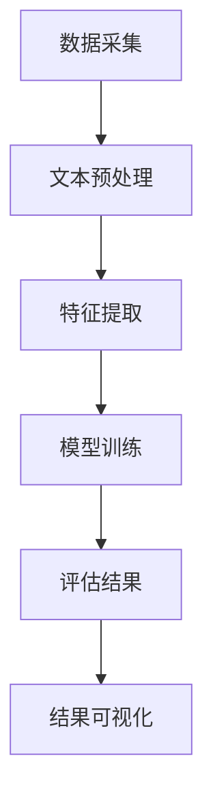
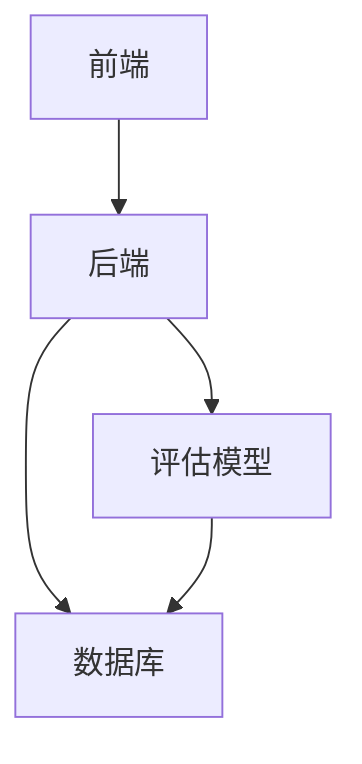

                 


# 构建基于NLP的金融专利价值动态评估系统

> 关键词：自然语言处理，专利评估，金融，文本挖掘，机器学习，系统架构

> 摘要：本文将详细探讨如何利用自然语言处理（NLP）技术构建一个动态评估金融专利价值的系统。我们将从背景介绍、核心概念、算法实现、系统架构设计到实际项目案例分析，逐步展开，为您提供全面的技术指导。

---

## 第一章: NLP与金融专利评估的背景

### 1.1 NLP技术的发展与应用

#### 1.1.1 自然语言处理的定义与核心概念

自然语言处理（NLP）是人工智能领域的重要分支，旨在让计算机能够理解、分析和生成人类语言。其核心概念包括：

- **文本预处理**：如分词、去停用词、词干提取等。
- **文本表示**：如TF-IDF、Word2Vec、BERT等。
- **语义分析**：如实体识别、关系抽取、情感分析。

#### 1.1.2 NLP技术在金融领域的应用现状

在金融领域，NLP技术已广泛应用于：

- **金融新闻分析**：实时监测市场动态，预测股票走势。
- **风险评估**：通过分析企业财报和新闻，评估企业信用风险。
- **智能客服**：通过自然语言理解技术，提供智能咨询服务。

#### 1.1.3 专利价值评估的定义与意义

专利价值评估是指通过对专利文本的分析，评估其在技术、法律和市场等维度的价值。其意义在于：

- **辅助企业决策**：帮助企业识别高价值专利，优化研发方向。
- **知识产权保护**：通过评估专利价值，制定合理的知识产权保护策略。

### 1.2 金融专利评估的背景与挑战

#### 1.2.1 专利价值评估的定义与关键要素

专利价值评估的关键要素包括：

- **技术创新性**：评估专利的技术新颖性和先进性。
- **市场潜力**：评估专利在市场中的应用前景和经济价值。
- **法律风险**：评估专利的法律稳定性，如是否容易被挑战或无效化。

#### 1.2.2 传统专利评估方法的局限性

传统专利评估方法主要依赖人工分析，存在以下局限性：

- **效率低下**：人工评估耗时长，成本高。
- **主观性较强**：评估结果受主观因素影响较大。
- **覆盖面有限**：难以对海量专利数据进行快速评估。

#### 1.2.3 基于NLP的专利评估优势与应用场景

基于NLP的专利评估优势明显：

- **高效性**：能够快速处理海量专利数据。
- **客观性**：通过算法模型进行量化评估，减少主观因素干扰。
- **全面性**：可以同时分析多个维度的数据，如技术领域、市场趋势等。

---

## 第二章: 金融专利价值动态评估的核心概念

### 2.1 NLP在专利文本处理中的应用

#### 2.1.1 专利文本的特征与处理流程

专利文本的主要特征包括：

- **技术领域**：专利涉及的技术领域，如人工智能、区块链等。
- **专利类型**：发明专利、实用新型专利、外观设计专利等。
- **法律状态**：专利的申请日期、授权日期、失效日期等。

专利文本的处理流程包括：

1. **数据收集**：获取专利文本数据，包括专利申请号、发明名称、申请日期、申请人、技术领域等。
2. **文本预处理**：去除停用词、分词、词干提取等。
3. **文本表示**：将文本转化为向量表示，如TF-IDF、Word2Vec、BERT等。
4. **特征提取**：提取文本中的关键技术点、法律信息、市场信息等。

#### 2.1.2 关键技术点：文本预处理、特征提取、模型训练

- **文本预处理**：包括分词、去除停用词、词干提取等。
- **特征提取**：包括关键词提取、实体识别、关系抽取等。
- **模型训练**：基于机器学习或深度学习模型进行训练，如支持向量机（SVM）、随机森林（RF）、长短期记忆网络（LSTM）等。

#### 2.1.3 专利价值评估的多维度分析

专利价值评估可以从以下几个维度进行分析：

1. **技术创新性**：评估专利的技术新颖性和创新程度。
2. **市场潜力**：评估专利在市场中的应用前景和经济价值。
3. **法律风险**：评估专利的法律稳定性，如是否容易被挑战或无效化。

### 2.2 系统架构与核心模块

#### 2.2.1 系统整体架构

系统整体架构包括以下几个模块：

1. **数据采集模块**：负责采集专利文本数据。
2. **文本预处理模块**：对专利文本进行清洗和标准化处理。
3. **特征提取模块**：提取专利文本中的关键技术点、法律信息、市场信息等。
4. **评估模型模块**：基于机器学习或深度学习模型进行专利价值评估。
5. **结果可视化模块**：将评估结果以可视化的方式展示出来。

#### 2.2.2 核心模块的功能与交互关系

- **数据采集模块**：与文本预处理模块交互，提供清洗后的文本数据。
- **文本预处理模块**：与特征提取模块交互，提供特征化的文本数据。
- **特征提取模块**：与评估模型模块交互，提供特征向量。
- **评估模型模块**：与结果可视化模块交互，提供评估结果。

#### 2.2.3 系统功能设计

- **领域模型设计（Mermaid类图）**
  ```mermaid
  classDiagram
      class 数据采集模块 {
          + 数据源：专利数据库
          + 方法：采集专利文本数据
      }
      class 文本预处理模块 {
          + 方法：分词、去停用词、词干提取
      }
      class 特征提取模块 {
          + 方法：关键词提取、实体识别、关系抽取
      }
      class 评估模型模块 {
          + 方法：训练评估模型、预测专利价值
      }
      class 结果可视化模块 {
          + 方法：生成可视化报告
      }
      数据采集模块 --> 文本预处理模块
      文本预处理模块 --> 特征提取模块
      特征提取模块 --> 评估模型模块
      评估模型模块 --> 结果可视化模块
  ```

---

## 第三章: 系统实现与算法原理

### 3.1 算法原理与流程

#### 3.1.1 基于NLP的专利文本处理流程

1. **数据采集**：从专利数据库中获取专利文本数据。
2. **文本预处理**：对专利文本进行清洗和标准化处理。
3. **文本表示**：将文本转化为向量表示，如TF-IDF、Word2Vec、BERT等。
4. **特征提取**：提取文本中的关键技术点、法律信息、市场信息等。
5. **模型训练**：基于机器学习或深度学习模型进行训练，如支持向量机（SVM）、随机森林（RF）、长短期记忆网络（LSTM）等。
6. **评估结果**：对专利价值进行预测和评估。

#### 3.1.2 专利价值评估模型的构建与训练

- **模型选择**：根据具体需求选择合适的模型，如线性回归、支持向量机、随机森林、深度学习模型等。
- **数据准备**：将专利文本数据进行特征提取和标注，构建训练数据集。
- **模型训练**：使用训练数据集对模型进行训练，调整模型参数，优化模型性能。
- **模型评估**：使用测试数据集对模型进行评估，计算模型的准确率、召回率、F1值等指标。

#### 3.1.3 系统实现的代码框架与流程图（Mermaid流程图）



### 3.2 核心算法与数学模型

#### 3.2.1 文本表示与相似度计算

- **TF-IDF**：
  $$ TF_{text}(t) = \frac{\text{词项} t \text{在文本中的出现次数}}{\text{文本的总词数}} $$
  $$ IDF(t) = \log\left(\frac{\text{语料库中的文本总数}}{\text{词项} t \text{出现的文本数}}\right) $$
  $$ TF-IDF(t) = TF_{text}(t) \times IDF(t) $$

- **Word2Vec**：
  Word2Vec通过词嵌入技术，将词表示为低维向量，常用算法包括CBOW和Skip-Gram。

- **BERT**：
  BERT是一种基于Transformer的预训练模型，通过双向上下文信息，生成高质量的文本表示。

#### 3.2.2 评估模型的数学公式

- **线性回归模型**：
  $$ y = \beta_0 + \beta_1 x_1 + \beta_2 x_2 + \dots + \beta_n x_n $$

- **支持向量机（SVM）**：
  SVM通过构建超平面，将数据分成两类，适用于分类和回归任务。

- **随机森林（RF）**：
  随机森林是一种基于决策树的集成学习方法，通过构建多棵决策树，取其平均或多数，提高模型的准确性和稳定性。

---

## 第四章: 项目实战

### 4.1 环境搭建与数据采集

#### 4.1.1 环境搭建

- **Python环境**：安装Python 3.8及以上版本。
- **库依赖**：安装必要的库，如numpy、pandas、scikit-learn、tensorflow、transformers等。
  ```bash
  pip install numpy pandas scikit-learn tensorflow transformers
  ```

#### 4.1.2 数据采集

- 从专利数据库（如专利网）获取专利文本数据。
- 数据格式：JSON或CSV，包含专利申请号、发明名称、申请日期、申请人、技术领域等。

### 4.2 核心代码实现

#### 4.2.1 文本预处理代码

```python
import pandas as pd
from sklearn.feature_extraction.text import TfidfVectorizer
from transformers import AutoTokenizer, AutoModelForPreTraining

# 加载专利文本数据
df = pd.read_csv('patent_data.csv')
texts = df['description'].tolist()

# 使用TF-IDF进行文本表示
vectorizer = TfidfVectorizer(max_features=1000)
tfidf_matrix = vectorizer.fit_transform(texts)
```

#### 4.2.2 评估模型代码

```python
from sklearn.model import SVC
from sklearn.metrics import accuracy_score

# 训练SVM模型
model = SVC()
model.fit(tfidf_matrix, df['label'])

# 模型预测
test_texts = ["This is a test text."]
tfidf_test = vectorizer.transform(test_texts)
predicted_label = model.predict(tfidf_test)
print(predicted_label)
```

### 4.3 案例分析与结果解读

#### 4.3.1 案例分析

假设我们有一个专利文本数据集，包含以下信息：

| 专利申请号 | 发明名称                     | 申请人   | 技术领域 | 专利价值（标签） |
|------------|------------------------------|----------|----------|------------------|
| 123456     | 一种基于深度学习的金融预测方法 | ABC公司 | 人工智能 | 高              |
| 789012     | 基于区块链的金融交易系统     | XYZ公司 | 区块链   | 中              |
| 345678     | 一种金融风险评估模型         | DEF公司 | 金融分析 | 低              |

#### 4.3.2 结果解读

- 对于申请号为123456的专利，模型预测其价值为“高”。
- 对于申请号为789012的专利，模型预测其价值为“中”。
- 对于申请号为345678的专利，模型预测其价值为“低”。

---

## 第五章: 系统架构与接口设计

### 5.1 系统架构设计

- **前端**：提供用户界面，用户可以上传专利文本或查询专利价值。
- **后端**：接收用户请求，调用评估模型进行计算，并返回结果。
- **数据库**：存储专利文本数据、模型参数、评估结果等。

#### 5.1.1 系统架构图（Mermaid架构图）



### 5.2 系统接口设计

- **API接口**：
  - **输入**：专利文本或专利申请号。
  - **输出**：专利价值评估结果。

#### 5.2.1 接口代码示例

```python
from flask import Flask, request, jsonify

app = Flask(__name__)

@app.route('/evaluate', methods=['POST'])
def evaluate():
    data = request.json
    text = data['text']
    # 调用评估模型进行计算
    result = model.predict(vectorizer.transform([text]))
    return jsonify({'result': result[0]})

if __name__ == '__main__':
    app.run(debug=True)
```

---

## 第六章: 总结与展望

### 6.1 总结

本文详细介绍了如何利用自然语言处理技术构建基于NLP的金融专利价值动态评估系统。通过文本预处理、特征提取、模型训练等步骤，实现对专利价值的自动评估。系统架构设计合理，功能模块清晰，能够高效地处理海量专利数据。

### 6.2 展望

未来的研究方向包括：

- **模型优化**：探索更高效的模型，如更大规模的预训练模型（如GPT-3、PaLM）。
- **多模态分析**：结合专利图像、视频等多模态数据，提高评估的准确性和全面性。
- **实时评估**：实现对专利价值的实时动态评估，满足金融市场的快速需求。

---

## 参考文献

1. [自然语言处理入门](https://zh.wikipedia.org/wiki/自然语言处理)
2. [专利价值评估方法](https://zh.wikipedia.org/wiki/专利价值评估)
3. [机器学习实战](https://zh.wikipedia.org/wiki/机器学习实战)

---

通过本文的详细讲解，您可以逐步掌握构建基于NLP的金融专利价值动态评估系统的核心技术和实现方法。希望本文对您在NLP和金融领域的研究和实践有所帮助！

