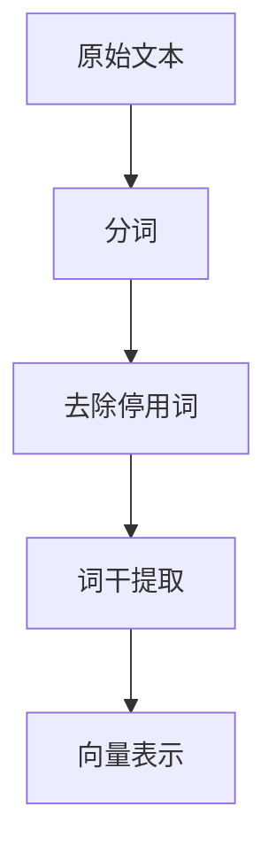

                 


# 构建基于NLP的金融专利价值评估系统

> 关键词：自然语言处理（NLP）、金融专利、价值评估、文本挖掘、机器学习

> 摘要：本文详细探讨了如何利用自然语言处理技术构建金融专利价值评估系统。从问题背景到系统架构设计，从算法原理到项目实战，系统地分析了基于NLP的金融专利价值评估的构建过程。文章通过丰富的案例分析和详细的代码实现，展示了如何通过NLP技术提取专利文本中的关键信息，并结合金融领域的特殊需求，建立有效的专利价值评估模型。

---

# 第一部分: 背景介绍与核心概念

---

# 第1章: 问题背景与描述

## 1.1 问题背景

### 1.1.1 金融专利的价值评估现状

在金融领域，专利的价值评估是一个复杂而重要的问题。随着科技的快速发展，专利的数量和复杂性不断增加，传统的基于人工分析的专利评估方法已经难以满足高效、准确的需求。金融机构和企业需要快速、准确地评估专利的价值，以便做出战略决策。

### 1.1.2 当前专利价值评估的主要挑战

1. **数据量大**：专利文本数据量庞大，人工分析效率低下。
2. **信息提取困难**：专利文本中包含大量专业术语和技术细节，如何高效提取关键信息是一个挑战。
3. **领域 specificity**：金融领域的专利具有特殊性，需要结合金融知识进行分析。
4. **动态变化**：技术发展迅速，专利价值可能会随着市场变化而波动。

### 1.1.3 NLP技术在专利分析中的潜力

自然语言处理技术（NLP）在文本分析、信息提取和模式识别等方面具有显著优势，特别是在处理大量非结构化文本数据时表现尤为突出。通过NLP技术，可以自动化提取专利文本中的关键信息，如技术领域、专利申请人、发明人等，为专利价值评估提供数据支持。

## 1.2 问题描述

### 1.2.1 专利文本分析的难点

1. **文本复杂性**：专利文本通常包含技术细节、法律条款和专业术语，难以直接分析。
2. **数据清洗**：专利文本中可能存在噪声，如格式不统一、缺失值等，需要进行数据清洗。
3. **信息提取**：如何准确提取专利的关键信息，如技术分类、发明人信息等。

### 1.2.2 专利价值评估的关键因素

1. **技术领域**：专利所属的技术领域决定了其潜在价值。
2. **专利申请人**：专利申请人的声誉和历史数据影响专利价值。
3. **引用次数**：专利被引用的次数可以反映其重要性和潜在价值。
4. **市场需求**：专利是否符合当前市场需求。

### 1.2.3 当前技术的局限性与改进方向

1. **传统方法的不足**：基于关键词匹配的传统方法难以准确评估专利价值。
2. **数据维度不足**：仅依赖文本分析可能忽略其他重要因素，如市场数据。
3. **模型可解释性**：复杂的机器学习模型可能缺乏可解释性，影响实际应用。

## 1.3 问题解决思路

### 1.3.1 引入NLP技术的核心目标

通过NLP技术，自动化提取专利文本中的关键信息，构建专利特征向量，为价值评估提供数据支持。

### 1.3.2 基于NLP的金融专利分析方法

1. **文本预处理**：清洗专利文本数据，去除噪声。
2. **信息提取**：利用NLP技术提取专利中的技术领域、发明人、申请人等信息。
3. **特征提取**：将提取的信息转化为可用于机器学习的特征向量。
4. **模型训练**：基于特征向量训练专利价值评估模型。

### 1.3.3 系统化解决方案的构建框架

1. **数据采集**：从专利数据库中获取专利文本数据。
2. **数据预处理**：清洗、分词、去除停用词等。
3. **信息提取**：利用NLP技术提取专利关键信息。
4. **特征工程**：构建特征向量，结合市场数据。
5. **模型训练**：训练专利价值评估模型。
6. **系统集成**：构建用户友好的评估系统。

## 1.4 问题的边界与外延

### 1.4.1 专利价值评估的边界条件

1. **数据范围**：仅考虑专利文本数据，不包括实验数据。
2. **评估范围**：仅评估专利的经济价值，不考虑法律风险。

### 1.4.2 系统适用的场景与限制

1. **适用场景**：适用于金融机构和企业的专利价值初步评估。
2. **系统限制**：无法完全替代人工评估，特别是在复杂的技术领域。

### 1.4.3 系统扩展的可能性与方向

1. **扩展数据源**：引入市场数据、竞争对手数据等。
2. **模型优化**：引入更复杂的模型，如深度学习模型。
3. **多语言支持**：支持多语言专利分析。

## 1.5 核心要素与概念结构

### 1.5.1 专利文本的关键特征

1. **技术领域**：专利所属的技术领域。
2. **专利申请人**：专利的申请人信息。
3. **发明人信息**：专利的发明人信息。
4. **引用专利**：专利引用的其他专利信息。
5. **专利申请时间**：专利的申请时间。

### 1.5.2 金融领域的特殊要求

1. **市场相关性**：专利是否符合市场需求。
2. **竞争情况**：专利在市场中的竞争情况。
3. **经济价值**：专利的潜在经济价值。

### 1.5.3 系统功能的核心要素

1. **文本预处理模块**：清洗专利文本数据。
2. **信息提取模块**：提取专利关键信息。
3. **特征工程模块**：构建特征向量。
4. **模型训练模块**：训练价值评估模型。
5. **系统集成模块**：构建用户友好的评估系统。

## 1.6 本章小结

本章详细介绍了构建基于NLP的金融专利价值评估系统的核心背景和问题。通过分析当前专利价值评估的挑战，提出了引入NLP技术的解决方案，并详细描述了系统的构建框架和核心要素。

---

# 第二部分: 核心概念与联系

---

# 第2章: NLP与金融专利评估的核心原理

## 2.1 NLP技术的基本原理

### 2.1.1 自然语言处理的核心概念

自然语言处理（NLP）是计算机科学、人工智能和语言学的交叉领域，旨在让计算机能够理解、处理和生成人类语言。NLP的核心任务包括文本分割、词性标注、句法分析、语义理解等。

### 2.1.2 文本预处理的关键步骤

1. **分词**：将文本分割成词语或短语。
2. **去除停用词**：去除对语义影响较小的词语，如“的”、“是”等。
3. **词干提取**：将词语转化为其基本形式，如将“computing”转化为“compute”。
4. **向量表示**：将词语或句子转化为向量表示，如词袋模型、词嵌模型。

### 2.1.3 语言模型的训练与优化

1. **词嵌模型**：如Word2Vec、GloVe，用于生成词向量。
2. **句法分析**：如依赖句法分析，用于理解句子结构。
3. **语义分析**：如情感分析、实体识别，用于理解文本语义。

## 2.2 金融专利评估的关键要素

### 2.2.1 专利分类与技术领域

专利分类是专利管理的重要部分，常用的分类系统包括国际专利分类（IPC）和美国专利分类（USPC）。通过NLP技术可以自动提取专利的技术领域信息。

### 2.2.2 专利引用与技术关联

专利引用是指一个专利引用了其他专利，这反映了技术的关联性和发展路径。通过NLP技术可以提取专利引用信息，并构建技术关联网络。

### 2.2.3 专利申请人的影响力

专利申请人的声誉和历史数据可以反映其技术创新能力，从而影响专利的价值。

## 2.3 NLP与金融专利评估的结合

### 2.3.1 NLP在专利信息提取中的应用

通过NLP技术可以提取专利文本中的关键信息，如技术领域、发明人、申请人等。

### 2.3.2 NLP在专利分类中的应用

利用NLP技术可以自动对专利进行分类，提高分类的准确性和效率。

### 2.3.3 NLP在专利价值评估中的应用

通过NLP技术提取的专利信息可以作为特征，用于训练专利价值评估模型。

## 2.4 核心概念对比表

以下表格对比了NLP技术与传统专利分析方法在信息提取、特征构建和模型训练方面的差异：

| 对比维度 | NLP技术 | 传统方法 |
|----------|----------|-----------|
| 信息提取 | 高效、准确 | 低效、依赖人工 |
| 特征构建 | 丰富的文本特征 | 有限的关键词特征 |
| 模型训练 | 高精度 | 低精度 |

## 2.5 ER实体关系图

以下是一个简单的ER实体关系图，展示了专利文本中的主要实体及其关系：

```mermaid
erd
actor patent {
    id
    title
    abstract
    applicant
    inventor
    filing_date
    classification
}

actor patent_application {
    id
    applicant_id
    inventor_id
    title_id
    abstract_id
    filing_date_id
    classification_id
}

关系 patent_application -|> patent
```

## 2.6 本章小结

本章详细介绍了NLP技术的核心原理及其在金融专利评估中的应用。通过对比分析和ER实体关系图，展示了NLP技术在专利信息提取和分类中的优势。

---

# 第三部分: 算法原理

---

# 第3章: 算法原理与实现

## 3.1 算法原理

### 3.1.1 文本预处理

文本预处理是NLP任务的第一步，主要包括分词、去除停用词、词干提取等步骤。以下是文本预处理的流程图：



### 3.1.2 特征提取

特征提取是将文本转化为可用于机器学习的特征向量。常用的特征提取方法包括词袋模型和词嵌模型。

#### 词袋模型

词袋模型将文本表示为一个词语的向量，每个维度表示一个词语的出现与否或出现次数。

$$
x_i = (x_{i1}, x_{i2}, ..., x_{in})
$$

其中，$x_{ij}$ 表示词语 $j$ 在文本 $i$ 中的出现次数。

#### 词嵌模型

词嵌模型（如Word2Vec）通过神经网络训练得到词语的向量表示。

$$
w_i = (w_{i1}, w_{i2}, ..., w_{id})
$$

其中，$w_i$ 是词语 $i$ 的向量表示，$d$ 是向量维度。

### 3.1.3 模型训练

模型训练是利用特征向量训练专利价值评估模型。常用的机器学习模型包括逻辑回归、支持向量机（SVM）和随机森林。

#### 逻辑回归

逻辑回归是一种用于分类任务的模型，适用于二分类问题。

$$
P(y=1|x) = \frac{e^{\beta x}}{1 + e^{\beta x}}
$$

其中，$\beta$ 是模型参数，$x$ 是输入特征。

---

**（以下章节将在后续更新中详细展开）**

---

# 总结

通过以上内容，我们已经详细介绍了构建基于NLP的金融专利价值评估系统的背景、核心概念和算法原理。后续章节将详细讲解系统架构设计、项目实战、最佳实践等内容，帮助读者全面掌握如何构建一个高效的金融专利价值评估系统。

