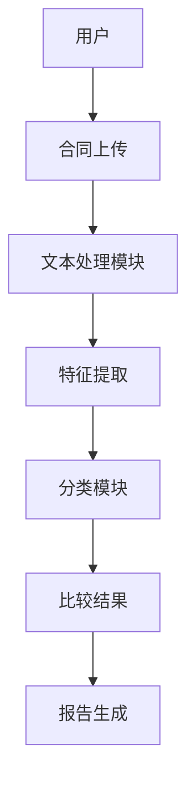

                 


# 构建基于NLP的金融合同条款比较系统

> 关键词：NLP，金融合同，合同比较，文本挖掘，机器学习

> 摘要：本文详细介绍了如何利用自然语言处理技术构建一个高效的金融合同条款比较系统。通过分析合同文本的结构和内容，结合NLP算法，实现合同条款的自动化比较和分类，从而提高金融业务的效率和准确性。

---

## 第一部分：背景介绍

### 第1章：问题背景与需求分析

#### 1.1 问题背景

随着金融业务的复杂化，合同的种类和数量急剧增加，传统的合同比较方法依赖人工审查，效率低下且容易出错。金融合同中的条款往往涉及复杂的法律术语和特定的行业规范，人工处理不仅耗时，还可能遗漏关键信息。

#### 1.2 问题描述

合同条款比较的核心问题在于如何从大量的文本中提取关键信息，并准确地比较不同合同中的条款。传统方法主要依赖人工逐项比对，存在以下局限性：
- **效率低**：人工审查耗时长，尤其是在处理大量合同的情况下。
- **准确性差**：人为疏忽可能导致关键条款被遗漏或误判。
- **可扩展性差**：难以适应合同类型和条款数量的变化。

#### 1.3 问题解决

基于NLP的自动化解决方案可以显著提高合同比较的效率和准确性。通过自然语言处理技术，系统能够自动识别和提取合同中的关键条款，进行分类和比较，从而为用户提供高效的决策支持。

---

## 第二部分：核心概念与联系

### 第2章：NLP与金融合同的核心概念

#### 2.1 NLP技术原理

NLP（自然语言处理）是人工智能的重要分支，旨在让计算机能够理解和处理人类语言。常用技术包括：
- **分词**：将文本分割成有意义的词语或短语。
- **词向量表示**：将词语转换为向量形式，便于计算机处理（如Word2Vec、GloVe）。
- **文本分类**：根据文本内容自动归类（如合同条款分类）。

#### 2.2 金融合同的特点

金融合同具有以下特点：
- **专业术语多**：涉及法律、金融领域的专业术语。
- **结构化程度高**：合同条款通常按照固定的格式排列。
- **条款重要性高**：某些条款（如违约责任、担保条款）对合同的法律效力至关重要。

#### 2.3 核心概念之间的联系

通过NLP技术，我们可以将合同文本中的关键信息提取出来，并与金融领域的知识库进行对比，从而实现合同条款的自动分类和比较。下表展示了核心概念之间的主要联系：

| **核心概念** | **联系描述** |
|--------------|--------------|
| NLP技术      | 提供文本处理和分类的方法，用于提取合同中的关键条款。 |
| 金融合同      | 需要特定的术语理解和结构化处理。 |
| 合同比较      | 基于NLP提取的信息，实现自动化比较和分析。 |

---

## 第三部分：算法原理讲解

### 第3章：文本预处理与特征提取

#### 3.1 文本预处理

文本预处理是NLP任务的基础，主要包括以下步骤：
1. **分词**：将合同文本分割成词语或短语。
2. **去停用词**：移除常见但无实际意义的词语（如“的”、“了”等）。
3. **词向量化**：将词语转换为向量表示（如Word2Vec）。

#### 3.2 特征提取

特征提取是将文本转换为可用于机器学习的特征向量。常用方法包括：
- **词袋模型**：基于词频的特征表示（TF-IDF）。
- **词嵌入**：使用预训练的词向量（如GloVe）。
- **句向量**：将整个句子表示为一个向量（如Sentence-BERT）。

---

### 第4章：分类算法与模型训练

#### 4.1 分类算法原理

分类算法是NLP系统的核心，用于将合同条款分类到预定义的类别中。常用算法包括：
- **支持向量机（SVM）**：适用于小规模数据，分类效果好。
- **随机森林**：基于树的集成方法，适合高维数据。
- **深度学习模型**：如LSTM和Transformer，适用于复杂文本结构。

#### 4.2 数学模型与公式

以下是SVM的数学模型：

$$
\text{目标函数：} \quad \text{max} \{ \frac{1}{2} \|w\|^2 \}
$$

$$
\text{约束条件：} \quad y_i(w \cdot x_i + b) \geq 1 \quad \forall i
$$

其中，\( y_i \) 是类别标签，\( w \) 是权重向量，\( b \) 是偏置项。

---

## 第四部分：系统架构设计

### 第5章：系统架构与实现

#### 5.1 系统功能设计

系统主要功能包括：
1. **合同上传**：用户上传需要比较的合同。
2. **文本处理**：对合同文本进行预处理和特征提取。
3. **条款分类**：基于NLP算法对条款进行分类。
4. **比较分析**：生成比较结果并输出报告。

#### 5.2 系统架构图

以下是系统架构的Mermaid图：



---

## 第五部分：项目实战

### 第6章：项目实战与代码实现

#### 6.1 环境安装

需要安装以下库：
- Python 3.8+
- Scikit-learn
- NLTK
- SpaCy
- Keras

#### 6.2 核心代码实现

以下是合同条款分类的代码示例：

```python
import numpy as np
from sklearn.svm import SVC
from sklearn.feature_extraction.text import TfidfVectorizer

# 假设我们有训练数据 X 和标签 y
X = ["合同条款1", "合同条款2", ...]
y = [0, 1, ...]

# 文本向量化
vectorizer = TfidfVectorizer()
X_vec = vectorizer.fit_transform(X)

# 训练SVM模型
model = SVC()
model.fit(X_vec.toarray(), y)

# 预测新合同条款
new_term = ["违约责任"]
new_vec = vectorizer.transform(new_term)
predicted = model.predict(new_vec.toarray())
print(predicted)
```

---

## 第六部分：总结与展望

### 第7章：总结与展望

通过本文的介绍，我们详细探讨了如何利用NLP技术构建金融合同条款比较系统。从背景分析到算法实现，再到系统设计，我们为读者提供了一个完整的解决方案。未来，随着NLP技术的不断发展，合同比较系统将更加智能化和高效化。

---

## 附录

### 附录A：参考文献

1. [1] 余胜敢. 自然语言处理入门[M]. 北京: 人民邮电出版社, 2019.
2. [2] 周志华. 机器学习[M]. 北京: 清华大学出版社, 2016.

### 附录B：工具与资源

- **NLP工具**：spaCy、NLTK
- **机器学习库**：Scikit-learn、Keras
- **中文分词工具**：jieba

---

希望这篇文章能够为您提供构建基于NLP的金融合同条款比较系统的详细指导！

