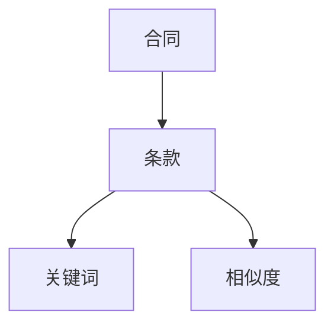
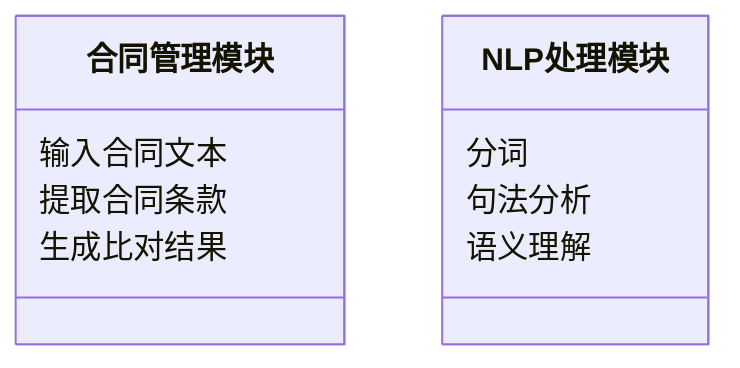
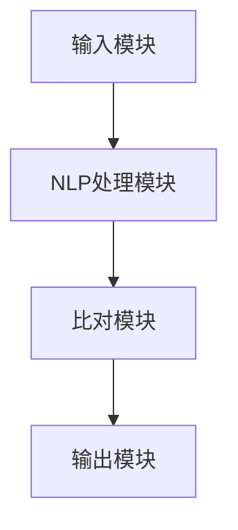
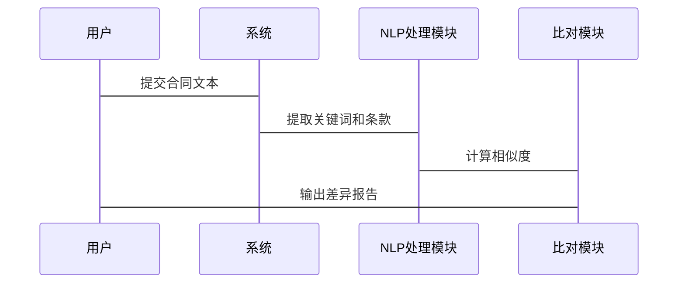

                 


# 构建基于NLP的金融合同条款自动化比对系统

## 关键词：NLP，金融合同，条款比对，文本相似度，深度学习

## 摘要

在金融领域，合同条款的比对是一项复杂且耗时的任务，传统的人工比对方法效率低下且容易出错。基于NLP的自动化比对系统能够高效、准确地完成这一任务，为企业节省大量时间和成本。本文将详细探讨如何构建这样一个系统，从背景介绍到系统架构设计，再到项目实战，全面解析其实现过程和应用价值。

---

# 第1章: 背景介绍与问题背景

## 1.1 问题背景

### 1.1.1 金融合同条款比对的痛点
- 金融合同通常包含大量复杂的法律条款，人工比对耗时且易出错。
- 合同版本更新频繁，每次比对需要投入大量资源。
- 传统方法依赖人工经验，难以标准化和高效化。

### 1.1.2 NLP技术在金融领域的应用潜力
- NLP技术可以提取合同中的关键信息，如关键词和条款。
- 基于NLP的相似度计算能够自动化识别合同中的差异。
- 深度学习模型在语义理解上的优势为合同比对提供了新的可能性。

### 1.1.3 自动化比对系统的必要性
- 提高比对效率，降低人工成本。
- 减少人为错误，确保比对结果的准确性。
- 为后续的合同管理和合规性检查提供支持。

## 1.2 问题描述

### 1.2.1 金融合同的复杂性与多样性
- 合同格式多样，条款复杂，涉及多个法律领域。
- 不同合同之间的术语和结构可能存在差异，增加了比对的难度。

### 1.2.2 传统合同比对方法的局限性
- 人工比对效率低，且容易遗漏关键条款。
- 缺乏统一的标准，导致比对结果的不一致。
- 不适用于大规模合同比对任务。

### 1.2.3 自动化比对系统的目标与边界
- 目标：实现合同条款的自动化比对，输出差异报告。
- 边界：仅处理合同条款内容，不涉及合同之外的部分。

## 1.3 问题解决与系统价值

### 1.3.1 系统如何解决合同比对问题
- 利用NLP技术提取合同中的关键词和条款。
- 基于文本相似度计算，自动识别合同中的差异。
- 提供可视化的差异报告，方便用户快速定位问题。

### 1.3.2 系统的价值与应用场景
- 提高合同管理效率，降低人工成本。
- 保障合同合规性，减少法律风险。
- 支持大规模合同比对任务，适用于金融行业。

### 1.3.3 系统的边界与外延
- 系统仅处理合同条款内容，不涉及其他部分。
- 支持多种合同格式，如PDF和Word文档。

## 1.4 核心概念与系统架构

### 1.4.1 系统核心要素组成
- **输入模块**：接收合同文本。
- **NLP处理模块**：提取关键词和条款。
- **比对模块**：计算文本相似度，生成差异报告。
- **输出模块**：展示差异结果。

### 1.4.2 系统架构的初步设想
- 输入模块接收合同文本，传递给NLP处理模块。
- NLP处理模块提取关键词和条款，传递给比对模块。
- 比对模块生成差异报告，输出模块展示结果。

### 1.4.3 系统功能模块的初步划分
- **预处理模块**：清洗文本，提取关键词。
- **特征提取模块**：提取文本特征，如词向量。
- **相似度计算模块**：基于特征计算相似度。
- **差异报告生成模块**：输出差异报告。

## 1.5 本章小结

本章从背景介绍出发，分析了金融合同条款比对的痛点和传统方法的局限性，提出了基于NLP的自动化比对系统的必要性和价值。通过核心概念和系统架构的初步设想，为后续的详细设计奠定了基础。

---

# 第2章: 核心概念与系统联系

## 2.1 NLP技术的核心原理

### 2.1.1 NLP的基本概念与技术栈
- **自然语言处理（NLP）**：研究如何让计算机理解人类语言的技术。
- **技术栈**：包括分词、词性标注、句法分析和语义理解等。

### 2.1.2 常见的NLP任务与模型
- **分词**：将文本分割成有意义的词语或短语。
- **句法分析**：分析句子的结构和语法关系。
- **语义理解**：理解文本的含义和上下文关系。

### 2.1.3 NLP在金融领域的应用案例
- **关键词提取**：从合同中提取关键条款。
- **文本分类**：分类合同类型或条款类别。

## 2.2 合同条款比对的实现原理

### 2.2.1 文本预处理与特征提取
- **预处理**：去除停用词、标点符号，进行分词。
- **特征提取**：将文本转化为向量，如TF-IDF或词向量。

### 2.2.2 文本相似度计算方法
- **余弦相似度**：计算两个向量之间的夹角。
- **Jaccard相似度**：基于集合的相似度计算。
- **编辑距离**：计算两个字符串的最小编辑操作数。

### 2.2.3 基于NLP的比对规则
- **关键词匹配**：匹配相同或相似的关键词。
- **语义相似度**：基于语义理解进行比对。

## 2.3 系统核心概念的ER实体关系图



---

## 2.4 本章小结

本章详细介绍了NLP技术的核心原理及其在合同比对中的应用，通过ER实体关系图展示了系统的核心概念和它们之间的关系。

---

# 第3章: 算法原理与数学模型

## 3.1 分词算法原理

### 3.1.1 基于正则表达式的分词方法
- **正则表达式**：利用规则匹配文本中的词语。
- **实现步骤**：编写正则表达式，匹配文本中的词语。

### 3.1.2 基于统计的分词方法
- **统计分词**：基于词频和上下文概率进行分词。
- **常见工具**：如jieba分词工具。

### 3.1.3 基于深度学习的分词模型
- **深度学习模型**：如LSTM和Transformer。
- **训练数据**：利用标注数据进行训练。

## 3.2 句法分析与语义理解

### 3.2.1 基于依存句法分析的语义理解
- **依存句法分析**：分析词语之间的依赖关系。
- **工具**：如spaCy和NLTK。

### 3.2.2 基于深度学习的语义理解模型
- **模型**：如BERT和GPT。
- **应用**：用于理解合同条款的含义和上下文。

### 3.2.3 常见的句法分析工具与库
- **spaCy**：支持多种语言的句法分析。
- **NLTK**：提供多种句法分析工具。

## 3.3 文本相似度计算

### 3.3.1 基于余弦相似度的文本相似度计算
- **余弦相似度公式**：
$$ \text{余弦相似度} = \frac{\vec{A} \cdot \vec{B}}{|\vec{A}| |\vec{B}|} $$
- **实现步骤**：计算向量的点积和模长。

### 3.3.2 基于编辑距离的相似度计算
- **编辑距离公式**：
$$ \text{编辑距离} = \text{min}(d(a, b), d(b, a)) $$
- **应用**：用于字符串的相似度计算。

### 3.3.3 基于深度学习的相似度计算
- **模型**：如BERT和Sentence-BERT。
- **优势**：能够捕捉到语义信息，提高相似度计算的准确性。

## 3.4 本章小结

本章详细介绍了分词、句法分析和文本相似度计算的算法原理和数学模型，为后续的系统设计和实现奠定了基础。

---

# 第4章: 系统分析与架构设计

## 4.1 问题场景介绍

### 4.1.1 金融合同比对的典型场景
- **合同变更**：比较新旧合同的条款差异。
- **合规检查**：确保合同符合相关法规和政策。

### 4.1.2 系统需要解决的核心问题
- **如何高效提取合同条款**。
- **如何准确计算文本相似度**。
- **如何生成差异报告**。

## 4.2 系统功能设计

### 4.2.1 领域模型设计



### 4.2.2 系统架构设计



### 4.2.3 系统接口设计

- **输入接口**：接收合同文本。
- **输出接口**：生成差异报告。

### 4.2.4 系统交互流程



## 4.3 本章小结

本章通过问题场景的介绍和系统功能、架构的设计，详细描述了基于NLP的金融合同条款自动化比对系统的实现方案。

---

# 第5章: 项目实战

## 5.1 环境安装与配置

### 5.1.1 安装Python和相关库
- **Python**：3.8+
- **NLP库**：spaCy、jieba、transformers。
- **深度学习框架**：TensorFlow、PyTorch。

### 5.1.2 安装与配置
```bash
pip install spacy transformers tensorflow
python -m spacy download en_core_web_sm
```

## 5.2 系统核心实现源代码

### 5.2.1 分词实现

```python
import spacy

nlp = spacy.load("en_core_web_sm")

def tokenize(text):
    doc = nlp(text)
    return [token.text for token in doc]
```

### 5.2.2 余弦相似度计算

```python
from sklearn.metrics.pairwise import cosine_similarity

def compute_cosine_similarity(vec1, vec2):
    return cosine_similarity(vec1.reshape(1, -1), vec2.reshape(1, -1))[0][0]
```

### 5.2.3 文本相似度计算

```python
def text_similarity(text1, text2):
    tokens1 = tokenize(text1)
    tokens2 = tokenize(text2)
    # 转换为向量
    vec1 = vectorize(tokens1)
    vec2 = vectorize(tokens2)
    return compute_cosine_similarity(vec1, vec2)
```

## 5.3 代码应用解读与分析

### 5.3.1 分词代码解读
- 使用spaCy进行分词，返回分词后的结果。

### 5.3.2 余弦相似度计算解读
- 使用sklearn库计算余弦相似度。

### 5.3.3 文本相似度计算解读
- 将文本分词后转换为向量，计算向量之间的余弦相似度。

## 5.4 实际案例分析与详细讲解

### 5.4.1 案例背景
- 比较两份金融合同的条款差异。

### 5.4.2 数据处理
- 对合同文本进行清洗和分词。

### 5.4.3 模型训练与测试
- 训练文本相似度模型，测试其准确性。

## 5.5 本章小结

本章通过实际案例的分析和代码实现，展示了如何利用NLP技术构建金融合同条款自动化比对系统。

---

# 第6章: 最佳实践与小结

## 6.1 最佳实践

### 6.1.1 数据预处理
- 清洗文本，去除噪声。
- 标注数据，提高模型的准确性。

### 6.1.2 模型选择
- 根据任务需求选择合适的NLP模型。
- 使用预训练模型，节省训练时间。

### 6.1.3 系统优化
- 优化算法，提高比对效率。
- 采用分布式系统，支持大规模数据处理。

## 6.2 小结

通过本文的详细讲解，我们了解了如何构建基于NLP的金融合同条款自动化比对系统。从背景介绍到系统设计，再到项目实战，全面覆盖了系统的实现过程和应用价值。

## 6.3 注意事项

- 确保数据质量，避免噪声干扰。
- 定期更新模型，适应新的合同条款。
- 处理好模型的可解释性，便于用户理解比对结果。

## 6.4 拓展阅读

- 深入研究NLP领域的最新技术，如大语言模型的应用。
- 探索更多文本相似度计算方法，如基于BERT的相似度计算。

---

# 结语

基于NLP的金融合同条款自动化比对系统不仅提高了合同管理的效率，还为金融行业的数字化转型提供了有力支持。未来，随着NLP技术的不断进步，系统将更加智能化和高效化。

---

# 参考文献

1. spaCy官方文档
2. Hugging Face的Transformers库
3. 《Python自然语言处理实战》
4. 《深度学习入门：基于Python》

