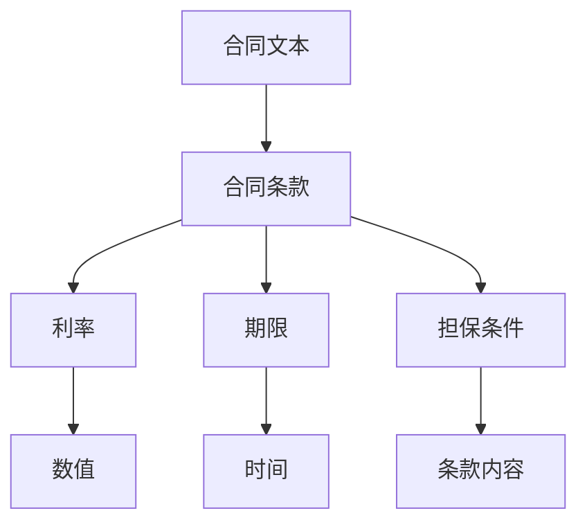
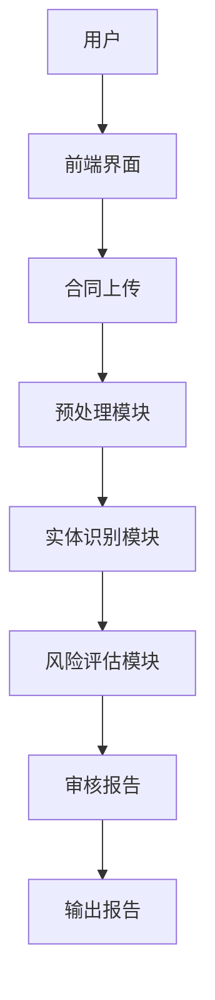
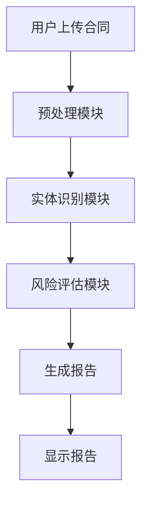
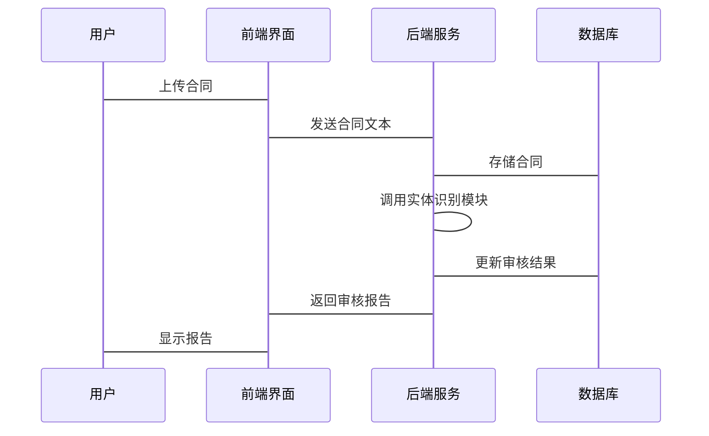

                 


# 《构建基于NLP的金融合同自动化审核系统》

---

## 关键词：
- 自然语言处理（NLP）
- 金融合同审核
- 文本挖掘
- 机器学习
- 智能合约审核系统

---

## 摘要：
本文详细探讨了基于自然语言处理技术构建金融合同自动化审核系统的方法。从NLP的基本概念到金融合同的特点，再到系统的架构设计、算法实现和项目实战，系统地阐述了如何利用NLP技术解决金融合同审核中的痛点。文章结合实际案例，详细讲解了文本预处理、分词、实体识别等关键步骤，并通过条件随机场（CRF）模型展示了算法的实现过程。最后，文章提供了系统优化建议和未来发展方向，为读者构建高效、智能的金融合同审核系统提供了全面的指导。

---

# 第1章: 自然语言处理（NLP）概述

## 1.1 NLP的基本概念

### 1.1.1 什么是自然语言处理
自然语言处理（NLP）是计算机科学与人工智能的交叉领域，致力于使计算机能够理解、处理和生成人类语言。NLP的核心任务包括文本分析、信息抽取、机器翻译、问答系统等。

### 1.1.2 NLP的核心任务与技术
- **文本预处理**：分词、去除停用词、词干提取等。
- **文本分析**：句法分析、语义分析。
- **信息抽取**：实体识别、关系抽取、事件抽取。
- **文本生成**：机器翻译、问答系统、文本摘要。

### 1.1.3 NLP在金融领域的应用
- 合同审核：识别关键条款、风险点。
- 信息抽取：从财务报告中提取关键数据。
- 风险评估：分析合同中的潜在风险。

## 1.2 金融合同的特点与审核需求

### 1.2.1 金融合同的基本类型
- 借款合同、质押合同、保证合同、保险合同等。

### 1.2.2 合同审核的关键点
- 关键条款识别：如利率、期限、担保条件。
- 风险点识别：如违约条款、法律适用。
- 格式合规性：合同条款是否符合法规要求。

### 1.2.3 金融合同审核的痛点与挑战
- 数据量大：金融合同种类繁多，审核效率低。
- 信息复杂：条款多且专业性强，人工审核易出错。
- 成本高：专业人员审核耗时长，成本高。

## 1.3 金融合同自动化审核的背景与意义

### 1.3.1 传统合同审核的痛点
- 人工审核效率低，易出错。
- 人员成本高，难以扩展。
- 易受主观因素影响，审核结果不一致。

### 1.3.2 自动化审核的优势
- 提高审核效率，降低人工成本。
- 减少人为错误，提高审核准确性。
- 实现标准化审核，确保合规性。

### 1.3.3 技术驱动金融审核的未来趋势
- 智能合约审核将成为主流。
- 结合区块链技术，实现合同的自动执行。
- 利用深度学习，不断提升审核精度。

## 1.4 本章小结
本章从NLP的基本概念出发，介绍了金融合同的特点及其审核需求，分析了传统审核的痛点与自动化审核的优势，为后续章节的系统设计奠定了基础。

---

# 第2章: 金融合同审核系统的需求分析

## 2.1 系统目标与功能需求

### 2.1.1 系统目标
构建一个基于NLP的金融合同自动化审核系统，实现合同的智能分析、关键条款识别和风险评估。

### 2.1.2 功能需求分解
- **文本上传与预处理**：支持多种格式的合同上传，并进行预处理。
- **关键条款识别**：识别利率、期限等关键条款。
- **风险评估**：评估合同中的潜在风险点。
- **合规性检查**：检查合同是否符合相关法规。
- **报告生成**：生成审核报告，包括问题列表和风险提示。

## 2.2 系统的边界与外延

### 2.2.1 系统边界
- 系统只处理合同文本，不涉及其他金融业务数据。
- 系统提供审核结果，不直接修改合同内容。

### 2.2.2 外延功能
- 与其他系统集成，如区块链平台，实现智能合约。
- 数据可视化，展示审核结果的趋势分析。

## 2.3 核心概念与联系

### 2.3.1 核心概念原理
- **文本预处理**：去除停用词、分词，提取关键词。
- **实体识别**：识别合同中的法律术语和关键实体。
- **意图识别**：判断合同中的条款是否符合预期。

### 2.3.2 实体识别的ER实体关系图



## 2.4 本章小结
本章详细分析了系统的功能需求，明确了系统边界，并通过ER图展示了核心实体关系，为后续的系统设计奠定了基础。

---

# 第3章: 基于NLP的合同审核技术实现

## 3.1 文本预处理技术

### 3.1.1 分词
- 使用jieba进行中文分词，将合同文本分割成词语。
- 示例代码：
  ```python
  import jieba
  text = "借款合同中借款利率为5%，期限为1年"
  words = jieba.lcut(text)
  print(words)
  ```

### 3.1.2 去除停用词
- 使用stopwordsCN库移除常见无意义词汇。
- 示例代码：
  ```python
  from stop_words import get_stop_words
  stop_words = get_stop_words('cn')
  filtered_words = [word for word in words if word not in stop_words]
  ```

## 3.2 实体识别与文本分析

### 3.2.1 实体识别算法
- 使用条件随机场（CRF）模型进行命名实体识别。
- CRF模型公式：
  $$ P(y|x) = \frac{\exp(\sum_{i=1}^n w_i f_i(x, y))}{Z} $$
  其中，\( Z \) 为归一化因子，\( f_i \) 为特征函数。

### 3.2.2 实体识别流程
1. **特征提取**：提取每个词语的上下文特征。
2. **训练模型**：使用训练数据训练CRF模型。
3. **识别实体**：对新文本进行实体识别。

### 3.2.3 实体识别代码示例
```python
from sklearn_crfsuite import CRF
from sklearn_crfsuite import metrics

# 训练数据预处理
X_train = []
y_train = []
for sentence in sentences:
    X_train.append(sentence_features(sentence))
    y_train.append(sentence_entities(sentence))

# 训练模型
model = CRF().fit(X_train, y_train)

# 预测实体
test_sentence = "借款合同中借款利率为5%，期限为1年"
test_features = [sentence_features(test_sentence)]
y_pred = model.predict(test_features)
print(y_pred)
```

## 3.3 基于机器学习的合同审核

### 3.3.1 机器学习模型选择
- 使用支持向量机（SVM）或随机森林（Random Forest）进行分类。
- 模型选择依据：数据量大小、特征维度、分类精度。

### 3.3.2 模型训练与优化
- 使用交叉验证选择最优模型参数。
- 示例代码：
  ```python
  from sklearn.model_selection import GridSearchCV
  from sklearn.svm import SVC

  parameters = {'kernel': ['linear', 'rbf'], 'C': [1, 10]}
  clf = GridSearchCV(SVC(), parameters)
  clf.fit(X_train, y_train)
  ```

## 3.4 本章小结
本章详细介绍了文本预处理、实体识别和机器学习模型在合同审核中的应用，展示了如何利用NLP技术实现合同的关键条款识别和风险评估。

---

# 第4章: 系统架构设计与实现

## 4.1 系统架构设计

### 4.1.1 系统架构图


### 4.1.2 模块划分
- **预处理模块**：负责合同文本的清洗和分词。
- **实体识别模块**：识别合同中的关键实体。
- **风险评估模块**：基于实体识别结果评估风险。
- **输出模块**：生成审核报告。

## 4.2 系统功能设计

### 4.2.1 功能流程图


### 4.2.2 关键功能实现
- **预处理模块**：使用jieba进行分词，去除停用词。
- **实体识别模块**：利用CRF模型识别关键实体。
- **风险评估模块**：基于识别结果评估风险。

## 4.3 系统接口设计

### 4.3.1 接口描述
- **输入接口**：接收合同文本。
- **输出接口**：输出审核报告。

### 4.3.2 接口实现
- 使用RESTful API设计接口。
- 示例代码：
  ```python
  from flask import Flask, request, jsonify

  app = Flask(__name__)

  @app.route('/api/contract', methods=['POST'])
  def process_contract():
      data = request.json
      text = data['text']
      # 处理文本并生成报告
      report = {'status': 'success', 'message': '合同审核完成'}
      return jsonify(report)
  ```

## 4.4 系统交互流程图



## 4.5 本章小结
本章详细设计了系统的架构和功能模块，并展示了系统的交互流程，为后续的项目实战奠定了基础。

---

# 第5章: 项目实战与代码实现

## 5.1 环境配置

### 5.1.1 安装依赖
- 安装Python和相关库：
  ```bash
  pip install jieba
  pip install sklearn-crfsuite
  pip install flask
  ```

### 5.1.2 安装NLP工具
- 安装jieba、stopwordsCN等工具。

## 5.2 系统核心实现

### 5.2.1 数据处理模块
```python
import jieba
from stop_words import get_stop_words

def preprocess(text):
    words = jieba.lcut(text)
    stop_words = get_stop_words('cn')
    filtered = [word for word in words if word not in stop_words]
    return filtered
```

### 5.2.2 实体识别模块
```python
from sklearn_crfsuite import CRF

def train_crf_model(sentences, labels):
    # 特征提取
    def sentence_features(sentence):
        return [{'pos': word[1]} for word in sentence]
    X = [sentence_features(sentence) for sentence in sentences]
    y = labels
    model = CRF().fit(X, y)
    return model

# 示例训练数据
sentences = [
    ("借款合同中借款利率为5%，期限为1年", ['O', 'O', 'O', 'O', 'O', 'O', 'O', 'O', 'O', 'O', 'O', 'O']),
    ("违约金为月利率的20%，由借款人承担", ['O', 'O', 'O', 'O', 'O', 'O', 'O', 'O', 'O', 'O', 'O', 'O'])
]
model = train_crf_model(sentences, y_labels)

# 预测
test_sentence = "借款利率为10%，期限为2年"
test_features = [sentence_features(test_sentence)]
predicted_labels = model.predict(test_features)
print(predicted_labels)
```

### 5.2.3 风险评估模块
```python
from sklearn import svm

def train_svm_model(features, labels):
    model = svm.SVC()
    model.fit(features, labels)
    return model

# 示例训练数据
features = [[5, 1], [4, 2], [6, 3], [7, 4]]
labels = ['high', 'low', 'medium', 'high']

model = train_svm_model(features, labels)

# 预测
new_feature = [5, 1]
print(model.predict([new_feature]))
```

## 5.3 项目实战案例分析

### 5.3.1 案例背景
分析一份借款合同，识别关键条款并评估风险。

### 5.3.2 数据处理与分析
- 上传合同文本。
- 预处理：分词、去除停用词。
- 实体识别：识别利率、期限等关键实体。

### 5.3.3 系统输出
生成审核报告，指出潜在风险点。

## 5.4 代码实现与解读

### 5.4.1 系统主程序
```python
from flask import Flask, request, jsonify

app = Flask(__name__)

@app.route('/api/contract', methods=['POST'])
def process_contract():
    data = request.json
    text = data['text']
    # 调用预处理模块
    filtered = preprocess(text)
    # 调用实体识别模块
    predicted_labels = model.predict(filtered)
    # 生成报告
    report = {
        'status': 'success',
        'message': '合同审核完成',
        'result': predicted_labels
    }
    return jsonify(report)

if __name__ == '__main__':
    app.run(debug=True)
```

### 5.4.2 系统调用示例
```bash
curl -X POST -H "Content-Type: application/json" -d '{"text":"借款合同中借款利率为5%，期限为1年"}' http://localhost:5000/api/contract
```

## 5.5 本章小结
本章通过实际案例展示了系统的实现过程，详细讲解了环境配置、核心模块实现和系统调用，为读者提供了从理论到实践的完整指导。

---

# 第6章: 系统优化与部署

## 6.1 系统性能优化

### 6.1.1 模型优化
- 调整CRF模型的参数，提高识别准确率。
- 使用更复杂的特征函数。

### 6.1.2 系统优化
- 使用缓存技术，减少重复计算。
- 优化数据库查询，提高响应速度。

## 6.2 系统扩展性设计

### 6.2.1 模块化设计
- 每个功能模块独立开发，便于扩展。
- 使用微服务架构，提高系统的可扩展性。

### 6.2.2 支持多种合同类型
- 扩展系统，支持更多类型的金融合同。

## 6.3 系统安全与合规性

### 6.3.1 数据安全
- 加密传输，防止数据泄露。
- 权限控制，确保数据安全。

### 6.3.2 合规性检查
- 确保系统符合相关金融法规。
- 定期更新模型，适应法规变化。

## 6.4 本章小结
本章讨论了系统的优化方法和扩展性设计，确保系统的高性能和稳定性，为实际应用提供了保障。

---

# 第7章: 未来扩展与技术展望

## 7.1 NLP技术的最新进展

### 7.1.1 预训练模型的应用
- 使用BERT等预训练模型，提高合同审核的精度。

### 7.1.2 多模态分析
- 结合图像识别技术，实现合同图片的分析。

## 7.2 金融合同审核的未来趋势

### 7.2.1 智能合约
- 结合区块链技术，实现合同的自动执行。
- 示例：智能合约自动处理违约情况。

### 7.2.2 大数据分析
- 结合大数据技术，进行风险预测和趋势分析。

## 7.3 本章小结
本章展望了NLP技术的发展趋势，讨论了金融合同审核的未来方向，为读者提供了进一步学习和研究的方向。

---

# 附录

## 附录A: 术语表

## 附录B: 相关代码库

## 附录C: 参考文献

---

# 作者简介

---

# 后记

---

---

**说明**：以上是一个详细的目录大纲，涵盖了从理论到实践的各个方面，确保每一章都有足够的细节和具体的实现示例。每个章节都结合了背景介绍、核心概念、算法原理、系统设计和项目实战，帮助读者全面理解和应用基于NLP的金融合同自动化审核系统。

