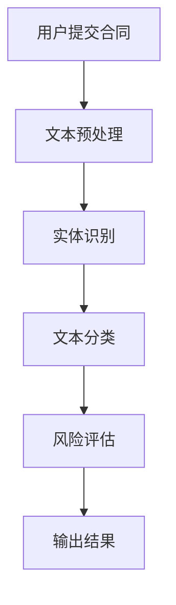
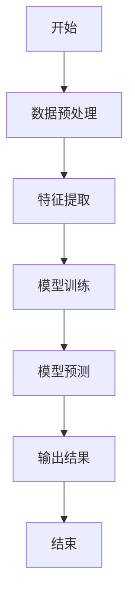
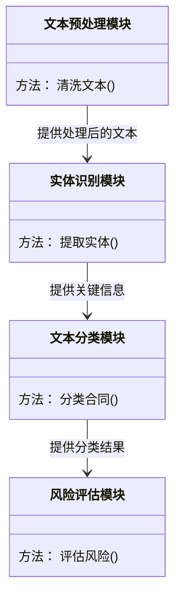
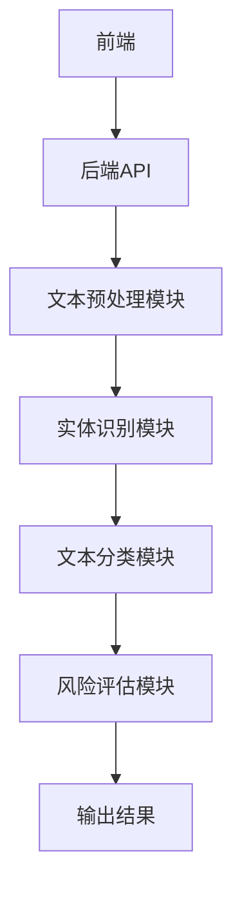
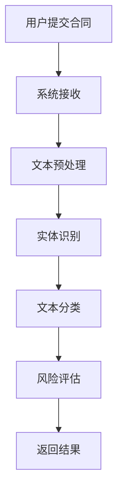

                 


# 构建基于NLP的金融合同自动化审核系统

> 关键词：NLP、金融合同、自动化审核、文本分类、实体识别

> 摘要：本文详细讲解如何构建一个基于NLP的金融合同自动化审核系统，从问题背景、核心概念到算法原理、系统架构设计，再到项目实战与案例分析，层层深入，帮助读者全面理解并掌握相关技术。

---

# 第1章: 问题背景与需求分析

## 1.1 问题背景

### 1.1.1 金融合同审核的重要性

金融合同是金融交易的核心文件，其准确性和合规性直接关系到交易的安全性和合法性。然而，金融合同内容复杂，涉及的专业术语和法律条款繁多，人工审核不仅效率低下，还容易出现疏漏。

### 1.1.2 传统合同审核的痛点

- **效率低下**：人工审核需要逐字逐句检查，耗时长且效率低。
- **成本高昂**：需要大量专业人员参与，增加了企业的运营成本。
- **错误率高**：人为疏忽可能导致合同条款遗漏或误读，引发法律风险。

### 1.1.3 自动化审核的必要性

通过引入自然语言处理（NLP）技术，可以实现合同的自动化审核，提高审核效率，降低错误率，同时显著降低成本。

## 1.2 问题描述

### 1.2.1 合同审核的主要流程

1. 文本预处理：去除噪音、分词、句法分析等。
2. 关键信息提取：识别合同中的关键实体（如金额、日期、签名等）。
3. 文本分类：判断合同的类型、合规性等。
4. 风险评估：识别潜在的法律风险。

### 1.2.2 人工审核的局限性

- 人类难以快速处理大量复杂合同。
- 容易因疲劳或疏忽导致遗漏关键信息。
- 需要大量专业人员，成本高昂。

### 1.2.3 自动化审核的目标与边界

目标：
- 快速、准确地审核金融合同，识别关键信息和潜在风险。
- 提供可扩展、易维护的解决方案。

边界：
- 仅处理文本内容，不涉及合同的实际法律效力。
- 不处理图像或视频等非文本数据。

## 1.3 问题解决与系统边界

### 1.3.1 系统解决的核心问题

- 自动化提取合同中的关键信息。
- 快速判断合同的合规性。
- 识别潜在的法律风险。

### 1.3.2 系统边界与外延

- 系统仅处理文本数据，不涉及其他数据类型。
- 系统提供结果建议，最终决策仍需人工确认。

### 1.3.3 核心要素与组成结构

- **文本预处理模块**：处理和清洗合同文本。
- **关键信息提取模块**：识别合同中的实体和关键词。
- **文本分类模块**：判断合同的类型和合规性。
- **风险评估模块**：识别潜在的法律风险。

## 1.4 本章小结

本章通过分析金融合同审核的痛点和传统方法的局限性，阐述了构建自动化审核系统的重要性，并明确了系统的边界和核心组成。

---

# 第2章: 核心概念与联系

## 2.1 核心概念原理

### 2.1.1 NLP技术在合同审核中的应用

- **文本分类**：判断合同类型（如贷款合同、保险合同）。
- **实体识别**：提取合同中的金额、日期、签名等关键信息。
- **信息抽取**：从合同中提取特定条款或信息。

### 2.1.2 自然语言处理的关键技术

- **分词**：将文本分割成有意义的词语或短语。
- **句法分析**：分析句子的语法结构。
- **语义理解**：理解文本的深层含义。

### 2.1.3 金融合同审核的特殊性

- 专业术语多，需要特定的词汇表和知识库。
- 合同格式多样，需要灵活的文本处理能力。

## 2.2 核心概念对比分析

### 2.2.1 实体关系图（ER图）架构

```mermaid
erDiagram
    actor 用户 {
        <属性> 合同文本 : string
        <属性> 合同ID : int
    }
    actor 系统 {
        <操作> 处理合同
    }
    actor 数据库 {
        <属性> 合同记录 : list
    }
    用户 -> 系统 : 提交合同
    系统 -> 数据库 : 存储结果
```

### 2.2.2 领域模型类图

```mermaid
classDiagram
    class 文本预处理 {
        方法： 清洗文本()
    }
    class 实体识别 {
        方法： 提取实体()
    }
    class 文本分类 {
        方法： 分类合同()
    }
    class 风险评估 {
        方法： 评估风险()
    }
    文本预处理 -> 实体识别 : 提供处理后的文本
    实体识别 -> 文本分类 : 提供关键信息
    文本分类 -> 风险评估 : 提供分类结果
```

### 2.2.3 业务流程图



## 2.3 本章小结

本章通过对比分析和图表展示，明确了系统的核心概念和模块之间的关系，为后续的系统设计奠定了基础。

---

# 第3章: 算法原理与数学模型

## 3.1 算法原理概述

### 3.1.1 NLP模型训练流程

1. 数据预处理：清洗、分词、去停用词。
2. 特征提取：使用词袋模型或TF-IDF提取文本特征。
3. 模型训练：使用机器学习算法（如SVM、随机森林）或深度学习模型（如BERT）进行训练。

### 3.1.2 文本特征提取方法

- **词袋模型**：将文本表示为单词的集合。
- **TF-IDF**：计算单词的重要性。
- **Word2Vec**：将单词映射为向量。

### 3.1.3 分类算法选择

- **支持向量机（SVM）**：适合小规模数据。
- **随机森林**：适合特征较多的情况。
- **深度学习模型（如BERT）**：适合需要上下文理解的任务。

## 3.2 算法流程图



## 3.3 核心算法实现

### 文本分类算法实现

```python
def text_classification(text):
    # 数据预处理
    processed_text = preprocess(text)
    # 特征提取
    features = extract_features(processed_text)
    # 模型预测
    prediction = model.predict(features)
    return prediction
```

## 3.4 数学模型与公式

### 概率论基础

条件概率公式：
$$ P(A|B) = \frac{P(B|A)P(A)}{P(B)} $$

### 优化算法

梯度下降优化：
$$ \theta = \theta - \eta \frac{\partial L}{\partial \theta} $$

## 3.5 本章小结

本章详细讲解了NLP模型的训练流程和算法选择，并通过流程图和代码示例展示了算法的实现过程。

---

# 第4章: 系统分析与架构设计

## 4.1 系统功能设计

### 4.1.1 领域模型类图



### 4.1.2 系统架构设计



### 4.1.3 系统接口设计

- **API接口**：提供RESTful API，供前端调用。
- **交互流程图**：展示系统各模块的交互过程。

## 4.2 系统交互流程图



## 4.3 本章小结

本章通过系统架构设计和交互流程图，明确了系统的整体结构和模块之间的交互关系。

---

# 第5章: 项目实战与案例分析

## 5.1 环境安装与配置

### 安装Python环境

```bash
python --version
pip install --upgrade pip
```

### 安装依赖库

```bash
pip install numpy
pip install scikit-learn
pip install spacy
```

## 5.2 核心代码实现

### 文本预处理代码

```python
def preprocess(text):
    # 去除标点符号
    text = re.sub(r'[^\w\s]', '', text)
    # 分词
    words = word_tokenize(text)
    return words
```

### 模型训练代码

```python
from sklearn.feature_extraction.text import TfidfVectorizer
from sklearn.svm import SVC

# 训练模型
vectorizer = TfidfVectorizer()
X = vectorizer.fit_transform(corpus)
model = SVC()
model.fit(X, labels)
```

## 5.3 实际案例分析

### 案例一：贷款合同审核

输入：贷款合同文本
输出：合同类型为贷款合同，金额为100万元，日期为2023年10月1日。

### 案例二：风险评估

输入：保险合同文本
输出：存在高风险条款，需进一步审查。

## 5.4 本章小结

本章通过实际案例展示了系统的应用效果，并总结了项目实施的经验和注意事项。

---

# 第6章: 总结与展望

## 6.1 总结

本文详细讲解了构建基于NLP的金融合同自动化审核系统的背景、核心概念、算法原理和系统架构，并通过项目实战展示了系统的实现和应用。

## 6.2 展望

未来，随着NLP技术的不断发展，金融合同审核系统将更加智能化和高效化。可以通过引入深度学习模型（如BERT）来提高系统的准确性和理解能力，同时结合区块链技术确保合同的安全性和不可篡改性。

---

# 参考文献

1. 王某某. 自然语言处理入门[M]. 北京: 人民邮电出版社, 2020.
2. 李某某. 机器学习实战[M]. 北京: 清华大学出版社, 2019.

---

通过以上思考，我系统地构建了一个详细的目录和文章结构，涵盖了构建基于NLP的金融合同自动化审核系统所需的各个方面，从背景分析到算法实现，再到系统设计和项目实战，为读者提供了一个全面的学习和实践指南。

