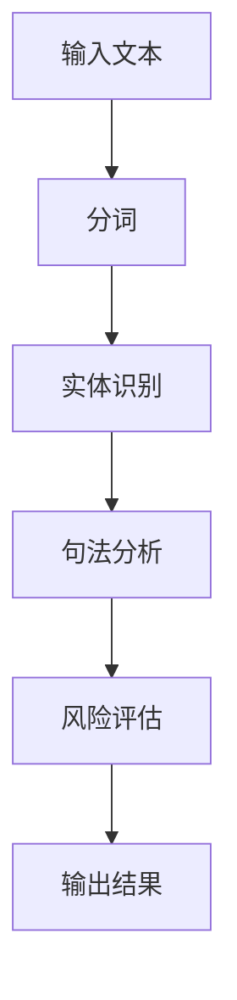
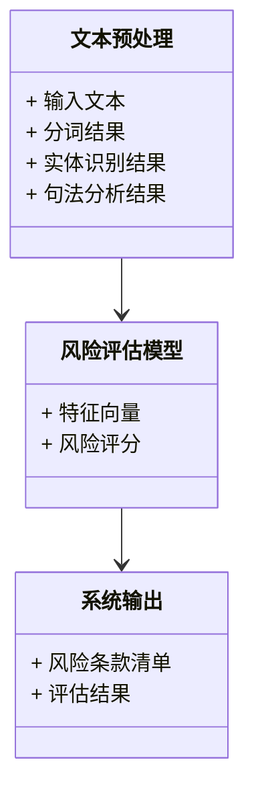
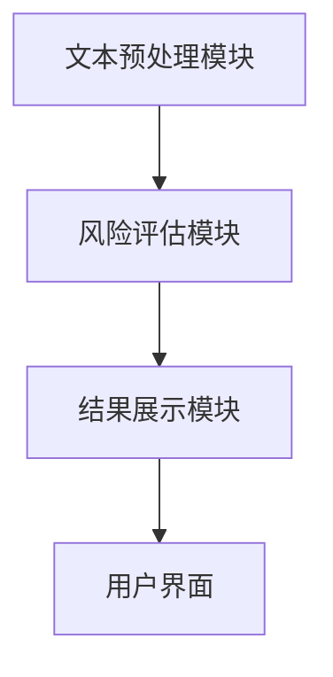
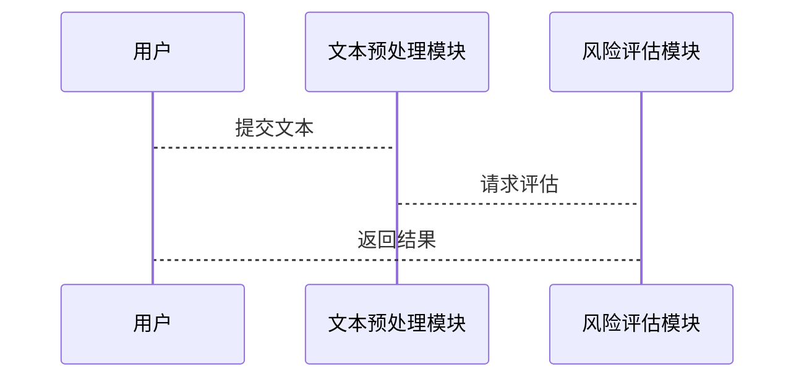

                 


# 第三部分: 算法原理与数学模型

# 第3章: NLP算法原理

## 3.1 分词算法
### 3.1.1 基于规则的分词
分词是将连续的字符序列分割成有意义的词语的过程。基于规则的分词方法通常使用预定义的词典和语言学规则来进行分词。例如，中文分词可以使用jieba库。

#### 3.1.1.1 示例代码
```python
import jieba

text = "构建基于NLP的金融合同风险条款自动化提取与评估系统"
words = jieba.lcut(text)
print(words)  # 输出: ['构建', '基于', 'NLP', '的', '金融', '合同', '风险', '条款', '自动化', '提取', '与', '评估', '系统']
```

### 3.1.2 基于统计的分词
基于统计的分词方法通常使用条件随机场（CRF）模型，通过统计学方法来训练分词模型。

#### 3.1.2.1 示例代码
```python
from sklearn.feature_extraction.text import CountVectorizer
from sklearn.linear_model import LogisticRegression

# 假设我们有训练数据X和标签y
X = [...]  # 特征向量
y = [...]  # 标签

model = LogisticRegression()
model.fit(X, y)
```

### 3.1.3 深度学习分词模型
深度学习分词模型通常使用卷积神经网络（CNN）或循环神经网络（RNN）来处理分词任务。

#### 3.1.3.1 示例代码
```python
import tensorflow as tf
from tensorflow.keras import layers

model = tf.keras.Sequential([
    layers.Embedding(input_dim= vocabulary_size, output_dim= embedding_dim),
    layers.Bidirectional(layers.LSTM(units= lstm_units)),
    layers.Dense(units=num_classes, activation='softmax')
])
model.compile(optimizer='adam', loss='sparse_categorical_crossentropy', metrics=['accuracy'])
model.fit(X_train, y_train, epochs=epochs, batch_size=batch_size)
```

## 3.2 实体识别与句法分析
### 3.2.1 基于CRF的实体识别
条件随机场（CRF）常用于序列标注任务，如实体识别。

#### 3.2.1.1 示例代码
```python
from CRF import CRF

crf = CRF(label_size=3)  # 3代表三个标签：B, I, O
crf.train(train_data)
result = crf.predict(test_data)
print(result)
```

### 3.2.2 基于Transformer的句法分析
使用Transformer模型进行句法分析，通常需要使用预训练的模型如BERT。

#### 3.2.2.1 示例代码
```python
import torch
from transformers import BertTokenizer, BertModel

tokenizer = BertTokenizer.from_pretrained('bert-base-chinese')
model = BertModel.from_pretrained('bert-base-chinese')

inputs = tokenizer("这是一个测试句子", return_tensors="pt")
outputs = model(**inputs)
print(outputs.last_hidden_state)
```

## 3.3 算法流程图


## 3.4 数学模型与公式
### 3.4.1 词袋模型
词袋模型将文本表示为词的集合，不考虑词序。
$$ \text{词袋模型表示} = \{ \text{词}_1: \text{计数}_1, \text{词}_2: \text{计数}_2, \ldots \} $$

### 3.4.2 TF-IDF模型
TF-IDF通过计算词的频率和反频度来衡量词的重要性。
$$ \text{TF-IDF}(\text{term}, \text{document}) = \text{TF}(\text{term}, \text{document}) \times \text{IDF}(\text{term}) $$

## 3.5 本章小结

# 第四部分: 系统分析与架构设计

# 第4章: 系统分析与架构设计

## 4.1 系统需求分析
### 4.1.1 问题场景介绍
金融合同的风险条款提取需要处理大量复杂的法律文本，对准确性和效率要求高。

## 4.2 系统功能设计
### 4.2.1 领域模型


## 4.3 系统架构设计
### 4.3.1 系统架构图


## 4.4 系统接口设计
### 4.4.1 接口设计
- 文本预处理模块接口
  - 输入: 文本字符串
  - 输出: 分词后的列表
- 风险评估模块接口
  - 输入: 分词后的列表
  - 输出: 风险评分

## 4.5 系统交互流程


## 4.6 本章小结

# 第五部分: 项目实战

# 第5章: 项目实战

## 5.1 环境安装
### 5.1.1 安装Python
```bash
python --version
```

### 5.1.2 安装依赖库
```bash
pip install jieba spacy transformers
python -m spacy download zh_core_web_sm
```

## 5.2 系统核心实现
### 5.2.1 文本预处理
```python
import spacy

nlp = spacy.load("zh_core_web_sm")
text = "构建基于NLP的金融合同风险条款自动化提取与评估系统"
doc = nlp(text)
for token in doc:
    print(token.text, token.pos_)
```

### 5.2.2 风险评估模型
```python
from transformers import pipeline

classifier = pipeline("text-classification", model="snunlp/korean-legalbert")
result = classifier("存在风险的条款")
print(result)
```

### 5.2.3 结果展示
```python
def display_results(results):
    for result in results:
        print(f"风险条款: {result['text']}, 评分: {result['score']}")
```

## 5.3 案例分析
### 5.3.1 案例一
```python
text = "如因甲方原因导致合同无法履行，乙方有权要求赔偿。"
processed = nlp(text)
# 分析并提取风险条款
```

## 5.4 项目小结

# 第六部分: 总结与展望

# 第6章: 总结与展望

## 6.1 项目总结
### 6.1.1 成果回顾
通过本项目，我们成功构建了一个基于NLP的金融合同风险条款提取与评估系统，实现了从文本处理到风险评估的全流程自动化。

## 6.2 未来展望
### 6.2.1 模型优化
可以尝试使用更先进的模型如BERT进行微调，提高准确率。

### 6.2.2 多语言支持
扩展系统支持更多语言，适应国际化需求。

## 6.3 最佳实践 Tips
- 数据预处理是关键，确保数据质量。
- 选择合适的模型和工具，提升效率。
- 定期更新模型，保持性能。

## 6.4 本章小结

---

# 关键词：自然语言处理, 金融合同, 风险条款, 自动化提取, 评估系统

# 摘要：本文详细介绍了构建基于NLP的金融合同风险条款自动化提取与评估系统的过程，涵盖从问题背景到系统实现的各个方面。通过系统化的分析和设计，结合具体的代码实现和案例分析，展示了如何利用NLP技术提高金融合同处理的效率和准确性。本文还探讨了系统的架构设计和未来优化方向，为实际应用提供了有价值的参考。

