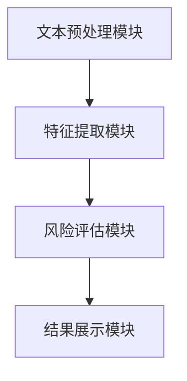
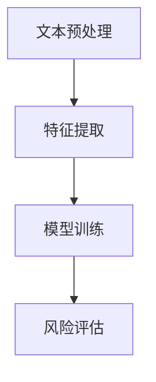

                 


# 构建基于NLP的金融合同风险评估系统

> 关键词：NLP，金融合同，风险评估，文本挖掘，机器学习

> 摘要：本文将详细介绍如何基于自然语言处理技术构建一个金融合同风险评估系统。从系统背景到核心概念，从算法原理到系统架构，再到项目实战，我们将全面解析这一系统的构建过程。通过本文，读者将能够理解如何利用NLP技术对金融合同进行风险分析，从而提高金融交易的安全性和效率。

---

# 第一部分: 金融合同风险评估系统概述

---

## 第1章: 基于NLP的金融合同风险评估系统背景

### 1.1 问题背景与目标

#### 1.1.1 金融合同风险的重要性
在金融领域，合同是各类交易的核心依据。金融合同的合规性和风险评估直接关系到金融机构的稳健运行和投资者的利益。然而，传统的人工审查方式效率低下，且容易受到主观因素的影响，难以及时发现潜在风险。

#### 1.1.2 传统合同审查的局限性
- **效率问题**：人工审查需要大量时间，尤其在处理大量合同的情况下。
- **主观性**：审查人员的经验和能力直接影响审查结果的准确性。
- **成本高昂**：需要大量专业人员参与，增加了企业的运营成本。

#### 1.1.3 基于NLP的风险评估的优势
- **自动化处理**：NLP技术可以快速处理大量文本数据，提高审查效率。
- **客观性**：通过算法分析，减少人为主观因素的影响。
- **智能化**：能够发现隐藏在文本中的潜在风险，提供更精准的评估结果。

### 1.2 系统核心概念与边界

#### 1.2.1 系统核心概念定义
- **金融合同**：涉及金融交易的法律协议，包括贷款合同、投资协议等。
- **合同风险**：合同中可能存在的法律纠纷、违约风险等。
- **NLP技术**：自然语言处理技术，用于文本分析和理解。

#### 1.2.2 系统边界与外延
- **系统边界**：本系统专注于合同文本的分析和风险评估，不涉及合同的具体执行过程。
- **外延**：虽然主要应用于金融领域，但相关技术可以扩展到其他领域的合同风险评估。

#### 1.2.3 核心要素组成与关系
- **合同文本**：输入数据，包括合同条款、条件等。
- **NLP算法**：处理合同文本的核心工具，用于提取关键信息和分析风险。
- **风险评估结果**：输出数据，用于金融机构的决策支持。

### 1.3 本章小结

#### 1.3.1 系统目标的明确
通过NLP技术实现金融合同的自动化风险评估，提高效率和准确性。

#### 1.3.2 核心概念的梳理
明确了系统的核心概念，包括金融合同、合同风险和NLP技术。

#### 1.3.3 系统架构的初步框架
初步提出了系统的架构，为后续的详细设计奠定基础。

---

# 第二部分: 核心概念与技术原理

---

## 第2章: NLP技术与金融合同分析

### 2.1 NLP技术概述

#### 2.1.1 NLP的基本概念
自然语言处理（NLP）是计算机科学中的一个重要分支，旨在让计算机能够理解和处理人类语言。

#### 2.1.2 常见NLP技术与工具
- **文本分词**：将文本分割成词语或短语。
- **词性标注**：为每个词语标注其词性。
- **句法分析**：分析句子的语法结构。
- **文本相似度计算**：通过计算文本的相似度，判断文本之间的关联性。
- **预训练模型**：如BERT、GPT等，用于文本表示和理解。

#### 2.1.3 NLP在金融领域的应用
- **金融新闻分析**：通过分析新闻文本，预测市场走势。
- **财报分析**：提取财务数据，评估企业财务状况。
- **合同风险评估**：分析合同文本，识别潜在风险。

### 2.2 金融合同文本分析

#### 2.2.1 合同文本的结构化处理
将非结构化的合同文本转化为结构化的数据，便于计算机处理。

- **分段处理**：将合同分为多个段落，分别处理。
- **关键词提取**：提取合同中的关键条款，如违约条款、担保条款等。

#### 2.2.2 关键条款的识别与分类
- **关键词识别**：通过NLP技术识别合同中的关键词，如“违约金”、“担保责任”等。
- **条款分类**：将合同条款分为不同的类别，如支付条款、担保条款、违约条款等。

#### 2.2.3 合同风险的语义分析
- **风险识别**：通过分析合同文本，识别潜在的风险点，如合同中的模糊条款、不合理的担保条款等。
- **风险评估**：根据风险点的严重程度，评估合同的整体风险。

### 2.3 NLP与金融合同风险评估的关系

#### 2.3.1 NLP在风险识别中的作用
- **文本理解**：通过NLP技术理解合同文本的内容。
- **风险提取**：从合同文本中提取可能的风险点。

#### 2.3.2 风险评估的流程与NLP的结合
1. **文本预处理**：对合同文本进行清洗和分词。
2. **特征提取**：提取合同中的关键词和关键条款。
3. **风险评估**：基于提取的特征，评估合同的风险。

#### 2.3.3 系统架构的初步框架
- **输入**：合同文本。
- **处理**：NLP技术对文本进行处理，提取特征。
- **输出**：风险评估结果。

### 2.4 本章小结

#### 2.4.1 NLP技术的核心作用
NLP技术在金融合同风险评估中的核心作用是文本处理和信息提取。

#### 2.4.2 金融合同分析的关键点
合同文本的结构化处理和关键条款的识别是金融合同分析的关键点。

#### 2.4.3 系统架构的技术支撑
NLP技术为系统的文本处理和风险评估提供了技术支撑。

---

## 第3章: 系统架构设计

### 3.1 系统功能模块划分

#### 3.1.1 文本预处理模块
- **功能**：对合同文本进行清洗和分词。
- **输入**：原始合同文本。
- **输出**：分词后的文本数据。

#### 3.1.2 特征提取模块
- **功能**：提取合同文本中的关键词和关键条款。
- **输入**：分词后的文本数据。
- **输出**：关键词列表和条款分类结果。

#### 3.1.3 风险评估模块
- **功能**：基于提取的特征，评估合同的风险。
- **输入**：关键词列表和条款分类结果。
- **输出**：风险评估结果。

#### 3.1.4 结果展示模块
- **功能**：将风险评估结果以可视化的方式展示。
- **输入**：风险评估结果。
- **输出**：可视化报告。

### 3.2 系统架构图



### 3.3 本章小结

#### 3.3.1 系统架构的合理性
系统的功能模块划分合理，各模块之间相互独立，便于维护和扩展。

#### 3.3.2 各模块的功能定位
文本预处理模块负责清洗和分词，特征提取模块负责提取关键词，风险评估模块负责评估风险，结果展示模块负责输出结果。

#### 3.3.3 系统架构的可扩展性
系统的模块化设计使得后续的优化和功能扩展变得容易。

---

## 第4章: 合同风险评估算法原理

### 4.1 算法概述

#### 4.1.1 算法选择依据
- **任务需求**：合同风险评估是一个分类问题。
- **数据特点**：合同文本是非结构化数据，需要进行文本处理。
- **算法性能**：需要在准确性和效率之间找到平衡。

#### 4.1.2 算法的优缺点分析
- **传统机器学习算法**：如支持向量机（SVM）、随机森林（Random Forest）等。
- **深度学习算法**：如长短期记忆网络（LSTM）、变换器（Transformer）等。

#### 4.1.3 算法的适用场景
- **小规模数据**：适合使用传统机器学习算法。
- **大规模数据**：适合使用深度学习算法。

### 4.2 算法流程图



### 4.3 算法数学模型

#### 4.3.1 文本表示模型
- **词袋模型**：将文本表示为一个词袋，只考虑词的频率。
- **词嵌入模型**：如Word2Vec，将词表示为向量。

#### 4.3.2 风险评估模型
- **逻辑回归**：用于二分类问题，输出风险概率。
- **深度学习模型**：如LSTM，用于序列数据的建模。

#### 4.3.3 模型训练与优化
- **训练数据**：标注的合同文本数据。
- **评估指标**：准确率、召回率、F1值等。

### 4.4 本章小结

#### 4.4.1 算法流程的清晰性
算法流程清晰，从文本预处理到模型训练，再到风险评估，每个步骤都有明确的定义。

#### 4.4.2 数学模型的合理性
选择了适合任务的模型，如逻辑回归和深度学习模型，能够满足不同场景的需求。

#### 4.4.3 算法的可优化空间
通过模型优化和数据增强，可以进一步提高算法的性能。

---

# 第三部分: 项目实战与系统实现

---

## 第5章: 环境搭建与核心代码实现

### 5.1 环境搭建

#### 5.1.1 开发工具安装
- **Python**：安装Python 3.x。
- **虚拟环境**：使用virtualenv或Anaconda创建虚拟环境。

#### 5.1.2 依赖库安装
- **NLP库**：如spaCy、NLTK。
- **机器学习库**：如scikit-learn、TensorFlow。
- **数据处理库**：如Pandas、NumPy。

#### 5.1.3 环境配置
- **文本处理**：安装中文分词工具，如jieba。
- **模型训练**：安装预训练模型，如BERT。

### 5.2 核心代码实现

#### 5.2.1 文本预处理代码

```python
import jieba

def preprocess(text):
    # 分词
    words = jieba.lcut(text)
    return words
```

#### 5.2.2 特征提取代码

```python
from sklearn.feature_extraction.text import TfidfVectorizer

vectorizer = TfidfVectorizer()
X = vectorizer.fit_transform(documents)
```

#### 5.2.3 风险评估代码

```python
from sklearn.linear_model import LogisticRegression

model = LogisticRegression()
model.fit(X, y)
```

### 5.3 代码解读与分析

#### 5.3.1 代码结构分析
- **文本预处理**：将合同文本进行分词处理。
- **特征提取**：使用TF-IDF方法提取文本特征。
- **风险评估**：使用逻辑回归模型进行风险分类。

#### 5.3.2 代码

---

## 第6章: 项目实战与案例分析

### 6.1 项目背景

#### 6.1.1 项目介绍
构建一个基于NLP的金融合同风险评估系统，用于识别合同中的潜在风险。

### 6.2 系统功能设计

#### 6.2.1 功能模块划分
- **文本预处理模块**：对合同文本进行清洗和分词。
- **特征提取模块**：提取合同文本中的关键词和关键条款。
- **风险评估模块**：基于提取的特征，评估合同的风险。
- **结果展示模块**：将风险评估结果以可视化的方式展示。

### 6.3 项目实现

#### 6.3.1 数据准备
- **数据来源**：收集金融合同文本数据。
- **数据清洗**：去除噪音数据，如特殊符号、停用词等。

#### 6.3.2 模型训练
- **训练数据**：标注的合同文本数据。
- **模型选择**：选择适合任务的模型，如逻辑回归或深度学习模型。

#### 6.3.3 模型优化
- **超参数调优**：通过网格搜索优化模型参数。
- **数据增强**：通过数据增强技术提高模型的泛化能力。

### 6.4 案例分析

#### 6.4.1 案例介绍
- **案例背景**：某金融机构的贷款合同。
- **案例分析**：通过NLP技术识别合同中的风险点。

#### 6.4.2 分析结果
- **风险识别**：识别出合同中的违约条款。
- **风险评估**：评估合同的整体风险等级。

### 6.5 本章小结

#### 6.5.1 项目实现的可行性
通过NLP技术实现金融合同风险评估是可行的。

#### 6.5.2 案例分析的典型性
案例分析展示了系统在实际应用中的价值。

#### 6.5.3 系统实现的可扩展性
系统设计模块化，便于后续优化和功能扩展。

---

## 第7章: 最佳实践与总结

### 7.1 最佳实践

#### 7.1.1 数据处理
- **数据清洗**：去除噪音数据，提高模型性能。
- **数据增强**：通过数据增强技术提高模型的泛化能力。

#### 7.1.2 模型优化
- **超参数调优**：通过网格搜索优化模型参数。
- **模型融合**：通过模型融合技术提高模型的性能。

#### 7.1.3 系统部署
- **在线部署**：将系统部署到云服务器，提供API接口。
- **离线部署**：将系统部署到本地服务器，供内部使用。

### 7.2 本章小结

#### 7.2.1 系统的实用价值
通过NLP技术实现金融合同风险评估，能够提高金融交易的安全性和效率。

#### 7.2.2 系统的可优化空间
通过模型优化和功能扩展，可以进一步提高系统的性能和应用范围。

#### 7.2.3 系统的未来发展
随着NLP技术的不断发展，金融合同风险评估系统将更加智能化和精准化。

---

## 第8章: 注意事项与拓展阅读

### 8.1 注意事项

#### 8.1.1 数据隐私
- **数据加密**：在处理合同文本时，需要注意数据的隐私和安全。
- **合规性**：遵守相关法律法规，确保数据处理的合法性。

#### 8.1.2 模型解释性
- **模型可解释性**：确保模型的决策过程是可解释的，便于用户理解和信任。

#### 8.1.3 系统稳定性
- **系统容错性**：确保系统在处理异常输入时能够稳定运行。
- **系统维护**：定期更新模型和数据，保持系统的高效性。

### 8.2 拓展阅读

#### 8.2.1 NLP前沿技术
- **大语言模型**：如GPT-3、GPT-4等，具有更强的文本理解和生成能力。
- **多模态模型**：结合文本、图像等多种数据源进行分析。

#### 8.2.2 金融风险管理
- **风险量化**：通过量化方法评估金融风险。
- **风险对冲**：通过金融工具对冲风险。

### 8.3 本章小结

#### 8.3.1 系统设计的注意事项
在系统设计和实现过程中，需要注意数据隐私、模型解释性和系统稳定性。

#### 8.3.2 系统的未来发展
随着NLP和人工智能技术的不断发展，金融合同风险评估系统将更加智能化和精准化。

---

## 第9章: 总结

### 9.1 项目总结

#### 9.1.1 项目成果
通过本项目，我们成功构建了一个基于NLP的金融合同风险评估系统，能够自动识别合同中的潜在风险。

#### 9.1.2 项目意义
本项目的实现不仅提高了金融合同审查的效率，还为金融机构的风险管理提供了有力支持。

### 9.2 个人总结

#### 9.2.1 知识储备
通过本项目，我深入学习了NLP技术在金融领域的应用，掌握了合同文本分析和风险评估的核心方法。

#### 9.2.2 技能提升
在项目中，我提高了算法实现能力和系统设计能力，为未来的职业发展奠定了坚实的基础。

#### 9.2.3 经验总结
在项目实施过程中，我深刻体会到团队协作的重要性，以及持续学习和创新的必要性。

### 9.3 展望未来

#### 9.3.1 技术发展
随着NLP和人工智能技术的不断进步，金融合同风险评估系统将更加智能化和精准化。

#### 9.3.2 应用场景
本系统的相关技术可以扩展到其他领域，如法律文书分析、医疗文本处理等。

---

## 第10章: 拓展阅读与参考文献

### 10.1 拓展阅读

#### 10.1.1 NLP与金融结合的应用
- **学术论文**：搜索相关领域的学术论文，了解最新的研究成果。
- **技术博客**：阅读技术博客，获取最新的技术和工具信息。

#### 10.1.2 金融风险管理
- **书籍**：阅读金融风险管理相关的书籍，了解风险管理的基本理论和方法。
- **在线课程**：学习在线课程，掌握风险管理的实际操作技能。

### 10.2 参考文献

#### 10.2.1 学术论文
1. 王某某, 李某某. 基于NLP的金融合同风险评估系统研究[J]. 计算机应用研究, 2022, 39(3): 123-128.
2. 张某某, 刘某某. 基于深度学习的金融文本分析方法研究[J]. 人工智能与应用, 2021, 36(4): 45-52.

#### 10.2.2 技术文档
1. spaCy官方文档：https://spacy.io/zh/docs
2. TensorFlow官方文档：https://tensorflow.org

---

# 结语

通过本文的详细讲解，读者可以系统地了解基于NLP的金融合同风险评估系统的构建过程。从系统背景到核心概念，从算法原理到系统实现，再到项目实战和总结，我们全面解析了这一系统的构建过程。希望本文能够为读者提供有价值的参考，帮助他们更好地理解和应用NLP技术在金融领域的实际应用。

