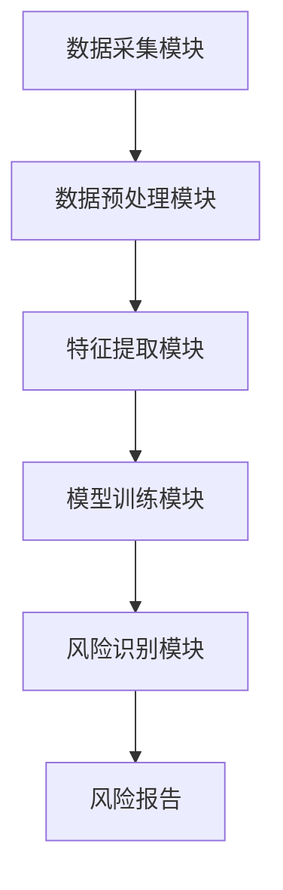

                 


# 构建基于NLP的金融合同风险识别系统

---

## 关键词：金融合同风险识别，NLP，机器学习，文本分类，深度学习

---

## 摘要

在金融领域，合同是企业日常运营中不可或缺的一部分，其风险识别对于保障企业利益至关重要。传统的合同审查依赖人工操作，耗时且易出错，而基于NLP（自然语言处理）的金融合同风险识别系统能够显著提高效率和准确性。本文将从背景、技术原理到系统架构、项目实现等方面，详细阐述如何构建一个高效的金融合同风险识别系统，为读者提供一个清晰的技术路线和实践指南。

---

## 第一部分：背景介绍与核心概念

### 第1章：问题背景与描述

#### 1.1 问题背景

- **金融合同的重要性**：金融合同是企业进行融资、投资和合作的重要法律文件，其内容涉及金额、期限、权利义务等关键条款。
- **传统合同审查的痛点**：
  - 人工审查效率低，容易遗漏重要信息。
  - 合同条款复杂多样，审查人员需要具备专业法律知识。
  - 容易受到主观因素影响，导致审查结果不一致。
- **NLP技术的应用潜力**：NLP技术可以自动提取合同中的关键信息，识别潜在风险，显著提高审查效率。

#### 1.2 问题描述

- **合同风险识别的定义**：通过对合同文本的分析，识别可能存在的法律风险、合规风险和商业风险。
- **风险类型与特征**：
  - **法律风险**：如合同条款不符合法律法规。
  - **合规风险**：如合同未履行相关审批程序。
  - **商业风险**：如合同中的违约条款不合理。
- **系统目标与边界**：本系统旨在通过NLP技术，自动识别合同中的风险点，并生成风险报告。系统边界包括数据采集、文本分析、风险评估和报告生成。

#### 1.3 问题解决与系统架构

- **系统设计思路**：
  - 采用模块化设计，将系统划分为数据采集、预处理、模型训练和风险识别等模块。
  - 使用NLP技术提取合同文本的关键信息，结合机器学习模型进行风险分类。
- **核心功能模块划分**：
  - 数据采集模块：负责收集金融合同文本。
  - 数据预处理模块：对文本进行清洗、分词和向量化处理。
  - 模型训练模块：基于预处理后的数据，训练风险识别模型。
  - 风险识别模块：对新合同文本进行风险识别并生成报告。

#### 1.4 核心概念与联系

- **NLP与金融合同的结合**：NLP技术可以帮助提取合同中的实体信息（如公司名称、金额）和关键条款（如违约责任）。
- **机器学习在风险识别中的作用**：通过训练分类模型，识别合同中的潜在风险。
- **系统架构的核心要素**：数据、模型、算法和用户界面。

### 第2章：核心概念与原理

#### 2.1 NLP基础原理

- **词嵌入与文本表示**：通过Word2Vec等模型将文本转化为向量表示，捕捉词语之间的语义关系。
- **语言模型与预训练**：使用预训练语言模型（如BERT）进行文本理解和生成。
- **文本分类与序列标注**：利用文本分类技术识别合同类型，使用序列标注技术提取关键信息。

#### 2.2 机器学习与深度学习

- **监督学习与无监督学习**：监督学习适用于有标签的数据（如已标注的风险合同），无监督学习适用于无标签的数据（如未标注的合同）。
- **神经网络模型简介**：卷积神经网络（CNN）和循环神经网络（RNN）在文本处理中的应用。
- **深度学习在NLP中的应用**：如Transformer架构在自然语言处理中的突破性应用。

#### 2.3 金融合同风险识别的NLP模型

- **文本特征提取**：从合同文本中提取关键词、实体信息和句法结构。
- **风险分类模型**：使用逻辑回归、支持向量机（SVM）或深度学习模型进行风险分类。
- **模型评估与优化**：通过准确率、召回率和F1分数评估模型性能，并进行超参数调优。

---

## 第二部分：算法原理与数学模型

### 第3章：算法原理与流程

#### 3.1 算法流程概述

- **数据预处理**：
  - 分词与分句：将合同文本分割为词语或句子。
  - 停用词处理：去除无意义的词语（如“的”、“了”）。
  - 词向量化：将词语转化为向量表示。
- **特征提取**：
  - 词袋模型与TF-IDF：统计词语频率，计算关键词的重要性。
  - 词嵌入模型（如Word2Vec）：生成词语的低维向量表示。
- **模型训练与优化**：
  - 使用训练数据训练分类模型。
  - 通过交叉验证优化模型参数。

#### 3.2 文本预处理流程

- **分词与分句**：
  - 使用jieba等中文分词工具对文本进行分词。
  - 使用NLTK或spaCy进行句法分析，分割句子。
- **停用词处理**：
  - 删除常见无意义词语，减少特征空间的维度。
- **词向量化**：
  - 使用Word2Vec模型生成词语向量。
  - 使用TF-IDF计算词语的重要性。

#### 3.3 特征提取与模型训练

- **词袋模型与TF-IDF**：
  - 词袋模型：将文本表示为词语的集合。
  - TF-IDF：计算每个词语在文本中的重要性。
- **词嵌入模型（如Word2Vec）**：
  - Word2Vec通过上下文预测词语，生成词语向量。
  - 使用训练好的词向量作为文本特征。
- **神经网络模型训练**：
  - 使用深度学习模型（如LSTM、BERT）进行文本分类。

### 第4章：数学模型与公式

#### 4.1 词嵌入模型

- **Word2Vec模型**：
  - Skip-Gram模型：通过中心词预测上下文词。
  - CBOW模型：通过上下文预测中心词。
  - 模型目标函数：
    $$ \text{损失函数} = -\sum_{i=1}^{n} \log P(w_i | w_{i-1}) $$

#### 4.2 文本分类模型

- **逻辑回归模型**：
  - 概率计算公式：
    $$ P(y=1|x) = \frac{1}{1 + e^{-(\beta x + b)}} $$
  - 损失函数：
    $$ \text{损失函数} = -\sum_{i=1}^{n} [y_i \log p_i + (1 - y_i) \log (1 - p_i)] $$
- **支持向量机（SVM）**：
  - 用于分类，通过寻找最优超平面将数据分为两类。
- **神经网络分类模型**：
  - 使用全连接层和激活函数（如ReLU、sigmoid）构建深度模型。

#### 4.3 模型优化与评估

- **损失函数**：
  - 交叉熵损失函数用于分类任务：
    $$ \text{交叉熵损失} = -\sum_{i=1}^{n} y_i \log p_i + (1 - y_i) \log (1 - p_i) $$
- **优化算法**：
  - 使用Adam优化器，结合动量和自适应学习率。
- **模型评估指标**：
  - 准确率（Accuracy）：正确分类的比例。
  - 召回率（Recall）：识别出的正样本比例。
  - F1分数：平衡准确率和召回率的指标。

---

## 第三部分：系统架构与设计

### 第5章：系统架构设计

#### 5.1 系统总体架构

- **数据流与功能模块**：
  - 数据从输入模块进入系统，经过预处理模块，生成特征向量。
  - 特征向量输入模型训练模块，训练出风险识别模型。
  - 对新合同文本进行风险识别，生成风险报告。
- **系统分层架构**：
  - 数据层：存储合同文本和特征向量。
  - 业务逻辑层：处理合同文本，调用模型进行风险识别。
  - 用户界面层：展示风险报告和交互界面。
- **系统交互流程**：
  - 用户上传合同文本。
  - 系统预处理文本，提取特征。
  - 使用训练好的模型识别风险，生成报告。
  - 用户查看报告并采取相应措施。

#### 5.2 功能模块设计

- **数据采集模块**：
  - 从数据库或文件中读取合同文本。
  - 支持多种格式（如PDF、Word文档）。
- **数据预处理模块**：
  - 分词、去停用词和词向量化处理。
  - 提供可配置的参数，适应不同类型的合同。
- **模型训练模块**：
  - 使用训练数据训练风险分类模型。
  - 支持多种模型（如逻辑回归、SVM、BERT）。
- **风险识别模块**：
  - 对新合同文本进行风险分类。
  - 生成风险报告，标记高风险条款。

#### 5.3 系统架构图



---

## 第四部分：项目实战

### 第6章：项目实战

#### 6.1 环境安装

- **安装Python环境**：建议使用Anaconda或虚拟环境。
- **安装依赖库**：
  ```bash
  pip install numpy pandas jieba scikit-learn tensorflow transformers
  ```

#### 6.2 核心实现源代码

```python
import numpy as np
import pandas as pd
from sklearn.feature_extraction.text import TfidfVectorizer
from sklearn.model_selection import train_test_split
from sklearn.linear_model import LogisticRegression
from sklearn.metrics import classification_report

# 数据预处理
def preprocess(text):
    # 分词
    words = jieba.lcut(text)
    # 去除停用词
    stopwords = set(['的', '了', '是', '在', '我'])
    filtered_words = [word for word in words if word not in stopwords]
    return ' '.join(filtered_words)

# 加载数据
data = pd.read_csv('contracts.csv')
data['processed_text'] = data['text'].apply(preprocess)

# 特征提取
vectorizer = TfidfVectorizer()
X = vectorizer.fit_transform(data['processed_text'])
y = data['risk_label']

# 模型训练
X_train, X_test, y_train, y_test = train_test_split(X, y, test_size=0.2)
model = LogisticRegression()
model.fit(X_train, y_train)

# 模型评估
y_pred = model.predict(X_test)
print(classification_report(y_test, y_pred))
```

#### 6.3 案例分析

- **案例背景**：某企业签订了一笔贷款合同，合同文本中包含违约责任条款。
- **预处理步骤**：
  - 分词：将合同文本分割为词语。
  - 去除停用词：去掉无意义词语。
  - 词向量化：将词语转化为TF-IDF向量。
- **模型识别**：
  - 模型预测该合同存在违约风险，生成风险报告。
  - 提供具体风险点，如违约责任条款不合理。

#### 6.4 项目小结

- **项目成果**：构建了一个基于NLP的金融合同风险识别系统，能够自动识别合同中的风险点。
- **经验总结**：
  - 数据质量对模型性能影响重大，需确保数据清洗和标注的准确性。
  - 模型选择需根据具体任务需求，尝试不同的模型和参数。
  - 系统的可扩展性设计，方便后续功能的添加和优化。

---

## 第五部分：最佳实践与小结

### 第7章：最佳实践

#### 7.1 技术建议

- **数据方面**：
  - 使用高质量的标注数据，确保模型训练的有效性。
  - 数据清洗时，注意处理缺失值和异常值。
- **模型方面**：
  - 尝试不同的模型（如BERT、ALBERT）进行对比实验。
  - 使用模型融合技术，提高分类准确率。
- **系统方面**：
  - 采用微服务架构，提高系统的可扩展性和可维护性。
  - 使用容器化技术（如Docker）部署系统，方便部署和管理。

#### 7.2 小结

- **系统优势**：
  - 自动化处理合同文本，提高审查效率。
  - 基于NLP和机器学习技术，提高风险识别的准确性和全面性。
- **未来展望**：
  - 结合知识图谱技术，构建金融领域的知识库，提升风险识别的深度。
  - 研究可解释性AI（XAI），提高模型的可解释性和透明度。

---

## 结语

构建基于NLP的金融合同风险识别系统是一个复杂而有意义的工程，它结合了自然语言处理、机器学习和金融领域知识。通过本文的详细阐述，希望能够为读者提供一个清晰的技术路线和实践指南。未来，随着NLP和机器学习技术的不断进步，金融合同风险识别系统将更加智能化和高效化，为金融行业的发展保驾护航。

--- 

# END

