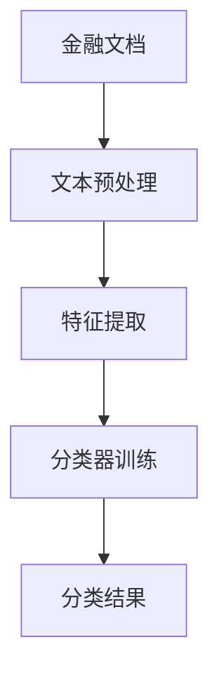
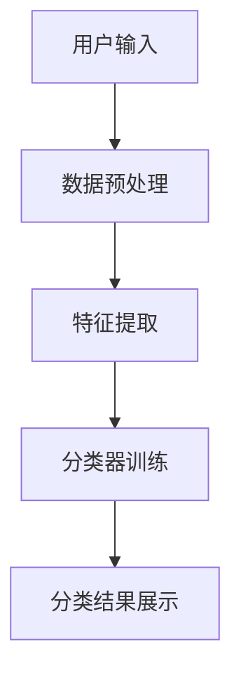

                 

好的，我明白了。以下是我为《构建基于NLP的金融文档自动分类系统》一书撰写的详细目录大纲：

---

# 构建基于NLP的金融文档自动分类系统

> 关键词：自然语言处理（NLP）、文本分类、金融文档、机器学习、深度学习、支持向量机（SVM）、TF-IDF

> 摘要：本文详细介绍了如何利用自然语言处理技术构建一个高效的金融文档自动分类系统。从问题背景到系统设计，从算法原理到项目实现，本文为读者提供了全面的技术指导。通过深入分析NLP在金融领域的应用，结合具体的数学模型和系统架构设计，帮助读者理解并掌握如何利用NLP技术实现金融文档的智能分类。

---

# 第一部分: 金融文档自动分类系统背景与核心概念

## 第1章: 问题背景与需求分析

### 1.1 问题背景
#### 1.1.1 金融文档分类的挑战
- 金融文档的多样性与复杂性
- 文档类型多样（新闻、报告、合同等）
- 文本数据量大，人工分类效率低
- 分类准确性要求高

#### 1.1.2 NLP和金融领域的结合
- NLP技术在金融中的应用潜力
- 自然语言处理的核心任务（文本分类、实体识别等）
- 金融领域文本的特点（专业术语多、领域知识强）

#### 1.1.3 自动分类系统的必要性
- 提高金融信息处理效率
- 降低人工成本
- 支持金融决策的智能化

### 1.2 问题描述
#### 1.2.1 分类任务的具体目标
- 文本分类的目标：将金融文档分为预定义的类别
- 分类粒度：粗粒度（如行业） vs 精细粒度（如具体业务）

#### 1.2.2 系统边界与外延
- 输入：结构化或非结构化的金融文档
- 输出：分类结果及概率（可选）
- 约束条件：分类性能、计算资源

#### 1.2.3 问题解决思路
- 数据驱动 vs 规则驱动
- 统一标准：如何处理不同来源的文档
- 系统设计：模块化设计，支持扩展

### 1.3 核心概念与联系
#### 1.3.1 核心概念原理
- 文本分类：将文本划分为预定义类别的过程
- 特征提取：从文本中提取对分类有用的特征
- 分类器：基于特征的分类模型

#### 1.3.2 核心概念属性特征对比表格
| 概念       | 属性特征               |
|------------|------------------------|
| 文本分类    | 输入：文本；输出：类别标签 |
| 特征提取    | 输入：文本；输出：特征向量 |
| 分类器      | 输入：特征向量；输出：预测类别 |

#### 1.3.3 ER实体关系图架构（Mermaid流程图）

---

## 第2章: NLP与金融领域的结合

### 2.1 NLP基础概念
#### 2.1.1 自然语言处理的核心任务
- 文本分类
- 实体识别
- 情感分析
- 信息提取

#### 2.1.2 金融文档的特点
- 专业术语多
- 数据结构复杂
- 需要领域知识支持

#### 2.1.3 NLP在金融中的应用场景
- 金融新闻分类
- 投资报告分析
- 风险评估

### 2.2 金融文档分类的核心要素
#### 2.2.1 文档类型与分类标准
- 文档类型：新闻、报告、合同
- 分类标准：行业、主题、情感倾向

#### 2.2.2 分类器的输入与输出
- 输入：金融文档文本
- 输出：分类结果（如行业类别）

#### 2.2.3 数据预处理的关键步骤
- 文本清洗（去除停用词、分词）
- 文本标准化（统一格式）
- 特征提取（TF-IDF、Word2Vec等）

### 2.3 系统设计与实现
#### 2.3.1 系统功能模块划分
- 数据预处理模块
- 特征提取模块
- 分类器训练模块
- 分类结果展示模块

#### 2.3.2 系统架构设计（Mermaid架构图）

---

# 第二部分: 系统分析与算法原理

## 第3章: 文本分类算法原理

### 3.1 常见文本分类算法
#### 3.1.1 基于规则的分类方法
- 优点：简单易实现
- 缺点：依赖人工规则，难以覆盖所有场景

#### 3.1.2 传统机器学习算法
- 支持向量机（SVM）
- 朴素贝叶斯（NB）
- K-近邻算法（KNN）

#### 3.1.3 深度学习模型
- 卷积神经网络（CNN）
- 循环神经网络（RNN）
- Transformer模型（如BERT）

### 3.2 基于TF-IDF的文本表示
#### 3.2.1 TF-IDF的计算公式
$$ TF-IDF(t, d) = TF(t, d) \times ID

