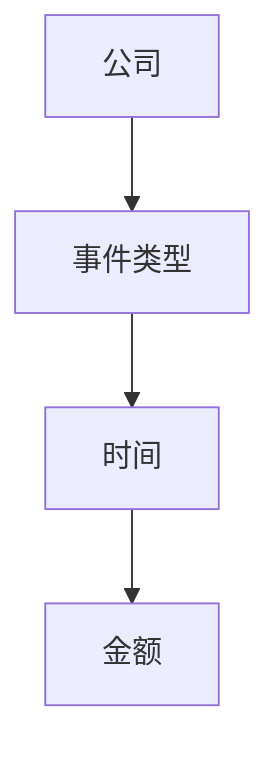
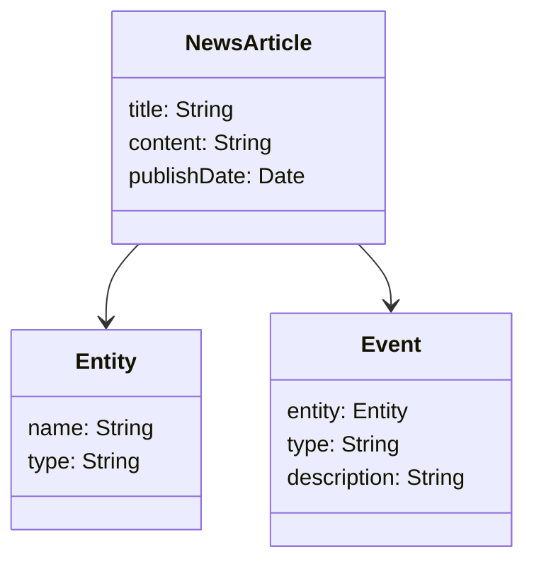
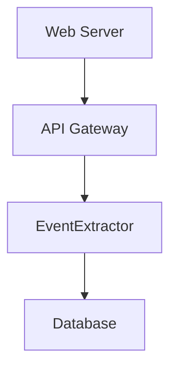
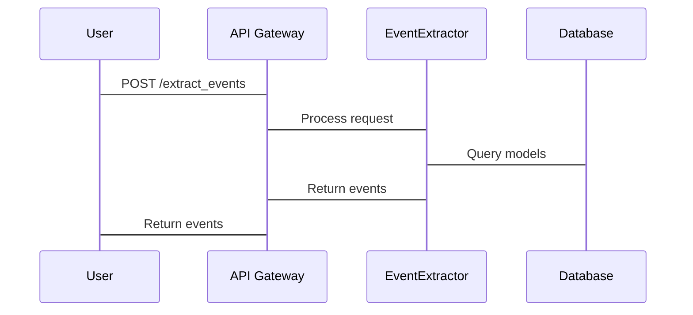

                 


```markdown
# 构建基于NLP的金融新闻事件抽取系统

> 关键词：NLP，金融新闻，事件抽取，自然语言处理，机器学习，文本挖掘

> 摘要：本文详细探讨了构建基于自然语言处理（NLP）的金融新闻事件抽取系统的各个方面。从问题背景到系统架构设计，再到项目实战，文章系统性地介绍了如何利用NLP技术从金融新闻中高效提取关键事件。文中结合实际案例，深入分析了算法原理、系统架构设计及最佳实践，帮助读者全面掌握构建此类系统的知识。

---

# 第一部分: 背景介绍

## 第1章: 问题背景与描述

### 1.1 问题背景

#### 1.1.1 金融新闻事件抽取的背景
金融市场的动态性和复杂性使得及时准确地获取关键事件信息对投资者和相关机构至关重要。传统的人工信息处理效率低下，且容易出错，因此，利用自然语言处理技术自动抽取金融新闻中的事件信息成为亟待解决的问题。

#### 1.1.2 当前技术挑战与痛点
- 数据量大且复杂：金融新闻涉及大量专业术语和复杂语境。
- 事件类型多样：包括并购、财务业绩发布、高层变动等。
- 高准确性要求：错误的事件抽取可能导致决策失误。

#### 1.1.3 问题解决的意义与价值
通过自动化的事件抽取系统，可以显著提高信息处理效率，降低人工成本，并为金融分析提供实时、准确的数据支持。

### 1.2 问题描述

#### 1.2.1 金融新闻事件的定义与分类
- 定义：金融新闻中的事件是指具有特定主题和时间戳的重要信息。
- 分类：如并购事件、财务事件、市场事件等。

#### 1.2.2 事件抽取的目标与范围
- 目标：准确识别新闻中的事件及其相关实体、时间、地点等信息。
- 范围：包括事件类型、主要实体、事件时间等。

#### 1.2.3 系统边界与外延
- 边界：系统仅处理中文金融新闻，暂不支持多语言。
- 外延：系统输出结构化的事件数据，供上层应用使用。

### 1.3 核心概念与联系

#### 1.3.1 核心概念原理
- 文本处理：对新闻文本进行分词、句法分析等预处理。
- 实体识别：识别文本中的公司名称、人名等实体。
- 事件抽取：识别事件类型、时间等信息。

#### 1.3.2 实体关系图（ER图）展示


#### 1.3.3 领域模型类图


---

# 第二部分: 核心概念与联系

## 第2章: 核心概念与联系

### 2.1 NLP基础概念

#### 2.1.1 分词与词性标注
- 分词：将连续文本分割成有意义的词语。
- 词性标注：为每个词语标注其词性。

#### 2.1.2 实体识别与关系抽取
- 实体识别：识别文本中的命名实体。
- 关系抽取：识别实体之间的关系。

#### 2.1.3 事件抽取的定义与流程
- 定义：从文本中抽取事件信息。
- 流程：分词 -> 实体识别 -> 关系抽取 -> 事件分类。

### 2.2 金融领域特定概念

#### 2.2.1 金融术语与定义
- 术语：如“并购”、“IPO”等。

#### 2.2.2 金融事件分类与属性
- 分类：如并购事件、财务事件等。
- 属性：如事件类型、时间、涉及公司等。

#### 2.2.3 金融新闻的结构化表示
- 结构化表示：将非结构化文本转化为结构化数据。

### 2.3 系统核心要素

#### 2.3.1 数据来源与预处理
- 数据来源：爬取金融新闻网站。
- 预处理：去除噪声、分词等。

#### 2.3.2 模型训练与优化
- 训练数据：标注的金融新闻数据。
- 模型优化：调整参数、选择合适的算法。

#### 2.3.3 系统部署与应用
- 部署：将系统部署到云服务器。
- 应用：提供API接口供其他系统调用。

---

# 第三部分: 算法原理讲解

## 第3章: 算法原理与实现

### 3.1 分词算法

#### 3.1.1 基于规则的分词
- 方法：使用预定义的规则进行分词。
- 示例：使用jieba库。

#### 3.1.2 基于统计的分词
- 方法：使用条件概率进行分词。
- 示例：使用CRF模型。

### 3.2 实体识别

#### 3.2.1 基于CRF的实体识别
- 方法：条件随机场模型。
- 示例：使用python-crfsuite库。

### 3.3 事件抽取

#### 3.3.1 基于LSTM的事件抽取
- 方法：使用LSTM进行序列标注。
- 示例：使用Keras框架。

#### 3.3.2 基于BERT的事件抽取
- 方法：预训练模型微调。
- 示例：使用BERT模型。

---

# 第四部分: 系统分析与架构设计

## 第4章: 系统分析与架构设计

### 4.1 问题场景介绍

#### 4.1.1 项目介绍
- 项目目标：构建金融新闻事件抽取系统。
- 项目范围：仅处理中文金融新闻。

### 4.2 系统功能设计

#### 4.2.1 领域模型类图


#### 4.2.2 系统架构设计


### 4.3 系统接口设计

#### 4.3.1 RESTful API
- 接口：/api/v1/extract_events
- 请求方式：POST
- 请求参数：新闻文本

#### 4.3.2 系统交互流程


---

# 第五部分: 项目实战

## 第5章: 项目实战

### 5.1 环境安装

#### 5.1.1 安装Python库
- 使用pip安装所需的Python库，如jieba、spacy、tensorflow等。

### 5.2 系统核心实现

#### 5.2.1 数据预处理代码
```python
import jieba

def preprocess(text):
    words = jieba.lcut(text)
    return words
```

#### 5.2.2 模型训练代码
```python
import spacy

nlp = spacy.load("zh_core_web_sm")
doc = nlp(text)
entities = [(ent.text, ent.label_) for ent in doc.ents]
```

#### 5.2.3 事件抽取代码
```python
from keras.models import Model
from keras.layers import LSTM, Dense

input_layer = Input(shape=(max_length, embeddings_dim))
lstm_layer = LSTM(units=128)(input_layer)
dense_layer = Dense(units=num_classes, activation='softmax')(lstm_layer)
model = Model(inputs=input_layer, outputs=dense_layer)
model.compile(optimizer='adam', loss='sparse_categorical_crossentropy', metrics=['accuracy'])
```

### 5.3 代码解读与分析

#### 5.3.1 数据预处理
- 使用jieba进行中文分词。
- 去除停用词，提取关键词。

#### 5.3.2 模型训练
- 使用预训练的词向量进行初始化。
- 采用CRF模型进行命名实体识别。

#### 5.3.3 事件抽取
- 使用LSTM进行序列标注，识别事件类型。
- 使用BERT模型进行事件关系抽取。

### 5.4 案例分析与详细讲解

#### 5.4.1 案例分析
- 输入：一篇关于公司并购的新闻。
- 输出：识别出事件类型为“并购”，涉及公司为“公司A”和“公司B”，金额为“10亿元”。

#### 5.4.2 案例详细讲解
- 详细分析模型的训练过程、参数调整、结果评估等。

### 5.5 项目小结

#### 5.5.1 实战总结
- 系统实现的关键点。
- 遇到的问题及解决方案。

#### 5.5.2 项目经验
- 数据预处理的重要性。
- 模型选择的注意事项。

---

# 第六部分: 最佳实践与小结

## 第6章: 最佳实践与小结

### 6.1 最佳实践 tips

#### 6.1.1 数据处理
- 确保数据质量，进行充分的清洗和标注。

#### 6.1.2 模型选择
- 根据任务需求选择合适的模型。

#### 6.1.3 系统优化
- 使用分布式架构优化性能。

### 6.2 小结

#### 6.2.1 系统回顾
- 回顾系统实现的各个部分。

#### 6.2.2 经验总结
- 总结项目中的经验和教训。

### 6.3 注意事项

#### 6.3.1 数据隐私
- 注意数据隐私和合规性。

#### 6.3.2 模型泛化
- 避免过拟合，确保模型的泛化能力。

### 6.4 拓展阅读

#### 6.4.1 相关书籍
- 推荐相关书籍和论文。

#### 6.4.2 在线资源
- 推荐相关的在线课程和工具。

---

# 结语

通过本文的详细讲解，读者可以系统性地了解如何构建一个基于NLP的金融新闻事件抽取系统。从背景介绍到系统实现，再到项目实战和最佳实践，本文为读者提供了全面的指导。希望本文能为相关领域的研究和应用提供有价值的参考。
```

