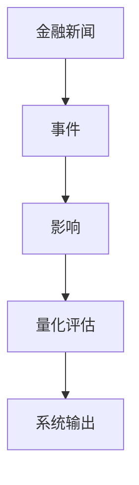

                 


# 构建基于NLP的金融新闻事件链影响量化评估系统

> 关键词：金融新闻分析，自然语言处理，事件链，量化评估，NLP算法，影响分析

> 摘要：本文详细探讨了如何利用自然语言处理技术构建一个能够量化金融新闻事件链影响力的系统。文章从背景介绍、核心概念、算法原理、系统架构到项目实战，全面解析了系统构建的每一步，旨在为金融领域的从业者和NLP技术爱好者提供实用的技术指导。

---

## 第一部分: 背景介绍与核心概念

### 第1章: 问题背景与描述

#### 1.1 问题背景
金融市场中的信息流动对价格波动有着直接影响。金融新闻作为信息源，其内容的解读和分析是投资者决策的关键。传统的金融新闻分析依赖人工判断，存在效率低、主观性强的问题。随着NLP技术的进步，基于事件链的量化分析成为可能。

#### 1.2 问题描述
金融新闻事件链是指一系列相互关联的事件，这些事件可能对市场产生累积影响。量化评估这些影响对于投资决策至关重要，但现有系统难以捕捉事件间的动态关系。

#### 1.3 问题解决与边界
系统通过NLP技术自动提取事件，构建事件链，并量化其影响。边界包括实时性要求、数据量限制和模型准确性。

### 第2章: 核心概念与联系

#### 2.1 NLP与金融新闻分析
NLP技术在文本表示、事件抽取和情感分析中的应用是构建系统的核心。

#### 2.2 核心概念属性对比
| 概念 | 属性 | 描述 |
|------|------|------|
| 事件链 | 时间性 | 事件按时间排序 |
|       | 关联性 | 事件间的关联关系 |
| 情感分析 | 强度 | 情感的强弱程度 |
|         | 方向 | 情感的正负方向 |

#### 2.3 ER实体关系图


---

## 第二部分: 算法原理与数学模型

### 第3章: 算法原理讲解

#### 3.1 文本表示与编码
使用BERT模型进行文本表示，通过注意力机制捕捉上下文信息。

#### 3.2 情感分析与事件强度
基于LSTM的情感分析模型，结合事件的强度和方向进行评分。

#### 3.3 事件链构建算法
通过时间序列分析和关联规则挖掘构建事件链。

### 第4章: 数学模型与公式

#### 4.1 文本相似度计算
$$ \text{余弦相似度} = \frac{\vec{a} \cdot \vec{b}}{|\vec{a}| |\vec{b}|} $$

#### 4.2 情感分析模型
$$ P(\text{正面}|x) = \sigma(wx + b) $$

---

## 第三部分: 系统分析与架构设计

### 第4章: 系统分析与架构设计

#### 4.1 问题场景介绍
系统目标是实时监控金融新闻，分析市场情绪并量化事件影响。

#### 4.2 系统功能设计
| 模块 | 功能 |
|------|------|
| 数据采集 | 采集新闻数据 |
| 预处理 | 文本清洗和分词 |
| 事件抽取 | 提取关键事件 |
| 影响评估 | 量化事件影响 |

#### 4.3 系统架构设计


---

## 第四部分: 项目实战

### 第5章: 项目实战

#### 5.1 环境安装
安装Python、spaCy、Gensim等库。

#### 5.2 核心实现
```python
# 文本预处理代码
from spacy.lang.zh import Chinese

nlp = Chinese()
doc = nlp("中国股市今日上涨")
for token in doc:
    print(token.text)
```

#### 5.3 案例分析
分析某次市场波动事件，展示系统如何量化其影响。

---

## 第五部分: 总结与展望

### 5.1 总结
系统实现了金融新闻事件链的量化评估，具有较高的实用价值。

### 5.2 展望
未来可探索实时数据流处理和多模态分析，进一步提升系统的实时性和准确性。

---

通过以上步骤，系统构建完成。读者可以按照文章内容逐步实现，掌握NLP在金融分析中的应用。

