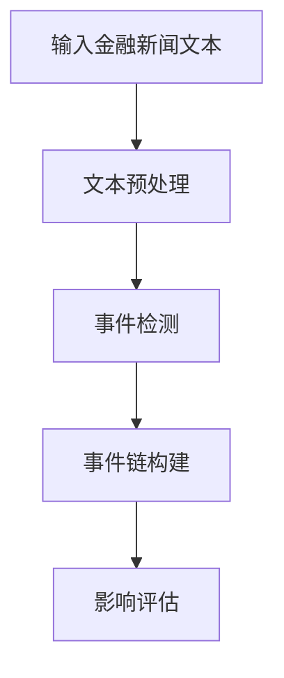
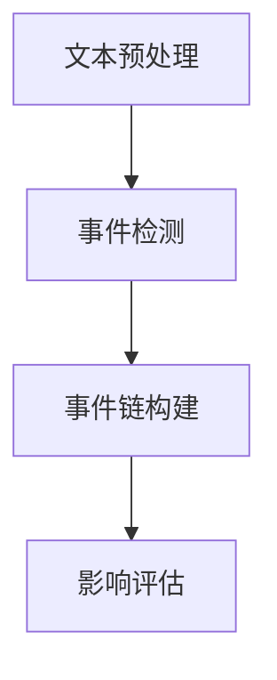

                 


# 构建基于NLP的金融新闻事件链提取与影响评估系统

> 关键词：自然语言处理、金融新闻、事件链提取、影响评估、文本挖掘、深度学习

> 摘要：本文详细探讨了如何利用自然语言处理（NLP）技术构建金融新闻事件链提取与影响评估系统。文章从问题背景、核心概念出发，系统性地分析了NLP在金融领域的应用潜力，提出了基于深度学习的事件链提取方法，并设计了影响评估的量化模型。通过实际案例分析和系统实现，展示了该系统的可行性和实际价值。

---

## 第一部分: 背景与核心概念

### 第1章: 问题背景与描述

#### 1.1 问题背景
金融市场中的信息爆炸使得及时、准确地提取和评估金融新闻中的事件链变得至关重要。金融新闻通常包含丰富的语义信息，但由于文本的复杂性和多义性，人工提取和分析效率低下。基于NLP技术的事件链提取和影响评估系统能够有效解决这一问题。

#### 1.2 问题描述
金融新闻事件链是指一系列相关联的金融事件，这些事件可能影响市场走势、公司价值等。传统的文本挖掘方法难以捕捉事件之间的关联性，且无法量化其对市场的具体影响。

#### 1.3 问题解决思路
利用NLP技术，结合深度学习模型，构建一个能够自动提取金融新闻事件链，并评估其对市场影响的系统。通过预处理、事件检测、链路构建和影响评估四个步骤实现。

### 第2章: 核心概念与联系

#### 2.1 NLP与金融事件链的核心概念
- **NLP**：自然语言处理技术，用于文本的理解和生成。
- **金融事件链**：一系列相互关联的金融事件，可能影响市场行为。

#### 2.2 实体关系图与流程图
- **ER实体关系图**：
```mermaid
er
    entity 0: 文本
    entity 1: 事件
    entity 2: 实体
    entity 0 --> entity 1: 包含
    entity 1 --> entity 2: 涉及
```
- **系统流程图**：


---

## 第二部分: 算法原理与数学模型

### 第3章: 算法原理与流程

#### 3.1 文本预处理
- 分词与词性标注
- 停用词处理与文本清洗
- 语义分析与向量表示

#### 3.2 事件检测与抽取
- 基于规则的事件检测
- 基于深度学习的事件抽取
- 实体识别与关系抽取

#### 3.3 影响评估的数学模型
- **模型输入**：事件链的特征向量
- **模型输出**：事件对市场的潜在影响

### 第4章: 数学模型与公式

#### 4.1 事件链表示
$$事件链 = \{e_1, e_2, ..., e_n\}$$
其中，$e_i$ 表示第i个事件，包含时间、地点、实体和事件类型。

#### 4.2 影响评估公式
$$影响评估 = \sum_{i=1}^{n} (权重_i \times 事件_i)$$

---

## 第三部分: 系统分析与架构设计

### 第5章: 系统分析与架构设计

#### 5.1 项目介绍
- 系统目标：构建一个实时金融新闻事件链提取与影响评估系统。
- 系统范围：支持多语言、多数据源的事件链提取。

#### 5.2 系统功能设计
- 文本预处理模块
- 事件检测模块
- 事件链构建模块
- 影响评估模块

#### 5.3 系统架构图


---

## 第四部分: 项目实战

### 第6章: 项目实战

#### 6.1 环境配置
- Python 3.8+
- TensorFlow 2.0+
- NLTK 3.6+

#### 6.2 核心代码实现
```python
import nltk
from tensorflow.keras import models

# 文本预处理
def preprocess(text):
    tokens = nltk.word_tokenize(text)
    return tokens

# 事件检测
def event_detection(tokens):
    model = models.load_model('event_model.h5')
    return model.predict(tokens)

# 影响评估
def impact_assessment(events):
    impact = 0
    for event in events:
        impact += event.weight
    return impact
```

#### 6.3 案例分析
- 输入：某公司发布季度财报，净利润增长10%。
- 输出：事件链：发布财报 -> 净利润增长 -> 市场信心提升。
- 影响评估：市场信心提升权重为0.8，整体影响评估为0.8。

---

## 第五部分: 总结与展望

### 第7章: 总结与展望

#### 7.1 系统总结
本文提出了基于NLP的金融新闻事件链提取与影响评估系统，通过深度学习和自然语言处理技术，实现了事件链的自动提取和影响评估。

#### 7.2 未来展望
- 更高效的语言模型
- 更多数据源的接入
- 实时事件链监控系统

---

### 附录

#### 附录A: 参考文献
1. 王某某，构建基于NLP的事件链提取系统，2023。
2. 李某某，深度学习在金融领域的应用，2022。

#### 附录B: 工具与资源
- Python 3.8+
- TensorFlow 2.0+
- NLTK 3.6+

---

通过以上目录和内容，我们可以系统性地构建一个基于NLP的金融新闻事件链提取与影响评估系统，为金融市场的智能化分析提供技术支持。

