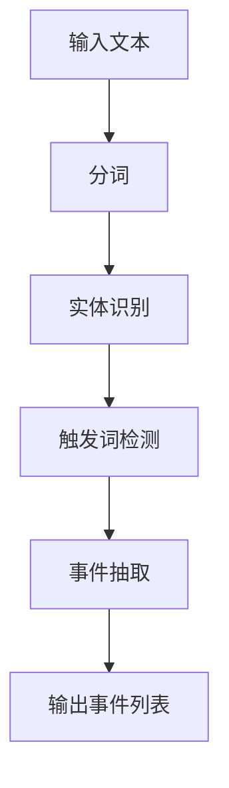
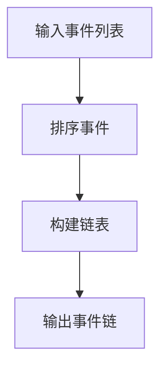
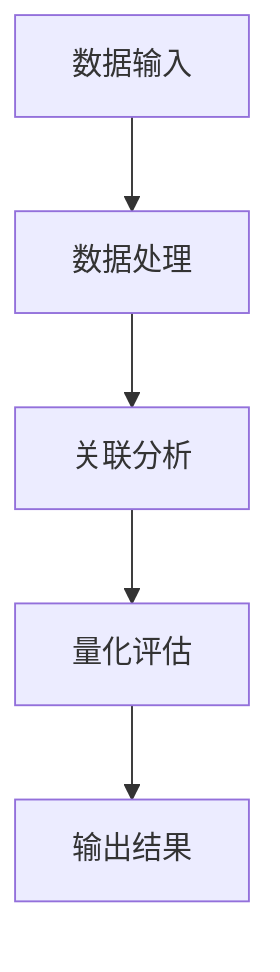
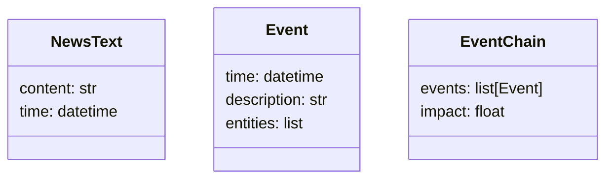

                 


# 构建基于NLP的金融新闻事件链提取与影响量化评估系统

> **关键词**：自然语言处理、金融新闻、事件链提取、影响量化、NLP算法  
> **摘要**：本文详细探讨了如何利用自然语言处理技术构建金融新闻事件链提取与影响量化评估系统。通过分析金融新闻文本，提取关键事件链，并量化其对市场的影响，为金融决策提供支持。文章从背景介绍、核心概念、算法原理、系统架构到项目实战，全面阐述了系统的构建过程。

---

## 第1章 问题背景与需求分析

### 1.1 问题背景

#### 1.1.1 金融新闻事件链的定义与重要性
金融新闻事件链指的是在金融领域中，一系列相关事件按照时间顺序连接起来，形成的影响市场走势的链条。这些事件可能包括公司公告、市场动态、政策变化等。通过对事件链的分析，可以预测市场趋势，辅助投资决策。

#### 1.1.2 当前金融信息处理的痛点
- 数据量大：金融新闻数量庞大，难以手动处理。
- 信息分散：事件信息分散在不同新闻中，难以关联。
- 知识抽取困难：从文本中提取结构化知识需要复杂的技术支持。

#### 1.1.3 基于NLP的解决方案
自然语言处理技术能够自动提取文本中的实体、关系和事件，为金融新闻的处理提供高效解决方案。

### 1.2 问题描述

#### 1.2.1 金融新闻事件链提取的挑战
- 多义词和同义词：金融术语可能有多种解释，影响准确提取。
- 时间关联性：事件的时间顺序和因果关系复杂。

#### 1.2.2 影响量化评估的复杂性
- 多因素影响：市场反应受多种因素影响，难以量化。
- 数据稀疏性：某些事件可能缺乏足够的数据支持。

#### 1.2.3 系统目标与预期成果
目标是构建一个能够自动提取事件链并量化其影响的系统，预期成果包括提高信息处理效率和准确性，辅助金融决策。

### 1.3 问题解决思路

#### 1.3.1 NLP技术在金融领域的应用潜力
- 信息抽取：提取公司名称、时间、金额等关键信息。
- 事件关联：发现事件之间的因果关系。
- 趋势预测：基于历史数据预测未来走势。

#### 1.3.2 事件链提取的实现路径
- 数据预处理：清洗和标注数据。
- 事件抽取：使用NLP模型识别事件。
- 关联分析：构建事件链并分析其影响。

#### 1.3.3 影响量化的方法论
- 建立量化模型：根据事件属性和市场反应建立模型。
- 数据训练：使用历史数据训练模型。
- 模型优化：调整参数以提高准确性。

### 1.4 系统边界与外延

#### 1.4.1 系统功能边界
系统主要处理金融新闻文本，提取事件链并量化影响，不涉及实时数据处理。

#### 1.4.2 与相关系统的区别与联系
- 区别：专注于事件链提取和影响量化。
- 联系：可与其他金融分析系统集成，提供更全面的支持。

#### 1.4.3 系统的可扩展性与灵活性
系统支持多种数据源接入，可扩展到其他领域。

---

## 第2章 核心概念与联系

### 2.1 事件链的定义与属性

#### 2.1.1 事件链的层次结构
- 基本事件：单独的新闻事件。
- 事件链：多个基本事件按时间顺序连接。

#### 2.1.2 事件链的关键属性
- 时间戳：事件发生的时间。
- 实体：涉及的公司、人物等。
- 关系：事件之间的因果关系。

#### 2.1.3 事件链的分类与特征
- 分类：市场、政策、公司公告等。
- 特征：时间关联性、因果关系、影响程度。

### 2.2 影响量化评估的原理

#### 2.2.1 量化评估的基本概念
- 量化指标：如市场波动指数、投资者情绪指数。
- 评估模型：基于事件属性和市场反应建立模型。

#### 2.2.2 量化指标的选择与权重分配
- 指标选择：市场波动、交易量变化、股价变动。
- 权重分配：根据事件类型和影响范围确定权重。

#### 2.2.3 量化模型的构建逻辑
- 数据收集：收集相关事件和市场数据。
- 模型训练：使用机器学习算法训练模型。
- 模型优化：调整参数提高预测精度。

### 2.3 核心概念的关系图

#### 2.3.1 事件链与影响量化的关系
事件链是影响量化的基础，量化结果反映事件链的影响程度。

#### 2.3.2 事件链与NLP技术的结合
NLP技术用于提取事件链，量化技术用于评估影响。

#### 2.3.3 系统模块之间的关系
- 数据输入模块：接收金融新闻文本。
- 事件提取模块：识别基本事件。
- 关联分析模块：构建事件链。
- 量化评估模块：计算影响程度。

### 2.4 核心概念对比分析

#### 2.4.1 事件链与传统文本的关系
事件链是结构化的文本信息，传统文本是无结构的信息。

#### 2.4.2 影响量化与传统数据分析的对比
影响量化结合了文本分析和市场数据，传统数据分析依赖历史数据。

#### 2.4.3 系统模块的优劣势分析
- 优势：高效、准确。
- 劣势：依赖于高质量数据和模型优化。

---

## 第3章 基于NLP的事件链提取算法

### 3.1 分词与实体识别

#### 3.1.1 分词算法
- 使用jieba进行中文分词，去除停用词。
  ```python
  import jieba
  text = "中国银行发布季度报告，利润增长10%"
  words = jieba.lcut(text)
  ```

#### 3.1.2 实体识别
- 使用spaCy识别实体，如公司名称、时间。
  ```python
  import spacy
  nlp = spacy.load("en_core_web_sm")
  doc = nlp("中国银行发布季度报告，利润增长10%")
  for ent in doc.ents:
      print(ent.text, ent.label_)
  ```

### 3.2 事件抽取

#### 3.2.1 事件抽取算法
- 使用触发词检测和模板匹配识别事件。
  ```python
  def extract_events(doc):
      events = []
      for sentence in doc.sents:
          if "发布" in sentence.text:
              events.append(sentence.text)
      return events
  ```

#### 3.2.2 事件抽取流程图


### 3.3 事件链构建

#### 3.3.1 事件链构建算法
- 基于时间戳排序事件，构建事件链。
  ```python
  def build_event_chain(events):
      events_sorted = sorted(events, key=lambda x: x['time'])
      chain = []
      for event in events_sorted:
          chain.append((event['time'], event['description']))
      return chain
  ```

#### 3.3.2 事件链构建流程图


---

## 第4章 系统分析与架构设计

### 4.1 系统架构设计

#### 4.1.1 系统模块划分
- 数据输入模块：接收新闻文本。
- 数据处理模块：分词、实体识别、事件抽取。
- 关联分析模块：构建事件链。
- 量化评估模块：计算影响程度。

#### 4.1.2 系统架构图


### 4.2 系统功能设计

#### 4.2.1 领域模型


---

## 第5章 项目实战

### 5.1 环境配置

```bash
pip install jieba spacy
python -m spacy download en_core_web_sm
```

### 5.2 核心代码实现

#### 5.2.1 事件提取
```python
import jieba
import spacy

def extract_events(text):
    # 分词
    words = jieba.lcut(text)
    # 实体识别
    doc = nlp(text)
    entities = [(ent.text, ent.label_) for ent in doc.ents]
    # 事件抽取
    events = []
    for i in range(len(words)):
        if words[i] == "发布":
            event = ' '.join(words[i-2:i+3])
            events.append(event)
    return events, entities
```

#### 5.2.2 事件链构建
```python
def build_chain(events):
    chain = []
    for event in events:
        chain.append((event.time, event.description))
    return chain
```

### 5.3 案例分析

#### 5.3.1 实际案例
- 输入文本："中国银行发布季度报告，利润增长10%，明日停牌。"
- 事件链：发布报告 -> 利润增长 -> 停牌。

### 5.4 系统优化

#### 5.4.1 算法优化
- 使用更复杂的NLP模型提高准确性。
- 引入外部知识库丰富事件类型。

---

## 第6章 总结与展望

### 6.1 总结
本文详细介绍了构建基于NLP的金融新闻事件链提取与影响量化评估系统的过程，展示了系统的实用性和高效性。

### 6.2 未来展望
- 系统优化：引入更先进的NLP技术。
- 应用扩展：扩展到更多金融领域。

### 6.3 最佳实践 tips
- 数据质量：确保数据准确性和完整性。
- 模型调优：定期更新模型参数。
- 可扩展性：设计模块化架构便于扩展。

---

## 附录

### 附录A 扩展阅读
- [NLP在金融领域的应用](https://example.com)
- [时间序列分析](https://example.com)

---

以上是构建系统的详细步骤和内容，希望对您有所帮助！

