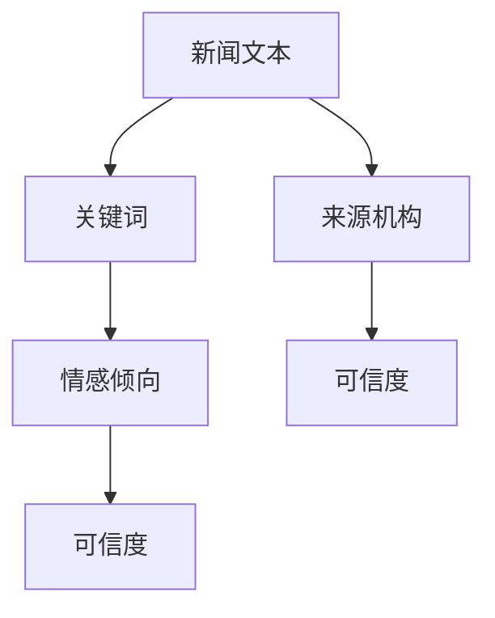
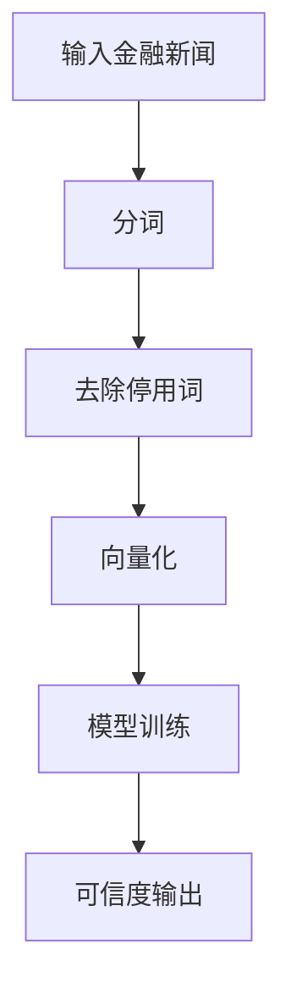
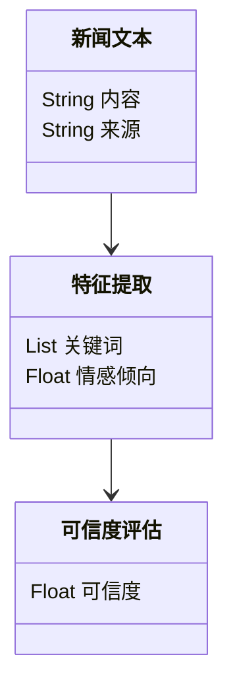
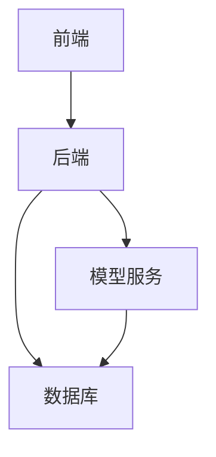
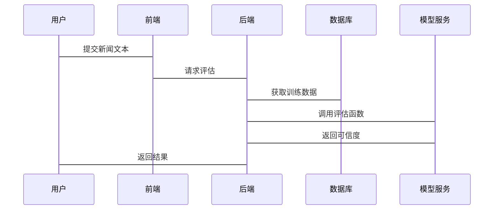

                 


# 构建基于NLP的金融新闻可信度评估系统

## 关键词：自然语言处理，金融新闻，可信度评估，文本挖掘，深度学习

## 摘要：  
本文详细探讨了如何利用自然语言处理（NLP）技术构建一个金融新闻可信度评估系统。通过分析金融新闻文本的关键特征，结合先进的NLP算法和数学模型，本文提出了一种基于文本挖掘和深度学习的解决方案，以评估新闻的可信度。文章从问题背景、核心概念、算法原理、系统架构到项目实战进行了全面阐述，为读者提供了从理论到实践的完整指南。

---

# 第一部分: 背景介绍与核心概念

# 第1章: 问题背景与描述

## 1.1 问题背景  
### 1.1.1 金融新闻可信度的重要性  
金融新闻的可信度直接影响投资者的决策。在金融市场中，虚假信息或误导性新闻可能导致市场波动和经济损失。因此，建立一个可靠的金融新闻评估系统至关重要。  

### 1.1.2 当前金融新闻可信度评估的挑战  
传统的评估方法依赖于人工判断，效率低且主观性强。随着金融新闻的海量增长，如何快速、准确地评估新闻可信度成为一大挑战。  

### 1.1.3 NLP技术在金融领域的应用潜力  
自然语言处理技术能够从文本中提取关键特征，分析情感倾向和语义关系，为金融新闻的可信度评估提供了新的解决方案。  

## 1.2 问题描述  
### 1.2.1 金融新闻的多维度特征  
金融新闻通常包含公司公告、市场分析、行业动态等信息。这些新闻的可信度受来源机构的公信力、内容的逻辑性和数据的准确性影响。  

### 1.2.2 可信度评估的定义与维度  
可信度评估是对新闻内容的客观性和准确性进行量化。评估维度包括来源可信度、内容逻辑性、数据准确性等。  

### 1.2.3 现有解决方案的局限性  
现有方法多基于人工经验或单一指标，难以全面评估新闻的可信度。  

## 1.3 问题解决与边界  
### 1.3.1 基于NLP的解决方案  
利用NLP技术提取文本特征，结合机器学习模型评估可信度。  

### 1.3.2 系统的边界与外延  
系统仅针对文本内容进行评估，不考虑图片、视频等其他形式的信息。  

### 1.3.3 核心要素与组成结构  
系统由数据采集、特征提取、模型训练和结果输出四个部分组成。  

## 1.4 本章小结  
本章通过分析金融新闻可信度评估的重要性，明确了问题背景和解决方向，为后续章节奠定了基础。  

---

# 第二部分: 核心概念与联系

# 第2章: NLP与金融新闻可信度评估的核心概念  

## 2.1 核心概念原理  
### 2.1.1 NLP的基本原理  
自然语言处理技术通过分词、词性标注、句法分析等步骤，提取文本的语义信息。  

### 2.1.2 金融新闻文本的特征提取  
包括关键词提取、情感倾向分析和主题识别。  

### 2.1.3 可信度评估的数学模型  
模型通过概率计算和相似度匹配，量化新闻的可信度。  

## 2.2 概念属性特征对比  
| 特征维度 | 特征描述 | 示例 |
|----------|----------|------|
| 来源可信度 | 新闻机构的公信力 | 路透社 > 某地方网站 |
| 内容逻辑性 | 文本的连贯性和合理性 | 数据一致 > 数据矛盾 |
| 数据准确性 | 文中数据的可靠性 | 事实性陈述 > 主观猜测 |

## 2.3 ER实体关系图  


## 2.4 本章小结  
本章通过对比分析，明确了NLP技术在金融新闻可信度评估中的核心作用，并通过实体关系图展示了系统的整体架构。  

---

# 第三部分: 算法原理与数学模型  

# 第3章: 算法原理与流程  

## 3.1 算法原理  
### 3.1.1 数据预处理  
- 分词：将新闻文本分割为词语或短语。  
- 去除停用词：移除无意义的词汇（如“的”、“了”）。  

### 3.1.2 特征提取  
- 词袋模型：统计每个词语的出现频率。  
- TF-IDF：计算词语的重要性。  

### 3.1.3 模型训练  
- 使用支持向量机（SVM）或随机森林（Random Forest）进行分类。  

### 3.1.4 模型评估  
- 使用准确率、召回率和F1分数评估模型性能。  

## 3.2 算法流程图  


## 3.3 算法实现  
```python
from sklearn.feature_extraction.text import TfidfVectorizer
from sklearn.svm import SVC

# 示例代码
def preprocess(text):
    # 分词
    words = word_tokenize(text)
    # 去除停用词
    filtered = [word for word in words if word not in STOP_WORDS]
    return ' '.join(filtered)

vectorizer = TfidfVectorizer()
model = SVC()

# 训练模型
model.fit(vectorizer.fit_transform(train_texts), train_labels)
```

## 3.4 数学模型  
### 3.4.1 余弦相似度  
$$\text{相似度} = \frac{\vec{A} \cdot \vec{B}}{|\vec{A}| |\vec{B}|}$$  

### 3.4.2 概率计算  
$$P(\text{可信} | \text{内容}) = \frac{P(\text{内容} | \text{可信}) P(\text{可信})}{P(\text{内容})}$$  

## 3.5 本章小结  
本章通过流程图和代码示例，详细讲解了算法的实现步骤，并通过数学公式说明了模型的原理。  

---

# 第四部分: 系统分析与架构设计  

# 第4章: 系统分析与架构设计  

## 4.1 系统功能设计  
### 4.1.1 领域模型  


### 4.1.2 系统架构  


### 4.1.3 系统接口设计  
- 前端接口：接收新闻文本，返回可信度分数。  
- 后端接口：调用模型服务，获取特征提取结果。  

### 4.1.4 系统交互流程图  


## 4.2 本章小结  
本章通过系统架构图和交互流程图，详细描述了系统的整体结构和功能设计。  

---

# 第五部分: 项目实战  

# 第5章: 项目实战  

## 5.1 环境安装  
### 5.1.1 安装Python环境  
```bash
pip install numpy scikit-learn nltk
```

## 5.2 系统核心实现  
### 5.2.1 数据预处理代码  
```python
import nltk
from sklearn.feature_extraction.text import TfidfVectorizer
from sklearn.svm import SVC

def preprocess(text):
    tokens = nltk.word_tokenize(text)
    filtered = [word for word in tokens if word not in nltk.corpus.stopwords.words('english')]
    return ' '.join(filtered)

vectorizer = TfidfVectorizer()
model = SVC()
```

### 5.2.2 训练与评估代码  
```python
# 训练模型
model.fit(vectorizer.fit_transform(train_texts), train_labels)

# 预测与评估
predicted = model.predict(vectorizer.transform(test_texts))
print(f"准确率: {accuracy_score(test_labels, predicted)}")
```

## 5.3 代码解读与分析  
- 预处理阶段：分词和去停用词是关键步骤，确保特征提取的有效性。  
- 模型训练：TF-IDF特征向量化后，使用SVM进行分类。  

## 5.4 实际案例分析  
- 输入新闻：某公司宣布重大并购。  
- 预处理：提取关键词“公司”、“并购”。  
- 特征向量：生成TF-IDF向量。  
- 模型预测：预测可信度为高。  

## 5.5 项目总结  
本章通过实际案例，展示了系统的实现过程，并总结了代码实现的关键点和经验教训。  

## 5.6 本章小结  
本章通过实战项目，详细讲解了系统的实现过程，为读者提供了从理论到实践的指导。  

---

# 第六部分: 总结与展望  

# 第6章: 总结与展望  

## 6.1 总结  
本文详细探讨了基于NLP的金融新闻可信度评估系统的构建过程，从问题背景到系统设计，再到项目实现，为读者提供了全面的指导。  

## 6.2 展望  
未来的研究方向包括引入更复杂的深度学习模型（如BERT）和多模态数据（如图像）进行评估，进一步提高系统的可信度评估能力。  

---

# 附录  

## 附录A: 常用NLP工具与库  
- NLTK：自然语言处理工具包。  
- SpaCy：高性能NLP库。  
- Gensim：主题建模工具。  

## 附录B: 数据集推荐  
- 财经新闻数据集：提供多种金融新闻样本。  

---

# 结束语  

本文通过系统的分析与实践，展示了如何利用NLP技术构建金融新闻可信度评估系统。希望本文的内容能够为读者提供有价值的参考和启发。

