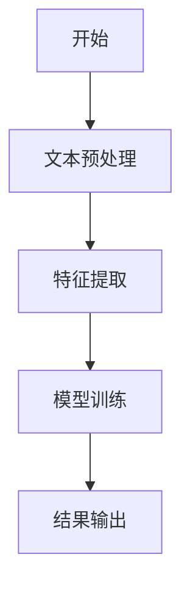
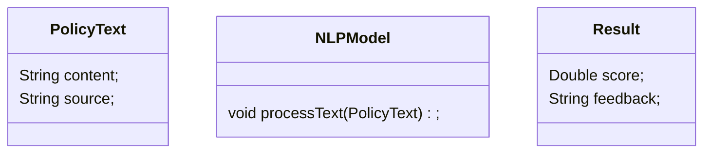
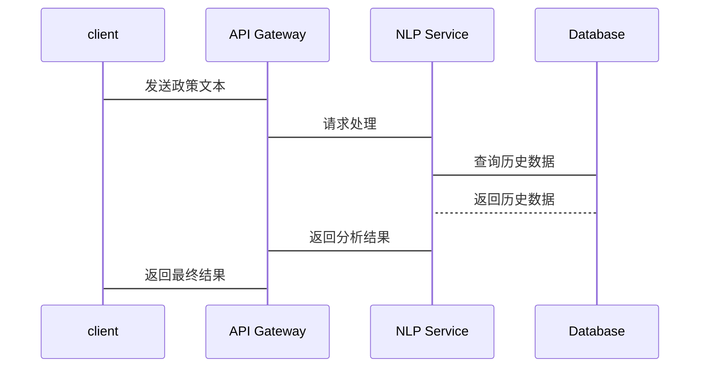

                 


# 构建基于NLP的金融监管政策执行效果动态评估系统

## 关键词：自然语言处理、金融监管、政策评估、动态评估、文本挖掘、机器学习

## 摘要

本文探讨如何利用自然语言处理技术构建一个动态评估金融监管政策执行效果的系统。通过分析政策文本，提取关键信息，运用NLP模型评估执行效果，实时监控和反馈，为监管机构提供数据支持，提升监管效率和准确性。文章详细阐述了系统构建的背景、技术原理、架构设计及实际应用案例。

---

# 第一部分：背景介绍

## 第1章：问题背景与描述

### 1.1 问题背景

#### 1.1.1 金融监管政策执行效果评估的重要性
金融监管政策的执行效果直接关系到市场的稳定和经济健康发展。传统的评估方法依赖人工分析，耗时且主观性强。NLP技术能够自动化处理海量政策文本，提取关键信息，提供客观评估依据。

#### 1.1.2 当前金融监管面临的挑战
- 政策文本复杂多样，人工解读效率低。
- 执行效果评估缺乏量化标准，主观性强。
- 监管信息分散，难以实时跟踪和反馈。

#### 1.1.3 NLP技术在金融监管中的应用潜力
NLP技术能够自动解析政策文本，识别关键实体，评估执行效果，辅助决策者制定优化策略。

### 1.2 问题描述

#### 1.2.1 金融政策执行效果的定义
政策执行效果指政策在实际执行中达到预期目标的程度，包括合规性、执行效率和市场反应。

#### 1.2.2 政策执行过程中的关键问题
- 政策理解偏差：不同解读导致执行偏差。
- 执行不一致：各级机构执行力度不一。
- 缺乏实时反馈：无法及时调整和优化。

#### 1.2.3 基于NLP的动态评估系统的目标
构建一个实时、动态的评估系统，自动分析政策文本，量化执行效果，提供实时反馈和改进建议。

### 1.3 问题解决思路

#### 1.3.1 NLP技术如何助力金融监管
- 文本预处理：清洗和分词。
- 特征提取：识别关键词和实体。
- 情感分析：判断政策执行的正面或负面效果。

#### 1.3.2 系统设计的核心思路
- 采用NLP模型分析政策文本。
- 结构化数据存储，便于查询和分析。
- 实时更新和反馈，动态评估执行效果。

#### 1.3.3 技术实现的可行性分析
- 现有NLP技术成熟，可应用于政策文本分析。
- 结构化存储技术成熟，支持高效查询。
- 可扩展性强，支持实时更新和反馈。

### 1.4 边界与外延

#### 1.4.1 系统的适用范围
适用于金融监管领域的政策文本分析，帮助评估政策执行效果，优化监管策略。

#### 1.4.2 系统的局限性
- 依赖高质量政策文本，数据不足会影响准确性。
- 情感分析受主观因素影响，存在误差。
- 仅评估执行效果，不直接解决执行中的具体问题。

#### 1.4.3 与其他监管工具的关系
系统作为辅助工具，与其他监管工具如合规监控系统、风险评估模型等协同工作，提供数据支持。

### 1.5 核心概念与核心要素

#### 1.5.1 系统构成的核心要素
- **政策文本**：输入的金融监管政策文本。
- **NLP模型**：用于分析文本的关键算法。
- **评估指标**：量化执行效果的指标体系。
- **反馈机制**：提供实时反馈和改进建议。

#### 1.5.2 各要素之间的关系
政策文本通过NLP模型处理后生成评估指标，评估指标通过反馈机制优化政策执行。

#### 1.5.3 核心概念的结构化描述
系统将政策文本转化为结构化数据，分析后生成评估结果，形成反馈循环。

---

# 第二部分：核心概念与联系

## 第2章：核心概念与联系

### 2.1 核心概念原理

#### 2.1.1 NLP技术的基本原理
NLP通过预处理、特征提取、模型训练等步骤，将文本转化为结构化数据，供后续分析使用。

#### 2.1.2 金融监管政策的文本特征
政策文本通常包含法律术语、专业术语和特定格式，需要特定的NLP处理方法。

#### 2.1.3 政策执行效果的量化方法
通过关键词匹配、情感分析等方法，将政策执行效果量化为指标。

### 2.2 核心概念属性特征对比

#### 2.2.1 不同NLP模型的对比分析
| 模型类型 | 输入要求 | 输出结果 | 优势 |
|----------|-----------|-----------|------|
| 词袋模型 | 词频统计 | 单词权重 | 简单高效 |
| 嵌入模型 | 文本向量 | 语义表示 | 高准确性 |
| 情感分析模型 | 文本情感 | 情感倾向 | 适用性广 |

#### 2.2.2 政策文本与执行效果的关系
政策文本是输入，执行效果是输出，NLP技术是连接二者的桥梁。

#### 2.2.3 核心概念的结构对比
- 政策文本：输入数据。
- NLP模型：处理数据的工具。
- 评估指标：输出结果。

### 2.3 ER实体关系图

```mermaid
er
actor: 监管机构
actor --> policy_text: 提供政策文本
policy_text --> system: 系统处理
system --> result: 输出评估结果
result --> feedback: 提供反馈
```

---

# 第三部分：算法原理讲解

## 第3章：算法原理与实现

### 3.1 算法原理

#### 3.1.1 基于NLP的文本预处理
- 分词：将文本分割成词语或短语。
- 去停用词：去除无意义词汇，如“的”、“了”等。
- 词干提取：将词转换为基本形式。

#### 3.1.2 文本特征提取
- 词袋模型：统计词频，生成特征向量。
- TF-IDF：计算关键词的重要性，用于特征选择。

#### 3.1.3 模型训练与优化
- 使用训练数据训练NLP模型，调整参数，优化模型性能。

### 3.2 算法流程图



### 3.3 算法实现代码

```python
from sklearn.feature_extraction.text import TfidfVectorizer
from sklearn.naive_bayes import MultinomialNB
from sklearn.pipeline import Pipeline
import numpy as np

# 示例数据
texts = ["政策A：加强市场监管，促进公平竞争。",
         "政策B：鼓励创新，支持科技企业发展。"]

# 创建TF-IDF模型和Naive Bayes分类器
model = Pipeline([
    ('tfidf', TfidfVectorizer()),
    ('clf', MultinomialNB())
])

# 训练模型
model.fit(texts, [0, 1])

# 预测新文本
new_text = ["新政策：支持绿色金融发展。"]
print(model.predict(new_text))
```

### 3.4 数学模型与公式

- TF-IDF计算公式：
  $$ \text{TF-IDF}(t, d) = \text{TF}(t, d) \times \text{IDF}(t) $$
  其中，TF是词t在文档d中的频率，IDF是词t的逆文档频率。

- 词袋模型的向量表示：
  $$ V(d) = (w_1, w_2, ..., w_n) $$
  其中，$w_i$是词i的权重。

---

# 第四部分：系统分析与架构设计方案

## 第4章：系统分析与架构设计

### 4.1 问题场景介绍

#### 4.1.1 问题场景
监管机构需要动态评估政策执行效果，实时调整监管策略。

#### 4.1.2 项目介绍
构建一个基于NLP的动态评估系统，实时分析政策文本，评估执行效果。

### 4.2 系统功能设计

#### 4.2.1 领域模型类图



### 4.3 系统架构设计

#### 4.3.1 系统架构图


#### 4.3.2 系统接口设计
- API接口：提供文本分析、结果查询等功能。
- 数据接口：连接数据库，存储和检索数据。

### 4.4 系统交互序列图



---

# 第五部分：项目实战

## 第5章：项目实战

### 5.1 环境安装

```bash
pip install scikit-learn
pip install spacy
pip install mermaid
```

### 5.2 核心代码实现

#### 5.2.1 文本预处理代码

```python
import spacy

nlp = spacy.load("en_core_web_sm")
doc = nlp("政策文本内容。")
tokens = [token.text for token in doc]
```

#### 5.2.2 模型训练代码

```python
from sklearn.model_selection import train_test_split

# 数据分割
X_train, X_test, y_train, y_test = train_test_split(texts, labels, test_size=0.2)

# 模型训练
model.fit(X_train, y_train)
```

### 5.3 代码解读与分析

#### 5.3.1 文本预处理
- 使用SpaCy进行分词和实体识别，提取关键信息。

#### 5.3.2 模型训练
- 使用TF-IDF和Naive Bayes模型训练分类器，评估政策文本的执行效果。

### 5.4 实际案例分析

#### 5.4.1 案例描述
分析某金融监管政策的执行效果，使用系统进行评估，输出结果和反馈。

#### 5.4.2 案例分析
通过系统分析，发现政策执行中的问题，提供改进建议。

### 5.5 项目小结

---

# 第六部分：最佳实践与总结

## 第6章：最佳实践 tips

### 6.1 小结
本文详细介绍了构建基于NLP的金融监管政策执行效果动态评估系统的方法，包括背景分析、技术实现、系统架构和项目实战。

### 6.2 注意事项
- 数据质量影响系统准确性，需确保数据清洗和标注。
- 模型选择需根据具体场景，可能需要多次实验和优化。
- 系统需实时更新，保持评估结果的及时性和准确性。

### 6.3 拓展阅读
建议深入学习NLP技术，探索更多应用场景，如风险预警、舆情分析等。

---

# 结语

本文为构建基于NLP的金融监管政策执行效果动态评估系统提供了理论和实践指导。通过系统化的分析和设计，结合实际案例，展示了如何利用NLP技术提升金融监管效率和准确性。未来，随着NLP技术的不断发展，系统将更加智能化和精准化，为金融监管提供更有力的支持。

