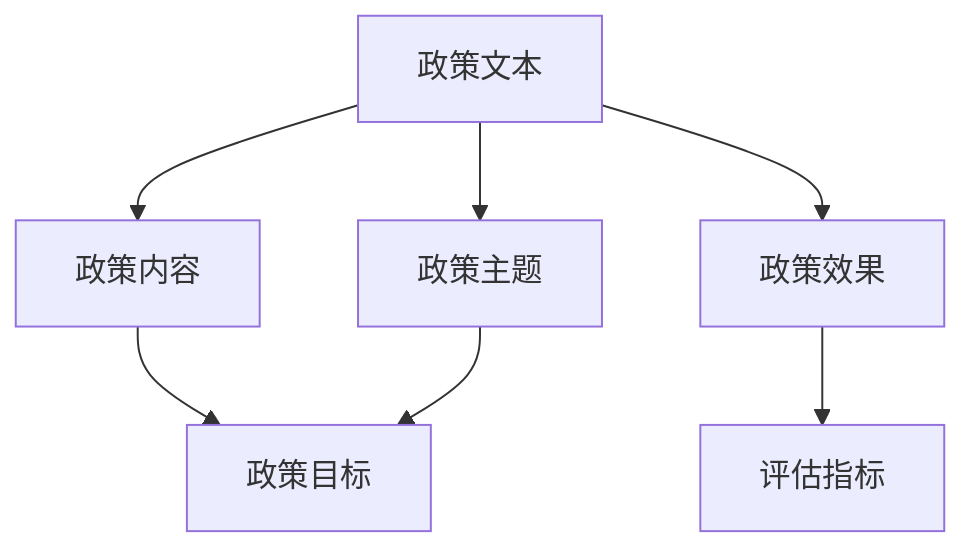
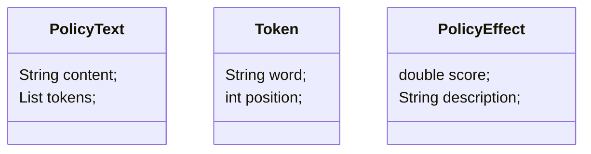
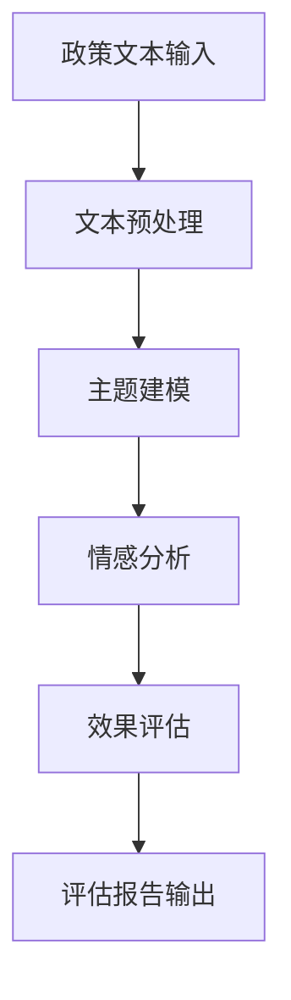
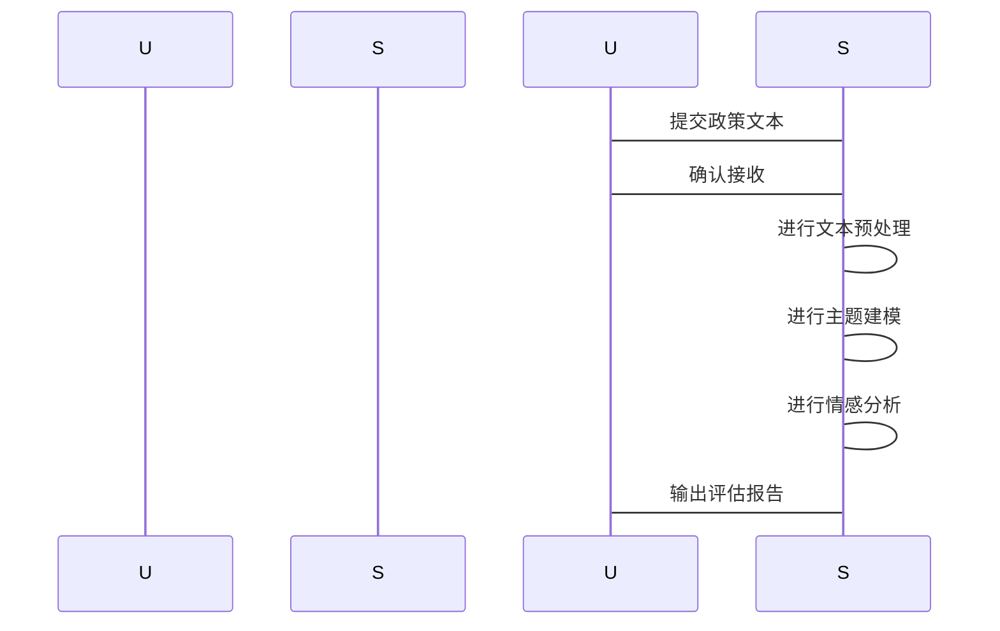

                 


# 构建基于NLP的金融监管政策执行效果评估系统

> 关键词：自然语言处理、金融监管、政策评估、文本挖掘、机器学习

> 摘要：本文详细探讨了如何利用自然语言处理（NLP）技术构建金融监管政策执行效果评估系统。通过分析政策文本，提取关键信息，评估政策执行效果，本文提出了一种基于NLP的解决方案，为金融监管机构提供了数据驱动的决策支持工具。

---

# 第一部分：概述

## 第1章：问题背景与目标

### 1.1 问题背景

#### 1.1.1 金融监管的重要性
金融监管是维护金融市场稳定、保护投资者利益的重要手段。政策制定者需要确保政策的实施能够达到预期效果，但传统的评估方法往往依赖于主观判断和有限的数据支持。

#### 1.1.2 政策执行效果评估的挑战
政策执行效果的评估通常面临以下挑战：
- **数据分散**：政策文本、市场数据和监管报告分散在不同的来源中。
- **信息提取困难**：政策文本复杂且专业性强，难以快速提取关键信息。
- **评估周期长**：传统评估方法耗时长，难以及时反馈政策效果。

#### 1.1.3 NLP技术的应用潜力
自然语言处理技术能够从大量文本数据中提取结构化信息，为政策效果评估提供技术支持。通过分析政策文本、市场反馈和监管报告，NLP可以帮助政策制定者更准确地评估政策执行效果。

### 1.2 问题描述

#### 1.2.1 金融政策执行的复杂性
金融政策的执行涉及多个部门和机构，政策文本通常包含复杂的术语和结构，需要专业的知识才能准确理解。

#### 1.2.2 政策效果评估的难点
政策效果的评估需要结合定量和定性分析，传统的评估方法难以充分利用文本数据中的潜在信息。

#### 1.2.3 基于NLP的解决方案
通过NLP技术，可以将非结构化的政策文本转化为结构化数据，结合机器学习算法进行效果评估，从而提高评估的准确性和效率。

### 1.3 问题解决思路

#### 1.3.1 NLP技术的核心优势
NLP技术能够从大量文本数据中提取关键词、主题和情感倾向，为政策评估提供多维度的支持。

#### 1.3.2 从文本到数据的转换
通过分词、实体识别和情感分析等技术，将政策文本转化为可量化的数据，为后续分析提供基础。

#### 1.3.3 数据驱动的政策效果评估
结合NLP提取的数据和实际市场表现，构建模型评估政策效果，帮助政策制定者优化决策。

### 1.4 系统边界与外延

#### 1.4.1 系统的输入与输出
- **输入**：政策文本、市场数据、监管报告。
- **输出**：政策执行效果评估报告、改进建议。

#### 1.4.2 系统的功能边界
系统专注于政策文本的分析和效果评估，不涉及政策制定过程。

#### 1.4.3 系统的扩展性与灵活性
系统设计允许添加更多数据源和分析方法，便于未来扩展。

### 1.5 核心概念与组成

#### 1.5.1 NLP技术的核心要素
- **分词**：将文本分割成有意义的词汇或短语。
- **词嵌入**：将词语表示为低维向量，便于计算机处理。
- **文本分类**：根据内容将文本归类。

#### 1.5.2 金融监管政策的文本特征
- **主题**：政策涉及的领域，如货币政策、市场监管。
- **内容**：政策的具体措施和要求。
- **目标**：政策希望达到的效果。

#### 1.5.3 政策执行效果的评估指标
- **合规性**：政策是否被正确执行。
- **有效性**：政策是否达到预期效果。
- **社会影响**：政策对市场和社会的影响。

---

## 第2章：核心概念与联系

### 2.1 NLP技术原理

#### 2.1.1 自然语言处理的基本概念
NLP涉及文本处理的多个步骤，包括分词、语法分析、语义理解等。

#### 2.1.2 词嵌入与文本表示
词嵌入（如Word2Vec）通过将词语映射到向量空间，使得词语之间的相似性可以通过向量运算体现。

#### 2.1.3 常见的NLP任务与模型
- **分词**：使用jieba等工具。
- **情感分析**：使用LSTM或BERT模型。
- **文本分类**：使用TF-IDF和SVM进行分类。

### 2.2 金融监管政策文本的特征分析

#### 2.2.1 政策文本的结构特征
政策文本通常包含标题、正文、条款和附则等部分。

#### 2.2.2 政策文本的主题分布
政策主题可能包括货币政策、资本市场监管等。

#### 2.2.3 政策文本的情感倾向
政策文本通常较为正式，但可以通过情感分析检测其倾向。

### 2.3 核心概念的ER实体关系图



---

## 第3章：算法原理与实现

### 3.1 分词与文本预处理

#### 3.1.1 分词算法的选择
选择适合金融领域的分词工具，如jieba。

#### 3.1.2 常见的文本预处理步骤
包括去除停用词、分词、去除标点符号等。

#### 3.1.3 正则表达式在文本清洗中的应用
使用正则表达式去除无关字符，提取关键词。

### 3.2 情感分析与主题建模

#### 3.2.1 情感分析算法原理
使用LSTM或BERT模型进行情感分析，判断政策文本的情感倾向。

#### 3.2.2 主题建模的LDA算法
通过LDA主题建模，识别政策文本的主要主题。

#### 3.2.3 算法实现的Python代码示例

```python
from gensim import corpora, models

# 示例文本
texts = ["金融监管", "政策执行", "市场影响"]

# 创建词典
dictionary = corpora.Dictionary(texts)
corpus = [dictionary.doc2bow(text) for text in texts]

# LDA主题建模
lda = models.LdaModel(corpus, num_topics=2, id2word=dictionary)
for topic in lda.print_topics():
    print(topic)
```

### 3.3 文本分类与效果评估

#### 3.3.1 文本分类的数学模型
使用支持向量机（SVM）进行文本分类，将政策文本分为不同类别。

#### 3.3.2 分类算法的性能评估指标
包括准确率、召回率、F1分数等。

#### 3.3.3 基于NLP的金融政策分类案例
使用TF-IDF和SVM对政策文本进行分类，评估分类效果。

---

## 第4章：系统分析与架构设计

### 4.1 项目背景与目标

#### 4.1.1 项目背景介绍
本项目旨在利用NLP技术构建金融监管政策执行效果评估系统，帮助政策制定者优化决策。

#### 4.1.2 项目目标分解
- 实现政策文本的自动分析。
- 构建政策效果评估模型。
- 提供直观的评估报告。

### 4.2 系统功能设计

#### 4.2.1 领域模型设计


### 4.3 系统架构设计

#### 4.3.1 系统架构图


### 4.4 系统接口设计

#### 4.4.1 输入接口
- 政策文本输入接口：接收政策文本数据。
- 数据预处理接口：清洗和分词文本。

#### 4.4.2 输出接口
- 评估报告输出接口：生成并输出评估报告。
- 数据接口：提供结构化的评估数据。

### 4.5 系统交互流程

#### 4.5.1 交互流程图


---

## 第5章：项目实战

### 5.1 环境安装

#### 5.1.1 安装Python和必要的库
- 安装Python 3.x
- 使用pip安装jieba、gensim、numpy等库。

#### 5.1.2 安装NLP框架
- 安装TensorFlow或Keras框架。

### 5.2 系统核心实现源代码

#### 5.2.1 文本预处理代码
```python
import jieba

def preprocess(text):
    words = jieba.lcut(text)
    return words
```

#### 5.2.2 情感分析代码
```python
from sklearn.feature_extraction.text import TfidfVectorizer
from sklearn.svm import SVC

vectorizer = TfidfVectorizer()
model = SVC()
model.fit(vectorizer.fit_transform(X), y)
```

### 5.3 案例分析与实际应用

#### 5.3.1 数据来源
使用公开的金融监管政策文本进行分析。

#### 5.3.2 实际应用案例
分析某项货币政策的执行效果，生成评估报告。

### 5.4 项目总结

#### 5.4.1 项目成果
成功构建了基于NLP的政策执行效果评估系统。

#### 5.4.2 项目经验
- NLP技术在金融领域的应用潜力巨大。
- 系统设计需要结合实际需求。

---

## 第6章：最佳实践、小结、注意事项与拓展阅读

### 6.1 最佳实践 tips

#### 6.1.1 数据质量
确保数据的完整性和准确性，选择合适的数据预处理方法。

#### 6.1.2 模型选择
根据具体任务选择合适的NLP模型，如BERT适合复杂任务。

#### 6.1.3 可解释性
保持模型的可解释性，便于政策制定者理解和优化。

### 6.2 小结

本文详细介绍了基于NLP的金融监管政策执行效果评估系统的构建过程，从问题背景到系统设计，再到实际应用，为金融监管领域提供了新的思路。

### 6.3 注意事项

- **数据隐私**：处理金融数据时需注意隐私保护。
- **模型调优**：根据实际效果不断优化模型参数。
- **持续学习**：定期更新模型以适应新的政策变化。

### 6.4 拓展阅读

- 《自然语言处理入门》
- 《金融监管与政策评估》
- 《机器学习在金融领域的应用》

---

通过以上内容，我们可以看到，构建基于NLP的金融监管政策执行效果评估系统是一个复杂但极具价值的项目。NLP技术为政策评估提供了新的工具和方法，能够帮助政策制定者更高效、更准确地评估政策效果，优化监管策略。

