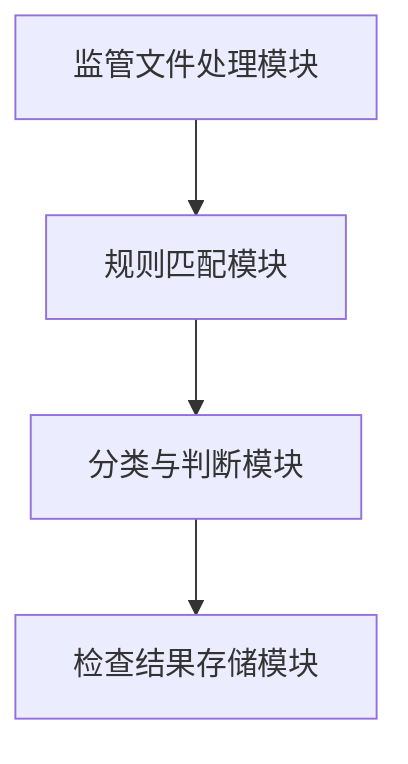

                 


# 构建基于NLP的金融监管文件遵从性检查系统

## 关键词：金融监管，自然语言处理，文件分析，合规检查，机器学习

## 摘要：本文详细介绍了如何利用自然语言处理（NLP）技术构建一个高效的金融监管文件遵从性检查系统。通过分析金融监管文件的文本内容，结合监管规则，系统能够自动识别文件是否符合相关法规要求。本文从问题背景、NLP技术基础、系统架构设计、核心算法实现、项目实战等方面展开，详细阐述了系统的构建过程，并提供了具体的代码实现和案例分析。

---

# 第一部分：背景介绍

## 第1章：问题背景与需求分析

### 1.1 问题背景

#### 1.1.1 金融监管的重要性  
金融监管是维护金融市场秩序、保护投资者利益的重要手段。随着金融业务的复杂化和多样化，监管文件的种类和数量急剧增加，传统的手动检查方式已经难以应对。

#### 1.1.2 传统金融监管的痛点  
- **效率低下**：监管文件数量庞大，人工检查耗时长、成本高。  
- **主观性**：人工检查依赖于监管人员的经验，可能存在疏漏或误判。  
- **规则复杂**：金融监管规则繁多且更新频繁，难以快速适应变化。

#### 1.1.3 NLP技术在金融监管中的应用潜力  
自然语言处理技术能够从文本中提取关键信息，自动识别文件是否符合监管要求，显著提高监管效率。

---

### 1.2 问题描述

#### 1.2.1 金融监管文件的主要类型  
- 公司年报、财务报表、招股说明书、并购公告等。

#### 1.2.2 文件遵从性检查的核心问题  
如何准确识别监管文件中的关键信息，判断其是否符合相关法规要求。

#### 1.2.3 当前技术手段的局限性  
传统方法主要依赖关键词匹配，难以处理语义复杂、表述灵活的金融文本。

---

### 1.3 问题解决思路

#### 1.3.1 引入NLP技术的必要性  
通过NLP技术，可以实现对金融文本的深度理解和语义分析，提高检查的准确性和效率。

#### 1.3.2 基于NLP的文件分析流程  
1. **文本预处理**：分词、去停用词、实体识别。  
2. **特征提取**：关键词提取、主题建模。  
3. **分类与判断**：基于规则或机器学习模型判断文件是否符合要求。

#### 1.3.3 系统目标与预期效果  
构建一个智能化的金融监管文件检查系统，实现自动化的文件分析和合规性判断。

---

### 1.4 系统边界与外延

#### 1.4.1 系统功能的边界  
- 仅处理文本内容，不涉及文件的格式转换或其他数据处理。  
- 专注于监管文件的合规性检查，不涉及其他类型的监管活动。

#### 1.4.2 与其他系统的关联  
- 与监管机构的数据库对接，获取最新的监管规则。  
- 与企业的文档管理系统集成，实现自动化的文件检查。

#### 1.4.3 系统的可扩展性与灵活性  
支持多种监管规则和文件类型，便于后续功能的扩展和优化。

---

### 1.5 核心概念与组成要素

#### 1.5.1 系统核心概念的定义  
- **监管文件**：需要检查的金融文本文件。  
- **监管规则**：具体的监管要求和标准。  
- **检查结果**：文件是否符合监管要求的判断结果。

#### 1.5.2 核心要素的特征对比  

| 核心要素 | 特征描述 |
|----------|-----------|
| 监管文件 | 文本形式，内容涉及财务、法律等信息 |
| 监管规则 | 明确的法律条文或行业标准 |
| 检查结果 | 二分类结果（合规/不合规） |

#### 1.5.3 系统架构的ER实体关系图  

```mermaid
er
    entity(金融监管文件) {
        id: 文档唯一标识符
        content: 文档内容
        status: 文件状态
    }
    entity(监管规则) {
        id: 规则唯一标识符
        rule_content: 规则内容
        source: 规则来源
    }
    entity(检查结果) {
        id: 检查结果标识符
        compliance_status: 遵从性状态
        timestamp: 时间戳
    }
    relationship(金融监管文件, 监管规则, 检查结果) {
        - 文件与规则的关系：一个文件对应多个规则
        - 检查结果与文件的关系：一个文件对应一个检查结果
        - 检查结果与规则的关系：一个检查结果对应多个规则的匹配结果
    }
```

---

## 第2章：NLP基础与技术

### 2.1 自然语言处理概述

#### 2.1.1 NLP的基本概念  
自然语言处理（NLP）是研究如何让计算机理解和生成人类语言的学科，广泛应用于文本分类、信息提取、机器翻译等领域。

#### 2.1.2 NLP的核心任务  
- **文本分词**：将连续文本分割成词语或短语。  
- **实体识别**：识别文本中的命名实体（如人名、地名、机构名等）。  
- **文本分类**：根据文本内容进行类别划分。  
- **信息提取**：从文本中提取结构化信息。

#### 2.1.3 NLP在金融领域的应用  
- **金融文本分析**：分析公司财报、新闻等文本，提取财务信息。  
- **风险评估**：通过分析文本内容评估企业风险。  
- **合规性检查**：自动检查监管文件是否符合法规要求。

---

### 2.2 常用NLP技术

#### 2.2.1 文本预处理技术  
- **分词**：使用jieba、spaCy等工具进行中文分词。  
- **去停用词**：移除常见无意义词语（如“的”、“了”等）。  
- **词干提取**：将词还原到其基本形式（如“running”还原为“run”）。  

#### 2.2.2 文本表示技术  
- **TF-IDF**：计算词语在文本中的重要性。  
- **Word2Vec**：通过上下文预测词语，生成词向量。  
- **BERT**：基于Transformer的预训练模型，用于文本表示和理解。

#### 2.2.3 文本分类技术  
- **朴素贝叶斯**：基于概率论的简单分类器。  
- **支持向量机（SVM）**：通过构建超平面进行分类。  
- **深度学习模型**：如LSTM、BERT等，适用于复杂的文本分类任务。

---

## 第3章：系统的核心算法

### 3.1 文本预处理算法

#### 3.1.1 分词与去停用词  
使用jieba库对中文文本进行分词，并去除停用词。

```python
import jieba
from jieba import Tokenizer

# 加载停用词表
stopwords = set(line.strip() for line in open('stopwords.txt', 'r', encoding='utf-8'))

def preprocess(text):
    words = jieba.lcut(text)
    filtered_words = [word for word in words if word not in stopwords]
    return ' '.join(filtered_words)
```

#### 3.1.2 实体识别  
使用spaCy库进行实体识别。

```python
import spacy

nlp = spacy.load("zh_core_web_sm")
doc = nlp(text)
ents = doc.ents
print([(ent.text, ent.label_) for ent in ents])
```

---

### 3.2 特征提取算法

#### 3.2.1 TF-IDF特征提取  
计算文本中词语的TF-IDF值，作为分类特征。

```python
from sklearn.feature_extraction.text import TfidfVectorizer

vectorizer = TfidfVectorizer(max_features=1000)
X = vectorizer.fit_transform(corpus)
```

#### 3.2.2 Word2Vec特征提取  
使用Word2Vec模型生成词向量。

```python
from gensim.models import Word2Vec

model = Word2Vec(sentences, vector_size=100, window=5, min_count=1, workers=4)
```

---

### 3.3 分类模型

#### 3.3.1 朴素贝叶斯分类器  
基于TF-IDF特征的分类。

```python
from sklearn.naive_bayes import MultinomialNB

model = MultinomialNB()
model.fit(X_train, y_train)
```

#### 3.3.2 LSTM分类器  
基于深度学习的分类。

```python
from keras.models import Sequential
from keras.layers import LSTM, Dense, Dropout

model = Sequential()
model.add(LSTM(128, dropout=0.2, recurrent_dropout=0.2, input_shape=(None, 100)))
model.add(Dense(2, activation='softmax'))
model.compile(loss='sparse_categorical_crossentropy', optimizer='adam', metrics=['accuracy'])
```

---

## 第4章：系统架构设计

### 4.1 系统功能模块

#### 4.1.1 监管文件处理模块  
负责接收和解析监管文件。

#### 4.1.2 规则匹配模块  
根据监管规则对文件内容进行匹配。

#### 4.1.3 分类与判断模块  
基于NLP算法对文件进行分类，判断是否符合监管要求。

---

### 4.2 系统架构设计



---

## 第5章：项目实战

### 5.1 环境搭建

#### 5.1.1 安装依赖库  
安装Python和相关库（如scikit-learn、jieba、spaCy等）。

---

### 5.2 数据处理

#### 5.2.1 加载数据集  
加载监管文件和对应的监管规则。

```python
import pandas as pd

df = pd.read_csv('financial_docs.csv')
docs = df['content'].tolist()
rules = df['regulation'].tolist()
```

---

### 5.3 模型实现

#### 5.3.1 训练模型  
训练一个基于TF-IDF和朴素贝叶斯的分类器。

```python
from sklearn.pipeline import Pipeline

pipe = Pipeline([
    ('tfidf', TfidfVectorizer()),
    ('nb', MultinomialNB())
])
pipe.fit(X_train, y_train)
```

---

### 5.4 测试与优化

#### 5.4.1 模型评估  
使用准确率、召回率等指标评估模型性能。

```python
from sklearn.metrics import accuracy_score

y_pred = pipe.predict(X_test)
print("Accuracy:", accuracy_score(y_test, y_pred))
```

---

### 5.5 案例分析

#### 5.5.1 实际案例  
分析一个具体监管文件的检查过程。

---

## 第6章：总结与展望

### 6.1 系统总结  
本文详细介绍了基于NLP的金融监管文件检查系统的构建过程，包括需求分析、技术选型、算法实现和系统设计。

### 6.2 实践中的挑战  
- **数据不足**：金融监管数据通常难以获取。  
- **规则复杂**：金融监管规则多样且复杂，难以完全覆盖。  
- **模型调优**：需要大量试验和优化才能达到较高的准确率。

### 6.3 未来研究方向  
- **模型优化**：探索更先进的深度学习模型（如BERT）在金融监管中的应用。  
- **规则动态更新**：实现规则的动态加载和更新。  
- **多语言支持**：支持多种语言的金融文本分析。

### 6.4 注意事项  
- 在实际应用中，需要结合具体业务需求进行调整。  
- 确保数据隐私和合规性，避免泄露敏感信息。

### 6.5 拓展阅读  
- 《自然语言处理入门》  
- 《金融风险管理》  
- 《深度学习实战》  

---

通过以上步骤，我们构建了一个基于NLP的金融监管文件遵从性检查系统，能够高效地进行文件分析和合规性判断，为金融监管提供了有力的技术支持。

