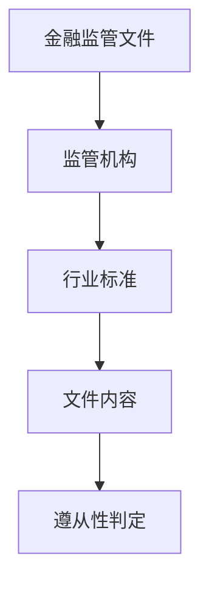
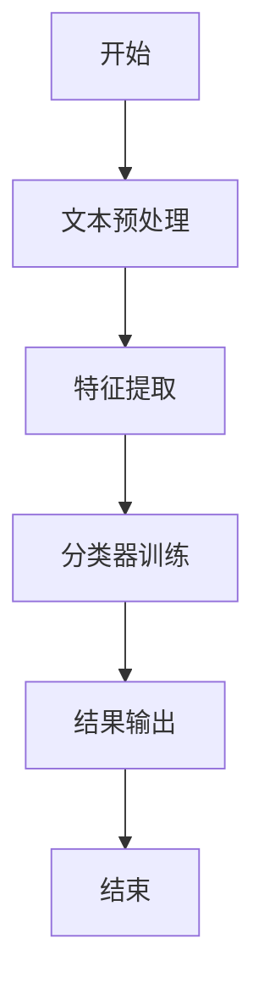
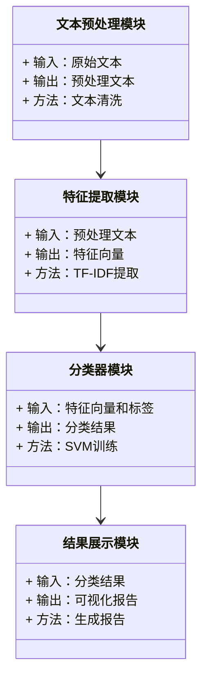

                 


# 构建基于NLP的金融监管文件遵从性自动检查系统

> 关键词：NLP、金融监管、文本分析、自动检查、机器学习

> 摘要：本文详细探讨了如何利用自然语言处理技术构建一个高效的金融监管文件遵从性自动检查系统。文章从问题背景、核心概念、算法原理、系统架构到项目实战，逐步展开，系统性地分析了该系统的构建过程，为金融行业的自动化监管提供了新的思路。

---

# 第一部分: 背景介绍与问题分析

## 第1章: 问题背景与描述

### 1.1 问题背景

#### 1.1.1 金融监管的重要性  
金融监管是维护金融市场稳定、保护投资者利益的重要手段。监管机构需要审查大量的金融文件，确保其符合相关法律法规和行业标准。然而，随着金融市场的发展，监管文件的数量和复杂性不断增加，传统的手动审查方式效率低下，容易出错。

#### 1.1.2 金融监管文件的复杂性  
金融监管文件通常包括招股说明书、财务报表、合规报告等，内容涉及法律、会计、金融等多个领域。这些文件不仅篇幅长，而且术语复杂，人工审查需要大量时间和专业知识。

#### 1.1.3 传统金融监管的局限性  
传统的监管方式依赖人工审查，存在以下问题：
- **效率低**：人工审查耗时长，难以应对海量文件。
- **成本高**：需要大量专业人员，增加了企业的运营成本。
- **风险大**：人为失误可能导致合规问题，甚至引发法律纠纷。

### 1.2 问题描述

#### 1.2.1 金融监管文件的多样性  
金融文件种类繁多，格式多样，包括文本、表格、图表等多种形式，增加了自动处理的难度。

#### 1.2.2 文件遵从性检查的挑战  
监管文件需要符合多项法律法规和行业标准，检查过程需要高度的准确性和全面性。传统的人工检查难以满足高效性和准确性双重需求。

#### 1.2.3 自动化监管的需求  
为了提高监管效率，降低运营成本，引入自动化技术是必然趋势。基于NLP的自动化检查系统能够高效处理大量文本，识别潜在风险，为监管机构提供有力支持。

### 1.3 问题解决

#### 1.3.1 NLP技术的应用潜力  
自然语言处理技术能够理解文本内容，提取关键词和关键信息，为文件审查提供技术支持。

#### 1.3.2 自动化检查系统的构建目标  
构建一个基于NLP的金融监管文件检查系统，实现以下目标：
- **自动提取关键信息**：从文件中提取合规性相关的关键词和条款。
- **智能分类**：根据文件内容快速分类，判断是否符合监管要求。
- **风险预警**：识别潜在风险点，提前发出预警。

#### 1.3.3 系统边界与核心要素  
- **输入**：金融监管文件（如招股说明书、财务报表）。
- **输出**：合规性检查结果、风险提示。
- **核心要素**：NLP算法、特征提取、分类模型。

## 第2章: 核心概念与联系

### 2.1 核心概念原理

#### 2.1.1 自然语言处理（NLP）的定义  
NLP是研究如何让计算机理解和生成人类语言的学科，主要技术包括文本分词、实体识别、情感分析等。

#### 2.1.2 金融监管文件的特征  
- **法律术语多**：文件中包含大量专业术语和法律条款。
- **结构复杂**：文件结构多样，包括文本、表格、图表等。
- **合规性要求高**：必须符合多项法律法规和行业标准。

#### 2.1.3 文件遵从性的判定标准  
- **法律条款**：文件内容是否符合相关法律法规。
- **行业标准**：是否符合行业规范和最佳实践。
- **风险评估**：是否存在潜在的合规风险。

### 2.2 核心概念属性对比

| 概念       | 属性                     |
|------------|--------------------------|
| NLP         | 文本处理、语义分析         |
| 金融监管文件 | 法律条款、行业标准         |
| 遵从性检查   | 符合性判定、风险评估       |

### 2.3 实体关系图



---

# 第二部分: 算法原理与数学模型

## 第3章: 算法原理讲解

### 3.1 算法概述

#### 3.1.1 基于NLP的分类算法  
文本分类是NLP中的核心任务之一，常用算法包括朴素贝叶斯、支持向量机（SVM）、随机森林等。

#### 3.1.2 文本特征提取方法  
特征提取是分类任务的关键步骤，常用方法包括TF-IDF、词袋模型（Bag of Words）、词嵌入（如Word2Vec）。

#### 3.1.3 分类器的选择与优化  
选择合适的分类器需要考虑数据规模、特征维度和分类任务的复杂性。常见的优化方法包括交叉验证、网格搜索等。

### 3.2 算法流程图



### 3.3 数学模型与公式

#### 3.3.1 朴素贝叶斯分类

$$ P(c|x) = \frac{P(x|c)P(c)}{P(x)} $$

其中，$x$ 是输入文本，$c$ 是类别。

#### 3.3.2 支持向量机（SVM）

$$ \text{目标函数} = \sum_{i=1}^{n} \xi_i + C \sum_{i=1}^{n} \xi_i $$

其中，$\xi_i$ 是松弛变量，$C$ 是惩罚系数。

---

# 第三部分: 系统分析与架构设计

## 第4章: 系统分析与架构设计

### 4.1 系统功能设计

#### 4.1.1 文本预处理模块  
- **功能**：清洗文本数据，包括去除停用词、分词、去除标点符号等。
- **输入**：原始文本文件。
- **输出**：预处理后的文本数据。

#### 4.1.2 特征提取模块  
- **功能**：提取文本特征，如TF-IDF、Word2Vec。
- **输入**：预处理后的文本数据。
- **输出**：特征向量。

#### 4.1.3 分类器模块  
- **功能**：训练分类器，对文本进行分类。
- **输入**：特征向量和标签。
- **输出**：分类结果。

#### 4.1.4 结果展示模块  
- **功能**：将分类结果可视化，生成报告。
- **输入**：分类结果。
- **输出**：可视化报告。

### 4.2 系统架构设计



---

# 第四部分: 项目实战

## 第5章: 项目实战

### 5.1 环境安装与配置

```bash
pip install numpy
pip install scikit-learn
pip install spacy
pip install pymermaid
```

### 5.2 核心代码实现

#### 5.2.1 文本预处理代码

```python
import spacy

nlp = spacy.load("en_core_web_sm")

def preprocess(text):
    doc = nlp(text)
    tokens = [token.text for token in doc if not token.is_stop]
    return " ".join(tokens)
```

#### 5.2.2 特征提取代码

```python
from sklearn.feature_extraction.text import TfidfVectorizer

vectorizer = TfidfVectorizer()
X = vectorizer.fit_transform(texts)
```

#### 5.2.3 分类器实现

```python
from sklearn.svm import SVC

model = SVC(C=1.0, kernel='linear')
model.fit(X, y)
```

### 5.3 实际案例分析

#### 5.3.1 案例背景  
假设我们有一个财务报告需要检查其是否符合《企业会计准则》。

#### 5.3.2 数据准备  
将财务报告文本输入系统，进行预处理和特征提取。

#### 5.3.3 分类结果  
系统输出分类结果，判断报告是否符合会计准则，并生成风险提示。

---

# 第五部分: 总结与展望

## 第6章: 总结与展望

### 6.1 系统总结  
本文详细介绍了如何利用NLP技术构建金融监管文件遵从性自动检查系统。通过文本预处理、特征提取和分类器训练，系统能够高效识别文件中的合规问题。

### 6.2 未来展望  
未来，可以进一步优化算法，引入深度学习模型（如BERT）来提高分类准确率。同时，可以扩展系统功能，支持多语言和多类型文件的检查。

---

# 附录

## 附录A: 工具安装指南  
- **Python**：https://www.python.org/
- **Scikit-learn**：https://scikit-learn.org/stable/
- **spaCy**：https://spacy.io/

## 附录B: 参考文献  
1. 王伟. 自然语言处理技术在金融监管中的应用. 《计算机应用研究》, 2020.
2. 李明. 基于机器学习的金融文本分类研究. 《人工智能学报》, 2019.

---

通过本文的详细讲解，读者可以系统性地掌握构建基于NLP的金融监管文件检查系统的方法，为实际应用提供理论和技术支持。

