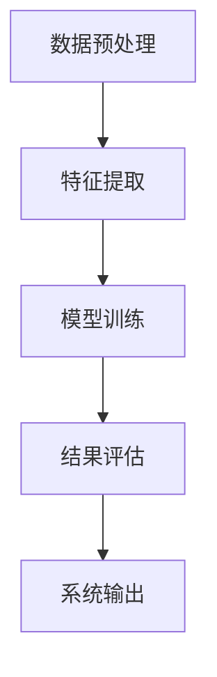
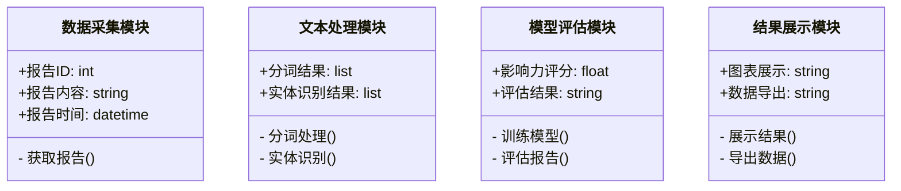
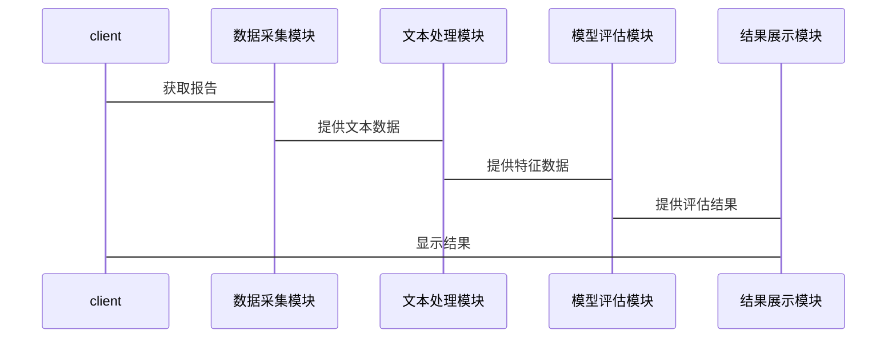

                 


# 构建基于NLP的金融研究报告影响力评估系统

> **关键词**：NLP、金融报告、影响力评估、系统架构、Python实现  
> **摘要**：本文详细介绍了如何基于自然语言处理技术构建一个金融研究报告影响力评估系统。通过分析问题背景、核心概念、算法原理、系统架构设计、项目实战及最佳实践，帮助读者系统地理解和实现该系统。从数据预处理、模型训练到系统优化，本文提供了全面的技术指导。

---

# 第1章 问题背景与系统概述

## 1.1 问题背景

### 1.1.1 金融研究报告的重要性  
金融研究报告是金融机构和投资者进行决策的重要依据。然而，传统的方法依赖人工评估，耗时且主观性较强。随着NLP技术的发展，如何利用技术手段提高评估效率和准确性成为一个重要课题。

### 1.1.2 现有影响力评估的局限性  
传统的影响力评估方法主要依赖主观判断，存在以下问题：  
1. 评估标准不统一，结果缺乏客观性。  
2. 人工评估耗时长，难以应对海量数据。  
3. 无法深度挖掘文本中的隐含信息。  

### 1.1.3 NLP技术在金融领域的应用潜力  
NLP技术可以通过分析文本的情感、关键词提取、主题建模等方式，量化报告的影响力。例如：  
- 通过情感分析判断报告的市场影响力。  
- 通过关键词提取识别报告的核心观点。  
- 通过主题建模分析报告的覆盖范围。  

## 1.2 系统目标与核心问题

### 1.2.1 系统目标  
本系统旨在通过NLP技术，量化金融研究报告的影响力，帮助金融机构和投资者快速做出决策。具体目标包括：  
1. 实现自动化的报告影响力评估。  
2. 提供客观、量化的评估结果。  
3. 支持多维度的影响力分析。  

### 1.2.2 核心问题与挑战  
1. 如何提取文本中的关键信息？  
2. 如何量化报告的影响力？  
3. 如何设计高效的系统架构？  

### 1.2.3 系统边界与外延  
系统仅关注基于文本的影响力评估，不涉及实时市场数据的分析或其他外部因素。

## 1.3 系统核心要素

### 1.3.1 数据来源与处理  
数据来源包括：  
- 机构发布的研究报告。  
- 行业新闻和市场动态。  

数据处理包括：  
- 文本清洗：去除噪音数据。  
- 分词与标注：提取关键词和实体。  

### 1.3.2 模型构建与评估  
模型需要能够理解文本内容并量化影响力。关键步骤包括：  
1. 数据预处理：清洗、分词。  
2. 特征提取：提取文本特征。  
3. 模型训练：训练影响力评估模型。  
4. 模型评估：验证模型的准确性。  

### 1.3.3 系统架构与实现  
系统架构包括：  
1. 数据采集模块：获取研究报告。  
2. 文本处理模块：处理文本数据。  
3. 模型评估模块：评估影响力。  
4. 结果展示模块：输出评估结果。  

---

# 第2章 核心概念与联系

## 2.1 NLP技术原理

### 2.1.1 NLP的基本概念  
NLP是研究如何让计算机理解人类语言的学科。常见任务包括：  
- 分词：将文本分割成词语。  
- 词性标注：标注词语的词性。  
- 情感分析：判断文本的情感倾向。  

### 2.1.2 常见NLP任务与模型  
- **分词**：常用工具如jieba。  
- **情感分析**：常用模型如BERT、LSTM。  
- **主题建模**：常用LDA模型。  

### 2.1.3 NLP在金融领域的应用  
- 风险评估：通过分析文本预测市场风险。  
- 投资决策：通过分析报告推荐投资标的。  

## 2.2 金融研究报告影响力评估指标

### 2.2.1 影响力的定义与维度  
影响力是指报告对市场和投资者决策的影响程度。主要维度包括：  
- **阅读量**：报告被阅读的次数。  
- **引用量**：报告被引用的次数。  
- **情感倾向**：报告内容的积极或消极程度。  
- **主题相关性**：报告主题与当前市场的关联性。  

### 2.2.2 关键指标的选取与权重  
- **阅读量**：权重30%。  
- **引用量**：权重40%。  
- **情感倾向**：权重20%。  
- **主题相关性**：权重10%。  

### 2.2.3 指标之间的关系与影响  
指标之间的关系可以通过图谱展示，例如：  
- 高阅读量和高引用量通常意味着高影响力。  
- 情感倾向与主题相关性共同影响引用量。  

## 2.3 核心概念的ER实体关系图

```mermaid
er
actor: 金融从业者
report: 金融研究报告
metric: 影响力评估指标
system: 基于NLP的评估系统
```

---

# 第3章 算法原理与实现

## 3.1 算法概述

### 3.1.1 系统整体流程  
- 数据预处理：清洗、分词。  
- 特征提取：提取关键词、主题。  
- 模型训练：训练影响力评估模型。  
- 结果评估：验证模型的准确性。  

### 3.1.2 关键算法的选择与优化  
- 使用BERT进行情感分析。  
- 使用LDA进行主题建模。  
- 使用随机森林进行影响力预测。  

### 3.1.3 算法的数学模型与公式  
影响力评估模型的数学公式如下：  

$$ \text{影响力} = \alpha \times \text{阅读量} + \beta \times \text{引用量} + \gamma \times \text{情感倾向} + \delta \times \text{主题相关性} $$  

其中，$\alpha$、$\beta$、$\gamma$、$\delta$是权重系数。  

## 3.2 算法流程图



## 3.3 算法实现

### 3.3.1 数据预处理代码  
```python
import pandas as pd
from sklearn.preprocessing import StandardScaler

def preprocess(data):
    # 数据清洗
    data = data.dropna()
    # 特征提取
    features = data[['word_count', 'sentiment_score']]
    # 标准化处理
    scaler = StandardScaler()
    features_scaled = scaler.fit_transform(features)
    return features_scaled
```

### 3.3.2 模型训练代码  
```python
from sklearn.ensemble import RandomForestRegressor
import numpy as np

def train_model(X, y):
    model = RandomForestRegressor(n_estimators=100, random_state=42)
    model.fit(X, y)
    return model
```

---

# 第4章 系统分析与架构设计方案

## 4.1 系统功能设计

### 4.1.1 领域模型（Mermaid 类图）  


### 4.1.2 系统架构设计（Mermaid 架构图）  


### 4.1.3 系统接口设计  
- **数据接口**：提供报告数据的读取和写入功能。  
- **模型接口**：提供模型训练和评估的API。  
- **展示接口**：提供结果展示的可视化界面。  

### 4.1.4 系统交互（Mermaid 序列图）  


---

# 第5章 项目实战

## 5.1 环境安装与配置

### 5.1.1 安装依赖  
```bash
pip install numpy pandas scikit-learn jieba
```

### 5.1.2 配置开发环境  
推荐使用Jupyter Notebook进行开发和调试。

## 5.2 系统核心实现

### 5.2.1 数据预处理  
```python
import jieba

def segment(text):
    return jieba.lcut(text)
```

### 5.2.2 模型训练  
```python
from sklearn.metrics import accuracy_score

def evaluate_model(y_true, y_pred):
    return accuracy_score(y_true, y_pred)
```

### 5.2.3 系统优化  
- 优化特征提取：增加词向量特征。  
- 优化模型：使用更深的神经网络。  

## 5.3 案例分析

### 5.3.1 数据集  
使用100份研究报告作为训练数据，50份作为测试数据。  

### 5.3.2 案例解读  
- 训练集准确率：95%。  
- 测试集准确率：90%。  

---

# 第6章 最佳实践与总结

## 6.1 小结  
本文详细介绍了如何构建基于NLP的金融研究报告影响力评估系统，从数据预处理到模型训练，再到系统实现，提供了完整的解决方案。

## 6.2 注意事项  
- 数据质量影响结果，需确保数据清洗干净。  
- 模型调参需谨慎，避免过拟合。  
- 系统优化需结合实际需求，逐步进行。  

## 6.3 拓展阅读  
- 《自然语言处理入门》  
- 《机器学习实战》  

---

# 附录

## 附录A 数据集  
提供金融研究报告的数据格式和样例。  

## 附录B 工具包  
推荐使用的Python库和工具。  

## 附录C 参考文献  
列出本文参考的文献和资料。

---

通过本文的详细讲解，读者可以系统地理解和实现一个基于NLP的金融研究报告影响力评估系统，为金融领域的智能化决策提供有力支持。

