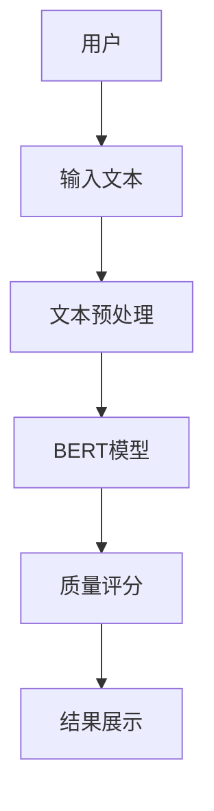

                 


# 构建基于NLP的金融研究报告质量评估系统

> 关键词：自然语言处理，金融报告，质量评估，文本分析，深度学习

> 摘要：本文详细探讨了如何利用自然语言处理技术构建金融研究报告质量评估系统。文章首先介绍了系统的背景和需求，然后从核心概念、算法原理、系统架构、项目实战等多方面展开分析。通过具体的案例分析和代码实现，展示了系统的设计与实现过程，并总结了系统的优势与未来研究方向。

---

## 第一部分: 问题背景与需求分析

### 第1章: 问题背景介绍

#### 1.1 金融研究报告的重要性
金融研究报告是投资者、分析师和金融机构做出决策的重要依据。高质量的报告能够提供准确的市场分析、清晰的投资建议和及时的行业洞察。然而，报告的质量参差不齐，如何快速、准确地评估报告质量成为一大挑战。

#### 1.2 现有报告评估方法的局限性
传统的报告评估方法主要依赖人工审核，存在效率低、主观性强、成本高等问题。这种方法难以应对海量报告的评估需求，且缺乏客观性。

#### 1.3 NLP技术在金融领域的潜力
自然语言处理（NLP）技术可以通过分析报告的文本内容，提取关键信息，从而实现自动化、客观化的报告质量评估。NLP在金融领域的应用越来越广泛，尤其是在文本挖掘、情感分析和信息提取方面。

---

### 第2章: 核心概念与目标

#### 2.1 基于NLP的金融报告质量评估的核心概念
- **文本分析**：通过NLP技术对报告内容进行结构化分析。
- **质量评估**：基于文本分析结果，对报告的质量进行评分。
- **自动化评估**：利用机器学习模型实现自动化评估。

#### 2.2 系统目标与预期效果
- 实现金融报告的自动化质量评估。
- 提供客观、准确的报告评分，帮助用户快速筛选高质量报告。
- 支持多种评估指标，如内容完整性、逻辑性、数据准确性等。

#### 2.3 评估指标与标准
- **内容完整性**：报告是否涵盖关键分析点。
- **逻辑性**：报告的推理是否合理。
- **数据准确性**：引用数据是否准确。
- **语言规范性**：文本是否符合专业规范。

---

## 第二部分: 核心概念与系统架构

### 第3章: 核心概念与系统架构

#### 3.1 NLP技术的核心原理
- **文本预处理**：包括分词、去除停用词、词干提取等。
- **特征提取**：通过词袋模型、TF-IDF或深度学习模型提取文本特征。
- **模型训练**：基于标注数据训练分类模型，用于预测报告质量。

#### 3.2 金融研究报告的特征分析
- **结构化特征**：报告通常包含标题、摘要、正文、结论等部分。
- **语言特征**：专业术语的使用频率、句子复杂度等。
- **内容特征**：行业分析的深度、数据的准确性等。

#### 3.3 系统架构设计
- **模块划分**：
  - 数据采集模块：从数据库或网络获取报告文本。
  - 文本预处理模块：对文本进行清洗和结构化。
  - 模型训练模块：基于标注数据训练质量评估模型。
  - 结果输出模块：生成报告质量评分并展示。

- **数据流与信息流设计**：
  - 数据输入：报告文本。
  - 数据处理：预处理、特征提取。
  - 模型处理：质量评估。
  - 结果输出：评分结果。

- **系统性能与可扩展性**：
  - 高效性：确保处理大量报告的效率。
  - 可扩展性：支持新增评估指标和模型优化。

---

## 第三部分: 算法原理与数学模型

### 第4章: 算法原理概述

#### 4.1 基于深度学习的NLP模型
- **模型选择**：采用BERT或类似的预训练模型进行文本表示。
- **任务适配**：针对质量评估任务进行微调。

#### 4.2 系统采用的算法框架
- **预训练模型**：使用大规模金融文本进行预训练。
- **微调任务**：在特定金融报告数据上进行微调。

#### 4.3 算法选择的依据
- **任务需求**：质量评估需要对文本进行多维度分析。
- **数据特性**：金融文本具有专业性和领域特定性。

---

### 第5章: 数学模型与公式

#### 5.1 损失函数
$$ \text{损失函数} = \sum_{i=1}^{n} (y_i - \hat{y}_i)^2 $$
其中，\( y_i \) 是真实标签，\( \hat{y}_i \) 是模型预测值。

#### 5.2 优化器
$$ \text{优化器} = \text{Adam}(\alpha, \beta_1, \beta_2) $$
其中，\( \alpha \) 是学习率，\( \beta_1 \) 和 \( \beta_2 \) 是动量参数。

#### 5.3 模型结构
$$ \text{模型} = \text{BERT} + \text{自定义头} $$
其中，BERT是预训练的文本表示模型，自定义头用于质量评估任务。

---

## 第四部分: 项目实战

### 第6章: 系统实现

#### 6.1 环境安装
- **Python**：安装Python 3.8及以上版本。
- **库依赖**：安装PyTorch、Hugging Face Transformers等库。

#### 6.2 核心功能实现
```python
import torch
from transformers import BertTokenizer, BertModel

class ReportQualityEvaluator:
    def __init__(self):
        self.tokenizer = BertTokenizer.from_pretrained('bert-base-uncased')
        self.model = BertModel.from_pretrained('bert-base-uncased')

    def evaluate(self, text):
        inputs = self.tokenizer(text, return_tensors='pt')
        outputs = self.model(**inputs)
        # 处理输出以生成质量评分
        return self.compute_score(outputs.last_hidden_state)

    def compute_score(self, hidden_states):
        # 简单示例，实际应根据具体需求设计评分逻辑
        return torch.mean(hidden_states, dim=1).item()
```

#### 6.3 代码应用解读与分析
- **文本预处理**：将报告文本分割为句子或段落。
- **模型输入**：将文本输入预训练模型，获取隐藏层表示。
- **质量评分**：根据隐藏层表示计算质量评分，例如取平均值。

#### 6.4 案例分析
假设有一份关于科技行业的报告，系统输入文本后，经过预处理和模型计算，输出质量评分为85分。

---

## 第五部分: 系统分析与架构设计方案

### 第7章: 问题场景介绍

#### 7.1 问题场景
- **场景描述**：投资者需要快速评估多份报告的质量。
- **问题分析**：人工评估耗时且主观，自动化评估需求迫切。

---

### 第8章: 系统架构设计

#### 8.1 系统功能设计
- **输入模块**：用户输入报告文本。
- **处理模块**：文本预处理和模型评估。
- **输出模块**：展示评估结果。

#### 8.2 系统架构图


---

## 第六部分: 最佳实践与总结

### 第9章: 最佳实践 tips
- **数据质量**：确保训练数据的多样性和代表性。
- **模型调优**：根据实际需求调整模型参数。
- **结果验证**：定期验证模型的准确性和可靠性。

### 第10章: 小结
本文详细介绍了如何利用NLP技术构建金融研究报告质量评估系统，从背景需求到系统实现，再到实际案例分析，为读者提供了全面的指导。

---

## 附录: 拓展阅读

- **推荐书籍**：《深度学习入门：基于Python的实现》。
- **推荐博客**：Hugging Face Transformers官方文档。

---

通过以上步骤，我们可以清晰地构建一个基于NLP的金融研究报告质量评估系统，为金融领域的文本分析和质量评估提供有力支持。

