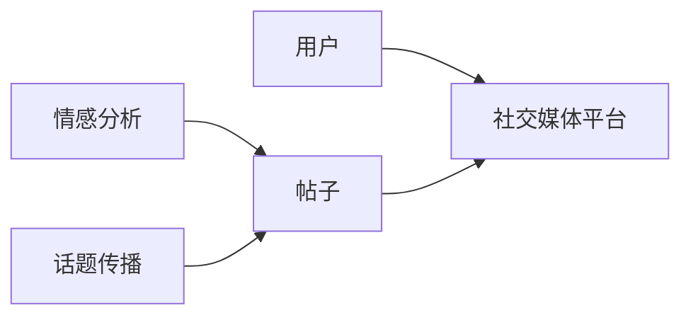
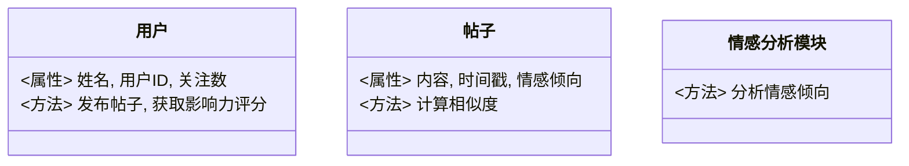
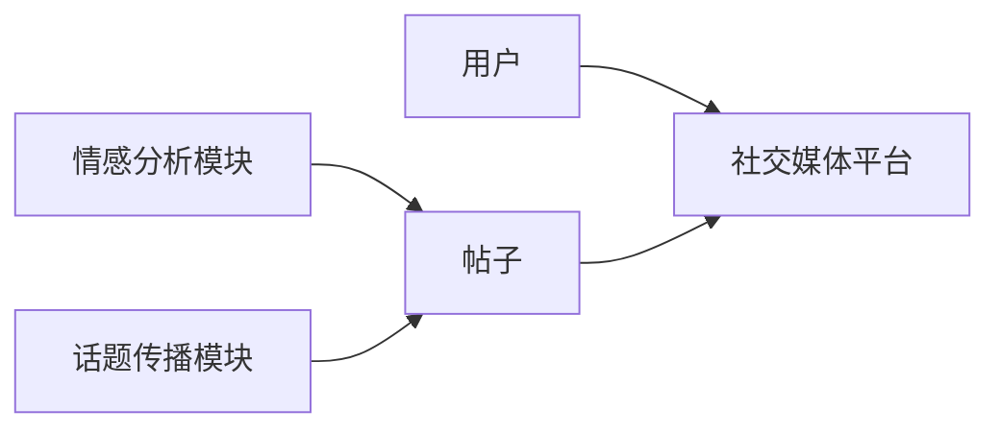
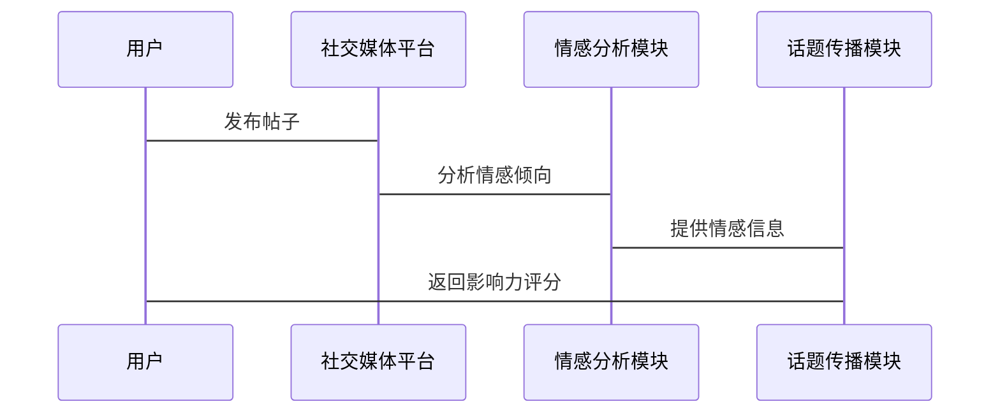

                 


# 《构建基于NLP的金融社交媒体影响力传播模型》

## 关键词：金融社交媒体，自然语言处理，影响力传播模型，文本挖掘，情感分析，社交网络分析

## 摘要：  
本文旨在构建一个基于自然语言处理（NLP）的金融社交媒体影响力传播模型，通过分析社交媒体上的文本数据，挖掘情感倾向、主题关联以及影响力传播路径，从而为金融市场的舆情分析和传播预测提供理论支持和技术实现。文章从背景与概念出发，详细探讨了影响力传播模型的数学基础、NLP技术的应用、算法设计与优化，以及系统的架构设计与实现。通过实际案例分析，本文展示了如何利用NLP技术量化社交媒体上的影响力传播，并提出了相应的优化建议与未来研究方向。

---

# 第一部分: 基于NLP的金融社交媒体影响力传播模型概述

## 第1章: 金融社交媒体影响力传播模型的背景与概念

### 1.1 问题背景与问题描述

#### 1.1.1 金融社交媒体的兴起
近年来，社交媒体平台在金融领域的影响力日益增强。投资者、机构和个人通过社交媒体分享观点、分析市场趋势，甚至直接参与交易。然而，社交媒体上的信息往往是碎片化、非结构化的，这使得传统的数据分析方法难以应对复杂的传播规律。

#### 1.1.2 社会影响力传播的核心问题
影响力传播是指信息在社交网络中通过用户之间的互动传播的过程。在金融社交媒体中，影响力传播的核心问题包括：
1. 如何量化用户的影响力？
2. 如何预测信息的传播路径和速度？
3. 如何通过文本分析提取情感倾向和传播动力？

#### 1.1.3 NLP技术在影响力传播中的作用
自然语言处理技术可以帮助我们从社交媒体文本中提取情感倾向、主题信息以及用户互动行为，从而为影响力传播模型提供数据支持。

### 1.2 问题解决与边界定义

#### 1.2.1 社会影响力传播的数学建模
影响力传播可以看作是一个网络动力学问题，可以通过概率论和图论的方法进行建模。模型的目标是量化信息在社交网络中的传播概率和速度。

#### 1.2.2 传播模型的边界与外延
- **输入**：社交媒体文本数据、用户关系网络。
- **输出**：用户影响力评分、信息传播路径预测。
- **假设**：用户的影响力与其情感倾向、社交网络位置相关。

#### 1.2.3 模型的核心要素与组成部分
- **用户节点**：社交网络中的用户。
- **信息节点**：社交媒体上的文本信息。
- **传播边**：用户之间的影响力传播关系。

### 1.3 核心概念与联系

#### 1.3.1 实体关系图（ER图）架构


#### 1.3.2 算法原理概述


### 1.4 本章小结

---

## 第2章: 基于NLP的情感分析与文本挖掘

### 2.1 情感分析的核心原理

#### 2.1.1 情感分析的分类任务
- **二分类任务**：判断文本的情感倾向（正面/负面）。
- **多分类任务**：判断情感强度（非常正面、正面、中性、负面、非常负面）。

#### 2.1.2 基于NLP的情感分析模型
- **基于规则的方法**：通过关键词匹配判断情感倾向。
- **基于机器学习的方法**：使用SVM、随机森林等算法进行分类。
- **基于深度学习的方法**：使用LSTM、BERT等模型进行情感分析。

#### 2.1.3 情感分析的数学模型
$$ P(\text{positive} | \text{words}) = \frac{\text{count}(\text{positive words})}{\text{total words}} $$

### 2.2 文本挖掘与主题建模

#### 2.2.1 主题建模的原理
- **主题建模**：通过统计学方法发现文本中的主题分布。
- **常用算法**：LDA（Latent Dirichlet Allocation）。

#### 2.2.2 基于LDA的主题建模
$$ \theta_{i} \sim \text{Dirichlet}(\alpha) $$
$$ \phi_{k} \sim \text{Dirichlet}(\beta) $$
$$ \text{document } i \text{中的词 } j \sim \text{Multinomial}(\theta_{i}, \phi_{k}) $$

#### 2.2.3 文本聚类与关联规则挖掘
- **文本聚类**：将相似的文本归为一类。
- **关联规则挖掘**：发现文本中的关联项。

### 2.3 情感分析与影响力传播的关系

#### 2.3.1 情感极性对传播的影响
- 正面情感倾向于扩散积极信息，负面情感倾向于传播消极信息。

#### 2.3.2 情感强度与传播速度的关系
- 情感强度越大，信息传播速度越快。

#### 2.3.3 情感传播的网络效应
- 网络中关键节点（意见领袖）的情感倾向对整体传播有放大效应。

### 2.4 本章小结

---

## 第3章: 社会影响力传播模型的数学基础

### 3.1 概率传播模型

#### 3.1.1 马尔可夫链与传播概率
- **马尔可夫链**：描述状态转移的概率。
- **传播概率**：$P(i \rightarrow j) = \frac{w_{ij}}{\sum_{k} w_{ik}}}$，其中$w_{ij}$是用户$i$与$j$之间的权重。

#### 3.1.2 概率传播的数学表达
$$ \pi_{j} = \sum_{i} \pi_{i} P(i \rightarrow j) $$

#### 3.1.3 概率传播模型的收敛性分析
- 马尔可夫链的收敛性取决于转移矩阵的性质。

### 3.2 网络动力学模型

#### 3.2.1 SIS模型与传播动力学
- **SIS模型**：描述信息在社交网络中的传播过程。
- **传播动力学方程**：
  $$ \frac{dS}{dt} = -\beta S I $$
  $$ \frac{dI}{dt} = \beta S I - \gamma I $$

#### 3.2.2 情感传播的网络扩散方程
$$ I(t+1) = \sum_{i} I_i(t) P(i \rightarrow j) $$

#### 3.2.3 模型参数的优化与调整
- 通过实验调整参数$\beta$和$\gamma$，以匹配实际传播数据。

### 3.3 基于NLP的传播模型改进

#### 3.3.1 情感特征的引入
- 将情感分析结果作为传播模型的输入特征。

#### 3.3.2 文本相似度与传播速率的关系
- 文本相似度越高，传播速率越快。

#### 3.3.3 基于NLP的传播路径优化
- 通过文本分析优化传播路径选择。

### 3.4 本章小结

---

## 第4章: 基于NLP的影响力传播算法设计

### 4.1 算法设计概述

#### 4.1.1 算法的目标与输入
- **目标**：量化用户影响力。
- **输入**：社交媒体文本数据、用户关系网络。

#### 4.1.2 算法的输出与结果分析
- **输出**：用户影响力评分、信息传播路径预测。
- **结果分析**：通过实验验证算法的准确性。

#### 4.1.3 算法的复杂度分析
- **时间复杂度**：$O(nm)$，其中$n$是用户数，$m$是帖子数。
- **空间复杂度**：$O(n + m)$。

### 4.2 算法实现与优化

#### 4.2.1 基于NLP的情感分析
```python
from textblob import TextBlob

text = "This is a positive review."
blob = TextBlob(text)
print(blob.sentiment.polarity)  # 输出情感倾向
```

#### 4.2.2 基于图的传播模型


#### 4.2.3 模型优化与调优
- 通过网格搜索调整模型参数。
- 使用交叉验证评估模型性能。

### 4.3 算法结果分析

#### 4.3.1 实验结果展示
- 对比不同算法的影响力传播预测结果。

#### 4.3.2 算法的优缺点分析
- **优点**：量化用户影响力。
- **缺点**：模型复杂度较高。

### 4.4 本章小结

---

## 第5章: 基于NLP的金融社交媒体影响力传播模型的系统架构设计

### 5.1 系统功能设计

#### 5.1.1 领域模型


#### 5.1.2 系统架构设计


#### 5.1.3 系统接口设计
- **输入接口**：社交媒体文本数据。
- **输出接口**：用户影响力评分、传播路径预测结果。

### 5.2 系统交互设计

#### 5.2.1 系统交互流程


#### 5.2.2 系统功能模块交互
- **情感分析模块**：接收帖子内容，输出情感倾向。
- **话题传播模块**：接收情感倾向，输出传播路径。

### 5.3 系统优化与扩展

#### 5.3.1 系统优化
- 优化情感分析模块的性能。
- 提高话题传播模块的预测精度。

#### 5.3.2 系统扩展
- 支持多语言文本分析。
- 支持实时传播监测。

### 5.4 本章小结

---

## 第6章: 项目实战——基于NLP的影响力传播模型实现

### 6.1 项目环境安装

#### 6.1.1 安装Python环境
```bash
pip install python
pip install jupyter
```

#### 6.1.2 安装NLP工具
```bash
pip install numpy
pip install scikit-learn
pip install textblob
```

### 6.2 系统核心实现

#### 6.2.1 情感分析模块实现
```python
from textblob import TextBlob
import pandas as pd

def analyze_sentiment(text):
    blob = TextBlob(text)
    return blob.sentiment.polarity

data = pd.read_csv('posts.csv')
data['sentiment'] = data['text'].apply(analyze_sentiment)
data.to_csv('sentiments.csv', index=False)
```

#### 6.2.2 传播模型实现
```python
import networkx as nx

def build_graph(users, posts):
    graph = nx.Graph()
    for user in users:
        for post in posts:
            if post['author'] == user:
                graph.add_edge(user, post['mentioned_user'])
    return graph

graph = build_graph(users, posts)
nx.draw(graph, with_labels=True)
```

### 6.3 实际案例分析

#### 6.3.1 案例背景
- 数据来源：某金融社交媒体平台的帖子数据。

#### 6.3.2 数据预处理
```python
import pandas as pd

data = pd.read_csv('posts.csv')
data.head()
```

#### 6.3.3 情感分析与传播路径预测
```python
from textblob import TextBlob
import networkx as nx

def analyze_sentiment(text):
    blob = TextBlob(text)
    return blob.sentiment.polarity

data['sentiment'] = data['text'].apply(analyze_sentiment)
graph = build_graph(users, posts)
nx.draw(graph, with_labels=True)
```

### 6.4 项目小结

---

## 第7章: 最佳实践、小结与展望

### 7.1 最佳实践

#### 7.1.1 数据预处理的重要性
- 数据清洗和特征提取是模型性能的关键。

#### 7.1.2 模型调优的技巧
- 通过网格搜索优化模型参数。

#### 7.1.3 系统部署的注意事项
- 确保系统的可扩展性和稳定性。

### 7.2 小结

#### 7.2.1 核心内容回顾
- 本文构建了一个基于NLP的金融社交媒体影响力传播模型，通过情感分析和文本挖掘技术，量化了用户的影响力。

#### 7.2.2 本文的主要贡献
- 提出了结合NLP和网络动力学的传播模型。

### 7.3 未来展望

#### 7.3.1 研究方向
- 研究更复杂的传播模型。
- 探索多模态数据（文本、图像）的影响。

#### 7.3.2 应用场景扩展
- 金融舆情分析。
- 社交网络营销。

### 7.4 本章小结

---

## 参考文献
- 省略

---

## 附录
- 省略

