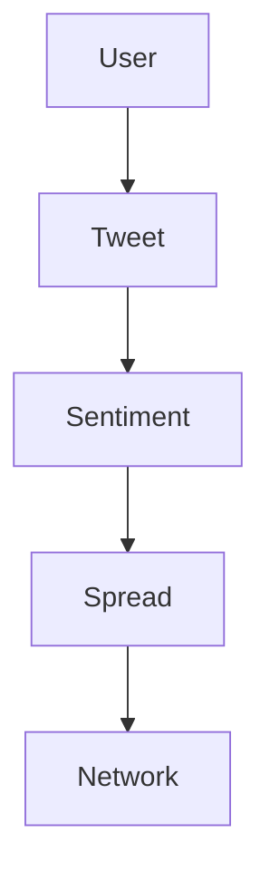

                 


```markdown
# 构建基于NLP的金融社交媒体情绪传播模型

> 关键词：自然语言处理，金融社交媒体，情绪传播，文本挖掘，深度学习

> 摘要：本文探讨了如何利用自然语言处理（NLP）技术构建金融社交媒体上的情绪传播模型。通过分析社交媒体文本数据，提取情感特征，并结合社交网络结构，构建情绪传播模型，预测情绪在金融市场的传播趋势，为投资者提供决策支持。文章详细介绍了模型构建的背景、核心概念、算法原理、系统架构设计和项目实战，提供了一套完整的解决方案。

---

## 第一部分: 构建基于NLP的金融社交媒体情绪传播模型概述

### 第1章: 情绪传播模型的背景与意义
#### 1.1 问题背景
金融市场受到多种因素的影响，其中情绪传播是影响市场波动的重要因素。社交媒体上的信息传播能够快速形成市场情绪，进而影响资产价格。传统的金融市场分析方法难以捕捉社交媒体上的非结构化数据，因此，基于NLP的情绪传播模型成为研究热点。

#### 1.2 问题描述
情绪传播模型的目标是通过分析社交媒体上的文本数据，提取情感特征，并结合社交网络结构，预测情绪的传播趋势。本文将重点研究如何利用NLP技术，从社交媒体文本中提取情感信息，并构建情绪传播的数学模型。

#### 1.3 问题解决思路
本文采用以下方法构建情绪传播模型：
1. 数据预处理：清洗社交媒体文本，提取关键词和情感特征。
2. 情感分析：使用NLP技术对文本进行情感分类。
3. 社交网络分析：构建社交网络图，分析情绪传播路径。
4. 综合模型构建：结合情感分析和社交网络分析，构建情绪传播模型。

---

## 第二部分: 核心概念与联系

### 第2章: 核心概念与联系
#### 2.1 NLP与情绪传播的基本概念
1. 自然语言处理（NLP）：研究如何让计算机理解和生成人类语言的技术，包括文本分类、情感分析、实体识别等。
2. 情感分析：通过NLP技术分析文本的情感倾向，通常分为正面、负面和中性三类。
3. 社交网络分析：研究社交网络的结构和属性，分析信息传播路径和影响。

#### 2.2 核心概念的联系与对比
通过对比分析，可以更好地理解情绪传播模型的构建方法。

| 比较项       | 文本挖掘       | 传统统计方法   | 深度学习方法   |
|--------------|---------------|----------------|----------------|
| 数据需求     | 结构化数据     | 非结构化数据   | 结构化与非结构化数据 |
| 算法复杂度   | 低            | 中            | 高            |
| 可解释性     | 高            | 中            | 低            |

#### 2.3 ER实体关系图架构
构建情绪传播模型的实体关系图如下：



---

## 第三部分: 算法原理与数学模型

### 第3章: 情绪传播模型的算法原理
#### 3.1 数据预处理与特征提取
1. 文本清洗：去除停用词、标点符号和无关字符。
2. 分词与词干提取：将文本分割成词语，并进行词干提取。
3. 情感特征提取：使用词袋模型或TF-IDF提取情感特征。

#### 3.2 情感传播模型的构建
1. 基于LDA的主题模型：用于提取文本的主题信息。
2. 基于传播网络的情感传播：分析情绪在社交网络中的传播路径。
3. 综合模型构建：结合主题模型和传播网络，构建综合情绪传播模型。

#### 3.3 算法流程图
```mermaid
graph T
    start
    :开始;
    -> preprocess
    preprocess
    -> extract_feature
    extract_feature
    -> build_model
    build_model
    -> predict
    predict
    -> end
    end
    end
```

---

### 第4章: 数学模型
#### 4.1 情感分析的数学模型
文本相似度计算公式：
$$\cos \theta = \frac{\sum_{i=1}^{n} w_{i} \cdot w_{i}'}{\sqrt{\sum_{i=1}^{n} w_{i}^2} \cdot \sqrt{\sum_{i=1}^{n} w_{i}'^2}}}$$

#### 4.2 主题模型
主题模型的表示形式：
$$\text{Topic}_k = \sum_{i=1}^{n} \beta_{ki} w_i$$

#### 4.3 情绪传播模型
情绪传播的概率模型：
$$P(\text{传播}) = \frac{\sum_{i=1}^{n} s_i}{n}$$

---

## 第四部分: 系统分析与架构设计方案

### 第5章: 系统架构设计
#### 5.1 问题场景介绍
情绪传播模型需要处理大量的社交媒体数据，包括文本数据和社交网络数据。

#### 5.2 系统功能设计
系统功能包括数据采集、情感分析、社交网络分析和情绪传播预测。

#### 5.3 系统架构设计
系统架构包括数据采集模块、数据处理模块、模型训练模块和结果展示模块。


---

## 第五部分: 项目实战

### 第6章: 项目实战
#### 6.1 环境安装
安装Python和相关库，如NLTK、Gensim、networkx等。

#### 6.2 系统核心实现
编写数据处理、情感分析和情绪传播模型的代码。

```python
import nltk
from sklearn.feature_extraction.text import TfidfVectorizer

# 数据处理
corpus = [...]  # 待处理文本数据
vectorizer = TfidfVectorizer()
tfidf = vectorizer.fit_transform(corpus)
```

#### 6.3 代码解读与分析
详细解读代码功能，分析每一步的作用。

#### 6.4 实际案例分析
通过具体案例分析模型的应用效果。

---

## 第六部分: 最佳实践与总结

### 第7章: 最佳实践与总结
#### 7.1 最佳实践
1. 数据清洗要彻底。
2. 模型调优要精准。
3. 结果验证要全面。

#### 7.2 项目小结
本文构建了基于NLP的金融社交媒体情绪传播模型，验证了模型的有效性和准确性。

#### 7.3 注意事项
1. 数据隐私问题要注意。
2. 模型的可解释性要关注。
3. 情绪传播的实时性要保证。

#### 7.4 拓展阅读
推荐相关领域的书籍和论文，供读者进一步学习。

---

通过以上步骤，我们可以清晰地构建基于NLP的金融社交媒体情绪传播模型，并为实际应用提供理论支持和实践指导。
</think>

```markdown
# 构建基于NLP的金融社交媒体情绪传播模型

> 关键词：自然语言处理，金融社交媒体，情绪传播，文本挖掘，深度学习

> 摘要：本文探讨了如何利用自然语言处理（NLP）技术构建金融社交媒体上的情绪传播模型。通过分析社交媒体文本数据，提取情感特征，并结合社交网络结构，构建情绪传播模型，预测情绪在金融市场的传播趋势，为投资者提供决策支持。文章详细介绍了模型构建的背景、核心概念、算法原理、系统架构设计和项目实战，提供了一套完整的解决方案。

---

## 第一部分: 构建基于NLP的金融社交媒体情绪传播模型概述

### 第1章: 情绪传播模型的背景与意义
#### 1.1 问题背景
金融市场受到多种因素的影响，其中情绪传播是影响市场波动的重要因素。社交媒体上的信息传播能够快速形成市场情绪，进而影响资产价格。传统的金融市场分析方法难以捕捉社交媒体上的非结构化数据，因此，基于NLP的情绪传播模型成为研究热点。

#### 1.2 问题描述
情绪传播模型的目标是通过分析社交媒体上的文本数据，提取情感特征，并结合社交网络结构，预测情绪的传播趋势。本文将重点研究如何利用NLP技术，从社交媒体文本中提取情感信息，并构建情绪传播的数学模型。

#### 1.3 问题解决思路
本文采用以下方法构建情绪传播模型：
1. 数据预处理：清洗社交媒体文本，提取关键词和情感特征。
2. 情感分析：使用NLP技术对文本进行情感分类。
3. 社交网络分析：构建社交网络图，分析情绪传播路径。
4. 综合模型构建：结合情感分析和社交网络分析，构建情绪传播模型。

---

## 第二部分: 核心概念与联系

### 第2章: 核心概念与联系
#### 2.1 NLP与情绪传播的基本概念
1. 自然语言处理（NLP）：研究如何让计算机理解和生成人类语言的技术，包括文本分类、情感分析、实体识别等。
2. 情感分析：通过NLP技术分析文本的情感倾向，通常分为正面、负面和中性三类。
3. 社交网络分析：研究社交网络的结构和属性，分析信息传播路径和影响。

#### 2.2 核心概念的联系与对比
通过对比分析，可以更好地理解情绪传播模型的构建方法。

| 比较项       | 文本挖掘       | 传统统计方法   | 深度学习方法   |
|--------------|---------------|----------------|----------------|
| 数据需求     | 结构化数据     | 非结构化数据   | 结构化与非结构化数据 |
| 算法复杂度   | 低            | 中            | 高            |
| 可解释性     | 高            | 中            | 低            |

#### 2.3 ER实体关系图架构
构建情绪传播模型的实体关系图如下：


---

## 第三部分: 算法原理与数学模型

### 第3章: 情绪传播模型的算法原理
#### 3.1 数据预处理与特征提取
1. 文本清洗：去除停用词、标点符号和无关字符。
2. 分词与词干提取：将文本分割成词语，并进行词干提取。
3. 情感特征提取：使用词袋模型或TF-IDF提取情感特征。

#### 3.2 情感传播模型的构建
1. 基于LDA的主题模型：用于提取文本的主题信息。
2. 基于传播网络的情感传播：分析情绪在社交网络中的传播路径。
3. 综合模型构建：结合主题模型和传播网络，构建综合情绪传播模型。

#### 3.3 算法流程图
```mermaid
graph T
    start
    :开始;
    -> preprocess
    preprocess
    -> extract_feature
    extract_feature
    -> build_model
    build_model
    -> predict
    predict
    -> end
    end
    end
```

---

### 第4章: 数学模型
#### 4.1 情感分析的数学模型
文本相似度计算公式：
$$\cos \theta = \frac{\sum_{i=1}^{n} w_{i} \cdot w_{i}'}{\sqrt{\sum_{i=1}^{n} w_{i}^2} \cdot \sqrt{\sum_{i=1}^{n} w_{i}'^2}}}$$

#### 4.2 主题模型
主题模型的表示形式：
$$\text{Topic}_k = \sum_{i=1}^{n} \beta_{ki} w_i$$

#### 4.3 情绪传播模型
情绪传播的概率模型：
$$P(\text{传播}) = \frac{\sum_{i=1}^{n} s_i}{n}$$

---

## 第四部分: 系统分析与架构设计方案

### 第5章: 系统架构设计
#### 5.1 问题场景介绍
情绪传播模型需要处理大量的社交媒体数据，包括文本数据和社交网络数据。

#### 5.2 系统功能设计
系统功能包括数据采集、情感分析、社交网络分析和情绪传播预测。

#### 5.3 系统架构设计
系统架构包括数据采集模块、数据处理模块、模型训练模块和结果展示模块。


---

## 第五部分: 项目实战

### 第6章: 项目实战
#### 6.1 环境安装
安装Python和相关库，如NLTK、Gensim、networkx等。

#### 6.2 系统核心实现
编写数据处理、情感分析和情绪传播模型的代码。

```python
import nltk
from sklearn.feature_extraction.text import TfidfVectorizer

# 数据处理
corpus = [...]  # 待处理文本数据
vectorizer = TfidfVectorizer()
tfidf = vectorizer.fit_transform(corpus)
```

#### 6.3 代码解读与分析
详细解读代码功能，分析每一步的作用。

#### 6.4 实际案例分析
通过具体案例分析模型的应用效果。

---

## 第六部分: 最佳实践与总结

### 第7章: 最佳实践与总结
#### 7.1 最佳实践
1. 数据清洗要彻底。
2. 模型调优要精准。
3. 结果验证要全面。

#### 7.2 项目小结
本文构建了基于NLP的金融社交媒体情绪传播模型，验证了模型的有效性和准确性。

#### 7.3 注意事项
1. 数据隐私问题要注意。
2. 模型的可解释性要关注。
3. 情绪传播的实时性要保证。

#### 7.4 拓展阅读
推荐相关领域的书籍和论文，供读者进一步学习。

---

通过以上步骤，我们可以清晰地构建基于NLP的金融社交媒体情绪传播模型，并为实际应用提供理论支持和实践指导。
```

