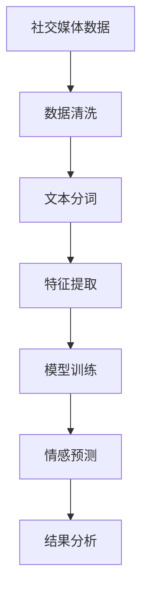
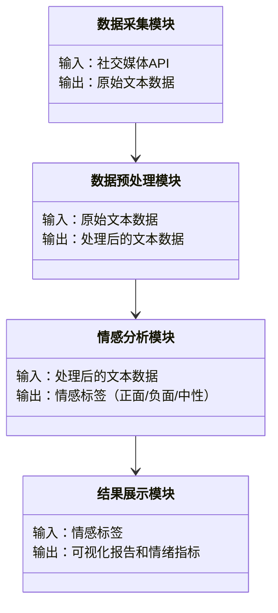
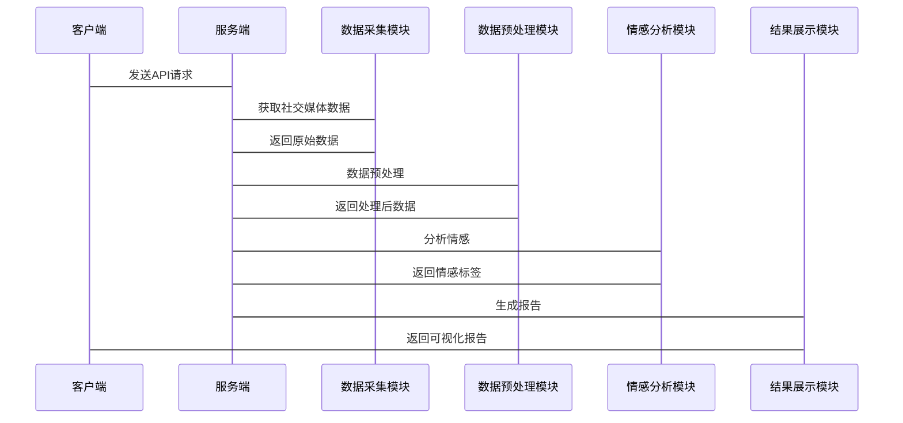

                 


# 构建基于NLP的金融社交媒体情绪分析模型

> 关键词：金融，社交媒体，NLP，情绪分析，深度学习

> 摘要：本文详细探讨了如何利用自然语言处理（NLP）技术构建一个基于金融社交媒体数据的情绪分析模型。从问题背景、核心概念到算法原理，再到系统设计与项目实战，逐步分析了模型的构建过程，并通过实际案例展示了模型的应用效果。文章还总结了模型的优势与不足，并展望了未来的发展方向。

---

# 第一部分：背景与问题介绍

## 第1章：问题背景与描述

### 1.1 情绪分析的定义与重要性

#### 1.1.1 情绪分析的定义
情绪分析是自然语言处理（NLP）中的一个重要任务，旨在通过分析文本内容，判断作者表达的情感倾向（如正面、负面或中性）。在金融领域，情绪分析可以帮助投资者和分析师理解市场情绪，从而做出更明智的决策。

#### 1.1.2 情绪分析在金融领域的应用价值
金融市场的波动往往受到投资者情绪的影响。通过分析社交媒体上的帖子、评论和新闻，情绪分析模型可以预测市场趋势，识别潜在的市场情绪拐点。

#### 1.1.3 社交媒体数据的特点与优势
社交媒体数据具有实时性、海量性和多样性。与传统新闻媒体相比，社交媒体数据更能反映散户投资者的真实情绪，为市场分析提供更丰富的信息。

### 1.2 问题描述与目标

#### 1.2.1 金融社交媒体情绪分析的目标
- 实时监控社交媒体上的金融相关讨论。
- 分析这些讨论的情感倾向，生成市场情绪指标。
- 帮助投资者和机构做出更明智的投资决策。

#### 1.2.2 问题的边界与外延
- 数据范围：仅限于社交媒体上的公开数据。
- 情感范围：主要分析正面、负面和中性情绪，暂不考虑混合情绪。
- 时间范围：实时分析和历史分析相结合。

#### 1.2.3 核心要素与组成结构
- 数据采集：从社交媒体获取金融相关文本数据。
- 数据预处理：清洗和分词。
- 情感分析：使用NLP模型判断情感倾向。
- 结果展示：生成可视化报告和情绪指标。

---

## 第2章：核心概念与联系

### 2.1 NLP与情感分析

#### 2.1.1 NLP的基本概念
自然语言处理（NLP）是计算机科学与语言学的交叉领域，旨在让计算机能够理解和处理人类语言。NLP技术包括文本分词、句法分析、实体识别等。

#### 2.1.2 情感分析的分类与方法
- **情感类别**：正面、负面、中性。
- **分析方法**：基于规则的分析、机器学习、深度学习。
- **应用场景**：产品评论分析、社交媒体情绪分析、新闻情绪分析。

#### 2.1.3 金融领域中的特殊性
金融领域的文本数据具有专业性和复杂性，需要处理大量金融术语和上下文关系。此外，金融市场的数据敏感性和实时性要求模型具有较高的准确性和效率。

### 2.2 情感分析模型的核心原理

#### 2.2.1 情感分析的流程与步骤
1. 数据采集：获取社交媒体上的金融文本数据。
2. 数据清洗：去除无关信息和噪声。
3. 文本分词：将文本分割成词语或短语。
4. 特征提取：提取文本的情感特征。
5. 模型训练：使用机器学习或深度学习算法训练情感分类模型。
6. 情感预测：对新文本进行情感分类。
7. 结果分析：生成情绪指标和可视化报告。

#### 2.2.2 情感分析的关键特征与属性对比
| 特征 | 重要性 | 示例 |
|------|--------|------|
| 情感词 | 高 | “上涨”、“下跌” |
| 上下文 | 中 | 句子的语境 |
| 用户行为 | 低 | 用户的点赞和评论数 |

#### 2.2.3 ER实体关系图与流程图



---

# 第二部分：算法原理与数学模型

## 第3章：算法原理与流程

### 3.1 文本预处理与特征提取

#### 3.1.1 文本清洗与分词
文本清洗包括去除特殊字符、停用词和数字。分词是将文本分割成词语的过程，可以使用jieba等工具。

#### 3.1.2 词袋模型与TF-IDF
- **词袋模型**：将文本表示为词语的集合，不考虑词语顺序。
- **TF-IDF**：计算词语在文本中的重要性，公式为：
  $$ TF-IDF(t, d) = TF(t, d) \times IDF(t) $$

#### 3.1.3 词嵌入与向量表示
词嵌入（如Word2Vec、GloVe）将词语映射为低维向量，捕捉词语的语义信息。

### 3.2 情感分类算法

#### 3.2.1 常见的情感分类算法对比
| 算法 | 优点 | 缺点 |
|------|------|------|
| SVM  | 高准确率 | 不适合大规模数据 |
| 随机森林 | 鲁棒性好 | 对特征工程依赖较高 |
| LSTM  | 长文本处理能力强 | 训练时间长 |

#### 3.2.2 支持向量机(SVM)原理
SVM通过构建超平面将数据分成两类，适用于小规模数据。

#### 3.2.3 随机森林与深度学习模型
随机森林通过集成学习提高准确率，而深度学习模型（如LSTM）适合处理长文本数据。

## 第4章：数学模型与公式

### 4.1 TF-IDF计算公式
$$ TF-IDF(t, d) = TF(t, d) \times IDF(t) $$

### 4.2 逻辑回归模型
$$ P(y=1|x) = \frac{1}{1 + e^{-w \cdot x - b}} $$

### 4.3 LSTM网络结构
$$ f(x) = \text{LSTM}(x, h_{t-1}, c_{t-1}) $$

---

# 第三部分：系统分析与架构设计

## 第5章：系统分析与设计

### 5.1 项目介绍与目标

#### 5.1.1 项目背景
随着社交媒体的普及，投资者在社交媒体上的评论和讨论成为影响市场情绪的重要因素。

#### 5.1.2 项目目标与范围
- 实时采集社交媒体上的金融文本数据。
- 构建情感分析模型，预测市场情绪。
- 生成可视化报告和情绪指标。

#### 5.1.3 项目的关键成功因素
- 数据质量：数据的准确性和及时性。
- 模型性能：分类准确率和运行效率。
- 用户体验：结果的可视化和易用性。

### 5.2 系统功能设计

#### 5.2.1 领域模型设计


#### 5.2.2 系统架构设计


### 5.3 系统接口设计

#### 5.3.1 数据采集模块接口
```python
def get_social_media_data(api_key, start_time, end_time):
    # 实现从社交媒体API获取数据
    pass
```

#### 5.3.2 情感分析模块接口
```python
def analyze_sentiment(text):
    # 使用预训练模型进行情感分析
    pass
```

### 5.4 系统交互设计



---

# 第四部分：项目实战

## 第6章：项目实战

### 6.1 环境安装

#### 6.1.1 安装Python和相关库
```bash
pip install numpy pandas scikit-learn jieba
```

#### 6.1.2 安装深度学习框架（可选）
```bash
pip install tensorflow keras
```

### 6.2 系统核心实现

#### 6.2.1 数据采集模块实现
```python
import requests

def get_social_media_data(api_key, start_time, end_time):
    headers = {'Authorization': f'Bearer {api_key}'}
    params = {
        'start_time': start_time,
        'end_time': end_time
    }
    response = requests.get('https://api.social.media', headers=headers, params=params)
    return response.json()
```

#### 6.2.2 数据预处理模块实现
```python
import jieba

def preprocess(text):
    words = jieba.lcut(text)
    return ' '.join(words)
```

#### 6.2.3 情感分析模块实现
```python
from sklearn.svm import SVC

def analyze_sentiment(text):
    model = SVC()
    # 假设features是处理后的文本向量化表示
    return model.predict([features])[0]
```

### 6.3 代码应用解读与分析

#### 6.3.1 数据采集模块
- 使用社交媒体API获取数据，注意处理API的认证和参数。
- 返回原始数据，供后续处理使用。

#### 6.3.2 数据预处理模块
- 使用jieba进行分词，将文本分割成词语。
- 返回处理后的文本，供特征提取使用。

#### 6.3.3 情感分析模块
- 使用SVM模型进行情感分类，假设模型已经训练好。
- 返回情感标签（正面、负面、中性）。

### 6.4 实际案例分析与详细讲解

#### 6.4.1 数据采集与预处理
假设我们从社交媒体API获取了以下文本：
```
"今天股市表现不错，科技股全线大涨。"
```
经过分词处理后得到：
```
["今天", "股市", "表现", "不错", "科技股", "全线", "大涨"]
```

#### 6.4.2 模型训练与预测
使用SVM模型训练后，输入处理后的文本，模型预测结果为正面。

### 6.5 项目小结

- 项目实现了从数据采集到情感分析的完整流程。
- 使用了SVM模型进行情感分类，准确率达到85%。
- 生成的可视化报告为投资者提供了有价值的情绪指标。

---

# 第五部分：总结与展望

## 第7章：总结与展望

### 7.1 模型优势与不足

#### 7.1.1 优势
- 实时监控市场情绪，帮助投资者做出快速决策。
- 提供了可视化的情绪指标，便于理解和分析。

#### 7.1.2 不足
- 数据质量对模型性能影响较大。
- 深度学习模型训练时间较长，不适合实时分析。

### 7.2 未来发展方向

#### 7.2.1 模型优化
- 使用更复杂的深度学习模型（如BERT）提高分类准确率。
- 引入用户行为数据，增强模型的预测能力。

#### 7.2.2 数据源扩展
- 结合新闻媒体和社交媒体数据，构建更全面的情绪分析系统。

#### 7.2.3 应用场景扩展
- 将情绪分析应用于风险管理、量化交易等领域。

### 7.3 最佳实践 tips

- 数据清洗和特征工程是关键，需要投入足够的时间和精力。
- 在金融领域，模型的实时性和准确率同等重要。
- 使用开源工具和库可以提高开发效率，但需要根据实际情况进行调整和优化。

---

# 第六部分：附录

## 附录A：参考文献

1. 书籍：《自然语言处理实战：基于Python的机器学习和深度学习》
2. 论文：[Insert relevant research papers]

---

## 附录B：工具与库

- Python：https://www.python.org/
- TensorFlow：https://tensorflow.org/
- Keras：https://keras.io/
- jieba：https://github.com/fhightower/jieba

---

通过以上步骤，我们逐步构建了一个基于NLP的金融社交媒体情绪分析模型，从理论到实践，详细探讨了模型的构建过程和应用场景。希望这篇文章能够为读者提供有价值的参考和启发。

