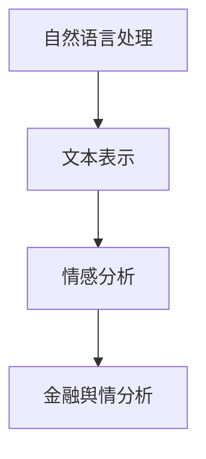
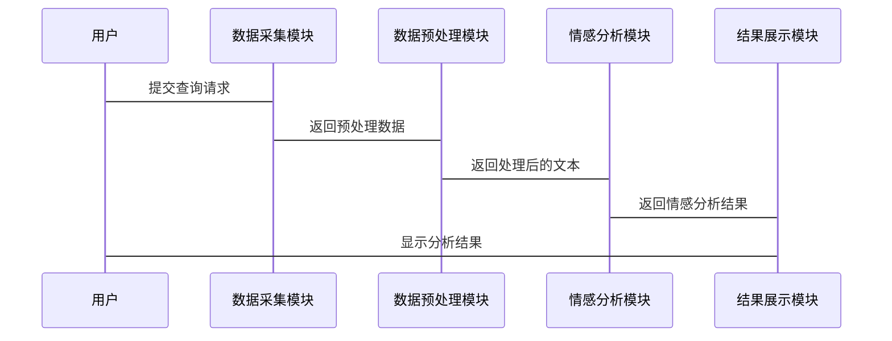

                 


# 构建基于NLP的金融舆情情感分析系统

> 关键词：NLP，情感分析，金融舆情，文本挖掘，机器学习

> 摘要：本文将详细探讨如何构建一个基于自然语言处理（NLP）的金融舆情情感分析系统。文章从问题背景、核心概念、算法原理、系统架构到项目实战，全面解析情感分析在金融领域的应用。通过具体的代码实现和案例分析，帮助读者掌握从理论到实践的整个过程。

---

# 第一部分: 问题背景与目标

## 第1章: 问题背景与目标

### 1.1 问题背景
#### 1.1.1 金融舆情分析的重要性
金融市场的波动往往与投资者的情绪密切相关。通过分析新闻、社交媒体、财报等文本数据，可以提取市场情绪，帮助投资者做出更明智的决策。例如，负面情绪的激增可能预示市场下跌，而积极情绪的集中可能预示上涨。

#### 1.1.2 情感分析在金融领域的应用
情感分析可以用于实时监控市场情绪、预测股票价格波动、评估公司声誉等。例如，Twitter上的用户 sentiment 可以用来预测 Dow Jones 指数的走势。

#### 1.1.3 当前技术挑战与解决方案
传统的情感分析方法依赖于规则和词典，但在金融领域，文本的复杂性和专业性使得这种方法效果有限。深度学习模型（如 LSTM 和 BERT）在处理复杂文本时表现出色，因此成为主流解决方案。

### 1.2 问题描述
#### 1.2.1 金融舆情数据的特征
金融舆情数据具有实时性、专业性、复杂性等特点。例如，新闻标题可能包含复杂的句式和专业术语，社交媒体评论可能带有情感倾向。

#### 1.2.2 情感分析的基本概念
情感分析旨在判断文本的情感倾向（如正面、负面、中性）。在金融领域，中性结果可能需要进一步分析以确定潜在的情绪倾向。

#### 1.2.3 系统目标与功能需求
系统目标是实时分析金融舆情数据，提取市场情绪，并生成可操作的报告。功能需求包括数据采集、预处理、情感分析、结果展示等。

### 1.3 问题解决思路
#### 1.3.1 NLP技术在情感分析中的作用
NLP技术帮助我们处理和理解文本数据，提取情感特征。例如，词嵌入技术（如 Word2Vec）可以将文本转换为数值表示。

#### 1.3.2 金融领域数据处理的特殊性
金融数据通常具有高度的专业性和领域知识。需要结合金融领域的词典和知识库，如公司名称、股票代码等。

#### 1.3.3 系统构建的总体思路
总体思路包括数据采集、预处理、模型训练、结果分析等步骤。需要结合深度学习模型和领域知识，构建高效的金融情感分析系统。

### 1.4 本章小结
本章介绍了金融舆情分析的重要性及其在金融领域中的应用。通过分析当前技术挑战，提出了构建金融情感分析系统的总体思路。

---

# 第二部分: 核心概念与联系

## 第2章: 核心概念与联系

### 2.1 NLP基础概念
#### 2.1.1 自然语言处理的核心任务
NLP的核心任务包括文本分类、情感分析、实体识别等。情感分析是其中的重要任务，广泛应用于金融、社交媒体等领域。

#### 2.1.2 词嵌入与文本表示
词嵌入技术（如 Word2Vec、GloVe）将单词映射为低维向量，帮助模型理解词语之间的关系。文本表示可以进一步处理为句子或段落的向量表示。

#### 2.1.3 常见的NLP模型与工具
常见的NLP模型包括 LSTM、Transformer、BERT 等。这些模型在情感分析任务中表现出色，提供了强大的文本理解能力。

### 2.2 情感分析原理
#### 2.2.1 情感分析的基本原理
情感分析通过分析文本中的情感词汇、句式结构等特征，判断文本的情感倾向。深度学习模型（如 LSTM 和 Transformer）可以自动提取这些特征。

#### 2.2.2 基于规则的情感分析
基于规则的情感分析依赖于预定义的词汇表和规则，如否定词检测、情感词强度计算等。这种方法在处理复杂文本时效果有限。

#### 2.2.3 基于机器学习的情感分析
基于机器学习的情感分析方法包括 SVM、随机森林等。这些方法需要大量标注数据进行训练，但在处理复杂任务时可能不如深度学习模型有效。

### 2.3 金融舆情分析的特殊性
#### 2.3.1 金融领域的专业术语
金融领域的文本包含大量专业术语，如“收益”、“利润”、“风险”等。这些术语的情感含义可能与普通语言中的含义不同。

#### 2.3.2 金融数据的复杂性
金融数据可能包含多模态信息，如文本、数字、时间戳等。需要综合分析这些信息，以准确判断市场情绪。

#### 2.3.3 金融情感分析的多维度特征
金融情感分析需要考虑多个维度，如情感强度、情感来源、情感目标等。例如，一条负面评论可能针对某个公司，也可能针对整个行业。

### 2.4 核心概念联系图
使用 Mermaid 绘制核心概念关系图，展示 NLP、情感分析和金融舆情分析之间的联系。



### 2.5 本章小结
本章介绍了 NLP 的核心概念和情感分析的基本原理。重点分析了金融舆情分析的特殊性，并通过图表展示了核心概念之间的联系。

---

# 第三部分: 算法原理与实现

## 第3章: 算法原理与实现

### 3.1 常见情感分析算法
#### 3.1.1 基于规则的方法
基于规则的情感分析依赖于预定义的词汇表和规则。例如，将“非常好”标记为正面情感，将“非常差”标记为负面情感。

#### 3.1.2 机器学习模型（如 SVM、随机森林）
机器学习模型通过训练数据学习情感特征，自动判断文本的情感倾向。例如，使用 SVM 对文本进行分类，分为正面、负面或中性。

#### 3.1.3 深度学习模型（如 LSTM、Transformer、BERT）
深度学习模型可以自动提取文本的深层特征，无需手动特征工程。例如，LSTM 可以捕捉文本的情感变化，BERT 可以理解上下文关系。

### 3.2 深度学习模型原理
#### 3.2.1 LSTM 网络结构
LSTM（长短期记忆网络）通过记忆单元和遗忘门来处理序列数据。在情感分析任务中，LSTM 可以捕捉文本的情感变化。

LSTM 的数学表达式如下：
$$
f(x) = \text{LSTM}(x, h_{t-1}, c_{t-1})
$$

其中，$x$ 是输入，$h_{t-1}$ 是前一时刻的隐藏状态，$c_{t-1}$ 是前一时刻的记忆单元。

#### 3.2.2 BERT 模型的预训练与微调
BERT（双向变压器）通过预训练学习文本的上下文关系。在情感分析任务中，需要对 BERT 模型进行微调，使其适应特定任务。

BERT 模型的输入与输出如下：
$$
\text{BERT}(x, y) = \text{Loss}(x, y)
$$

其中，$x$ 是输入文本，$y$ 是情感标签，$\text{Loss}$ 是损失函数。

#### 3.2.3 模型训练流程
模型训练流程包括数据预处理、模型选择、参数调优等步骤。例如，使用交叉验证选择最佳模型参数，避免过拟合。

### 3.3 情感分析的数学模型
#### 3.3.1 LSTM 的数学表达式
LSTM 的核心在于其记忆单元和遗忘门。数学公式如下：
$$
i_t = \sigma(W_i x_t + U_i h_{t-1} + b_i)
$$
$$
f_t = \sigma(W_f x_t + U_f h_{t-1} + b_f)
$$
$$
o_t = \sigma(W_o x_t + U_o h_{t-1} + b_o)
$$
$$
c_t = f_t \odot c_{t-1} + i_t \odot tanh(W_c x_t + U_c h_{t-1} + b_c)
$$
$$
h_t = o_t \odot tanh(c_t)
$$

其中，$i_t$ 是输入门，$f_t$ 是遗忘门，$o_t$ 是输出门，$c_t$ 是记忆单元，$h_t$ 是隐藏状态。

#### 3.3.2 BERT 模型的输入与输出
BERT 模型的输入是文本序列，输出是情感标签。数学公式如下：
$$
y = \text{argmax}(\text{softmax}(W_y h + b_y))
$$

其中，$h$ 是模型的隐藏层输出，$W_y$ 和 $b_y$ 是输出层的参数。

### 3.4 算法实现步骤
#### 3.4.1 数据预处理
数据预处理包括分词、去除停用词、文本对齐等步骤。例如，使用分词工具将文本分割成词语，去除没有意义的停用词。

#### 3.4.2 模型训练
模型训练需要标注数据。例如，使用 LSTM 模型训练情感分类器，分为正面、负面、中性三类。

#### 3.4.3 模型评估与优化
模型评估包括准确率、召回率、F1 值等指标。通过交叉验证选择最佳模型参数，优化模型性能。

### 3.5 本章小结
本章详细介绍了情感分析的常见算法及其原理。通过数学公式和流程图，展示了 LSTM 和 BERT 模型的实现过程。

---

# 第四部分: 系统架构与设计

## 第4章: 系统架构与设计

### 4.1 系统功能设计
#### 4.1.1 数据采集模块
数据采集模块负责从金融新闻、社交媒体等来源获取舆情数据。例如，使用 API 获取新闻标题和内容。

#### 4.1.2 数据预处理模块
数据预处理模块对采集的数据进行清洗和转换。例如，去除噪音数据、统一文本格式。

#### 4.1.3 情感分析模块
情感分析模块使用深度学习模型对文本进行情感分类。例如，使用 LSTM 或 BERT 模型预测文本的情感倾向。

#### 4.1.4 结果展示模块
结果展示模块将分析结果以可视化的方式呈现。例如，生成情感趋势图、市场情绪指数等。

### 4.2 系统架构设计
#### 4.2.1 分层架构
系统架构采用分层设计，包括数据层、业务逻辑层和表现层。每一层负责不同的功能模块。

#### 4.2.2 微服务架构
微服务架构将系统划分为多个独立的服务，如数据采集服务、情感分析服务等。各服务之间通过 RESTful API 进行通信。

#### 4.2.3 可扩展性设计
系统架构设计考虑了可扩展性，例如使用负载均衡、弹性伸缩等技术应对流量高峰。

### 4.3 系统接口设计
#### 4.3.1 数据接口
数据接口负责与数据源（如新闻网站、社交媒体）进行交互。例如，使用 REST API 获取实时数据。

#### 4.3.2 模型接口
模型接口负责与情感分析模型进行交互。例如，将预处理后的文本输入模型，获取情感分类结果。

#### 4.3.3 用户接口
用户接口是系统的前端部分，负责接收用户输入并展示分析结果。例如，用户可以通过 Web 界面查看市场情绪指数。

### 4.4 系统交互流程
使用 Mermaid 绘制系统交互序列图，展示系统各模块之间的交互流程。



### 4.5 本章小结
本章详细描述了金融舆情情感分析系统的架构设计，包括功能模块、系统架构、接口设计和交互流程。

---

# 第五部分: 项目实战

## 第5章: 项目实战

### 5.1 环境安装
#### 5.1.1 安装 Python 和必要的库
安装 Python 和以下库：
- `numpy`
- `pandas`
- `tensorflow`
- `transformers`
- `scikit-learn`

#### 5.1.2 安装开发工具
安装 IDE（如 PyCharm）和版本控制工具（如 Git）。

### 5.2 系统核心实现源代码
#### 5.2.1 数据采集模块
使用 `requests` 库从新闻网站获取数据。

```python
import requests

def fetch_data(url):
    response = requests.get(url)
    return response.text
```

#### 5.2.2 数据预处理模块
使用 `nltk` 库进行文本分词和去停用词。

```python
from nltk.corpus import stopwords
from nltk.tokenize import word_tokenize

def preprocess(text):
    tokens = word_tokenize(text)
    filtered = [word for word in tokens if word.lower() not in stopwords.words('english')]
    return ' '.join(filtered)
```

#### 5.2.3 情感分析模块
使用 LSTM 模型进行情感分类。

```python
import tensorflow as tf
from tensorflow.keras.layers import LSTM, Dense, Dropout

model = tf.keras.Sequential()
model.add(LSTM(64, input_shape=(None, 100), return_sequences=True))
model.add(Dropout(0.5))
model.add(LSTM(32, return_sequences=False))
model.add(Dense(3, activation='softmax'))
model.compile(loss='sparse_categorical_crossentropy', optimizer='adam', metrics=['accuracy'])
```

#### 5.2.4 结果展示模块
使用 Matplotlib 绘制情感趋势图。

```python
import matplotlib.pyplot as plt

def plot_trend(data):
    plt.figure(figsize=(10, 5))
    plt.plot(data['date'], data['sentiment_score'], 'b-', markersize=5)
    plt.xlabel('日期')
    plt.ylabel('情感得分')
    plt.title('市场情绪趋势图')
    plt.show()
```

### 5.3 代码应用解读与分析
详细解读上述代码的功能和实现过程，分析每个模块的作用。

### 5.4 案例分析
通过具体案例分析，展示如何使用上述系统进行金融舆情分析。

### 5.5 本章小结
本章通过具体的代码实现，展示了如何构建一个完整的金融舆情情感分析系统。从数据采集到结果展示，每个步骤都进行了详细说明。

---

# 第六部分: 最佳实践与总结

## 第6章: 最佳实践与总结

### 6.1 最佳实践 tips
- 数据预处理是关键，需要仔细清洗和转换数据。
- 模型选择应根据任务需求和数据量决定，深度学习模型在处理复杂任务时表现更优。
- 系统架构设计要考虑可扩展性和可维护性。

### 6.2 小结
本文详细介绍了如何构建一个基于 NLP 的金融舆情情感分析系统，从理论到实践，全面解析了系统的设计与实现。

### 6.3 注意事项
- 数据隐私和安全问题需要注意，特别是在处理金融数据时。
- 模型的可解释性在金融领域尤为重要，需要确保分析结果的透明性和可追溯性。

### 6.4 拓展阅读
建议读者进一步阅读以下内容：
- 深度学习在自然语言处理中的应用
- 金融时间序列分析
- 多模态情感分析

---

# 结语

通过本文的详细讲解，读者可以掌握构建基于 NLP 的金融舆情情感分析系统的完整流程。从问题背景到系统实现，每一步都进行了深入的分析和具体的代码实现。希望本文能够为读者在金融舆情分析领域提供有价值的参考和指导。

