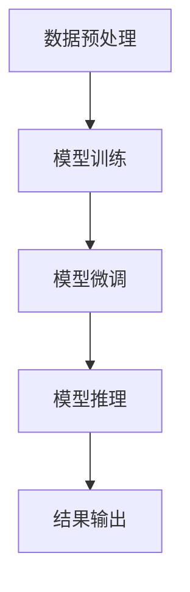
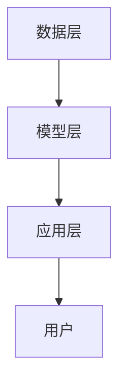
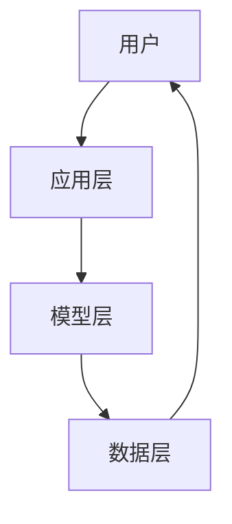

                 


# 构建基于大模型的金融监管合规自动化平台

> 关键词：金融监管，合规自动化，大模型，人工智能，系统架构，算法原理

> 摘要：本文详细探讨了如何利用大模型技术构建金融监管合规自动化平台。首先分析了传统金融监管的痛点与挑战，接着阐述了大模型在金融监管中的应用潜力与优势。然后从系统架构、算法原理、数据处理、模型训练、功能设计等多个维度详细讲解了平台的构建过程。最后通过实际案例展示了平台的应用效果，并总结了建设中的关键点与未来发展方向。

---

# 第1章: 问题背景与需求分析

## 1.1 问题背景

### 1.1.1 传统金融监管的痛点
传统金融监管主要依赖人工审核和规则-based系统，存在以下痛点：
- 数据来源广泛且复杂，包括文本、表格、图像等多种格式。
- 合规要求多样且动态变化，难以快速响应。
- 人工审核效率低，容易遗漏风险点。
- 规则-based系统难以应对复杂的关联关系和非结构化数据。

### 1.1.2 金融合规的重要性与挑战
金融合规是保障金融稳定、防范金融风险的核心环节。然而，随着金融业务的复杂化和创新化，合规要求日益严格，数据量急剧增长，传统的监管方式已难以满足需求。

### 1.1.3 大模型技术的兴起与应用潜力
近年来，大模型技术在自然语言处理、图像识别等领域取得了突破性进展。其强大的语义理解和知识推理能力为金融监管提供了新的解决方案。

---

## 1.2 问题描述

### 1.2.1 金融监管中的数据复杂性
金融数据具有多样性、实时性和关联性强等特点，传统的数据处理技术难以高效应对。

### 1.2.2 合规要求的多样性和动态变化
金融监管法规繁多，且常根据经济形势和风险变化进行调整，这要求监管系统具备高度的灵活性和适应性。

### 1.2.3 传统监管方式的局限性
传统监管方式主要依赖人工审核和简单的规则匹配，难以处理复杂的关联关系和非结构化数据。

---

## 1.3 问题解决思路

### 1.3.1 引入大模型技术的必要性
大模型技术可以有效处理非结构化数据，自动发现隐藏在数据中的关联关系，显著提高监管效率和准确性。

### 1.3.2 大模型在金融监管中的应用方向
- **文本分析与合规检查**：对监管文件、财务报告等文本进行自动理解和分析。
- **风险评估与预警**：基于历史数据和实时数据，识别潜在风险。
- **数据挖掘与关联分析**：发现数据中的隐藏关联，辅助决策。

### 1.3.3 从人工监管到智能监管的转变
通过引入大模型技术，构建智能化的监管平台，实现从被动响应到主动发现的转变。

---

## 1.4 问题的边界与外延

### 1.4.1 金融监管的边界
- 仅限于金融领域的监管，不涉及其他行业的监管。
- 重点关注合规性和风险评估，不涉及具体的业务操作。

### 1.4.2 合规自动化平台的范围界定
- 平台主要服务于金融机构和监管机构，提供合规性评估和风险预警服务。
- 不直接参与具体的业务流程，但可以与业务系统进行数据交互。

### 1.4.3 与相关领域的区别与联系
- **区别**：与企业级风险管理系统的区别在于监管目标和适用范围。
- **联系**：与金融数据分析平台有较强的关联性，可以共享数据和分析能力。

---

## 1.5 概念结构与核心要素

### 1.5.1 平台的整体架构
金融监管合规自动化平台由以下模块组成：
- 数据采集与处理模块
- 模型训练与部署模块
- 合规检查与风险预警模块
- 可视化分析与报告生成模块

### 1.5.2 核心功能模块
- **数据采集**：支持多种数据格式的采集与预处理。
- **模型训练**：基于大模型技术进行定制化训练。
- **合规检查**：自动识别数据中的违规行为。
- **风险预警**：实时监控风险指标，发出预警信号。

### 1.5.3 关键技术选型
- **大模型技术**：选择适合金融领域的预训练模型，并进行微调。
- **分布式计算框架**：使用Spark或Flink进行大数据处理。
- **可视化工具**：使用Tableau或Power BI进行数据展示。

---

# 第2章: 大模型与金融监管的结合

## 2.1 大模型的核心概念与原理

### 2.1.1 大模型的基本原理
大模型（Large Language Model，LLM）是一种基于深度学习的自然语言处理模型，通常使用Transformer架构，通过大量数据训练，具备强大的语义理解和生成能力。

### 2.1.2 大模型的训练机制
- **预训练**：在海量通用数据上进行无监督学习，提取通用语言特征。
- **微调**：在特定领域数据上进行有监督学习，适应具体任务需求。

### 2.1.3 大模型的应用模式
- **生成式应用**：如文本生成、对话系统。
- **理解式应用**：如文本分类、信息抽取。
- **推理式应用**：如问题解答、逻辑推理。

---

## 2.2 大模型在金融监管中的应用

### 2.2.1 文本分析与合规检查
- **合同审查**：自动识别合同中的法律条款和风险点。
- **监管文件分析**：自动理解监管文件中的合规要求。

### 2.2.2 风险评估与预警
- **舆情分析**：监控市场情绪，预测潜在风险。
- **信用评估**：基于多维度数据评估企业信用风险。

### 2.2.3 数据挖掘与关联分析
- **异常检测**：发现交易中的异常行为。
- **关联规则挖掘**：识别数据中的关联关系，辅助决策。

---

## 2.3 金融监管合规平台的核心要素

### 2.3.1 数据采集与处理
- **数据源**：包括金融机构的交易数据、财务报表、监管文件等。
- **数据预处理**：清洗、转换、标准化。

### 2.3.2 模型训练与部署
- **模型选择**：选择适合任务的模型架构。
- **模型训练**：基于金融数据进行微调。
- **模型部署**：将训练好的模型部署到生产环境。

### 2.3.3 平台的可扩展性与安全性
- **可扩展性**：支持大规模数据处理和高并发请求。
- **安全性**：确保数据隐私和系统安全。

---

# 第3章: 大模型驱动的金融监管合规自动化

## 3.1 大模型在金融合规中的优势

### 3.1.1 高效性与准确性
- 大模型可以快速处理大量数据，显著提高监管效率。
- 基于深度学习的特征提取能力，提高合规检查的准确性。

### 3.1.2 自适应性与灵活性
- 大模型可以根据新的监管要求快速调整，适应变化。
- 支持多种数据格式和多种任务类型。

### 3.1.3 可解释性与透明性
- 大模型可以通过注意力机制等方法提供可解释的结果。
- 便于监管机构理解和审核。

---

## 3.2 大模型与金融监管的结合方式

### 3.2.1 基于文本的大模型分析
- **合同审查**：自动识别合同中的关键条款。
- **监管文件分析**：自动理解监管要求。

### 3.2.2 基于数据的大模型建模
- **风险评估**：基于历史数据预测风险。
- **异常检测**：识别交易中的异常行为。

### 3.2.3 基于知识图谱的关联分析
- **关联规则挖掘**：识别数据中的关联关系。
- **知识图谱构建**：将监管知识和业务数据结合，辅助决策。

---

## 3.3 平台的整体架构设计

### 3.3.1 数据层设计
- **数据源**：金融机构的交易数据、财务报表、监管文件。
- **数据存储**：使用分布式存储系统，支持高效查询。

### 3.3.2 模型层设计
- **模型训练**：基于大模型进行微调，适应具体任务。
- **模型部署**：将训练好的模型部署到生产环境。

### 3.3.3 应用层设计
- **用户界面**：提供直观的可视化界面，方便用户操作。
- **API接口**：提供标准化接口，方便与其他系统集成。

---

## 3.4 系统交互设计

### 3.4.1 用户与平台的交互流程
1. 用户上传数据。
2. 平台进行数据处理。
3. 平台调用大模型进行分析。
4. 平台生成结果并反馈给用户。

### 3.4.2 模型与数据的交互流程
1. 数据预处理：清洗、转换、标准化。
2. 模型训练：基于预处理后的数据进行微调。
3. 模型推理：对新数据进行预测或分类。

---

## 3.5 系统架构设计

### 3.5.1 分层架构设计
- **数据层**：负责数据的存储和管理。
- **模型层**：负责模型的训练和推理。
- **应用层**：负责与用户的交互和结果展示。

### 3.5.2 微服务架构设计
- **数据服务**：提供数据查询和管理接口。
- **模型服务**：提供模型训练和推理接口。
- **应用服务**：提供用户界面和API接口。

### 3.5.3 高可用性与扩展性设计
- **负载均衡**：使用反向代理实现高可用性。
- **弹性扩展**：根据请求量自动调整资源分配。

---

## 3.6 系统接口设计

### 3.6.1 数据接口
- **输入接口**：支持多种数据格式的上传。
- **输出接口**：提供处理后的数据和分析结果。

### 3.6.2 模型接口
- **训练接口**：提供模型训练的API。
- **推理接口**：提供模型推理的API。

### 3.6.3 用户接口
- **可视化界面**：提供直观的用户操作界面。
- **API接口**：提供标准化的API接口。

---

## 3.7 系统交互设计

### 3.7.1 用户与平台的交互流程
1. 用户通过可视化界面上传数据。
2. 平台进行数据预处理。
3. 平台调用大模型进行分析。
4. 平台生成结果并反馈给用户。

### 3.7.2 模型与数据的交互流程
1. 数据预处理：清洗、转换、标准化。
2. 模型训练：基于预处理后的数据进行微调。
3. 模型推理：对新数据进行预测或分类。

---

## 3.8 系统架构设计

### 3.8.1 分层架构设计
- **数据层**：负责数据的存储和管理。
- **模型层**：负责模型的训练和推理。
- **应用层**：负责与用户的交互和结果展示。

### 3.8.2 微服务架构设计
- **数据服务**：提供数据查询和管理接口。
- **模型服务**：提供模型训练和推理接口。
- **应用服务**：提供用户界面和API接口。

### 3.8.3 高可用性与扩展性设计
- **负载均衡**：使用反向代理实现高可用性。
- **弹性扩展**：根据请求量自动调整资源分配。

---

## 3.9 系统接口设计

### 3.9.1 数据接口
- **输入接口**：支持多种数据格式的上传。
- **输出接口**：提供处理后的数据和分析结果。

### 3.9.2 模型接口
- **训练接口**：提供模型训练的API。
- **推理接口**：提供模型推理的API。

### 3.9.3 用户接口
- **可视化界面**：提供直观的用户操作界面。
- **API接口**：提供标准化的API接口。

---

## 3.10 系统交互设计

### 3.10.1 用户与平台的交互流程
1. 用户通过可视化界面上传数据。
2. 平台进行数据预处理。
3. 平台调用大模型进行分析。
4. 平台生成结果并反馈给用户。

### 3.10.2 模型与数据的交互流程
1. 数据预处理：清洗、转换、标准化。
2. 模型训练：基于预处理后的数据进行微调。
3. 模型推理：对新数据进行预测或分类。

---

# 第4章: 大模型驱动的金融合规自动化平台算法原理

## 4.1 算法原理概述

### 4.1.1 大模型的基本算法原理
- **Transformer架构**：由自注意力机制和前馈网络组成。
- **预训练与微调**：通过大规模数据预训练，然后在特定任务上进行微调。

### 4.1.2 金融合规分析的算法选择
- **文本分类**：用于合规性判断。
- **序列标注**：用于文本实体识别。
- **文本生成**：用于自动生成合规报告。

### 4.1.3 算法的优化与调优
- **超参数调优**：调整学习率、批量大小等参数。
- **模型剪枝**：减少模型复杂度，提高推理速度。
- **知识蒸馏**：将大模型的知识迁移到小模型。

---

## 4.2 算法流程图



---

## 4.3 算法实现代码

```python
def preprocess_data(data):
    # 数据清洗与转换
    pass

def train_model(train_data):
    # 基于大模型的微调训练
    pass

def evaluate_model(test_data):
    # 模型评估
    pass

def predict_model(new_data):
    # 模型推理
    pass
```

---

## 4.4 数学模型与公式

### 4.4.1 损失函数
$$ L = -\frac{1}{N}\sum_{i=1}^{N} y_i \log(p_i) + (1 - y_i) \log(1 - p_i) $$

### 4.4.2 优化算法
$$ \theta = \theta - \eta \frac{\partial L}{\partial \theta} $$

---

## 4.5 算法实现细节

### 4.5.1 数据预处理
- 文本清洗：去除噪声、分词、去停用词。
- 特征提取：提取文本中的关键词、实体。

### 4.5.2 模型训练
- 使用预训练的大模型进行微调。
- 设置适当的训练参数，如学习率、批量大小。

### 4.5.3 模型推理
- 对新数据进行特征提取。
- 调用模型进行预测或分类。

---

## 4.6 算法优化与调优

### 4.6.1 超参数调优
- 学习率：常用Adam优化器，学习率设为$10^{-3}$。
- 批量大小：根据硬件资源调整，通常设为32或64。

### 4.6.2 模型剪枝
- 去除冗余参数，减少模型复杂度。
- 使用L1/L2正则化进行参数约束。

### 4.6.3 知识蒸馏
- 将大模型的知识迁移到小模型，保持性能的同时减少计算量。

---

# 第5章: 系统分析与架构设计方案

## 5.1 系统功能设计

### 5.1.1 数据采集与预处理
- 支持多种数据格式的采集。
- 提供数据清洗、转换、标准化功能。

### 5.1.2 模型训练与部署
- 提供大模型的微调功能。
- 支持模型的在线部署与更新。

### 5.1.3 合规检查与风险预警
- 提供文本分类、实体识别功能。
- 实时监控风险指标，发出预警信号。

### 5.1.4 可视化分析与报告生成
- 提供数据可视化功能。
- 自动生成合规报告和风险分析报告。

---

## 5.2 系统架构设计

### 5.2.1 分层架构设计
- **数据层**：负责数据的存储和管理。
- **模型层**：负责模型的训练和推理。
- **应用层**：负责与用户的交互和结果展示。

### 5.2.2 微服务架构设计
- **数据服务**：提供数据查询和管理接口。
- **模型服务**：提供模型训练和推理接口。
- **应用服务**：提供用户界面和API接口。

### 5.2.3 高可用性与扩展性设计
- **负载均衡**：使用反向代理实现高可用性。
- **弹性扩展**：根据请求量自动调整资源分配。

---

## 5.3 系统接口设计

### 5.3.1 数据接口
- **输入接口**：支持多种数据格式的上传。
- **输出接口**：提供处理后的数据和分析结果。

### 5.3.2 模型接口
- **训练接口**：提供模型训练的API。
- **推理接口**：提供模型推理的API。

### 5.3.3 用户接口
- **可视化界面**：提供直观的用户操作界面。
- **API接口**：提供标准化的API接口。

---

## 5.4 系统交互设计

### 5.4.1 用户与平台的交互流程
1. 用户通过可视化界面上传数据。
2. 平台进行数据预处理。
3. 平台调用大模型进行分析。
4. 平台生成结果并反馈给用户。

### 5.4.2 模型与数据的交互流程
1. 数据预处理：清洗、转换、标准化。
2. 模型训练：基于预处理后的数据进行微调。
3. 模型推理：对新数据进行预测或分类。

---

## 5.5 系统架构设计图



---

## 5.6 系统交互设计图



---

# 第6章: 项目实战

## 6.1 环境安装

### 6.1.1 安装Python
```bash
python --version
pip install --upgrade pip
```

### 6.1.2 安装大模型框架
```bash
pip install transformers
pip install torch
```

## 6.2 系统核心实现源代码

### 6.2.1 数据预处理
```python
import pandas as pd
from transformers import AutoTokenizer, AutoModelForMaskedLM

def preprocess_data(data):
    tokenizer = AutoTokenizer.from_pretrained('bert-base-cased')
    inputs = tokenizer(data['text'], return_tensors='np', padding=True, truncation=True)
    return inputs
```

### 6.2.2 模型训练
```python
import torch
from torch import nn
from transformers import AutoModelForMaskedLM

def train_model(train_data):
    model = AutoModelForMaskedLM.from_pretrained('bert-base-cased')
    optimizer = torch.optim.Adam(model.parameters(), lr=1e-3)
    model.train()
    for batch in train_data:
        outputs = model(**batch)
        loss = outputs.loss
        loss.backward()
        optimizer.step()
    return model
```

### 6.2.3 模型推理
```python
def predict_model(model, new_data):
    inputs = preprocess_data(new_data)
    with torch.no_grad():
        outputs = model(**inputs)
    return outputs
```

## 6.3 代码应用解读与分析

### 6.3.1 数据预处理代码解读
- 使用BERT模型的分词器对文本数据进行分词和编码。
- 返回预处理后的输入数据。

### 6.3.2 模型训练代码解读
- 加载预训练的BERT模型。
- 定义优化器和损失函数。
- 迭代训练数据，更新模型参数。

### 6.3.3 模型推理代码解读
- 对新数据进行预处理。
- 使用训练好的模型进行预测。

---

## 6.4 实际案例分析

### 6.4.1 案例背景
某金融机构需要对大量财务报表进行合规性检查，传统方式耗时且容易出错。

### 6.4.2 数据处理
- 数据来源：财务报表、交易记录、监管文件。
- 数据预处理：清洗、分词、特征提取。

### 6.4.3 模型训练
- 使用BERT模型进行微调，训练财务报表分类任务。
- 设置适当的超参数，如学习率、批量大小。

### 6.4.4 模型推理
- 对新财务报表进行合规性分类。
- 生成分类结果和风险预警。

---

## 6.5 项目小结

### 6.5.1 项目总结
通过引入大模型技术，构建了金融监管合规自动化平台，显著提高了监管效率和准确性。

### 6.5.2 项目成果
- 实现了基于大模型的文本分析、风险评估和数据挖掘功能。
- 提供了直观的可视化界面和标准化API接口。

### 6.5.3 项目经验
- 数据预处理是关键，需要根据具体任务进行定制化处理。
- 模型调优是提升性能的重要环节，需要耐心和经验。

---

# 第7章: 总结与展望

## 7.1 总结

### 7.1.1 核心成果
- 构建了基于大模型的金融监管合规自动化平台。
- 提供了高效的文本分析、风险评估和数据挖掘功能。

### 7.1.2 实践价值
- 提高了金融监管效率和准确性。
- 降低了合规成本，提升了金融机构的竞争力。

### 7.1.3 理论意义
- 为金融监管领域的智能化转型提供了新的思路。
- 推动了大模型技术在金融领域的应用和发展。

---

## 7.2 展望

### 7.2.1 技术发展
- 大模型技术的进一步优化与创新。
- 新兴技术（如图神经网络）的应用探索。

### 7.2.2 应用拓展
- 拓展到更多金融场景，如智能投顾、信用评估。
- 与区块链等新兴技术结合，提升数据安全性和可信度。

### 7.2.3 未来挑战
- 数据隐私与安全保护。
- 模型的可解释性和透明性。
- 多模态数据的融合与分析。

---

## 7.3 最佳实践 Tips

### 7.3.1 数据处理
- 数据预处理是关键，需根据具体任务进行定制化处理。
- 确保数据质量和完整性，避免噪声干扰。

### 7.3.2 模型训练
- 选择适合任务的模型架构，避免盲目追求大模型。
- 合理设置超参数，进行充分的调优和验证。

### 7.3.3 系统设计
- 采用模块化设计，便于功能扩展和维护。
- 确保系统高可用性和可扩展性，支持高并发请求。

### 7.3.4 安全与隐私
- 采用加密技术保护数据隐私。
- 确保系统安全，防止数据泄露和攻击。

---

## 7.4 小结

通过本文的详细讲解，我们了解了如何利用大模型技术构建金融监管合规自动化平台。从问题背景到系统架构，从算法原理到项目实战，我们系统地探讨了平台的构建过程和应用价值。未来，随着技术的不断发展，金融监管将更加智能化和自动化，为金融行业的稳定与发展提供更有力的支持。

---

## 7.5 注意事项

### 7.5.1 数据安全
- 确保数据的存储和传输安全，防止数据泄露。
- 遵守相关法律法规，保护用户隐私。

### 7.5.2 模型可解释性
- 提供可解释的结果，便于监管机构审核和验证。
- 避免“黑箱”模型，确保模型的透明性和可信度。

### 7.5.3 系统维护
- 定期更新模型和数据，保持系统的先进性和准确性。
- 及时修复系统漏洞，确保平台的稳定运行。

---

## 7.6 拓展阅读

### 7.6.1 推荐书籍
- 《大模型时代的金融创新》
- 《人工智能在金融领域的应用》

### 7.6.2 推荐博客
- [大模型技术博客](https://example.com)
- [金融监管技术博客](https://example.com)

### 7.6.3 推荐工具
- [Hugging Face](https://huggingface.co)
- [Kubernetes](https://kubernetes.io)

---

通过本文的详细讲解，我们系统地探讨了如何利用大模型技术构建金融监管合规自动化平台。从问题背景到系统架构，从算法原理到项目实战，我们为读者提供了全面的技术指导和实践指南。希望本文能为相关领域的技术人员和研究人员提供有价值的参考和启发。

