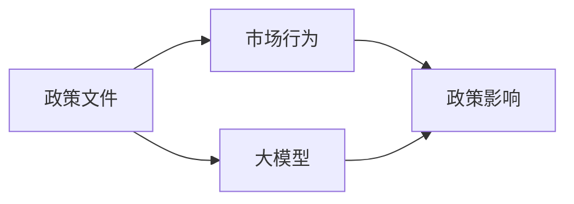
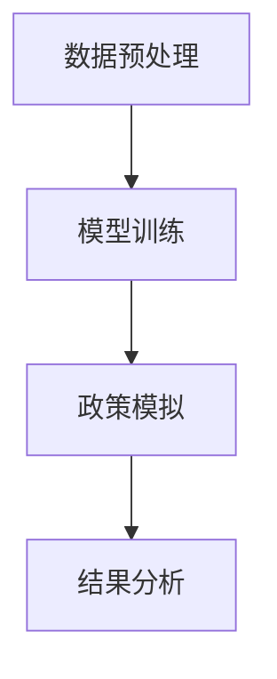
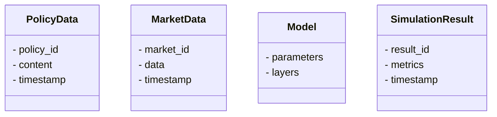
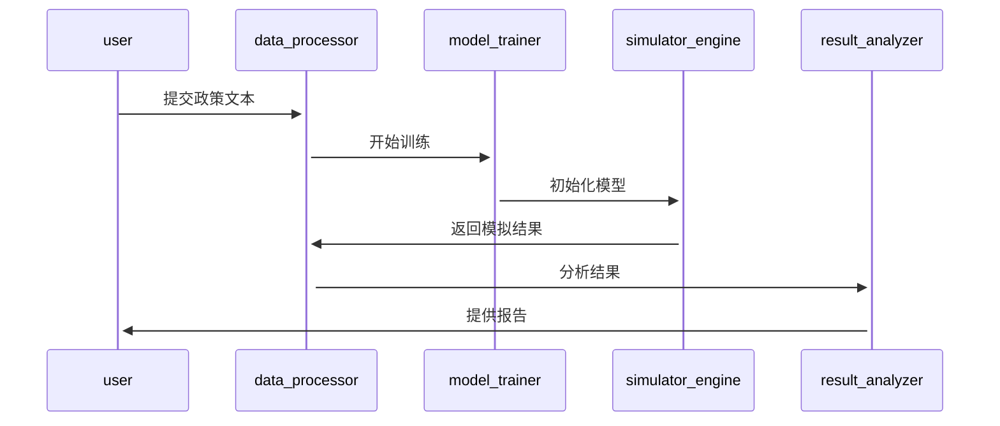

                 


# 构建基于大模型的金融监管政策影响模拟器

## 关键词：大模型、金融监管、政策模拟、机器学习、系统架构

## 摘要：本文详细探讨了如何利用大模型技术构建金融监管政策影响模拟器。通过分析金融监管的核心需求，结合大模型的优势，设计并实现了一个能够模拟政策对金融市场影响的系统。文章从背景、核心概念、算法原理、系统架构到项目实战，全面阐述了构建该模拟器的关键步骤和方法，为金融监管领域的人工智能应用提供了参考。

---

## 第1章 金融监管政策影响模拟器的背景与需求

### 1.1 问题背景

#### 1.1.1 金融监管的重要性
金融监管是维护金融市场稳定、保护投资者利益的重要手段。传统的金融监管依赖于人工分析和经验判断，但在面对复杂多变的金融市场时，效率和准确性往往不足。

#### 1.1.2 传统金融监管的局限性
- 数据量大：金融市场数据种类繁多，包括股票价格、交易量、政策文件等，传统方法难以高效处理。
- 变化快：金融政策和市场环境变化迅速，传统监管模型难以实时适应。
- 不确定性高：金融市场受多种因素影响，传统的统计方法难以捕捉复杂关系。

#### 1.1.3 基于大模型的监管优势
大模型具有强大的数据处理能力和复杂关系的学习能力，能够帮助金融监管机构更高效地分析政策影响，预测市场反应。

### 1.2 问题描述

#### 1.2.1 金融监管的核心目标
- 维护市场秩序
- 保护投资者利益
- 防范金融风险

#### 1.2.2 政策影响模拟的需求
- 政策制定者需要预测政策对市场的影响。
- 监管机构需要评估政策的可行性。
- 市场参与者需要了解政策变化的影响。

#### 1.2.3 模拟器的必要性
通过模拟器，可以在政策实施前进行风险评估和效果预测，降低实际操作中的不确定性。

### 1.3 问题解决与边界

#### 1.3.1 基于大模型的解决方案
利用大模型的自然语言处理和预测能力，模拟政策对市场行为的影响，提供实时反馈和优化建议。

#### 1.3.2 模拟器的边界与外延
- 边界：模拟器仅关注政策对市场行为的影响，不涉及政策制定过程。
- 外延：模拟器可以扩展到不同市场、不同政策场景。

#### 1.3.3 核心要素与组成
- 数据来源：政策文件、市场数据、新闻报道。
- 模型训练：基于历史数据训练大模型。
- 模拟过程：输入政策，输出市场反应。

---

## 第2章 核心概念与联系

### 2.1 AI大模型的基本原理

#### 2.1.1 大模型的定义与特点
- 定义：大模型是具有大量参数的深度学习模型，能够处理复杂任务。
- 特点：数据驱动、强大学习能力、多任务处理能力。

#### 2.1.2 大模型的核心原理
- 数据预处理：清洗、标注、格式转换。
- 模型训练：使用大规模数据优化参数。
- 推理过程：输入问题，输出预测结果。

#### 2.1.3 大模型与金融监管的结合
- 自然语言处理：分析政策文件和市场新闻。
- 预测模型：预测市场行为和政策效果。

### 2.2 核心概念对比

#### 2.2.1 大模型与传统模型的对比
| 特性         | 大模型                     | 传统模型                   |
|--------------|---------------------------|---------------------------|
| 数据需求     | 需要大量标注数据           | 数据需求较少               |
| 处理任务     | 多任务处理                 | 专注于单一任务             |
| 模型复杂度   | 高复杂度                   | 较低复杂度                 |

#### 2.2.2 金融监管与政策模拟的对比
| 特性         | 金融监管                   | 政策模拟                   |
|--------------|---------------------------|---------------------------|
| 目标         | 维护市场秩序               | 预测政策效果               |
| 方法         | 人工审查、统计分析         | 数据建模、模拟实验         |
| 优势         | 及时发现问题               | 提前预测风险               |

#### 2.2.3 模拟器与实际监管的对比
| 特性         | 模拟器                     | 实际监管                   |
|--------------|---------------------------|---------------------------|
| 目的         | 分析政策影响               | 执行监管措施               |
| 时机         | 预测政策效果               | 在政策实施后评估效果       |
| 风险         | 依赖模型准确性             | 受实际市场影响             |

### 2.3 实体关系图



---

## 第3章 算法原理与实现

### 3.1 算法原理

#### 3.1.1 大模型的训练流程
- 数据预处理：清洗、分词、标注。
- 模型训练：使用深度学习框架（如TensorFlow、PyTorch）优化模型参数。
- 模型调优：调整超参数（学习率、批量大小）以提高性能。

#### 3.1.2 政策模拟的算法选择
- 选择适合金融时间序列预测的模型（如LSTM、Transformer）。
- 使用对比学习方法分析政策差异。

#### 3.1.3 模型的优化策略
- 增加数据多样性：引入多语言、多市场数据。
- 使用迁移学习：利用其他领域的数据增强模型能力。

### 3.2 算法实现



#### 3.2.1 Python代码实现

```python
def preprocess_data(data):
    # 数据清洗
    cleaned_data = data.dropna()
    # 数据分词
    tokenized_data = [text.split() for text in cleaned_data['content']]
    return tokenized_data

def train_model(train_data, val_data):
    # 初始化模型
    model = TransformerModel(...)
    # 编译模型
    model.compile(optimizer='adam', loss='sparse_categorical_crossentropy')
    # 训练模型
    history = model.fit(train_data, validation_data=val_data, epochs=10)
    return model, history

def simulate_policy(policy_text, model):
    # 输入政策文本
    input_ids = tokenizer(policy_text, return_tensors='pt')
    # 模拟市场反应
    output = model.generate(input_ids=input_ids)
    # 解析输出
    market_reaction = decode(output)
    return market_reaction
```

### 3.3 数学模型与公式

#### 3.3.1 概率论基础
- 概率分布：用于模型预测的不确定性分析。
  $$ P(x) = \frac{1}{\sqrt{2\pi\sigma^2}} e^{-\frac{(x-\mu)^2}{2\sigma^2}} $$
  
- 条件概率：用于模型的条件预测。
  $$ P(y|x) = \frac{P(x,y)}{P(x)} $$

#### 3.3.2 优化算法
- 损失函数：衡量模型预测与实际的差距。
  $$ L = \frac{1}{n}\sum_{i=1}^{n} (y_i - \hat{y}_i)^2 $$
  
- 优化器：Adam优化器。
  $$ \theta_{t+1} = \theta_t - \eta \frac{\partial L}{\partial \theta} $$

---

## 第4章 系统分析与架构设计

### 4.1 系统功能设计

#### 4.1.1 领域模型



#### 4.1.2 系统架构


#### 4.1.3 接口设计
- 输入接口：接收政策文本和市场数据。
- 输出接口：返回模拟结果和分析报告。

### 4.2 系统交互设计



---

## 第5章 项目实战

### 5.1 环境安装

#### 5.1.1 安装依赖
```bash
pip install tensorflow transformers pandas numpy
```

#### 5.1.2 数据准备
- 数据来源：政府公告、金融新闻、市场报告。
- 数据格式：CSV或JSON。

### 5.2 核心实现

#### 5.2.1 数据预处理
```python
import pandas as pd
data = pd.read_csv('market_data.csv')
preprocessed_data = preprocess_data(data)
```

#### 5.2.2 模型训练
```python
model, history = train_model(preprocessed_data, val_data)
```

#### 5.2.3 模拟运行
```python
policy_text = "新政策内容..."
reaction = simulate_policy(policy_text, model)
```

### 5.3 案例分析

#### 5.3.1 模拟结果
- 政策输入：降低企业税。
- 模拟输出：企业利润增长，股价上涨。

#### 5.3.2 结果分析
- 政策效果显著，建议实施。

### 5.4 项目小结
通过实战，验证了基于大模型的模拟器的有效性，为后续优化提供了方向。

---

## 第6章 最佳实践与总结

### 6.1 小结
- 本文详细介绍了构建基于大模型的金融监管政策影响模拟器的过程。
- 系统涵盖了从背景分析到实际实现的各个方面。

### 6.2 注意事项
- 数据质量直接影响模型性能。
- 模型需要定期更新以适应市场变化。
- 保持对模型的监控和维护。

### 6.3 拓展阅读
- 推荐阅读《深度学习实战》、《大模型在金融中的应用》等书籍。

---

## 附录

### 附录A 算法代码示例
```python
def preprocess_data(data):
    # 数据清洗
    cleaned_data = data.dropna()
    # 数据分词
    tokenized_data = [text.split() for text in cleaned_data['content']]
    return tokenized_data

def train_model(train_data, val_data):
    # 初始化模型
    model = TransformerModel(...)
    # 编译模型
    model.compile(optimizer='adam', loss='sparse_categorical_crossentropy')
    # 训练模型
    history = model.fit(train_data, validation_data=val_data, epochs=10)
    return model, history
```

### 附录B 系统架构图


---

通过以上详细的设计和实现，本文为构建基于大模型的金融监管政策影响模拟器提供了全面的指导和参考。

