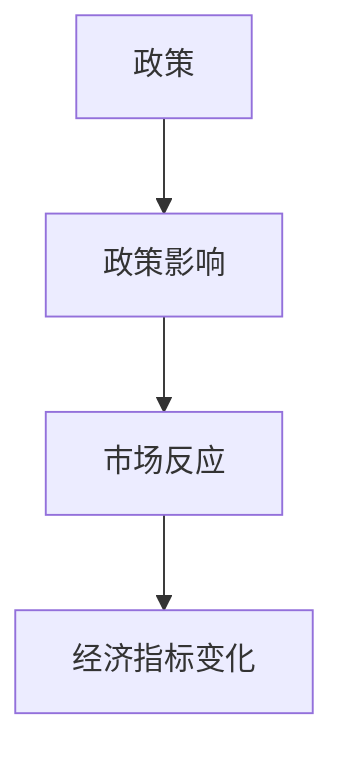
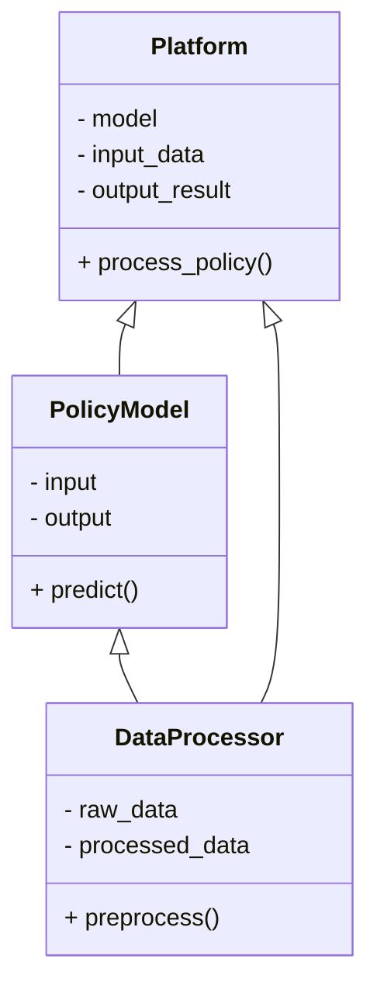

                 


# 构建基于大模型的金融监管政策影响链预测平台

## 关键词：大模型，金融监管，政策影响链，预测平台，系统架构

## 摘要：  
随着金融市场的复杂化和监管需求的日益增长，构建一个基于大模型的金融监管政策影响链预测平台变得至关重要。本文将详细探讨如何利用大模型技术来预测和分析金融监管政策的影响链，涵盖背景介绍、核心概念、算法原理、系统架构设计以及项目实战等内容。通过本文，读者将了解如何利用大模型技术在金融监管领域中的应用，以及如何构建一个高效、准确的政策影响链预测平台。

---

## 第一部分：问题背景与需求分析

### 第1章：问题背景介绍

#### 1.1 问题背景介绍
金融监管是维护金融市场稳定、保护投资者利益的重要手段。随着经济全球化和金融创新的快速发展，金融监管面临着政策复杂化、市场波动加剧等挑战。传统的监管方法难以及时捕捉和预测政策变化带来的影响，因此，如何利用先进的技术手段，尤其是大模型技术，来构建一个高效的政策影响链预测平台成为亟待解决的问题。

#### 1.2 问题描述与目标
政策影响链是指政策的实施如何层层传递，影响市场参与者的行为，最终对金融市场产生影响的过程。本文的目标是构建一个基于大模型的平台，能够预测政策实施后的市场反应，评估政策效果，并为监管机构提供决策支持。

#### 1.3 问题解决思路
基于大模型的解决方案将通过以下步骤实现：
1. 数据收集与预处理：收集历史政策数据、市场数据和相关经济指标。
2. 模型训练：利用大模型对政策数据进行分析，预测政策对市场的影响。
3. 平台构建：搭建一个用户友好的平台，提供政策输入、预测结果展示和决策建议功能。

#### 1.4 问题边界与外延
平台将专注于政策影响链的预测，不涉及政策制定过程。同时，平台的应用场景不仅限于金融监管，还可以扩展到经济政策分析、企业战略规划等领域。

---

### 第2章：核心概念与联系

#### 2.1 大模型与金融监管的结合原理
大模型通过自然语言处理和深度学习技术，能够理解和分析大量非结构化数据，如政策文件、新闻报道等。这些数据经过模型处理后，可以提取出政策的关键特征，并预测其对市场的影响。

#### 2.2 核心概念属性对比
| 概念       | 属性特征             |
|------------|----------------------|
| 大模型     | 高准确性、强泛化能力 |
| 金融监管   | 监管力度、政策导向性 |

#### 2.3 ER实体关系图


---

### 第3章：算法原理与数学模型

#### 3.1 大模型的训练流程
1. **数据预处理**：清洗和标注数据，确保数据质量。
2. **模型训练**：使用深度学习模型（如Transformer）进行训练。
3. **模型优化**：通过调整超参数和优化策略提高模型性能。

#### 3.2 算法原理的数学模型
模型的损失函数和优化器定义如下：
- **损失函数**：$$ L = \frac{1}{N}\sum_{i=1}^{N}(y_i - \hat{y_i})^2 $$
- **优化器**：$$ \theta_{new} = \theta_{old} - \eta \cdot \nabla L $$

#### 3.3 算法实现的Python代码
```python
import torch
from torch import nn

# 数据加载与处理
data = torch.randn(100, 1)
target = torch.randn(100, 1)

# 模型定义
class PolicyModel(nn.Module):
    def __init__(self):
        super(PolicyModel, self).__init__()
        self.linear = nn.Linear(1, 1)
    
    def forward(self, x):
        return self.linear(x)

# 模型训练
model = PolicyModel()
criterion = nn.MSELoss()
optimizer = torch.optim.Adam(model.parameters(), lr=0.01)

for epoch in range(100):
    outputs = model(data)
    loss = criterion(outputs, target)
    optimizer.zero_grad()
    loss.backward()
    optimizer.step()
```

---

## 第四部分：系统分析与架构设计方案

### 第4章：系统功能设计

#### 4.1 系统功能模块
1. **数据输入模块**：用户输入政策文本或关键词。
2. **预测模块**：模型分析政策并生成预测结果。
3. **结果展示模块**：以可视化形式展示预测结果。

#### 4.2 领域模型类图


---

### 第5章：系统架构设计

#### 5.1 系统架构图


#### 5.2 系统接口设计
- **API接口**：提供RESTful API，方便其他系统调用。
- **数据接口**：支持多种数据格式的输入。

---

## 第五部分：项目实战

### 第6章：环境安装与配置

#### 6.1 环境要求
- Python 3.8+
- PyTorch 1.9+
- Transformers库

#### 6.2 安装依赖
```bash
pip install torch transformers
```

### 第7章：系统核心实现

#### 7.1 核心代码实现
```python
from transformers import AutoTokenizer, AutoModelForCausalLM

# 加载模型
tokenizer = AutoTokenizer.from_pretrained('gpt2')
model = AutoModelForCausalLM.from_pretrained('gpt2')

# 政策输入
policy_text = "新金融监管政策：..."

# 模型预测
inputs = tokenizer(policy_text, return_tensors='np')
outputs = model.generate(inputs.input_ids, max_length=50)
print(tokenizer.decode(outputs[0]))
```

#### 7.2 代码解读
- 使用预训练的GPT-2模型，加载Tokenizer和Model。
- 输入政策文本，生成预测结果。

### 第8章：案例分析

#### 8.1 实际案例
假设输入一条新监管政策，模型预测其对股市的影响。

#### 8.2 结果分析
预测结果将展示市场可能的反应，如股价波动、投资者行为变化等。

---

## 第六部分：总结与展望

### 第9章：最佳实践与注意事项

#### 9.1 实践建议
- 数据质量至关重要，确保数据的全面性和准确性。
- 定期更新模型，保持预测的准确性。

#### 9.2 注意事项
- 数据隐私和安全需严格保护。
- 模型解释性需增强，便于用户理解。

### 第10章：小结与展望

#### 10.1 小结
本文详细介绍了基于大模型的金融监管政策影响链预测平台的构建过程，从背景分析到系统实现，为监管机构提供了有力的技术支持。

#### 10.2 展望
未来，随着大模型技术的不断进步，预测平台的功能将更加智能化和多样化，为金融监管提供更全面的支持。

---

通过本文的详细讲解，读者可以深入了解如何利用大模型技术构建金融监管政策影响链预测平台，并在实际应用中发挥重要作用。

