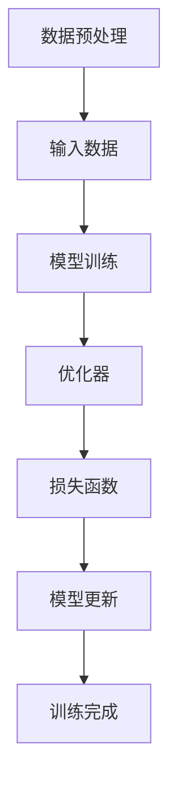
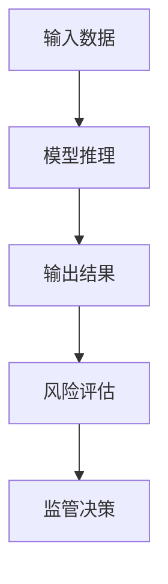
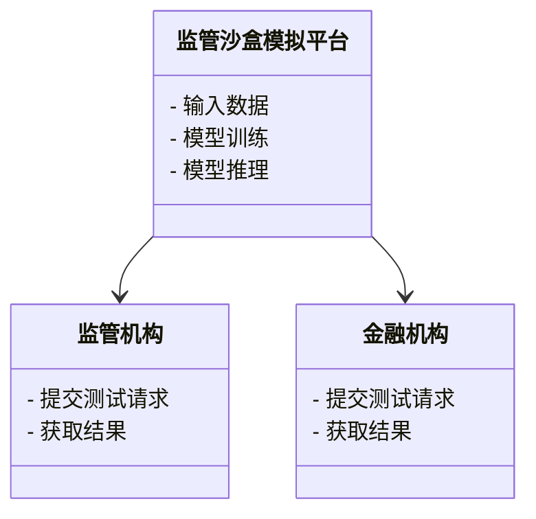
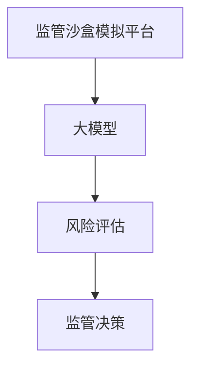
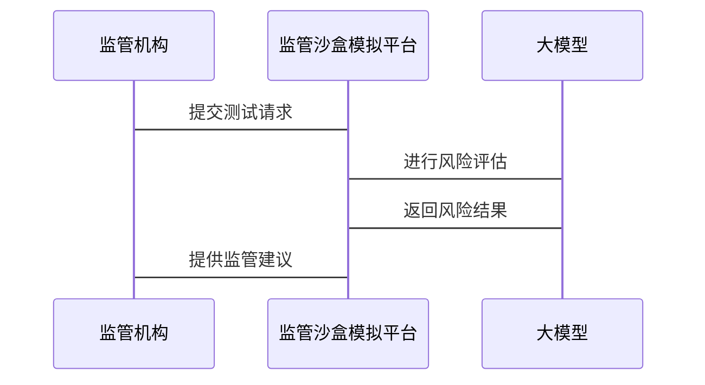

                 


# 构建基于大模型的金融监管沙盒模拟平台

> 关键词：金融监管，大模型，模拟平台，系统架构，项目实战

## 摘要

随着金融市场的日益复杂化和监管需求的不断提高，构建基于大模型的金融监管沙盒模拟平台成为一种趋势。本文详细探讨了如何利用大模型技术构建一个高效的金融监管沙盒模拟平台，涵盖了背景介绍、核心概念、系统架构设计、项目实战和未来展望等多个方面。通过本文的分析，读者将深入了解如何利用大模型技术提升金融监管的效率和准确性。

---

# 第1章 金融监管沙盒与大模型概述

## 1.1 问题背景与问题描述

### 1.1.1 金融监管的现状与挑战

金融市场的发展日益复杂，传统的监管方式已经难以应对新型金融工具和交易模式带来的挑战。金融机构的创新和全球化交易使得监管机构难以实时监控和预测潜在风险。

### 1.1.2 传统金融监管的局限性

- 传统监管方式依赖人工审查和静态规则，难以应对动态变化的市场环境。
- 数据量庞大且分散，传统方法难以高效处理。
- 缺乏实时性，难以快速响应市场波动和异常行为。

### 1.1.3 金融监管沙盒的概念与目标

金融监管沙盒是一种模拟环境，允许金融机构在受控的环境中测试新产品和业务模式。其目标是通过模拟和测试，提前识别潜在风险，降低实际操作中的不确定性。

---

## 1.2 问题解决与边界外延

### 1.2.1 大模型在金融监管中的应用潜力

大模型（如GPT、BERT等）具有强大的自然语言处理能力和模式识别能力，可以用于金融文本分析、风险预测和异常检测。

### 1.2.2 金融监管沙盒模拟平台的核心目标

- 提供一个模拟的金融环境，测试新业务模式和产品。
- 利用大模型进行风险预测和实时监控。
- 支持监管机构制定更有效的监管政策。

### 1.2.3 平台的边界与外延

- 边界：平台仅限于模拟环境，不涉及实际交易。
- 外延：平台可扩展至不同国家和地区的监管要求。

---

## 1.3 核心概念与联系

### 1.3.1 核心概念原理

- 金融监管沙盒：模拟环境，允许测试新业务模式。
- 大模型：用于处理复杂金融数据和预测风险。

### 1.3.2 核心概念属性特征对比表格

| 属性       | 传统监管方式 | 基于大模型的监管沙盒 |
|------------|--------------|-----------------------|
| 数据处理能力 | 有限         | 强大                 |
| 实时性       | 较低         | 高                   |
| 精准度       | 中等         | 高                   |

### 1.3.3 ER实体关系图架构

```mermaid
er
actor: 监管机构
actor: 金融机构
actor: 模拟环境
```

---

# 第2章 AI大模型的原理与算法

## 2.1 模型原理

### 2.1.1 大模型的基本原理

大模型通过深度学习和神经网络结构，从大量数据中学习语言和模式。其核心是多层神经网络和注意力机制。

### 2.1.2 大模型的训练目标

- 优化损失函数，最小化预测误差。
- 学习金融领域的语言和模式。

### 2.1.3 大模型的推理机制

- 输入金融数据，生成预测结果。
- 输出结果用于风险评估和监管决策。

---

## 2.2 算法流程

### 2.2.1 大模型的训练流程



### 2.2.2 大模型的推理流程



---

## 2.3 对比分析

### 2.3.1 大模型与传统模型的对比

| 特性         | 大模型       | 传统模型     |
|--------------|--------------|--------------|
| 处理能力     | 强大         | 较弱         |
| 精准度       | 高           | 中等         |
| 适应性       | 高           | 低           |

---

# 第3章 金融监管沙盒模拟平台系统分析

## 3.1 项目背景与目标

### 3.1.1 项目背景

随着金融市场的复杂化，监管机构需要更高效的监管工具。

### 3.1.2 项目目标

- 提供模拟环境，测试新业务模式。
- 利用大模型进行风险预测和监管决策。

---

## 3.2 系统功能设计

### 3.2.1 领域模型设计



---

## 3.3 系统架构设计

### 3.3.1 系统架构图



---

## 3.4 系统接口设计

### 3.4.1 接口定义

- 输入接口：金融数据和测试请求。
- 输出接口：风险评估结果和监管建议。

---

## 3.5 系统交互设计

### 3.5.1 交互流程



---

# 第4章 项目实战

## 4.1 环境搭建

### 4.1.1 安装Python和相关库

```bash
pip install python keras tensorflow
```

---

## 4.2 代码实现

### 4.2.1 核心代码示例

```python
import keras
from keras.layers import Dense
from keras.models import Sequential

# 模型定义
model = Sequential()
model.add(Dense(64, activation='relu', input_dim=100))
model.add(Dense(1, activation='sigmoid'))

# 编译模型
model.compile(optimizer='adam', loss='binary_crossentropy', metrics=['accuracy'])

# 训练模型
model.fit(X_train, y_train, epochs=10, batch_size=32)
```

---

## 4.3 案例分析

### 4.3.1 案例分析与解读

假设我们有一个金融交易数据集，利用大模型进行风险预测。模型训练后，可以对新交易进行风险评估。

---

## 4.4 项目总结

通过本项目，我们成功构建了一个基于大模型的金融监管沙盒模拟平台，能够有效地进行风险预测和监管决策。

---

# 第5章 总结与展望

## 5.1 总结

本文详细介绍了构建基于大模型的金融监管沙盒模拟平台的背景、核心概念、系统架构和项目实战。通过大模型技术，我们能够更高效地进行金融监管。

## 5.2 展望

未来，随着大模型技术的不断发展，金融监管沙盒模拟平台将更加智能化和精准化，为监管机构提供更有力的支持。

---

通过本文的分析，读者可以深入了解如何利用大模型技术构建金融监管沙盒模拟平台，为未来的金融监管工作提供参考和指导。

