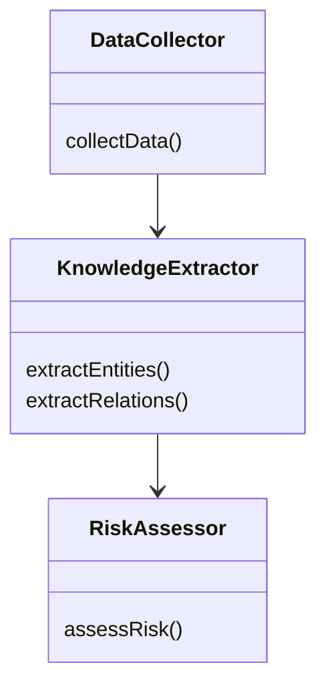

                 


# 构建基于知识图谱的金融产品全生命周期风险动态评估系统

## 关键词：知识图谱，金融风险管理，全生命周期，动态评估，风险控制

## 摘要：  
本文详细探讨了如何利用知识图谱构建金融产品全生命周期风险动态评估系统。通过分析金融产品的全生命周期，结合知识图谱的强大建模能力，提出了一套创新的风险评估方法。文章从知识图谱的基本概念出发，逐步深入讲解了系统构建的核心算法、架构设计以及实际应用案例，为金融机构提供了有效的风险管理工具。

---

# 第一部分: 知识图谱与金融风险管理概述

## 第1章: 知识图谱与金融风险管理背景

### 1.1 知识图谱的基本概念

#### 1.1.1 知识图谱的定义
知识图谱是一种以图结构形式表示知识的数据模型，由节点（实体）和边（关系）组成，能够将分散的数据连接起来，形成语义网络。例如，金融领域的知识图谱可以表示“公司-投资-产品”之间的关系。

#### 1.1.2 知识图谱的核心属性
知识图谱的核心属性包括：
- **实体**：如“公司”、“产品”、“风险”等。
- **关系**：如“投资”、“关联”等，描述实体之间的联系。
- **属性**：如“成立时间”、“注册资本”等，用于丰富实体信息。

#### 1.1.3 知识图谱与传统数据库的区别
| 属性 | 知识图谱 | 传统数据库 |
|------|---------|------------|
| 数据结构 | 图结构 | 行列结构 |
| 表达能力 | 强语义连接 | 基础关系 |
| 查询效率 | 较低 | 较高 |

### 1.2 金融产品全生命周期风险管理的挑战

#### 1.2.1 金融产品的全生命周期概述
金融产品的生命周期包括：**发行、运行、终止**三个阶段，每个阶段的风险特征不同。

#### 1.2.2 传统风险管理的局限性
- 数据分散，难以全局分析。
- 风险关联性弱，难以发现隐性风险。
- 动态变化捕捉不足，难以实时评估。

#### 1.2.3 知识图谱在金融风险管理中的优势
- **语义关联**：捕捉隐性风险关系。
- **动态更新**：实时跟踪产品风险。
- **全生命周期管理**：覆盖产品生命周期的各个阶段。

### 1.3 本章小结
本章介绍了知识图谱的基本概念，分析了金融产品风险管理的挑战，并提出了利用知识图谱进行风险管理的优势。

---

## 第2章: 知识图谱的核心概念与构建原理

### 2.1 知识图谱的构建流程

#### 2.1.1 数据采集与预处理
- 数据来源：金融产品信息、市场数据、新闻资讯等。
- 数据清洗：去重、补全、格式统一。

#### 2.1.2 实体识别与关系抽取
- 实体识别：使用NLP技术提取公司、产品等实体。
- 关系抽取：识别实体之间的关系，如“投资”、“关联”。

#### 2.1.3 知识图谱存储与管理
- 数据库选择：Neo4j、OrientDB等图数据库。
- 存储结构：节点和边的存储方式。

### 2.2 知识图谱的属性特征对比

#### 实体属性对比表
| 实体 | 属性 |
|------|------|
| 公司 | 成立时间、注册资本、主营业务 |
| 产品 | 类型、发行时间、期限 |

#### 关系属性对比表
| 关系 | 属性 |
|------|------|
| 投资 | 投资金额、投资时间 |
| 关联 | 关联类型、关联强度 |

#### 知识图谱的ER实体关系图
```mermaid
er
    entity Entity {
        id: string
        name: string
        type: string
    }
    entity Relation {
        id: string
        name: string
        type: string
    }
    entity Fact {
        subject: Entity
        predicate: Relation
        object: Entity
    }
```

### 2.3 本章小结
本章详细介绍了知识图谱的构建流程，并通过表格和图示展示了实体和关系的属性特征。

---

## 第3章: 知识图谱构建算法原理

### 3.1 实体识别与关系抽取算法

#### 3.1.1 基于规则的实体识别
- 使用正则表达式提取公司名称、产品名称等。

#### 3.1.2 基于深度学习的关系抽取
- 使用BERT模型进行关系抽取，代码示例：
```python
from transformers import BertTokenizer, BertModel
tokenizer = BertTokenizer.from_pretrained('bert-base-cased')
model = BertModel.from_pretrained('bert-base-cased')
inputs = tokenizer("Apple invests in Google", return_tensors='np')
outputs = model(**inputs)
print(outputs)
```

#### 3.1.3 实体链接算法
- 使用K-近邻算法将实体映射到知识库中的标准实体。

### 3.2 知识图谱融合算法

#### 3.2.1 多源数据融合
- 使用图融合算法将多个来源的数据整合到同一个知识图谱中。

#### 3.2.2 基于图的融合算法
- 使用图的最短路径算法解决实体对齐问题。

#### 3.2.3 融合效果评估
- 使用F1分数评估融合后的知识图谱质量。

### 3.3 本章小结
本章介绍了知识图谱构建的核心算法，包括实体识别、关系抽取和图融合算法，并提供了具体的代码示例。

---

## 第4章: 基于知识图谱的风险评估模型

### 4.1 风险评估模型的设计思路

#### 4.1.1 系统功能模块
- 数据采集模块：收集金融产品数据。
- 知识抽取模块：提取实体和关系。
- 风险评估模块：基于知识图谱进行风险计算。

#### 4.1.2 系统架构设计


### 4.2 风险评估模型的实现

#### 4.2.1 风险传播算法
- 使用图卷积网络（GCN）在知识图谱中传播风险。
- 数学公式：
  $$
  r_i^{(t+1)} = \sum_{j} a_{ij} \cdot r_j^{(t)}
  $$
  其中，$a_{ij}$是节点i和j之间的关联性。

#### 4.2.2 风险聚合算法
- 使用注意力机制聚合多源信息。
- 数学公式：
  $$
  score = \alpha \cdot risk1 + (1-\alpha) \cdot risk2
  $$

### 4.3 本章小结
本章设计了基于知识图谱的风险评估模型，并详细介绍了模型的实现过程。

---

## 第5章: 项目实战与系统实现

### 5.1 环境安装与配置

#### 5.1.1 安装Python环境
- 使用Anaconda安装Python 3.8及以上版本。

#### 5.1.2 安装依赖库
- `pip install numpy pandas spacy transformers`

### 5.2 核心实现代码

#### 5.2.1 数据预处理代码
```python
import pandas as pd
df = pd.read_csv('financial_products.csv')
print(df.head())
```

#### 5.2.2 知识抽取代码
```python
import spacy
nlp = spacy.load("en_core_web_sm")
doc = nlp("Apple invests in Google")
for ent in doc.ents:
    print(ent.text, ent.label_)
```

#### 5.2.3 图构建代码
```python
from networkx import Graph
G = Graph()
G.add_nodes_from(['Apple', 'Google', 'Investment'])
G.add_edges_from([('Apple', 'Investment'), ('Investment', 'Google')])
```

### 5.3 系统集成与测试

#### 5.3.1 系统功能测试
- 测试知识图谱的构建是否正确。
- 测试风险评估模型的输出是否合理。

### 5.4 本章小结
本章通过实际案例展示了如何构建基于知识图谱的金融产品风险评估系统，并提供了详细的代码实现。

---

## 第6章: 总结与展望

### 6.1 系统总结
- 知识图谱的强大建模能力为金融风险管理提供了新的思路。
- 系统实现了金融产品的全生命周期风险管理。

### 6.2 未来展望
- 引入实时数据流，实现动态风险评估。
- 结合区块链技术，提高系统的可信度。

### 6.3 本章小结
本章总结了系统的实现成果，并展望了未来的发展方向。

---

## 附录: 工具与资源

### A.1 工具安装指南
- **Python**：安装Anaconda或使用虚拟环境。
- **Spacy**：`pip install spacy`

### A.2 数据集说明
- 数据来源：公开金融数据、新闻资讯等。

### A.3 参考文献
- 引用的学术论文和书籍。

---

通过以上步骤，我们构建了一个基于知识图谱的金融产品全生命周期风险动态评估系统，为金融机构提供了强大的风险管理工具。

