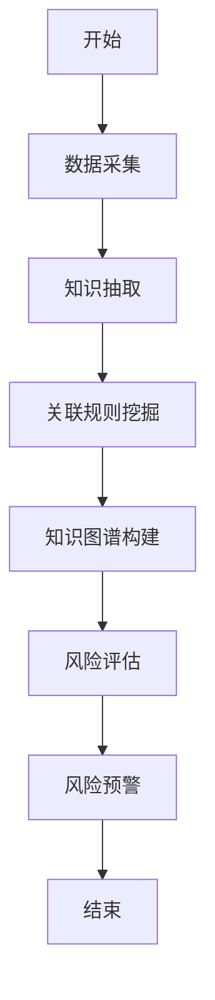
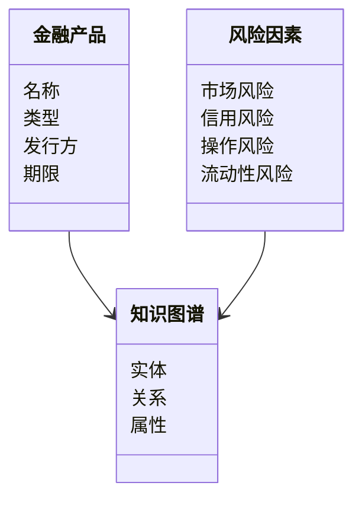

                 


# 构建基于知识图谱的金融产品全生命周期风险跟踪系统

> 关键词：知识图谱、金融产品、风险跟踪、全生命周期、系统架构

> 摘要：本文详细介绍了如何利用知识图谱技术构建金融产品全生命周期风险跟踪系统。通过分析金融产品的全生命周期管理需求，结合知识图谱的核心原理，提出了一种基于知识图谱的风险跟踪框架，并详细阐述了系统的构建过程、算法原理、系统架构设计和实际应用案例。本文还提供了具体的代码实现和数学模型，为读者提供了一套完整的解决方案。

---

# 第1章: 金融产品全生命周期风险跟踪的背景与挑战

## 1.1 问题背景

### 1.1.1 金融产品的全生命周期管理

金融产品从研发、发行、交易到终止的整个生命周期中，涉及众多复杂的业务流程和风险管理需求。传统的金融产品管理方式通常依赖于孤立的数据库和静态的报表，难以捕捉产品之间的关联性，也无法实时跟踪和预测潜在风险。

### 1.1.2 风险跟踪的重要性

金融市场的波动性和复杂性使得风险跟踪成为金融管理的核心任务。通过实时跟踪金融产品的全生命周期，可以及时发现潜在风险，从而采取有效的风险管理措施，避免重大损失。

### 1.1.3 知识图谱在金融领域的应用潜力

知识图谱是一种以图结构形式表示知识的技术，能够将金融产品、市场、参与者等实体及其关系以结构化的形式表示出来。通过知识图谱，可以实现金融产品全生命周期的动态跟踪，并支持跨领域的关联分析。

---

## 1.2 问题描述

### 1.2.1 传统金融风险跟踪的局限性

传统金融风险跟踪系统通常基于规则和静态数据分析，难以应对金融市场中复杂多变的风险因素。例如，无法有效识别跨产品、跨市场的关联风险，也无法实时更新和动态调整风险评估结果。

### 1.2.2 知识图谱在风险跟踪中的优势

知识图谱通过语义理解和关联分析，能够发现隐藏在海量数据中的潜在风险。通过构建金融领域的知识图谱，可以实现对金融产品全生命周期的动态跟踪，并支持基于图的复杂查询和推理。

### 1.2.3 金融产品全生命周期管理的需求

金融产品全生命周期管理需要覆盖从产品设计、发行、交易到终止的各个阶段，并在每个阶段中进行实时的风险评估和监控。这种全生命周期管理需要一种灵活、动态的知识表示和分析方法。

---

## 1.3 问题解决

### 1.3.1 知识图谱的核心作用

知识图谱通过构建金融领域的知识网络，能够将金融产品、市场、参与者等实体及其关系以结构化的形式表示出来，从而支持复杂的风险分析和关联推理。

### 1.3.2 金融产品全生命周期的风险跟踪框架

本文提出了一种基于知识图谱的金融产品全生命周期风险跟踪框架，包括数据采集、知识抽取、知识图谱构建、风险评估与预警等模块。

### 1.3.3 知识图谱构建与风险评估的结合

通过知识图谱构建技术，将金融产品的全生命周期数据转化为结构化的知识网络，然后基于知识图谱进行风险评估和预警。

---

## 1.4 边界与外延

### 1.4.1 系统的边界定义

本文提出的金融产品全生命周期风险跟踪系统仅关注金融产品本身及其直接相关的风险因素，不涉及与金融产品无关的外部系统。

### 1.4.2 相关领域的外延

尽管本文主要关注金融领域，但知识图谱技术可以扩展到其他领域，例如供应链管理、医疗健康等。

### 1.4.3 知识图谱与其他技术的协同

知识图谱可以与机器学习、自然语言处理等技术协同工作，进一步提升金融产品风险跟踪的准确性和实时性。

---

## 1.5 核心要素组成

### 1.5.1 金融产品的基本属性

金融产品的基本属性包括产品类型、发行方、发行时间、产品期限、产品规模等。

### 1.5.2 风险因素的分类

风险因素可以分为市场风险、信用风险、操作风险、流动性风险等。

### 1.5.3 知识图谱的构建要素

知识图谱的构建要素包括实体、关系、属性、规则和动态更新机制。

---

# 第2章: 知识图谱的基本原理

## 2.1 知识图谱的定义与特点

### 2.1.1 知识图谱的定义

知识图谱是一种以图结构形式表示知识的技术，由实体、关系和属性三部分组成。

### 2.1.2 知识图谱的核心特点

- 结构化：知识以实体和关系的形式组织，支持语义理解和关联分析。
- 动态性：能够实时更新和扩展，适应数据的变化。
- 可扩展性：支持大规模数据的存储和处理。

### 2.1.3 知识图谱与传统数据库的区别

传统数据库通常以行和列的形式存储数据，而知识图谱以图结构形式存储数据，支持复杂的关联分析。

---

## 2.2 知识图谱的构建流程

### 2.2.1 数据采集与预处理

数据采集可以通过爬虫、API调用等方式获取金融产品的相关信息，预处理包括数据清洗和标准化。

### 2.2.2 知识抽取与关联规则挖掘

知识抽取包括实体识别和关系抽取，关联规则挖掘用于发现实体之间的关联性。

### 2.2.3 知识图谱的存储与管理

知识图谱可以通过图数据库（如Neo4j）进行存储和管理，支持高效的查询和推理。

---

## 2.3 知识图谱的表示与推理

### 2.3.1 实体与关系的表示

实体和关系可以用图的形式表示，例如，金融产品A由公司B发行，可以表示为A --发行--> B。

### 2.3.2 知识推理的基本方法

知识推理可以通过基于规则的推理、统计推理和深度学习推理等方式进行。

### 2.3.3 知识图谱的动态更新

动态更新可以通过监听数据源的变化，实时更新知识图谱中的实体和关系。

---

# 第3章: 金融风险的核心概念

## 3.1 金融风险的分类

### 3.1.1 市场风险

市场风险是指由于市场价格波动导致的金融产品价值损失的风险。

### 3.1.2 信用风险

信用风险是指由于债务人违约导致的损失风险。

### 3.1.3 操作风险

操作风险是指由于内部操作失误或外部事件导致的损失风险。

### 3.1.4 流动性风险

流动性风险是指由于缺乏足够流动性导致的无法及时变现的风险。

---

## 3.2 金融风险的影响因素

### 3.2.1 经济周期的影响

经济周期的波动会影响金融产品的市场需求和价格波动。

### 3.2.2 市场波动的关联性

不同金融产品和市场的波动往往是相互关联的，需要进行全局性的风险分析。

### 3.2.3 产品复杂性与风险暴露

金融产品的复杂性越高，其潜在风险也越大，需要更加精细的风险管理。

---

## 3.3 金融风险的评估与管理

### 3.3.1 风险评估的基本方法

风险评估可以通过定量分析和定性分析相结合的方式进行。

### 3.3.2 风险管理的策略与工具

常用的金融风险管理工具包括对冲、保险、限额管理和压力测试等。

### 3.3.3 现有风险跟踪系统的局限性

现有的风险跟踪系统通常基于孤立的数据源，难以进行跨领域的关联分析。

---

# 第4章: 知识图谱构建的算法原理

## 4.1 知识抽取与关联规则挖掘

### 4.1.1 基于规则的知识抽取

通过预定义的规则从文本数据中提取实体和关系。

### 4.1.2 基于统计的关联规则挖掘

通过统计方法发现数据中的关联性。

### 4.1.3 基于深度学习的实体识别

使用神经网络模型进行实体识别和关系抽取。

---

## 4.2 知识图谱的表示学习

### 4.2.1 Word2Vec模型

Word2Vec是一种常用的词向量表示方法，可以用于实体和关系的向量化表示。

### 4.2.2 Graph Neural Networks (GNN)

GNN是一种基于图结构的深度学习模型，可以用于知识图谱的表示和推理。

---

## 4.3 知识图谱的动态更新

### 4.3.1 基于事件驱动的更新

当发生特定事件（如新产品发行）时，触发知识图谱的更新。

### 4.3.2 基于时间窗口的更新

定期对知识图谱进行更新，保持其准确性和时效性。

---

## 4.4 风险评估的数学模型

### 4.4.1 基于概率的模型

例如，贝叶斯网络可以用于风险因素的概率计算。

### 4.4.2 基于图的模型

例如，PageRank算法可以用于评估实体的重要性和风险传播。

---

## 4.5 风险评估的算法实现

### 4.5.1 算法流程图



### 4.5.2 Python代码实现

```python
import networkx as nx

def build_knowledge_graph():
    G = nx.Graph()
    G.add_edge("金融产品A", "发行方B", label="发行")
    G.add_edge("发行方B", "市场C", label="参与")
    return G

G = build_knowledge_graph()
print(G.nodes())
print(G.edges())
```

---

# 第5章: 系统架构设计与实现

## 5.1 问题场景介绍

本文提出的金融产品全生命周期风险跟踪系统旨在通过知识图谱技术，实现对金融产品全生命周期的动态跟踪和风险评估。

## 5.2 系统功能设计

### 5.2.1 领域模型



### 5.2.2 系统架构设计


---

## 5.3 系统接口设计

### 5.3.1 API接口定义

```python
class KnowledgeGraphService:
    def get_entities(self):
        pass

    def get_relationships(self):
        pass

    def update_graph(self, new_entities):
        pass
```

### 5.3.2 系统交互流程图

```mermaid
sequenceDiagram
    User -> KnowledgeGraphService: 查询风险信息
    KnowledgeGraphService -> RiskAssessment: 获取风险评估结果
    RiskAssessment -> KnowledgeGraphService: 返回风险报告
    User <-- KnowledgeGraphService: 收到风险报告
```

---

## 5.4 项目实战

### 5.4.1 环境安装

```bash
pip install networkx
pip install neo4j
```

### 5.4.2 核心代码实现

```python
from neo4j import GraphDatabase

class KnowledgeGraph:
    def __init__(self, uri, user, password):
        self.driver = GraphDatabase.driver(uri, auth=(user, password))
    
    def add_entity(self, label, properties):
        with self.driver.session() as session:
            session.run("CREATE (:Entity {label: $label, properties: $properties})", 
                        label=label, properties=properties)
```

### 5.4.3 代码解读与分析

上述代码展示了如何使用Neo4j图数据库存储金融产品的实体信息，包括产品名称、类型、发行方等属性。

---

## 5.5 实际案例分析

### 5.5.1 案例背景

假设我们有一个金融产品A，由公司B发行，涉及市场C和D。我们需要通过知识图谱分析该产品的市场风险和信用风险。

### 5.5.2 分析过程

1. 从知识图谱中提取与金融产品A相关的实体和关系。
2. 基于图结构分析市场C和D的波动性，评估市场风险。
3. 基于发行方B的信用评级，评估信用风险。

### 5.5.3 结果展示

通过知识图谱分析，发现市场C和D的波动性较高，同时发行方B的信用评级较低，因此金融产品A的市场风险和信用风险均较高。

---

## 5.6 项目小结

通过知识图谱技术，我们可以实现金融产品全生命周期的动态跟踪和风险评估。本文提出的系统架构和实现方法为金融风险管理提供了一种新的思路。

---

## 5.7 最佳实践

### 5.7.1 数据质量的重要性

确保数据的准确性和完整性是构建知识图谱的关键。

### 5.7.2 模型的可解释性

选择可解释性强的模型，有助于更好地理解和优化风险评估过程。

### 5.7.3 系统的持续优化

定期更新知识图谱和优化算法模型，以适应市场变化和新的风险因素。

---

## 5.8 拓展阅读

- 知识图谱相关书籍：《知识图谱：概念、方法与应用》
- 金融风险管理相关书籍：《金融风险管理》
- 图数据库相关书籍：《Neo4j图数据库实战》

---

# 结论

本文详细介绍了如何利用知识图谱技术构建金融产品全生命周期风险跟踪系统。通过分析金融产品的全生命周期管理需求，结合知识图谱的核心原理，提出了一种基于知识图谱的风险跟踪框架，并详细阐述了系统的构建过程、算法原理、系统架构设计和实际应用案例。本文还提供了具体的代码实现和数学模型，为读者提供了一套完整的解决方案。

通过本文的介绍，读者可以深入了解知识图谱在金融风险管理中的应用，并能够实际操作构建类似的系统。未来，随着知识图谱和人工智能技术的不断发展，金融产品全生命周期风险跟踪系统将更加智能化和高效化。

