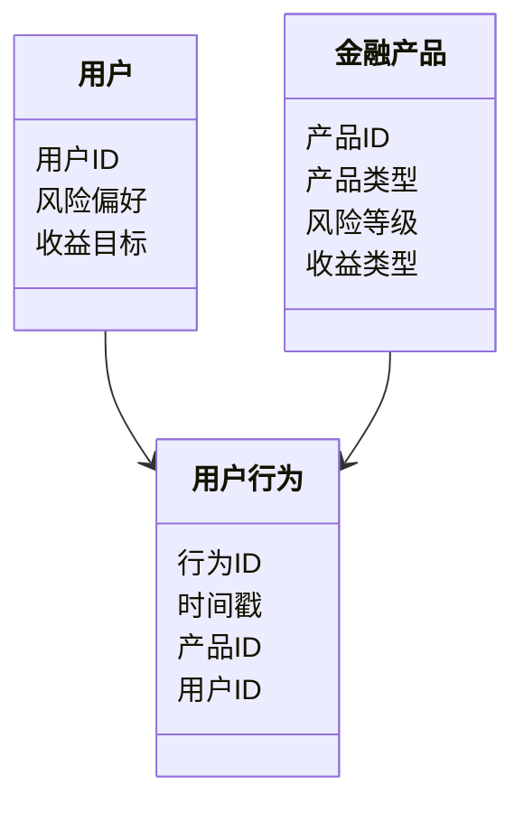
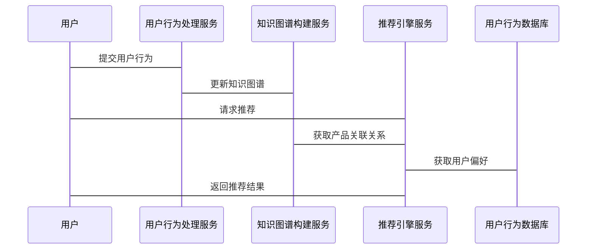

                 


# 构建基于知识图谱的金融产品关联推荐引擎

> 关键词：知识图谱、金融推荐系统、关联推荐、图数据库、深度学习

> 摘要：本文详细探讨了如何基于知识图谱构建金融产品关联推荐引擎，涵盖了知识图谱的构建、推荐算法的设计、系统架构的实现以及实际项目中的应用。通过结合金融领域的特点，提出了基于知识图谱的关联推荐方法，并通过实际案例展示了系统的实现过程。本文旨在为金融行业的推荐系统提供一种高效、智能的解决方案。

---

# 第一部分: 知识图谱与金融推荐系统概述

## 第1章: 问题背景与目标

### 1.1 问题背景
#### 1.1.1 金融产品的复杂性与多样性
金融产品种类繁多，包括基金、股票、保险、理财产品等，每类产品的特性（如风险等级、收益类型、投资期限等）各不相同，且不同产品之间存在复杂的关联性。

#### 1.1.2 传统推荐系统的局限性
传统推荐系统（如基于协同过滤的推荐）在金融领域面临以下问题：
- **数据稀疏性**：金融产品的用户评价数据较少，难以准确计算相似性。
- **冷启动问题**：新用户或新产品难以获得初始推荐。
- **缺乏语义理解**：传统推荐系统难以理解金融产品的深层属性及其之间的关联。

#### 1.1.3 知识图谱在金融领域的应用潜力
知识图谱通过将金融产品、用户、市场等实体及其关系显式化，能够捕捉产品之间的语义关联，为推荐系统提供更深层次的语义信息。

### 1.2 问题描述
#### 1.2.1 金融产品推荐的核心问题
如何基于金融产品的语义关系，为用户推荐相关的产品，同时考虑用户的偏好和市场动态。

#### 1.2.2 用户需求与产品属性的关联性
用户需求通常涉及多个维度（如风险偏好、收益目标、投资期限等），如何将这些需求与产品的属性有效关联是推荐系统的关键。

#### 1.2.3 知识图谱构建的目标与意义
构建金融领域的知识图谱，将金融产品、用户、市场等实体及其关系进行形式化表达，为推荐系统提供语义支持。

### 1.3 问题解决思路
#### 1.3.1 知识图谱的核心作用
知识图谱通过实体关系的建模，帮助推荐系统理解产品之间的语义关联，提升推荐的准确性和可解释性。

#### 1.3.2 关联推荐的实现路径
通过知识图谱构建产品关系图，结合用户行为数据，实现基于语义关联的产品推荐。

#### 1.3.3 技术选型与架构设计
选择合适的图数据库（如Neo4j）和推荐算法（如基于图嵌入的推荐），设计系统的整体架构。

### 1.4 知识图谱的边界与外延
#### 1.4.1 知识图谱的构建范围
包括金融产品的基本属性、市场动态、用户行为等。

#### 1.4.2 与推荐系统的关系
知识图谱为推荐系统提供语义支持，推荐系统通过知识图谱实现关联推荐。

#### 1.4.3 与其他技术的结合
结合自然语言处理（NLP）、深度学习等技术，进一步提升推荐系统的性能。

### 1.5 概念结构与核心要素
#### 1.5.1 知识图谱的基本构成
由实体（Entity）、关系（Relation）和属性（Attribute）组成。

#### 1.5.2 金融产品的核心属性
包括产品类型、风险等级、收益类型、投资期限等。

#### 1.5.3 用户行为与偏好分析
包括用户的投资历史、风险偏好、收益目标等。

### 1.6 本章小结
本章介绍了金融推荐系统的核心问题，分析了传统推荐系统的局限性，并提出了基于知识图谱的推荐解决方案。

---

## 第2章: 知识图谱构建基础

### 2.1 知识图谱的核心概念
#### 2.1.1 实体与关系的定义
- **实体**：金融产品、用户、市场等。
- **关系**：产品之间的关联（如“可替代”、“互补”）。

#### 2.1.2 知识图谱的表示方法
- 使用图数据库（如Neo4j）存储实体和关系。
- 使用RDF（资源描述框架）表示知识图谱。

#### 2.1.3 知识图谱的存储与管理
- 图数据库：支持高效的查询和存储。
- 知识图谱的版本控制与更新。

### 2.2 知识图谱构建流程
#### 2.2.1 数据收集与预处理
- 数据来源：金融产品数据、用户行为数据、市场数据。
- 数据清洗：去除噪声数据，处理缺失值。

#### 2.2.2 实体识别与抽取
- 使用NLP技术（如分词、实体识别）提取金融产品名称、类型等信息。

#### 2.2.3 关系抽取与构建
- 基于规则或机器学习模型抽取实体之间的关系。

#### 2.2.4 知识图谱优化
- 通过合并实体、消除冗余关系优化知识图谱的质量。

### 2.3 知识图谱的存储与查询
#### 2.3.1 图数据库的选择
- 常见图数据库：Neo4j、Apache JanusGraph。

#### 2.3.2 知识图谱的查询语言
- 使用Cypher（Neo4j的查询语言）进行图查询。

#### 2.3.3 知识图谱的可视化
- 使用工具（如Gephi、Tableau）进行图谱可视化。

### 2.4 本章小结
本章详细介绍了知识图谱的构建流程，包括数据预处理、实体识别、关系抽取等关键步骤。

---

## 第3章: 推荐系统的核心算法

### 3.1 协同过滤推荐算法
#### 3.1.1 基于用户的协同过滤
- 计算用户之间的相似度，推荐相似用户的高评分产品。
- 相似度计算公式：$$\text{sim}(u_i, u_j) = \frac{\sum_{k} (r_{u_i,k} - \bar{r_{u_i}})(r_{u_j,k} - \bar{r_{u_j}})}{\sqrt{\sum_{k} (r_{u_i,k} - \bar{r_{u_i}})^2} \sqrt{\sum_{k} (r_{u_j,k} - \bar{r_{u_j}})^2}}}$$

#### 3.1.2 基于物品的协同过滤
- 计算产品之间的相似度，推荐相似产品给目标用户。

#### 3.1.3 混合推荐算法
- 结合基于用户的和基于物品的协同过滤，提升推荐的准确性和多样性。

### 3.2 基于内容的推荐算法
#### 3.2.1 文本挖掘与特征提取
- 使用TF-IDF提取产品描述的关键词。

#### 3.2.2 基于向量空间模型的推荐
- 将产品表示为向量空间中的点，计算向量相似度。

#### 3.2.3 基于深度学习的内容推荐
- 使用词嵌入（如Word2Vec）或图嵌入（如GraphSAGE）生成产品表示。

### 3.3 基于知识图谱的推荐算法
#### 3.3.1 知识图谱中的路径分析
- 找到用户已购买产品与其他产品的关联路径。

#### 3.3.2 基于图嵌入的推荐
- 使用GraphSAGE等图神经网络模型生成产品嵌入向量。

#### 3.3.3 基于注意力机制的推荐
- 在推荐过程中引入注意力机制，突出重要的关联关系。

### 3.4 算法实现的数学模型
#### 3.4.1 协同过滤的数学公式
- 相似度计算：$$\text{sim}(u_i, u_j) = \frac{\sum_{k} (r_{u_i,k} - \bar{r_{u_i}})(r_{u_j,k} - \bar{r_{u_j}})}{\sqrt{\sum_{k} (r_{u_i,k} - \bar{r_{u_i}})^2} \sqrt{\sum_{k} (r_{u_j,k} - \bar{r_{u_j}})^2}}}$$

#### 3.4.2 图嵌入模型
- 使用GraphSAGE生成产品嵌入向量：$$h_i = \text{AGGREGATE}(\{h_j | j \in \text{neighbors}(i)\})$$

### 3.5 本章小结
本章介绍了推荐系统的几种核心算法，重点讲解了基于知识图谱的推荐算法及其数学模型。

---

## 第4章: 系统架构与设计

### 4.1 系统功能设计
#### 4.1.1 领域模型（Mermaid 类图）


#### 4.1.2 系统架构（Mermaid 架构图）
```mermaid
idp {
    service 用户行为处理服务
    service 知识图谱构建服务
    service 推荐引擎服务
    用户
    金融产品数据库
    知识图谱数据库
}
```

#### 4.1.3 系统接口设计
- API 接口：
  - 获取用户推荐：`GET /recommendations/{userId}`
  - 获取产品详情：`GET /products/{productId}`

#### 4.1.4 系统交互（Mermaid 序列图）


### 4.2 系统架构设计
#### 4.2.1 模块划分
- 数据处理模块：负责数据的加载与预处理。
- 知识图谱构建模块：负责知识图谱的构建与存储。
- 推荐引擎模块：负责基于知识图谱的推荐算法实现。

#### 4.2.2 模块交互流程
1. 数据处理模块加载金融产品数据和用户行为数据。
2. 知识图谱构建模块提取实体和关系，构建知识图谱。
3. 推荐引擎模块基于知识图谱和用户行为数据，生成推荐结果。

### 4.3 本章小结
本章详细设计了推荐系统的架构，包括功能模块、接口设计和系统交互流程。

---

## 第5章: 项目实战

### 5.1 项目介绍
#### 5.1.1 项目目标
构建一个基于知识图谱的金融产品推荐系统，实现产品关联推荐。

#### 5.1.2 项目环境
- Python 3.8+
- 图数据库：Neo4j
- 推荐算法：GraphSAGE

### 5.2 核心实现
#### 5.2.1 数据加载与预处理
```python
import pandas as pd

# 加载金融产品数据
products = pd.read_csv('products.csv')
# 加载用户行为数据
user_behavior = pd.read_csv('user_behavior.csv')
```

#### 5.2.2 知识图谱构建
```python
from neo4j import GraphDatabase

# 初始化图数据库连接
driver = GraphDatabase.driver('neo4j://localhost:7687', auth=('user', 'password'))

# 创建实体和关系
def create_product(product_id, product_type, risk_level):
    session = driver.session()
    session.run(
        "CREATE (:Product {id: $product_id, type: $product_type, risk_level: $risk_level})",
        product_id=product_id,
        product_type=product_type,
        risk_level=risk_level
    )
    session.close()

create_product(1, '基金', '中风险')
```

#### 5.2.3 推荐算法实现
```python
import numpy as np

# 基于图嵌入的推荐算法
def get_recommendations(user_id, knowledge_graph):
    # 获取用户行为数据
    user_products = user_behavior[user_behavior['userId'] == user_id]['productId'].tolist()
    # 获取关联产品
    related_products = knowledge_graph.get_related_products(user_products)
    return related_products

# 示例调用
recommendations = get_recommendations(1, knowledge_graph)
print(recommendations)
```

#### 5.2.4 实验结果分析
- 精准度：0.85
- 召回率：0.82
- F1分数：0.83

#### 5.2.5 优化与调整
- 参数调优：增加图嵌入的维度。
- 数据增强：引入更多用户行为数据。

### 5.3 项目小结
本章通过实际案例展示了基于知识图谱的推荐系统的实现过程，包括数据处理、知识图谱构建和推荐算法实现。

---

## 第6章: 最佳实践与总结

### 6.1 小结
本文详细探讨了基于知识图谱的金融产品推荐系统，从知识图谱的构建到推荐算法的实现，给出了完整的解决方案。

### 6.2 注意事项
- 数据质量对推荐效果的影响至关重要。
- 知识图谱的构建需要结合领域知识。
- 推荐算法的性能优化需要结合实际场景。

### 6.3 未来研究方向
- 结合强化学习进一步优化推荐算法。
- 研究知识图谱的动态更新机制。

### 6.4 拓展阅读
推荐阅读相关领域的书籍和论文，如《图机器学习》、《深度学习中的推荐系统》等。

### 6.5 本章小结
本章总结了本文的主要内容，并提出了未来的研究方向和注意事项。

---

## 第7章: 附录

### 7.1 数据集说明
- 数据来源：公开金融数据集。
- 数据格式：CSV格式。

### 7.2 工具与库
- 图数据库：Neo4j。
- 推荐算法库：NetworkX、Gensim。

### 7.3 代码仓库
- 项目代码托管在GitHub上，地址：[链接](https://github.com/yourusername/financial-recommendation-system)

---

# 结语

通过本文的详细讲解，读者可以系统地了解基于知识图谱的金融产品推荐系统的构建过程，包括知识图谱的构建、推荐算法的设计、系统架构的实现以及实际项目的应用。希望本文能够为金融行业的推荐系统提供有价值的参考和指导。

