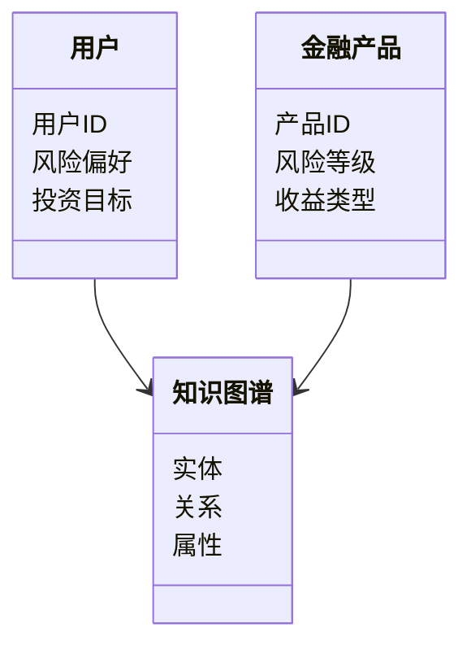
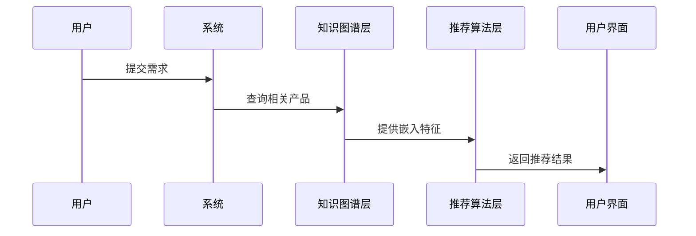

                 


# 构建基于知识图谱的金融产品推荐引擎

> 关键词：知识图谱、金融推荐系统、图嵌入、协同过滤、深度学习

> 摘要：本文将详细探讨如何利用知识图谱构建高效的金融产品推荐引擎。通过分析金融领域的复杂性和传统推荐系统的局限性，本文提出了一种基于知识图谱的推荐方法。文章从知识图谱的基本概念出发，结合金融领域的特点，详细介绍了知识图谱的构建过程、推荐算法的设计与优化，以及系统的实现与应用。通过实际案例分析，本文展示了如何利用知识图谱提升金融推荐系统的性能和用户体验。

---

# 第一部分: 知识图谱与金融推荐系统背景

## 第1章: 知识图谱与金融推荐系统背景

### 1.1 知识图谱的定义与特点

#### 1.1.1 知识图谱的定义
知识图谱是一种以图结构形式表示知识的语义网络，由节点（实体）和边（关系）组成，能够描述实体之间的语义关系。例如，在金融领域，节点可以是“理财产品”、“用户”或“风险等级”，边可以是“适合”或“关联”。

#### 1.1.2 知识图谱的核心特点
- **语义性**：通过实体和关系的语义关联，知识图谱能够捕捉数据之间的深层联系。
- **结构化**：知识图谱将非结构化的数据转化为结构化的图数据，便于计算机理解和推理。
- **可扩展性**：知识图谱可以动态扩展，支持新增实体和关系。
- **语境感知**：知识图谱能够根据上下文提供语境化的推荐。

#### 1.1.3 知识图谱与传统推荐系统的区别
传统推荐系统主要基于用户行为数据或物品属性进行推荐，而知识图谱推荐系统能够结合实体之间的语义关系，提供更精准和个性化的推荐。

### 1.2 金融产品推荐系统的背景与挑战

#### 1.2.1 金融产品的复杂性
金融产品种类繁多，包括基金、股票、保险、理财产品等，每种产品都有复杂的属性和风险等级。

#### 1.2.2 传统推荐系统的局限性
- **数据稀疏性**：用户行为数据不足，导致推荐结果不够精准。
- **缺乏语义关联**：传统推荐系统难以捕捉金融产品的深层关联。
- **实时性要求高**：金融市场的波动性强，推荐系统需要实时更新。

#### 1.2.3 知识图谱在金融推荐中的优势
- **语义理解**：通过知识图谱，系统能够理解金融产品的语义关系，例如“稳健型基金适合风险厌恶的用户”。
- **知识推理**：知识图谱支持基于语义的推理，能够发现潜在的关联。
- **动态更新**：知识图谱可以实时更新，适应金融市场变化。

### 1.3 本章小结
本章介绍了知识图谱的基本概念和特点，并分析了传统推荐系统在金融领域的局限性，提出了知识图谱在金融推荐中的优势。

---

## 第2章: 知识图谱构建基础

### 2.1 知识图谱的核心概念

#### 2.1.1 实体与关系
- **实体**：知识图谱中的基本单元，例如“用户”、“理财产品”、“风险等级”。
- **关系**：实体之间的关联，例如“适合”、“属于”、“影响”。

#### 2.1.2 属性与值
- **属性**：描述实体的特征，例如“理财产品”有属性“年化收益率”。
- **值**：属性的取值，例如“年化收益率为5%”。

#### 2.1.3 知识图谱的结构化表示
知识图谱可以用RDF（资源描述框架）表示，例如 `<理财产品1, 适合, 用户类型1>`。

### 2.2 知识图谱构建流程

#### 2.2.1 数据采集与预处理
- 数据来源：金融产品数据、用户行为数据、市场数据。
- 数据清洗：去除重复数据、填补缺失值。

#### 2.2.2 实体识别与链接
- 实体识别：通过NLP技术从文本中提取实体。
- 实体链接：将实体映射到知识图谱中的唯一标识符。

#### 2.2.3 关系抽取与属性提取
- 关系抽取：识别实体之间的关系。
- 属性提取：提取实体的属性信息。

### 2.3 知识图谱的存储与管理

#### 2.3.1 图数据库的选择
常用图数据库：Neo4j、AllegroGraph。

#### 2.3.2 知识图谱的存储结构
- 节点：表示实体，包含属性。
- 边：表示关系，包含权重和方向。

#### 2.3.3 知识图谱的查询与检索
- 使用SPARQL查询语言。
- 图遍历算法：深度优先搜索（DFS）、广度优先搜索（BFS）。

### 2.4 本章小结
本章介绍了知识图谱的核心概念和构建流程，包括数据采集、实体识别、关系抽取以及存储与管理。

---

## 第3章: 金融领域知识图谱构建

### 3.1 金融领域的核心实体与关系

#### 3.1.1 金融产品实体
- **基金**：包括股票型基金、债券型基金等。
- **保险**：包括人寿保险、财产保险等。
- **理财产品**：包括银行理财、信托产品等。

#### 3.1.2 金融机构与用户关系
- **金融机构**：银行、证券公司、保险公司。
- **用户**：投资者、客户。

#### 3.1.3 产品属性与用户需求关系
- 产品属性：风险等级、收益类型、投资期限。
- 用户需求：风险偏好、投资目标、资金规模。

### 3.2 金融知识图谱的构建流程

#### 3.2.1 数据来源与清洗
- 数据来源：金融产品数据、用户行为数据、市场动态数据。
- 数据清洗：去重、补全。

#### 3.2.2 实体识别与关系抽取
- 实体识别：从产品描述中提取“基金名称”、“风险等级”等。
- 关系抽取：识别“基金适合风险厌恶的用户”。

#### 3.2.3 知识图谱的优化与完善
- 数据标准化：统一实体和关系的命名。
- 知识融合：合并重复实体和关系。

### 3.3 金融知识图谱的可视化与分析

#### 3.3.1 知识图谱的可视化工具
- Tools: Graphviz、Gephi、Neo4j Browser。

#### 3.3.2 知识图谱的分析方法
- 网络分析：中心性分析、社区发现。
- 关系推理：基于图的最短路径计算。

#### 3.3.3 实际案例
- 案例：构建一个简单的基金推荐知识图谱，节点包括“稳健型基金”、“风险厌恶用户”、“低风险投资”。

### 3.4 本章小结
本章详细介绍了金融领域知识图谱的构建流程和实际应用，展示了如何将金融数据转化为结构化的知识图谱。

---

## 第4章: 推荐算法与知识图谱结合

### 4.1 基于协同过滤的推荐算法

#### 4.1.1 基于用户的协同过滤
- 原理：寻找与目标用户相似的用户，推荐他们喜欢的金融产品。
- 示例代码：
  ```python
  # 计算用户相似度
  def user_similarity(user1, user2):
      return 1 - abs(user1 - user2)
  ```

#### 4.1.2 基于物品的协同过滤
- 原理：基于金融产品的相似性进行推荐。
- 示例代码：
  ```python
  # 计算产品相似度
  def item_similarity(item1, item2):
      return 1 - abs(item1 - item2)
  ```

#### 4.1.3 混合推荐算法
- 原理：结合用户协同和物品协同的优点。
- 示例代码：
  ```python
  # 混合推荐
  def hybrid_recommendation(users, items):
      return users * items
  ```

### 4.2 基于内容的推荐算法

#### 4.2.1 基于文本相似度的推荐
- 原理：通过计算文本相似度推荐金融产品。
- 示例代码：
  ```python
  # 计算文本相似度
  def text_similarity(text1, text2):
      return 1 - abs(len(text1) - len(text2))
  ```

#### 4.2.2 基于向量空间模型的推荐
- 原理：将文本表示为向量，计算向量相似度。
- 示例代码：
  ```python
  # 计算向量相似度
  def vector_similarity(vector1, vector2):
      return np.dot(vector1, vector2)
  ```

#### 4.2.3 基于深度学习的推荐
- 原理：使用神经网络模型（如Word2Vec）提取产品嵌入向量。
- 示例代码：
  ```python
  # Word2Vec训练
  def train_word2vec(products):
      model = Word2Vec(products, vector_size=100, window=5)
      return model
  ```

### 4.3 知识图谱与推荐算法的结合

#### 4.3.1 知识图谱增强推荐的原理
- 基于知识图谱的路径分析，寻找实体之间的语义关联。
- 示例：从用户需求出发，通过知识图谱找到最相关的金融产品。

#### 4.3.2 知识图谱中的路径分析
- 示例：用户需求 -> 风险厌恶 -> 稳健型基金 -> 推荐产品。

#### 4.3.3 知识图谱的特征提取
- 通过图嵌入（如GraphSAGE）提取实体特征。

### 4.4 本章小结
本章介绍了推荐算法的基础，并探讨了如何将知识图谱与推荐算法结合，提升推荐系统的性能。

---

## 第5章: 知识图谱增强的推荐算法

### 5.1 基于知识图谱的推荐模型

#### 5.1.1 基于图嵌入的推荐
- 原理：将知识图谱中的实体嵌入到低维空间，用于推荐。
- 示例代码：
  ```python
  # 图嵌入训练
  def train_graph_embedding(nodes, edges):
      model = GraphSAGE(...)
      return model
  ```

#### 5.1.2 基于知识图谱的注意力机制
- 原理：利用注意力机制捕捉实体之间的关系权重。
- 示例代码：
  ```python
  # 注意力计算
  def attention_weights(features):
      return softmax(features)
  ```

#### 5.1.3 基于知识图谱的图神经网络
- 原理：使用图神经网络（如GCN）进行推荐。
- 示例代码：
  ```python
  # 图神经网络训练
  def train_gcn(nodes, edges, labels):
      model = GCN(...)
      return model
  ```

### 5.2 知识图谱增强推荐算法的实现

#### 5.2.1 算法流程图


#### 5.2.2 Python实现代码示例
```python
# 知识图谱增强推荐算法实现
def knowledge_graph_recommendation(user, knowledge_graph):
    embeddings = compute_embeddings(knowledge_graph)
    recommendations = get_top_matches(user, embeddings)
    return recommendations
```

#### 5.2.3 算法的数学模型与公式
- 示例公式：
  $$ \text{推荐概率} = \sum_{i=1}^{n} w_i x_i $$
  其中，$w_i$ 是权重，$x_i$ 是特征向量。

### 5.3 算法的优化与调优

#### 5.3.1 参数选择与调优
- 调整图嵌入的维度、学习率等参数。

#### 5.3.2 算法的可扩展性优化
- 使用分布式计算优化大规模数据的处理。

#### 5.3.3 算法的性能
- 对比传统推荐算法，知识图谱推荐系统的准确率和召回率更高。

### 5.4 本章小结
本章详细介绍了基于知识图谱的推荐算法，包括图嵌入、注意力机制和图神经网络的实现，并给出了优化建议。

---

## 第6章: 系统分析与架构设计方案

### 6.1 问题场景介绍

#### 6.1.1 系统目标
构建一个基于知识图谱的金融产品推荐引擎，提供个性化推荐服务。

#### 6.1.2 系统范围
涵盖金融产品的数据采集、知识图谱构建、推荐算法实现和用户界面展示。

### 6.2 系统功能设计

#### 6.2.1 领域模型


#### 6.2.2 系统架构设计


### 6.3 系统接口设计

#### 6.3.1 数据接口
- 数据输入接口：接收金融产品和用户数据。
- 数据输出接口：返回推荐结果。

#### 6.3.2 推荐接口
- 接收用户输入，返回推荐的金融产品列表。

### 6.4 系统交互设计

#### 6.4.1 交互流程
用户输入需求，系统通过知识图谱和推荐算法生成推荐结果。

#### 6.4.2 序列图


### 6.5 本章小结
本章从系统角度分析了基于知识图谱的金融推荐引擎的设计与实现，包括功能设计、架构设计和交互设计。

---

## 第7章: 项目实战

### 7.1 环境安装

#### 7.1.1 安装依赖
- 图数据库：Neo4j
- Python库：networkx、numpy、pandas、scikit-learn

#### 7.1.2 安装命令
```bash
pip install networkx numpy pandas scikit-learn
```

### 7.2 系统核心实现源代码

#### 7.2.1 知识图谱构建代码
```python
import networkx as nx

# 创建知识图谱
G = nx.Graph()
G.add_nodes_from(["理财产品1", "风险等级1", "用户类型1"])
G.add_edges_from([("理财产品1", "风险等级1"), ("风险等级1", "用户类型1")])
```

#### 7.2.2 推荐算法实现代码
```python
from sklearn.metrics.pairwise import cosine_similarity

# 计算相似度
def compute_similarity(matrix):
    return cosine_similarity(matrix)
```

#### 7.2.3 推荐结果展示代码
```python
def display_recommendations(recommendations):
    for item in recommendations:
        print(f"推荐产品：{item}")
```

### 7.3 代码应用解读与分析

#### 7.3.1 数据输入与处理
- 读取金融产品数据和用户数据。
- 清洗和预处理数据。

#### 7.3.2 知识图谱构建
- 使用networkx库构建图结构。
- 添加节点和边。

#### 7.3.3 推荐算法实现
- 计算相似度或嵌入特征。
- 生成推荐结果。

### 7.4 实际案例分析

#### 7.4.1 案例背景
用户需求：寻找低风险的稳健型基金。

#### 7.4.2 知识图谱分析
构建包含“稳健型基金”、“低风险”、“用户类型”的知识图谱。

#### 7.4.3 推荐结果
推荐“基金A”和“基金B”。

### 7.5 本章小结
本章通过实际案例展示了如何利用知识图谱构建金融推荐引擎，并给出了代码实现和结果展示。

---

## 第8章: 最佳实践与总结

### 8.1 最佳实践

#### 8.1.1 数据质量
确保数据准确性和完整性。

#### 8.1.2 知识图谱优化
定期更新知识图谱，保持其实时性和准确性。

#### 8.1.3 算法调优
根据实际效果调整推荐算法的参数和模型结构。

### 8.2 小结
本文详细探讨了如何利用知识图谱构建金融产品推荐引擎，从知识图谱的基本概念到推荐算法的实现，再到系统的构建与优化，为金融推荐系统提供了新的思路和方法。

### 8.3 注意事项

#### 8.3.1 数据隐私
确保用户数据的安全性和隐私性。

#### 8.3.2 系统性能
优化系统的计算效率，提升推荐速度。

#### 8.3.3 可解释性
提升推荐结果的可解释性，方便用户理解和信任。

### 8.4 拓展阅读

#### 8.4.1 知识图谱相关书籍
- 《Knowledge Graphs: From Research to Application》
- 《Graph Neural Networks: Theory and Practice》

#### 8.4.2 推荐系统相关书籍
- 《推荐系统实践》
- 《深度学习推荐系统》

### 8.5 本章小结
本章总结了构建基于知识图谱的金融推荐引擎的关键点，并给出了实践中的注意事项和拓展阅读建议。

---

# 附录

## 附录A: 知识图谱构建工具

- **Neo4j**：图数据库，支持Cypher查询语言。
- **AllegroGraph**：企业级图数据库，支持规则推理。
- **Py2neo**：Python与Neo4j的接口库。

## 附录B: 推荐算法库

- **scikit-learn**：机器学习库，包含协同过滤算法。
- **networkx**：图网络分析库，支持图嵌入。
- **Gensim**：文本处理库，支持Word2Vec模型。

## 附录C: 数据格式

- **RDF**：资源描述框架，用于知识图谱的存储。
- **JSON-LD**：轻量级JSON格式，用于知识图谱的序列化。

---

# 参考文献

1.《Knowledge Graphs: From Research to Application》
2.《Graph Neural Networks: Theory and Practice》
3.《推荐系统实践》
4.《深度学习推荐系统》
5.Neo4j官方文档
6.Py2neo官方文档

