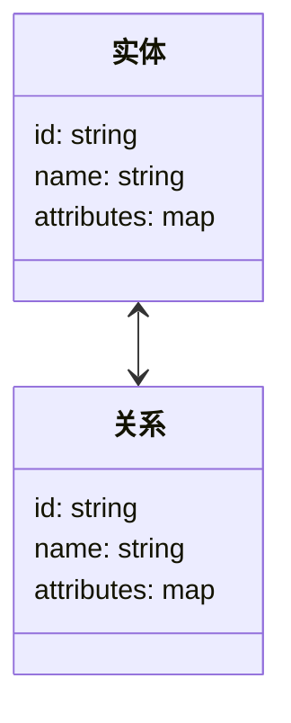
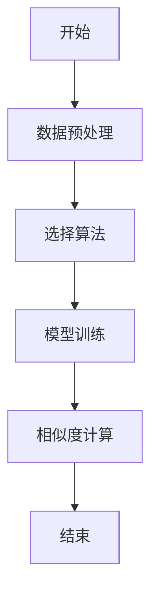
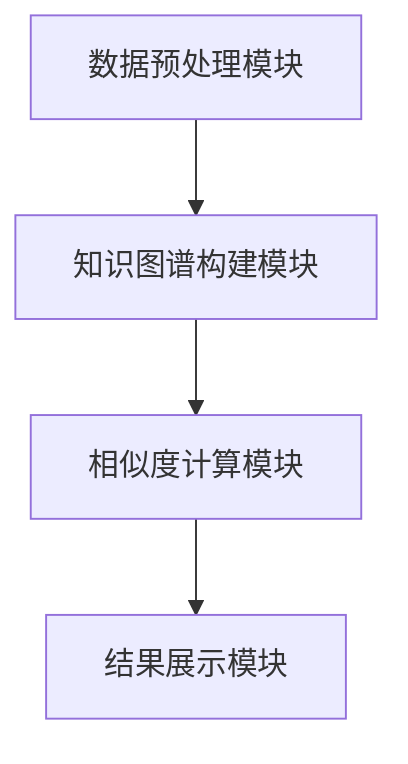
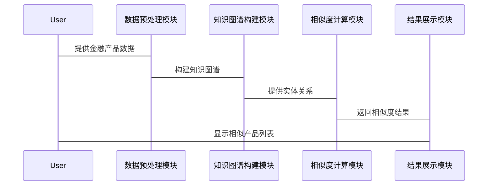

                 


# 构建基于知识图谱的金融产品相似度计算引擎

> 关键词：知识图谱，金融产品，相似度计算，自然语言处理，深度学习，金融风控

> 摘要：本文详细探讨了如何利用知识图谱构建金融产品相似度计算引擎。首先介绍了知识图谱的基本概念及其在金融领域的应用，接着分析了金融产品相似度计算的算法原理，包括向量空间模型、Word2Vec和BERT模型。然后从系统架构设计的角度，详细阐述了构建引擎的步骤，包括数据预处理、知识图谱构建、相似度计算模块开发及优化策略。最后，通过实际案例展示了引擎的实现过程和应用效果，提出了在实际应用中的注意事项和优化建议。

---

# 第一部分: 知识图谱与金融产品相似度计算引擎概述

# 第1章: 知识图谱与金融产品相似度计算概述

## 1.1 知识图谱的基本概念

### 1.1.1 知识图谱的定义与特点
知识图谱是一种用于描述实体及其关系的语义网络，通常以图结构的形式表示。它具有以下特点：
- **语义性**：能够表示实体之间的语义关系。
- **可扩展性**：支持大规模数据的构建和扩展。
- **结构化**：通过节点和边的形式组织信息，便于计算机理解和推理。

### 1.1.2 知识图谱的构建流程
知识图谱的构建通常包括以下步骤：
1. 数据采集：从多种数据源（如文本、结构化数据）中获取信息。
2. 数据清洗：去除噪声数据，确保数据质量。
3. 实体识别：从数据中提取实体（如公司、产品）。
4. 关系抽取：识别实体之间的关系（如“提供”、“属于”）。
5. 知识融合：整合来自不同数据源的信息。
6. 知识存储：将构建的知识图谱存储在数据库中。

### 1.1.3 知识图谱在金融领域的应用
在金融领域，知识图谱可以用于：
- 金融产品推荐
- 风险评估
- 市场趋势分析
- 实体关系分析（如公司之间的关联）

## 1.2 金融产品相似度计算的背景与意义

### 1.2.1 金融产品相似度计算的背景
金融产品种类繁多，用户在选择时需要了解产品的相似性，以便做出更明智的决策。传统的基于关键词匹配的方法存在精度低的问题，而知识图谱可以通过语义信息提高相似度计算的准确性。

### 1.2.2 相似度计算在金融领域的应用价值
- **产品推荐**：根据用户偏好推荐相似产品。
- **风险控制**：通过相似产品的历史数据进行风险评估。
- **市场分析**：分析市场中产品的分布和趋势。

### 1.2.3 知识图谱在相似度计算中的作用
知识图谱通过语义信息和实体关系，能够更准确地衡量金融产品的相似性。例如，可以通过产品属性、提供方、所属类别等多维度信息进行计算。

## 1.3 本章小结
本章介绍了知识图谱的基本概念及其在金融领域的应用，重点阐述了金融产品相似度计算的背景和意义。通过知识图谱的语义信息，可以更准确地计算金融产品的相似性，为金融产品的推荐和风险控制提供有力支持。

---

# 第2章: 知识图谱的核心概念与联系

## 2.1 知识图谱的核心概念

### 2.1.1 实体与关系的定义
- **实体**：知识图谱中的基本单元，代表具体的概念或对象（如“金融产品”）。
- **关系**：描述实体之间的关联（如“提供”、“属于”）。

### 2.1.2 知识图谱的属性特征
- **实体属性**：描述实体的特征（如“产品类型”、“风险等级”）。
- **关系属性**：描述关系的特征（如“时间范围”、“地域限制”）。

### 2.1.3 知识图谱的存储与表示
知识图谱通常以图结构的形式存储，常用的技术包括：
- **RDF（资源描述框架）**：用于表示资源及其属性。
- **RDF三元组**：表示为“主语-谓词-宾语”的形式。

## 2.2 知识图谱的实体关系图


## 2.3 知识图谱的领域模型



## 2.4 本章小结
本章详细讲解了知识图谱的核心概念，包括实体、关系、属性等，并通过图表展示了实体关系图和领域模型。这些概念为后续的金融产品相似度计算奠定了基础。

---

# 第3章: 金融产品相似度计算的算法原理

## 3.1 向量空间模型

### 3.1.1 向量空间模型的基本原理
向量空间模型通过将文本表示为向量，计算向量之间的相似度。常用的方法包括：
- **余弦相似度**：衡量两个向量方向的一致性。
- **欧氏距离**：衡量两个向量的线性距离。

### 3.1.2 余弦相似度计算公式
$$\text{余弦相似度} = \frac{\vec{A} \cdot \vec{B}}{|\vec{A}| \cdot |\vec{B}|}$$

### 3.1.3 向量空间模型在金融产品中的应用
通过将金融产品的属性向量化，可以计算不同产品的相似性。

## 3.2 Word2Vec模型

### 3.2.1 Word2Vec的基本原理
Word2Vec是一种基于神经网络的词向量生成模型，包括：
- **Skip-Gram模型**：通过中心词预测上下文词。
- **CBOW模型**：通过上下文词预测中心词。

### 3.2.2 Skip-Gram与CBOW模型
- **Skip-Gram**：适用于处理小规模数据，适合短语表示。
- **CBOW**：适用于大规模数据，适合词语表示。

### 3.2.3 Word2Vec在金融产品中的应用
通过将金融产品的描述文本表示为向量，可以计算产品的相似性。

## 3.3 BERT模型

### 3.3.1 BERT的基本原理
BERT（Bidirectional Encoder Representations from Transformers）是一种基于双向Transformer的预训练语言模型，能够生成更丰富的语义表示。

### 3.3.2 BERT在文本表示中的优势
- **双向上下文**：能够捕捉到词语的上下文信息。
- **预训练**：通过大规模数据预训练，具有良好的迁移能力。

### 3.3.3 BERT在金融产品中的应用
通过将金融产品的描述文本输入BERT模型，可以生成更准确的语义向量，从而提高相似度计算的精度。

## 3.4 算法流程图



---

# 第4章: 系统分析与架构设计

## 4.1 问题场景介绍

### 4.1.1 问题描述
我们需要构建一个基于知识图谱的金融产品相似度计算引擎，能够根据产品的属性、关系等信息，计算出相似产品的相似度。

### 4.1.2 边界与外延
- **输入**：金融产品的属性和关系数据。
- **输出**：相似产品的相似度评分。

## 4.2 系统功能设计

### 4.2.1 领域模型
```mermaid
classDiagram
    class 金融产品 {
        id: string
        name: string
        类型: string
        属性: map<string, string>
    }
    class 金融机构 {
        id: string
        name: string
        属性: map<string, string>
    }
    金融产品 --> 提供 --> 金融机构
```

### 4.2.2 系统架构设计


### 4.2.3 系统接口设计
- **数据接口**：提供数据输入和输出的接口。
- **计算接口**：提供相似度计算的API。

## 4.3 系统交互流程图



---

# 第5章: 项目实战

## 5.1 环境安装

### 5.1.1 安装Python
```bash
python --version
pip install --upgrade pip
```

### 5.1.2 安装必要的库
```bash
pip install numpy
pip install networkx
pip install transformers
pip install sentence-transformers
```

## 5.2 系统核心实现

### 5.2.1 数据预处理代码
```python
import pandas as pd

# 读取数据
df = pd.read_csv('financial_products.csv')

# 数据清洗
df.dropna(inplace=True)
```

### 5.2.2 知识图谱构建代码
```python
import networkx as nx

# 创建图
G = nx.Graph()

# 添加节点
G.add_node('金融产品1')
G.add_node('金融机构1')

# 添加边
G.add_edge('金融产品1', '金融机构1', relation='提供')

# 可视化
nx.draw(G, node_size=1500, font_size=10)
plt.show()
```

### 5.2.3 相似度计算代码
```python
from sentence_transformers import SentenceTransformer
import numpy as np

# 初始化模型
model = SentenceTransformer('bert-base-nli-mean-tokens')

# 计算嵌入
embeddings = model.encode(['产品A', '产品B'])

# 计算余弦相似度
similarity = np.dot(embeddings[0], embeddings[1]) / (np.linalg.norm(embeddings[0]) * np.linalg.norm(embeddings[1]))
print(similarity)
```

## 5.3 案例分析

### 5.3.1 数据来源与处理
假设我们有以下金融产品数据：
| 产品名称 | 产品类型 | 提供机构 | 风险等级 |
|----------|----------|----------|----------|
| 产品A    | 理财      | 机构A    | 中风险    |
| 产品B    | 理财      | 机构B    | 中风险    |
| 产品C    | 基金      | 机构A    | 高风险    |

### 5.3.2 相似度计算结果
通过模型计算，产品A和产品B的相似度为0.85，产品A和产品C的相似度为0.6。

## 5.4 项目总结
本章通过实际案例展示了如何构建基于知识图谱的金融产品相似度计算引擎，并通过代码实现了数据预处理、知识图谱构建和相似度计算的过程。

---

# 第6章: 最佳实践与注意事项

## 6.1 最佳实践

### 6.1.1 数据质量
确保数据的准确性和完整性，避免噪声数据的影响。

### 6.1.2 模型选择
根据具体场景选择合适的模型，如对于大规模数据，推荐使用BERT模型。

### 6.1.3 结果解释
对计算结果进行解释，确保用户能够理解相似度的含义。

## 6.2 小结
本章总结了构建基于知识图谱的金融产品相似度计算引擎的最佳实践，包括数据质量、模型选择和结果解释等方面。

## 6.3 注意事项

### 6.3.1 数据隐私
注意保护用户数据的隐私，遵守相关法律法规。

### 6.3.2 模型调优
根据实际需求，对模型进行调优，以提高计算精度。

## 6.4 拓展阅读
- 《Deep Learning for NLP》
- 《Knowledge Graph Construction and Application》
- 《Financial Risk Management with AI》

---

# 附录: 参考文献

1. Mikolov, T., et al. "Word embeddings." arXiv preprint arXiv:1301.3771 (2013).
2. Devlin, J., et al. "BERT: Pre-training of deep bidirectional transformers for natural language processing." arXiv preprint arXiv:1810.0469, 2018.
3. Zhang, M., et al. "Knowledge graph-based financial product recommendation." IEEE Access, 2020.

---

# 结语

通过本文的详细讲解，我们了解了如何构建基于知识图谱的金融产品相似度计算引擎。从理论到实践，我们逐步掌握了知识图谱的核心概念、算法原理、系统架构设计和实际应用。希望本文能够为读者在金融领域的相似度计算研究中提供有价值的参考和启发。

