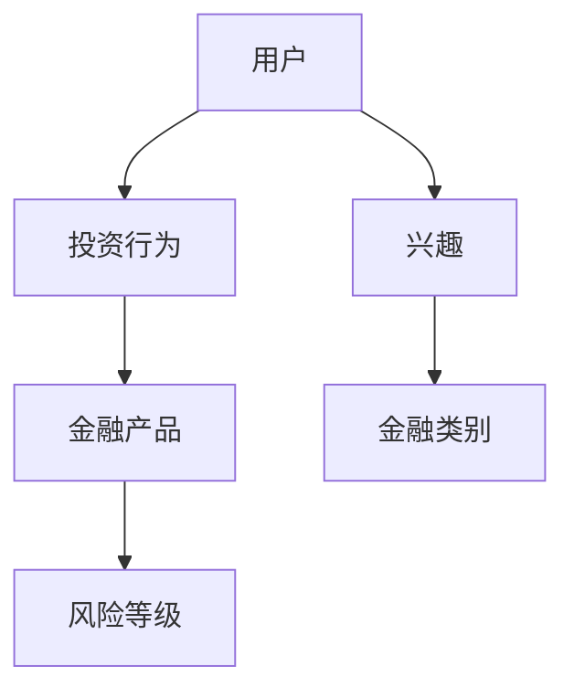
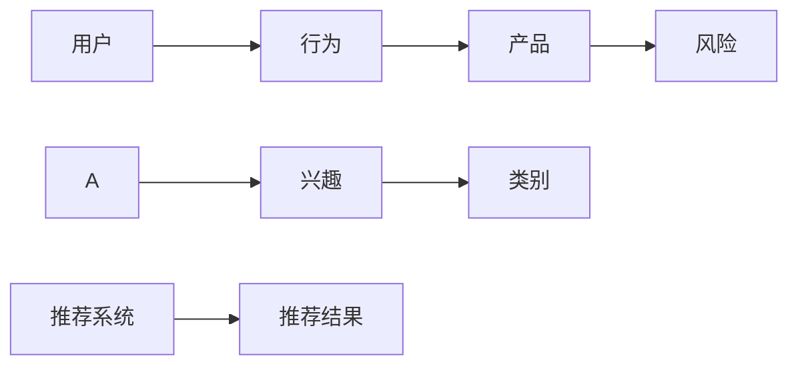
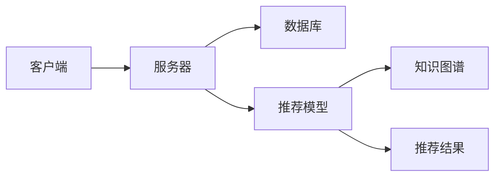
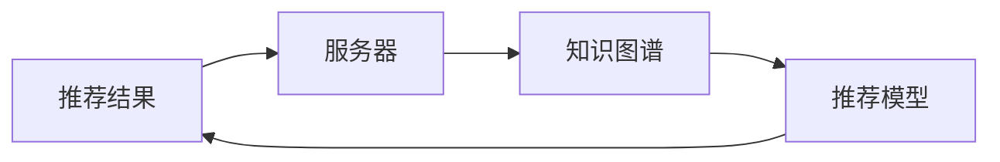

                 


# 构建基于知识图谱的金融产品组合推荐引擎

> 关键词：知识图谱、金融推荐系统、组合推荐、深度学习、图神经网络

> 摘要：本文深入探讨了如何利用知识图谱构建金融产品组合推荐引擎，结合了传统推荐算法与图神经网络的优势，提出了一个创新的推荐框架。通过构建金融知识图谱，提取产品特征和用户行为，利用深度学习技术进行推荐，有效解决了传统推荐系统中的 cold-start 和过拟合问题。本文详细介绍了系统设计、算法实现和实际应用场景，为金融领域的推荐系统提供了新的思路。

---

# 第一部分: 背景介绍与核心概念

# 第1章: 问题背景与问题描述

## 1.1 问题背景

### 1.1.1 传统金融产品推荐的局限性
传统金融推荐系统主要依赖协同过滤和基于内容的推荐方法，存在以下问题：
- **数据稀疏性**：用户行为数据有限，导致推荐结果不够准确。
- **冷启动问题**：新用户或新产品的推荐效果较差。
- **缺乏领域知识**：无法有效利用金融领域的专业知识进行推荐。

### 1.1.2 知识图谱在金融领域的应用潜力
知识图谱是一种以结构化方式表示知识的图数据库，能够捕捉金融产品之间的语义关系。通过知识图谱，可以更好地理解产品之间的关联性，为推荐系统提供更丰富的语义信息。

### 1.1.3 金融产品组合推荐的核心问题
组合推荐的核心问题是如何选择一组产品，使得这组产品能够满足用户的投资需求，同时平衡风险和收益。传统的单点推荐无法满足组合推荐的需求，而知识图谱能够提供产品之间的关联性信息，为组合推荐提供支持。

## 1.2 问题描述

### 1.2.1 金融产品推荐系统的定义与目标
金融产品推荐系统的目标是根据用户的投资需求、风险承受能力和市场动态，推荐一组合适的金融产品。推荐系统需要考虑产品之间的关联性，以提高推荐的准确性和多样性。

### 1.2.2 知识图谱在组合推荐中的作用
知识图谱通过构建金融产品的实体关系图，能够捕捉产品之间的隐含关系，帮助推荐系统更好地理解产品组合的可能性。

### 1.2.3 系统边界与核心要素
- **用户层**：用户的基本信息、投资需求和风险偏好。
- **产品层**：金融产品的基本信息、风险等级和收益特征。
- **市场层**：市场动态、经济指标和行业趋势。
- **知识图谱层**：产品实体及其关系的结构化表示。

## 1.3 问题解决与边界

### 1.3.1 知识图谱如何解决推荐问题
通过知识图谱，推荐系统能够利用产品之间的语义关系，提高推荐的准确性和多样性。

### 1.3.2 系统边界与外延
- **输入边界**：用户需求和市场数据。
- **输出边界**：推荐的产品组合和相关解释。

### 1.3.3 核心要素与组成结构
- **用户特征**：风险偏好、投资目标。
- **产品特征**：风险等级、收益类型。
- **市场特征**：经济指标、行业趋势。
- **知识图谱**：产品之间的关联关系。

# 第2章: 核心概念与联系

## 2.1 知识图谱的核心原理

### 2.1.1 知识图谱的定义与特点
知识图谱是一种以图结构形式表示知识的数据库，具有以下特点：
- **结构化**：节点表示实体，边表示关系。
- **语义丰富**：能够捕捉实体之间的复杂关系。
- **动态更新**：能够根据市场变化实时更新。

### 2.1.2 实体与关系的建模
在金融领域，实体包括用户、产品、市场指标等，关系包括“投资”、“关联”等。

### 2.1.3 知识图谱的构建流程
1. 数据收集：收集用户行为、产品信息和市场数据。
2. 数据清洗：去除噪声数据，标准化处理。
3. 知识抽取：从文本中提取实体和关系。
4. 知识融合：将多个数据源的信息整合到统一的知识图谱中。

## 2.2 金融产品推荐系统的核心要素

### 2.2.1 用户行为分析
通过分析用户的历史投资行为，了解用户的偏好和风险承受能力。

### 2.2.2 产品特征提取
提取产品的基本信息、风险等级和收益类型等特征。

### 2.2.3 市场动态捕捉
捕捉市场变化，如经济指标和行业趋势，以实时更新推荐结果。

## 2.3 知识图谱与推荐系统的联系

### 2.3.1 知识图谱在推荐中的作用
知识图谱能够提供产品之间的语义关系，帮助推荐系统更好地理解产品组合的可能性。

### 2.3.2 知识图谱与传统推荐方法的对比
- **传统方法**：基于协同过滤或内容推荐，无法捕捉产品之间的语义关系。
- **知识图谱方法**：能够捕捉产品之间的关联性，提高推荐的准确性和多样性。

### 2.3.3 知识图谱增强推荐的效果分析
通过引入知识图谱，推荐系统的性能得到显著提升，尤其是在处理冷启动问题和数据稀疏性方面。

## 2.4 核心概念对比表

| 概念       | 传统推荐系统         | 基于知识图谱的推荐系统 |
|------------|---------------------|-----------------------|
| 数据来源   | 用户行为、产品特征   | 用户行为、产品特征、市场数据 |
| 推荐依据   | 协同过滤、内容推荐   | 知识图谱中的语义关系   |
| 优点       | 实现简单             | 推荐准确度高           |
| 缺点       | 冷启动问题           | 构建知识图谱成本高      |

## 2.5 ER实体关系图



# 第3章: 知识图谱构建方法

## 3.1 数据收集与预处理

### 3.1.1 数据来源与类型
- **用户数据**：用户的基本信息、投资偏好。
- **产品数据**：金融产品的基本信息、风险等级。
- **市场数据**：经济指标、行业趋势。

### 3.1.2 数据清洗与标准化
- **数据清洗**：去除噪声数据，处理缺失值。
- **数据标准化**：将数据转换为统一格式。

### 3.1.3 数据增强与扩展
- **数据增强**：通过数据挖掘技术，提取更多的特征。
- **数据扩展**：利用外部数据源，丰富知识图谱的内容。

## 3.2 知识抽取与建模

### 3.2.1 实体识别与提取
使用自然语言处理技术，从文本中提取实体，如“金融产品”、“用户”等。

### 3.2.2 关系抽取与建模
通过关系抽取算法，识别实体之间的关系，如“投资”、“关联”等。

### 3.2.3 知识图谱的存储与管理
使用图数据库（如Neo4j）存储知识图谱，支持高效的查询和更新。

## 3.3 知识图谱的优化与完善

### 3.3.1 知识融合与冲突处理
将多个数据源的信息整合到统一的知识图谱中，处理冲突信息。

### 3.3.2 知识表示的优化
通过优化知识表示方式，提高知识图谱的可解释性和可扩展性。

### 3.3.3 知识图谱的动态更新
根据市场变化，实时更新知识图谱中的实体和关系。

# 第4章: 金融产品推荐算法原理

## 4.1 传统推荐算法概述

### 4.1.1 基于协同过滤的推荐
协同过滤基于用户行为的相似性进行推荐，适用于数据充足的场景，但存在冷启动问题。

### 4.1.2 基于内容的推荐
内容推荐基于产品特征进行推荐，适用于产品信息丰富的场景，但无法捕捉产品之间的语义关系。

### 4.1.3 基于混合模型的推荐
混合模型结合了协同过滤和内容推荐的优点，但仍然难以处理数据稀疏性问题。

## 4.2 基于知识图谱的推荐算法

### 4.2.1 知识图谱表示学习
知识图谱表示学习通过将实体和关系映射到低维空间，提高推荐的效率和准确性。

### 4.2.2 基于路径的推荐
基于路径的推荐算法通过分析实体之间的路径，找到相关的产品进行推荐。

### 4.2.3 基于注意力机制的推荐
注意力机制能够关注重要的实体和关系，提高推荐的准确性和多样性。

## 4.3 算法原理图



# 第5章: 系统架构与设计方案

## 5.1 系统架构设计

### 5.1.1 整体架构图



### 5.1.2 模块设计
- **客户端**：接收用户输入，展示推荐结果。
- **服务器**：处理用户请求，调用推荐模型。
- **数据库**：存储用户数据和产品数据。
- **推荐模型**：基于知识图谱进行推荐。
- **知识图谱**：存储产品实体及其关系。

### 5.1.3 接口设计
- **用户接口**：提供用户输入和结果展示。
- **系统接口**：提供API供其他系统调用推荐结果。

## 5.2 系统功能设计

### 5.2.1 用户模块
- 用户信息管理：用户注册、登录、修改信息。
- 投资需求设置：用户设置投资目标、风险偏好。

### 5.2.2 产品模块
- 产品信息管理：产品信息的录入、更新和查询。
- 产品推荐：根据用户需求推荐产品组合。

### 5.2.3 市场模块
- 市场数据采集：采集经济指标、行业趋势等数据。
- 市场分析：分析市场动态，更新知识图谱。

## 5.3 系统架构图


## 5.4 系统交互图



# 第6章: 项目实战与优化

## 6.1 环境安装与配置

### 6.1.1 系统需求
- 操作系统：Linux/Windows/MacOS
- 内存：4GB及以上
- 处理器：支持多线程的CPU

### 6.1.2 工具安装
- 图数据库：Neo4j
- 深度学习框架：TensorFlow/PyTorch
- 自然语言处理工具：spaCy

## 6.2 系统核心实现

### 6.2.1 知识图谱构建
- 数据预处理：清洗和标准化数据。
- 实体识别与关系抽取：使用自然语言处理工具提取实体和关系。
- 知识图谱存储：将实体和关系存储到图数据库中。

### 6.2.2 推荐算法实现
- 知识图谱表示学习：使用图神经网络进行特征提取。
- 基于路径的推荐：分析实体之间的路径，生成推荐结果。
- 注意力机制推荐：利用注意力机制关注重要的实体和关系。

## 6.3 代码实现与解读

### 6.3.1 知识图谱构建代码
```python
import neo4j
from neo4j.exceptions import Neo4jError

def create_graph(neo4j_uri, neo4j_user, neo4j_password):
    driver = neo4j.Driver(neo4j_uri, auth=(neo4j_user, neo4j_password))
    try:
        with driver.session() as session:
            session.run("CREATE INDEX ON :Product(id)")
            session.run("CREATE INDEX ON :User(id)")
            session.run("CREATE INDEX ON :InvestmentBehavior(userId, productId)")
    except Neo4jError as e:
        print(f"Error creating indexes: {e}")
    finally:
        driver.close()
```

### 6.3.2 推荐算法代码
```python
import tensorflow as tf
from tensorflow.keras import layers

def knowledge_graph_recommendation(users, products, interactions):
    # 构建知识图谱嵌入
    product_embeddings = layers.Embedding(input_dim=len(products), output_dim=64)(products)
    user_embeddings = layers.Embedding(input_dim=len(users), output_dim=64)(users)
    
    # 计算相似性
    similarity = tf.reduce_mean(tf.multiply(user_embeddings, product_embeddings), axis=-1)
    
    # 生成推荐结果
    predictions = layers.Dense(1)(similarity)
    return predictions
```

## 6.4 实际案例分析与优化

### 6.4.1 案例分析
- **用户A**：风险偏好低，投资目标为稳定收益。
- **推荐结果**：推荐低风险的债券和货币基金。

### 6.4.2 系统优化
- **模型优化**：引入注意力机制，提高推荐准确度。
- **数据优化**：增加市场数据，丰富知识图谱内容。
- **性能优化**：优化图数据库查询效率，减少推荐延迟。

## 6.5 项目小结

### 6.5.1 核心代码总结
- 知识图谱构建：使用Neo4j存储实体和关系。
- 推荐算法实现：基于图神经网络进行推荐。

### 6.5.2 实际应用中的注意事项
- **数据隐私**：确保用户数据的安全性和隐私性。
- **模型解释性**：提供可解释的推荐结果，增强用户信任。

### 6.5.3 拓展与延伸
- **多模态推荐**：结合文本、图像等多种数据源进行推荐。
- **实时推荐**：根据市场变化实时更新推荐结果。

# 第7章: 总结与展望

## 7.1 系统总结

### 7.1.1 系统功能总结
- 用户信息管理
- 产品推荐
- 市场分析

### 7.1.2 系统性能总结
- 推荐准确度提高
- 系统响应时间减少
- 知识图谱动态更新

## 7.2 系统优化与改进

### 7.2.1 系统优化方向
- **模型优化**：引入更复杂的图神经网络模型。
- **数据优化**：增加数据源，丰富知识图谱内容。
- **性能优化**：优化系统架构，提高处理效率。

### 7.2.2 技术改进
- **分布式计算**：利用分布式计算技术，提高系统处理能力。
- **在线学习**：实现在线学习，实时更新知识图谱。

## 7.3 未来展望

### 7.3.1 知识图谱在金融领域的应用前景
随着知识图谱技术的不断发展，其在金融领域的应用将更加广泛，推荐系统的性能将得到进一步提升。

### 7.3.2 深度学习技术的发展趋势
深度学习技术的不断进步将推动推荐系统的发展，实现更智能、更个性化的推荐。

### 7.3.3 结合多模态数据的推荐系统
未来推荐系统将结合文本、图像等多种数据源，提供更丰富的推荐结果。

---

# 结语

构建基于知识图谱的金融产品组合推荐引擎是一项复杂的系统工程，需要结合知识图谱、深度学习和传统推荐算法的优势，实现高效、准确的推荐。本文通过详细分析系统设计、算法实现和实际应用，为金融领域的推荐系统提供了新的思路和方法。未来，随着技术的不断进步，推荐系统将更加智能和多样化，为用户带来更好的投资体验。

