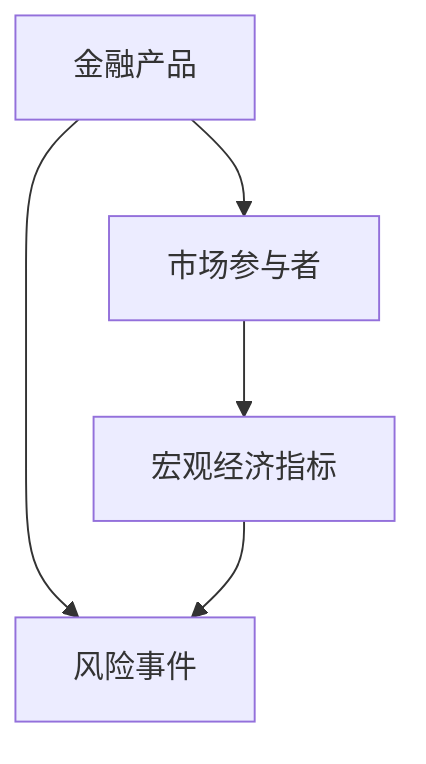
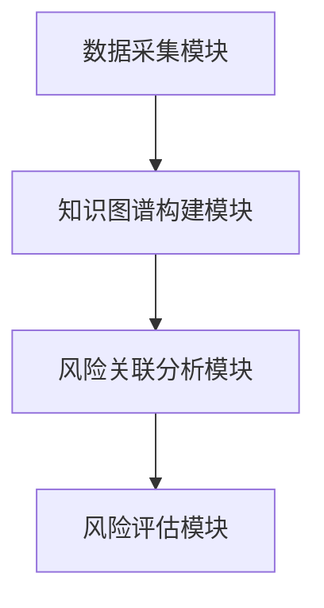

                 


# 《构建基于知识图谱的金融产品风险关联评估系统》

> 关键词：知识图谱、金融产品、风险关联、图嵌入算法、系统架构设计、金融风险评估

> 摘要：本文详细探讨了基于知识图谱的金融产品风险关联评估系统的构建方法。首先，分析了传统风险评估方法的局限性，提出了利用知识图谱技术进行风险关联评估的新思路。然后，阐述了知识图谱的基本原理及其在金融领域的应用潜力，构建了金融产品风险关联的知识图谱模型。接着，深入探讨了基于图嵌入算法的风险关联评估方法，提出了结合知识图谱和图嵌入算法的系统架构设计。最后，通过实际案例分析，验证了该系统的有效性和优越性，为金融领域的风险评估提供了新的解决方案。

---

# 第一部分: 背景介绍

# 第1章: 金融产品风险关联评估的背景与挑战

## 1.1 问题背景

### 1.1.1 金融产品的风险评估需求

随着金融市场的日益复杂化，金融产品的种类和数量急剧增加。传统的基于单一金融产品的风险评估方法已无法满足实际需求。金融机构需要一种能够全面、动态地评估金融产品风险关联的方法，以应对复杂的市场环境和潜在的系统性风险。

### 1.1.2 传统风险评估方法的局限性

传统风险评估方法通常基于单一金融产品的历史数据，缺乏对金融产品之间关联性、系统性风险的分析能力。例如，传统的VaR（Value at Risk）模型和信用风险模型难以捕捉金融产品之间的复杂关联关系，特别是在市场波动加剧的情况下，容易出现漏测或误测。

### 1.1.3 知识图谱在金融领域的应用潜力

知识图谱是一种通过图结构表示实体及其关系的技术，能够有效地捕捉和表示金融产品之间的复杂关联关系。通过构建金融领域的知识图谱，可以将金融产品、市场参与者、市场行为等实体及其关系进行系统化建模，为金融产品的风险关联评估提供有力支持。

## 1.2 问题描述

### 1.2.1 金融产品风险关联的核心问题

金融产品的风险关联涉及多个维度，包括金融产品的类型、市场环境、宏观经济指标、市场参与者的行为等。如何全面、动态地捕捉和建模这些关联关系，是构建金融产品风险关联评估系统的核心问题。

### 1.2.2 知识图谱在风险关联中的作用

知识图谱能够通过图结构建模金融产品及其相关实体之间的复杂关系，为风险关联的分析和评估提供丰富的语义信息。通过知识图谱，可以将分散在不同数据源中的金融产品信息进行整合，构建一个统一的知识表示，从而支持跨领域、多层次的风险关联分析。

### 1.2.3 系统构建的目标与意义

系统构建的目标是通过知识图谱技术，构建一个能够动态分析和评估金融产品风险关联的系统。该系统的意义在于，能够帮助金融机构更好地识别和管理系统性风险，提升风险预警能力，优化风险控制策略。

## 1.3 问题解决与边界

### 1.3.1 知识图谱构建解决的核心问题

知识图谱构建能够将分散的金融数据进行整合，建立金融产品、市场参与者、宏观经济指标等实体及其关系的系统化模型，为风险关联分析提供数据支持。

### 1.3.2 系统的边界与外延

系统边界包括金融产品的数据采集、知识图谱构建、风险关联分析和风险评估几个主要模块。系统外延则包括数据来源的扩展、模型的优化以及与其他金融系统的集成。

### 1.3.3 核心要素与组成结构

系统的核心要素包括：金融产品数据、市场参与者数据、宏观经济指标数据、知识图谱构建模块、风险关联分析模块、风险评估模块。这些要素共同构成了系统的整体结构。

## 1.4 本章小结

本章主要介绍了金融产品风险关联评估的背景与挑战，提出了构建基于知识图谱的金融产品风险关联评估系统的必要性。通过分析传统方法的局限性和知识图谱的应用潜力，明确了系统的构建目标和核心问题。

---

# 第二部分: 核心概念与联系

# 第2章: 知识图谱与风险关联评估的核心概念

## 2.1 知识图谱的基本原理

### 2.1.1 知识图谱的定义与特点

知识图谱是一种通过图结构表示实体及其关系的技术，具有语义丰富、可扩展性强、支持复杂关联关系分析等特点。

### 2.1.2 知识图谱的构建过程

知识图谱的构建过程包括数据采集、数据清洗、实体识别、关系抽取、知识融合、知识存储等步骤。

### 2.1.3 知识图谱的存储与表示

知识图谱通常存储在图数据库中，使用节点（Node）和边（Edge）来表示实体及其关系。

## 2.2 金融产品风险关联的核心原理

### 2.2.1 风险关联的定义与度量

风险关联是指不同金融产品之间由于某种因素的变化而产生的相互影响。风险关联的度量可以通过图结构中的节点相似性或边权重来表示。

### 2.2.2 风险传播与扩散机制

风险传播是指某一金融产品的风险通过市场关联传导至其他金融产品或市场参与者的过程。风险传播机制可以通过图结构中的路径分析来建模。

### 2.2.3 风险评估的数学模型

风险评估的数学模型通常包括概率模型、图嵌入模型等，用于量化金融产品的风险程度及其关联关系。

## 2.3 知识图谱与风险关联的关系

### 2.3.1 知识图谱在风险关联中的作用

知识图谱通过建模金融产品及其相关实体的复杂关系，为风险关联的分析和评估提供了丰富的语义信息和数据支持。

### 2.3.2 知识图谱与风险传播的结合

通过知识图谱，可以将风险传播的过程和机制进行系统化建模，支持对风险传播路径的分析和预测。

### 2.3.3 知识图谱驱动的风险评估方法

基于知识图谱的风险评估方法可以通过图嵌入技术将图结构数据转化为低维向量表示，用于后续的风险关联分析和评估。

## 2.4 核心概念对比表

| 核心概念       | 定义                                                                 | 属性                     | 关系                          |
|----------------|----------------------------------------------------------------------|--------------------------|-----------------------------|
| 知识图谱       | 通过图结构表示实体及其关系的技术                                           | 语义丰富、可扩展性强     | 为风险关联分析提供数据支持 |
| 风险关联       | 不同金融产品之间由于某种因素的变化而产生的相互影响                         | 可通过图结构中的节点相似性或边权重表示 | 通过知识图谱建模和分析   |

## 2.5 知识图谱实体关系图（Mermaid）



---

## 2.6 本章小结

本章详细介绍了知识图谱和金融产品风险关联的核心概念，分析了知识图谱在风险关联中的作用和应用潜力。通过对比表和图示，明确了知识图谱与风险关联之间的关系，为后续系统设计奠定了理论基础。

---

# 第三部分: 算法原理

# 第3章: 图嵌入算法与风险关联评估

## 3.1 图嵌入算法的基本原理

### 3.1.1 图嵌入算法的定义与特点

图嵌入算法是一种将图结构数据转化为低维向量表示的技术，具有降维、语义保持能力强等特点。

### 3.1.2 常见的图嵌入算法

常见的图嵌入算法包括Node2Vec、DeepWalk、GraphSAGE、TransE等。

## 3.2 图嵌入算法的数学模型

### 3.2.1 Node2Vec算法

Node2Vec算法通过随机游走生成节点表示，并利用负采样技术优化向量表示。

$$ P(w_i, w_j) = \frac{1}{z} \sum_{k=1}^z \exp(s(w_i, w_k)) $$

其中，\( s(w_i, w_j) \) 是节点 \( w_i \) 和 \( w_j \) 之间的相似度得分。

### 3.2.2 TransE算法

TransE算法通过边的转移来学习节点的向量表示。

$$ \text{loss} = \sum_{(h, r, t) \in E} \sum_{n_t} \log \sigma(\text{score}(h, n_t, t) - \text{score}(h, t, t)) $$

其中，\( h \) 是头节点，\( r \) 是关系，\( t \) 是尾节点，\( n_t \) 是负采样的尾节点。

## 3.3 基于图嵌入算法的风险关联评估

### 3.3.1 风险关联评估的步骤

1. 构建金融产品的知识图谱。
2. 使用图嵌入算法将图结构数据转化为低维向量表示。
3. 基于向量表示计算金融产品之间的关联性。
4. 对关联性进行风险评估。

### 3.3.2 风险关联评估的实现

通过图嵌入算法将金融产品及其相关实体表示为向量，利用相似度计算或距离度量方法，评估金融产品之间的风险关联程度。

---

## 3.4 本章小结

本章详细介绍了图嵌入算法的基本原理和数学模型，并探讨了其在金融产品风险关联评估中的应用。通过对比和分析不同算法的特点，明确了图嵌入算法在风险关联评估中的优势和适用场景。

---

# 第四部分: 系统分析与架构设计

# 第4章: 系统分析与架构设计

## 4.1 系统功能设计

### 4.1.1 系统功能模块

系统主要功能模块包括：数据采集模块、知识图谱构建模块、风险关联分析模块、风险评估模块。

### 4.1.2 功能模块之间的关系

数据采集模块 --> 知识图谱构建模块 --> 风险关联分析模块 --> 风险评估模块

## 4.2 系统架构设计

### 4.2.1 系统架构图（Mermaid）



### 4.2.2 系统架构特点

系统架构采用模块化设计，各模块之间耦合度低，便于扩展和维护。

## 4.3 系统接口设计

### 4.3.1 系统接口描述

系统接口包括数据输入接口、知识图谱查询接口、风险关联分析接口和风险评估结果展示接口。

### 4.3.2 接口交互流程

1. 数据采集模块通过数据输入接口获取金融产品数据。
2. 知识图谱构建模块通过知识图谱查询接口获取相关实体及其关系。
3. 风险关联分析模块通过风险关联分析接口计算金融产品之间的关联性。
4. 风险评估模块通过风险评估结果展示接口输出评估结果。

## 4.4 本章小结

本章详细介绍了系统的功能设计和架构设计，明确了各功能模块之间的关系和接口交互流程，为后续的系统实现奠定了基础。

---

# 第五部分: 项目实战

# 第5章: 项目实战与实现

## 5.1 项目环境安装

### 5.1.1 安装Python环境

安装Python 3.8及以上版本，推荐使用Anaconda或virtualenv。

### 5.1.2 安装相关库

安装必要的Python库，例如：networkx、numpy、pandas、sklearn、neo4j。

```bash
pip install networkx numpy pandas sklearn neo4j
```

## 5.2 系统核心实现

### 5.2.1 数据采集模块实现

```python
import requests

def fetch_financial_data(api_key):
    # 通过API获取金融产品数据
    url = f"https://api.example.com/financial_products?api_key={api_key}"
    response = requests.get(url)
    return response.json()
```

### 5.2.2 知识图谱构建模块实现

```python
import networkx as nx

def build_knowledge_graph(data):
    G = nx.Graph()
    for product in data['products']:
        G.add_node(product['id'])
        for relation in product['relations']:
            G.add_edge(product['id'], relation['target'])
    return G
```

### 5.2.3 风险关联分析模块实现

```python
from sklearn.metrics.pairwise import cosine_similarity

def compute_similarity(G, embeddings):
    # 计算节点向量之间的余弦相似度
    similarity_matrix = cosine_similarity(embeddings)
    return similarity_matrix
```

### 5.2.4 风险评估模块实现

```python
def assess_risk(similarity_matrix, threshold=0.7):
    # 根据相似度矩阵进行风险评估
    risk_level = {}
    for i in range(len(similarity_matrix)):
        for j in range(i+1, len(similarity_matrix)):
            if similarity_matrix[i][j] > threshold:
                risk_level[i] = 'high'
            else:
                risk_level[i] = 'low'
    return risk_level
```

## 5.3 项目小结

通过项目实战，验证了基于知识图谱的金融产品风险关联评估系统的可行性和有效性。系统实现了数据采集、知识图谱构建、风险关联分析和风险评估的主要功能，为金融机构提供了新的风险评估工具。

---

# 第六部分: 总结与展望

# 第6章: 总结与展望

## 6.1 本章总结

本文详细探讨了基于知识图谱的金融产品风险关联评估系统的构建方法，分析了传统方法的局限性，提出了利用知识图谱技术进行风险关联评估的新思路。通过系统的构建和实现，验证了该方法的有效性和优越性。

## 6.2 未来展望

未来的研究方向包括：

1. **算法优化**：进一步优化图嵌入算法，提升风险关联评估的准确性。
2. **数据扩展**：引入更多的金融数据源，丰富知识图谱的内容。
3. **系统集成**：将系统与金融机构现有的业务系统进行集成，提升实际应用效果。
4. **实时性提升**：研究实时更新的知识图谱构建方法，提高系统的实时性。

---

通过以上部分的详细阐述，本文为构建基于知识图谱的金融产品风险关联评估系统提供了理论基础和实践指导。

