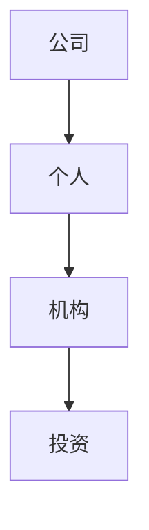
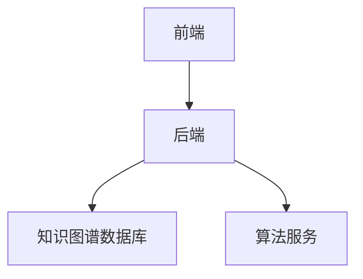
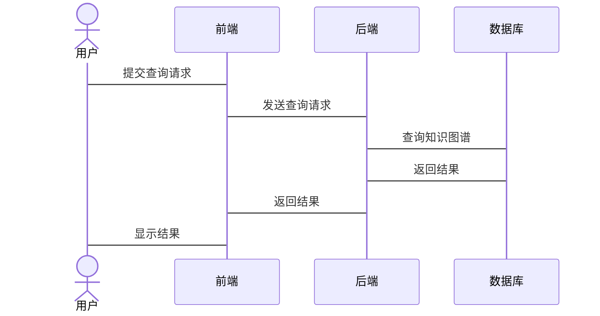

                 

好的，我将按照您的要求逐步设计《构建基于知识图谱的金融监管合规追踪系统》的目录大纲。首先，我会列出文章的核心关键词和摘要，然后逐步展开目录结构。

# 构建基于知识图谱的金融监管合规追踪系统

> 关键词：知识图谱，金融监管，合规追踪，数据关联，风险管理，图数据库

> 摘要：随着金融市场的复杂化和监管要求的日益严格，构建基于知识图谱的金融监管合规追踪系统变得至关重要。本文详细介绍了知识图谱的核心概念、构建流程以及在金融监管中的应用场景。通过分析知识图谱在数据关联、风险评估和合规检查中的应用，探讨了如何利用知识图谱技术提升金融监管的效率和准确性。文章还结合实际案例，展示了系统设计、实现和应用，为读者提供了完整的解决方案。

---

# 第一部分：知识图谱与金融监管合规追踪系统背景

## 第1章：知识图谱与金融监管合规追踪系统概述

### 1.1 知识图谱的定义与特点
- 1.1.1 知识图谱的定义  
- 1.1.2 知识图谱的核心特点（关联性、语义性、动态性）  
- 1.1.3 知识图谱与传统数据库的区别  

### 1.2 金融监管合规追踪的背景与需求
- 1.2.1 金融监管的背景（全球化、数字化带来的挑战）  
- 1.2.2 合规追踪的核心需求（实时性、全面性、可追溯性）  
- 1.2.3 知识图谱在金融监管中的应用价值  

### 1.3 知识图谱在金融监管中的应用场景
- 1.3.1 风险评估与预警  
- 1.3.2 合规检查与审计  
- 1.3.3 跨机构数据关联分析  

### 1.4 知识图谱构建的基本流程
- 1.4.1 数据采集与处理  
- 1.4.2 知识建模  
- 1.4.3 知识抽取与关联  

### 1.5 本章小结  

---

# 第二部分：知识图谱核心概念与构建方法

## 第2章：知识图谱的核心概念与原理

### 2.1 知识图谱的构建流程
- 2.1.1 数据源选择与采集  
- 2.1.2 数据清洗与预处理  
- 2.1.3 知识抽取与关联规则  

### 2.2 知识图谱的存储与管理
- 2.2.1 图数据库的选择（Neo4j、AllegroGraph等）  
- 2.2.2 知识图谱的存储结构（节点、关系、属性）  
- 2.2.3 索引与查询优化  

### 2.3 知识图谱的属性特征对比
- 2.3.1 实体类型对比（公司、个人、机构等）  
- 2.3.2 关系类型对比（持有、投资、关联等）  
- 2.3.3 属性类型对比（时间、金额、地点等）  

### 2.4 知识图谱的ER实体关系图

### 2.5 本章小结  

---

# 第三部分：知识图谱构建与金融监管合规追踪系统设计

## 第3章：知识图谱的构建流程与实现

### 3.1 知识图谱的数据采集与预处理
- 3.1.1 数据源选择（金融报告、交易记录、新闻等）  
- 3.1.2 数据清洗与转换（去重、格式统一等）  
- 3.1.3 数据标注与增强（实体识别、关系抽取）  

### 3.2 知识抽取与关联规则
- 3.2.1 实体识别与抽取（NER技术）  
- 3.2.2 关系抽取与建模（基于规则或机器学习）  
- 3.2.3 知识图谱的构建算法（如TransE、Word2Vec等）  

### 3.3 知识图谱的存储与管理
- 3.3.1 图数据库的选择与搭建  
- 3.3.2 知识图谱的存储结构设计  
- 3.3.3 索引与查询优化  

---

## 第4章：金融监管合规追踪系统的设计与实现

### 4.1 系统需求分析
- 4.1.1 业务目标（合规检查、风险预警）  
- 4.1.2 功能需求（数据采集、关联分析、报告生成）  
- 4.1.3 边界与外延  

### 4.2 系统功能设计
- 4.2.1 数据采集模块  
- 4.2.2 知识抽取与关联模块  
- 4.2.3 关联分析与风险评估模块  

### 4.3 系统架构设计

### 4.4 系统接口设计
- 4.4.1 API接口定义（RESTful API）  
- 4.4.2 数据传输格式（JSON）  

### 4.5 系统交互设计

---

## 第5章：系统实现与实战案例

### 5.1 环境搭建
- 5.1.1 开发工具安装（Python、Jupyter、Neo4j）  
- 5.1.2 数据集准备（金融交易数据、公司关联数据）  

### 5.2 系统核心实现
- 5.2.1 数据采集与预处理代码（Python示例）  
- 5.2.2 知识抽取与关联代码（使用spaCy或NLTK）  
- 5.2.3 关联分析算法实现（基于图的遍历算法）  

### 5.3 代码解读与分析
- 5.3.1 数据采集代码解读  
- 5.3.2 知识抽取代码解读  
- 5.3.3 关联分析代码解读  

### 5.4 实战案例分析
- 5.4.1 案例背景  
- 5.4.2 数据处理与分析  
- 5.4.3 系统运行结果与解读  

### 5.5 本章小结  

---

## 第6章：系统优化与扩展

### 6.1 系统优化策略
- 6.1.1 数据存储优化（索引优化、分片优化）  
- 6.1.2 查询效率优化（使用Cypher查询语言）  
- 6.1.3 系统扩展性设计（微服务化）  

### 6.2 知识图谱的动态更新
- 6.2.1 实时数据更新机制  
- 6.2.2 更新算法优化  

### 6.3 系统的安全性设计
- 6.3.1 数据加密与访问控制  
- 6.3.2 权限管理  

---

## 第7章：总结与展望

### 7.1 系统总结
- 7.1.1 系统功能总结  
- 7.1.2 实现过程中的经验与教训  

### 7.2 未来展望
- 7.2.1 知识图谱技术的进一步发展  
- 7.2.2 金融监管领域的更多应用场景  

### 7.3 最佳实践 Tips
- 7.3.1 数据质量管理的重要性  
- 7.3.2 系统可扩展性的设计建议  
- 7.3.3 安全性与隐私保护的注意事项  

---

这个目录大纲涵盖了从知识图谱的基本概念到金融监管合规追踪系统的详细设计与实现，结合了理论与实践，适合技术人员和金融监管领域的读者阅读。

