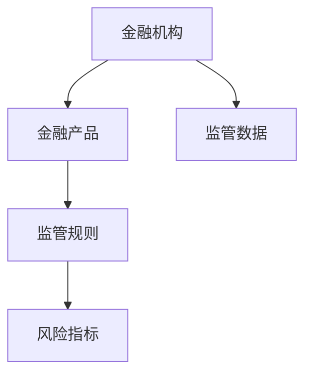
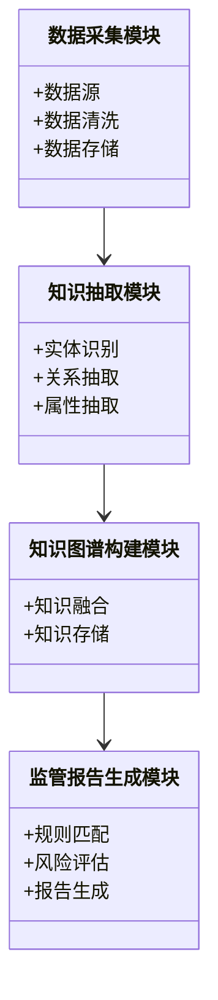
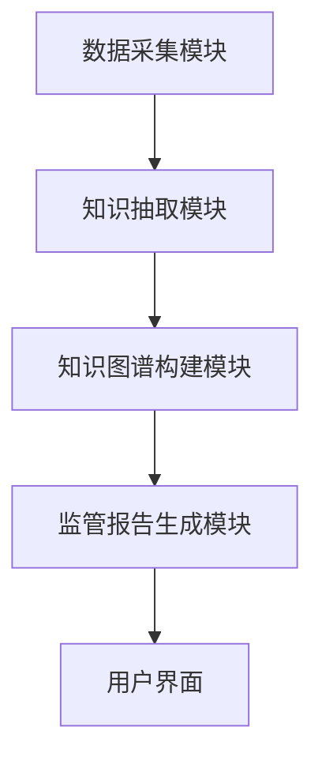
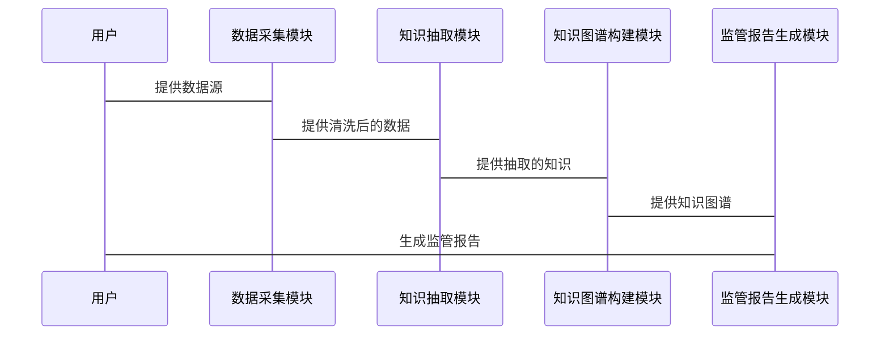

                 


# 构建基于知识图谱的金融监管报告生成器

## 关键词：知识图谱、金融监管、自然语言处理、机器学习、深度学习

## 摘要

本文旨在探讨如何利用知识图谱技术构建金融监管报告生成器。通过分析金融监管的核心需求与痛点，结合知识图谱的构建原理与算法实现，提出一种基于知识图谱的金融监管报告生成系统设计方案。本文从背景介绍、核心概念、算法原理、系统架构到项目实战，逐步展开，详细阐述了基于知识图谱的金融监管报告生成器的构建过程，最后给出了实际案例分析与应用展望。

---

# 第1章: 知识图谱与金融监管的背景介绍

## 1.1 知识图谱的基本概念

### 1.1.1 知识图谱的定义与特点

知识图谱是一种以图结构形式表示知识的语义网络，其节点表示实体或概念，边表示实体之间的关系。知识图谱具有以下特点：

1. **语义性**：通过实体间的关系描述，构建语义网络。
2. **结构化**：数据以结构化的形式存储，便于计算机理解和推理。
3. **可扩展性**：支持动态扩展和更新，适应数据变化。

### 1.1.2 知识图谱的核心要素与组成

知识图谱由以下核心要素组成：

- **实体（Entity）**：现实世界中的具体事物或概念，例如“公司”、“金融产品”等。
- **关系（Relation）**：实体之间的关联，例如“公司发行金融产品”。
- **属性（Attribute）**：描述实体的特征，例如“公司的注册资本”。
- **概念（Concept）**：抽象的类别或概念，例如“金融机构”。

### 1.1.3 知识图谱在金融领域的应用潜力

知识图谱在金融领域的应用潜力巨大，尤其是在金融监管、风险控制和智能投顾等领域。通过知识图谱，可以实现对金融数据的语义理解和关联分析，从而提高监管效率和决策能力。

---

## 1.2 金融监管的基本概念

### 1.2.1 金融监管的定义与目标

金融监管是指对金融市场参与者的行为、金融产品和交易活动进行监督和管理，以维护金融市场的稳定和健康发展。其目标包括：

1. **维护市场秩序**：防止市场操纵和不公平竞争。
2. **保护投资者**：确保投资者的合法权益。
3. **防范金融风险**：识别和控制系统性金融风险。

### 1.2.2 传统金融监管的挑战与痛点

传统金融监管面临以下主要挑战：

1. **数据分散**：金融机构和金融产品的数据分散在不同系统中，难以统一管理和分析。
2. **信息孤岛**：各部门之间的数据孤岛问题严重，缺乏有效的信息共享机制。
3. **监管滞后**：传统监管方式依赖人工审查，存在滞后性和低效性。
4. **风险复杂性**：金融产品的复杂性增加，监管难度也随之增大。

### 1.2.3 金融监管的数字化转型趋势

随着人工智能和大数据技术的快速发展，金融监管正在向数字化、智能化方向转型。通过引入知识图谱、自然语言处理（NLP）和机器学习等技术，可以实现对金融数据的深度分析和智能监管。

---

## 1.3 问题背景与问题描述

### 1.3.1 传统金融监管报告生成的痛点

传统金融监管报告生成过程中存在以下痛点：

1. **人工依赖**：报告生成主要依赖人工整理和编写，效率低下且易出错。
2. **信息不完整**：由于数据分散，报告内容可能存在遗漏或不准确。
3. **缺乏关联性**：报告内容往往缺乏对金融机构和金融产品之间的关联性分析。

### 1.3.2 知识图谱在金融监管中的应用价值

知识图谱在金融监管中的应用价值体现在以下几个方面：

1. **语义理解**：通过知识图谱可以实现对金融数据的语义理解，提升报告生成的准确性。
2. **关联分析**：利用知识图谱可以发现金融机构和金融产品之间的隐含关系，提高监管的全面性。
3. **智能生成**：基于知识图谱的规则推理，可以实现监管报告的自动化生成。

### 1.3.3 本研究的核心问题与目标

本研究的核心问题是：如何利用知识图谱技术构建金融监管报告生成器，实现监管报告的自动化生成和智能化分析。研究目标包括：

1. 构建金融领域的知识图谱，整合金融机构和金融产品的相关信息。
2. 基于知识图谱实现监管规则匹配和风险识别。
3. 开发监管报告生成系统，实现报告的自动化生成与分析。

---

## 1.4 本章小结

本章介绍了知识图谱的基本概念及其在金融监管中的应用潜力，分析了传统金融监管的痛点和数字化转型趋势，并提出了本研究的核心问题与目标。下一章将详细探讨知识图谱与金融监管的核心概念及其关联性。

---

# 第2章: 知识图谱与金融监管的核心概念与联系

## 2.1 知识图谱的核心原理

### 2.1.1 知识抽取与表示

知识抽取是知识图谱构建的第一步，主要包括实体识别、关系抽取和属性抽取。实体识别通过自然语言处理技术从文本中提取出具体的实体，例如“公司名称”、“金融产品名称”等。关系抽取则识别实体之间的关系，例如“公司发行金融产品”。属性抽取用于提取实体的属性信息，例如“公司的注册资本”。

知识表示是将抽取到的知识以结构化的形式表示，常用的方法包括基于向量空间模型和图嵌入模型。向量空间模型通过将实体表示为向量，描述其在语义空间中的位置；图嵌入模型则通过图结构学习实体和关系的嵌入表示。

### 2.1.2 知识融合与推理

知识融合是将多个来源的知识进行整合，消除冲突，形成一致的知识图谱。知识推理则是基于知识图谱进行推理，例如通过关系链推理发现新的知识。例如，如果已知“公司A发行金融产品B”，并且“金融产品B涉及风险”，可以推理出“公司A涉及金融风险”。

### 2.1.3 知识图谱的构建流程

知识图谱的构建流程包括以下几个步骤：

1. **数据采集**：从多种数据源（例如新闻、公告、监管文件）采集金融相关数据。
2. **知识抽取**：从数据中抽取实体、关系和属性。
3. **知识融合**：将抽取的知识进行整合，消除冲突，形成一致的知识图谱。
4. **知识存储与管理**：将知识图谱存储在图数据库中，例如Neo4j。
5. **知识应用**：基于知识图谱进行语义搜索、关联分析和智能生成。

## 2.2 金融监管的核心要素

### 2.2.1 金融机构与金融产品

金融机构包括银行、证券公司、保险公司等，金融产品包括存款、股票、基金等。金融监管需要对金融机构和金融产品的合法性、合规性进行监管。

### 2.2.2 监管规则与风险指标

监管规则是金融监管的依据，例如《证券法》、《银行法》等。风险指标是衡量金融风险的量化指标，例如杠杆率、不良资产率等。

### 2.2.3 监管数据的多维特征

监管数据具有多维特征，包括时间、空间、主体等维度。例如，可以分析某段时间内某家银行的不良资产率变化情况。

## 2.3 知识图谱与金融监管的关联分析

### 2.3.1 知识图谱在风险识别中的应用

通过知识图谱可以发现金融机构和金融产品之间的关联关系，识别潜在风险。例如，如果某家银行多次被曝露存在内部控制问题，可以通过知识图谱分析其关联的金融产品是否存在风险。

### 2.3.2 知识图谱在监管规则匹配中的作用

通过知识图谱可以实现监管规则与金融产品的自动匹配。例如，将监管规则“银行资本充足率不得低于8%”与某家银行的资本充足率进行匹配，识别是否存在违规行为。

### 2.3.3 知识图谱在监管报告生成中的价值

通过知识图谱可以实现监管报告的自动化生成与智能化分析。例如，基于知识图谱可以自动生成监管报告的框架，提取关键信息，生成风险分析和合规性评估。

## 2.4 核心概念的ER实体关系图

以下是金融机构、金融产品、监管规则和风险指标之间的实体关系图：



## 2.5 本章小结

本章详细探讨了知识图谱的核心原理及其在金融监管中的应用，分析了金融监管的核心要素，并通过ER实体关系图展示了知识图谱与金融监管的核心概念之间的关联。下一章将深入探讨知识图谱构建的算法原理与实现。

---

# 第3章: 知识图谱构建的算法原理与实现

## 3.1 知识抽取算法

### 3.1.1 基于NLP的实体识别算法

实体识别是知识抽取的关键步骤之一，常用的算法包括基于规则的实体识别和基于深度学习的实体识别。基于规则的实体识别通过预定义的规则和模式匹配实现，例如正则表达式匹配公司名称。基于深度学习的实体识别则使用神经网络模型，例如LSTM（长短期记忆网络）和BERT（双向Transformer）。

### 3.1.2 实体关系抽取的算法原理

实体关系抽取是通过分析文本中的实体关系，构建实体间的关联关系。常用算法包括基于规则的关系抽取和基于深度学习的关系抽取。基于规则的关系抽取通过预定义的关系模板匹配文本中的关系。基于深度学习的关系抽取则使用神经网络模型，例如Transformer架构，通过序列标注的方式识别关系。

### 3.1.3 知识图谱构建的向量空间模型

向量空间模型是知识表示的一种常用方法，将实体表示为向量，描述其在语义空间中的位置。向量空间模型可以通过词袋模型、TF-IDF（词频-逆文档频率）和主题模型（例如LDA）等方法构建。

## 3.2 算法原理的数学模型

### 3.2.1 实体表示的向量空间模型

向量空间模型通过将实体表示为向量，描述其在语义空间中的位置。例如，可以使用词向量（Word2Vec）或句向量（Sentence-BERT）表示实体。

$$\text{向量表示} = [\text{词向量}, \text{句向量}, \text{段落向量}]$$

### 3.2.2 基于聚类的实体识别算法

聚类算法是一种常用的实体识别方法，通过将相似的文本聚类，识别出不同的实体。例如，可以使用K-means算法对文本进行聚类，每个聚类对应一个实体。

$$\text{聚类中心} = \text{argmin} \sum_{i=1}^{n} ||x_i - c||^2$$

## 3.3 算法实现的Python代码示例

以下是基于K-means算法的聚类实现代码示例：

```python
from sklearn.cluster import KMeans
from sklearn.datasets import make_blobs

# 生成示例数据
data, labels = make_blobs(n_samples=100, centers=3, random_state=42)

# 聚类算法
kmeans = KMeans(n_clusters=3)
kmeans.fit(data)

# 输出聚类结果
print("聚类中心：", kmeans.cluster_centers_)
print("聚类标签：", kmeans.labels_)
```

## 3.4 算法实现的详细讲解与举例说明

### 3.4.1 实体识别算法的实现步骤

1. **数据预处理**：对文本数据进行分词、去停用词等预处理。
2. **特征提取**：使用TF-IDF或Word2Vec等方法提取文本特征。
3. **聚类算法**：使用K-means算法对文本进行聚类，识别出不同的实体。
4. **结果分析**：对聚类结果进行分析，验证实体识别的准确性。

### 3.4.2 实体关系抽取的实现步骤

1. **数据预处理**：对文本数据进行分词、句法分析等预处理。
2. **关系抽取**：使用预定义的关系模板或深度学习模型识别实体关系。
3. **知识图谱构建**：将实体及其关系存储到图数据库中，例如Neo4j。

## 3.5 本章小结

本章详细探讨了知识图谱构建的算法原理与实现，包括实体识别、关系抽取和向量空间模型等内容。通过Python代码示例和数学公式，详细讲解了算法的实现步骤和应用场景。下一章将从系统架构设计的角度，深入探讨基于知识图谱的金融监管报告生成器的实现方案。

---

# 第4章: 系统分析与架构设计

## 4.1 问题场景介绍

### 4.1.1 问题场景描述

本研究旨在构建一个基于知识图谱的金融监管报告生成器，解决传统金融监管报告生成过程中的效率低下、信息不完整和缺乏关联性等问题。

### 4.1.2 项目介绍

本项目的目标是通过构建金融领域的知识图谱，实现监管报告的自动化生成与智能化分析。项目的主要任务包括：

1. **知识图谱构建**：从多种数据源采集金融相关数据，构建金融领域的知识图谱。
2. **监管规则匹配**：基于知识图谱实现监管规则与金融产品的自动匹配。
3. **风险识别与评估**：通过知识图谱分析金融机构和金融产品之间的关联关系，识别潜在风险。
4. **监管报告生成**：基于知识图谱生成监管报告，包括风险评估、合规性分析等内容。

## 4.2 系统功能设计

### 4.2.1 领域模型类图

以下是系统功能设计的领域模型类图：



### 4.2.2 系统架构设计

以下是系统的总体架构设计：



### 4.2.3 系统接口设计

系统接口设计包括以下几个部分：

1. **数据采集接口**：从多种数据源（例如新闻、公告、监管文件）采集金融相关数据。
2. **知识抽取接口**：从文本中抽取实体、关系和属性。
3. **知识图谱构建接口**：将抽取的知识进行融合和存储。
4. **监管报告生成接口**：基于知识图谱生成监管报告。

### 4.2.4 系统交互流程图

以下是系统的交互流程图：



## 4.3 本章小结

本章从系统架构设计的角度，详细探讨了基于知识图谱的金融监管报告生成器的实现方案，包括系统功能设计、系统架构设计和系统交互流程图等内容。下一章将通过项目实战，详细讲解系统的实现过程。

---

# 第5章: 项目实战

## 5.1 环境安装与配置

### 5.1.1 环境要求

- 操作系统：Windows 10 或 macOS 10.15及以上
- Python版本：Python 3.8及以上
- 图数据库：Neo4j Community Edition 4.0及以上
- 其他依赖：自然语言处理工具（例如spaCy）、机器学习库（例如scikit-learn）、深度学习框架（例如TensorFlow）

### 5.1.2 安装步骤

1. **安装Python**：
   ```bash
   # 下载并安装Python 3.8及以上版本
   ```

2. **安装依赖库**：
   ```bash
   pip install numpy pandas sklearn spacy neo4j-driver
   ```

## 5.2 核心代码实现

### 5.2.1 数据采集模块

```python
import neo4j-driver
from neo4j-driver import GraphDatabase

# 连接Neo4j数据库
driver = GraphDatabase.driver("bolt://localhost:7687", auth=("neo4j", "password"))

# 数据采集函数
def load_data(data_source):
    # 数据采集逻辑
    pass

# 数据加载
load_data("金融机构.csv")
```

### 5.2.2 知识抽取模块

```python
import spacy

# 加载spaCy中文模型
nlp = spacy.load("zh_core_web_sm")

# 实体识别函数
def extract_entities(text):
    doc = nlp(text)
    entities = [ent.text for ent in doc.ents]
    return entities

# 示例文本
text = "中国工商银行是一家大型商业银行，主要业务包括存款、贷款、理财等。"
print(extract_entities(text))
```

### 5.2.3 知识图谱构建模块

```python
from neo4j-driver import Session

# 初始化图数据库会话
session = driver.session()

# 知识融合函数
def merge_concepts(entities, relationships):
    # 知识融合逻辑
    pass

# 示例数据
entities = ["中国工商银行", "存款"]
relationships = [("中国工商银行", "提供", "存款")]

# 知识图谱构建
merge_concepts(entities, relationships)
```

### 5.2.4 监管报告生成模块

```python
# 监管规则匹配函数
def match_regulations(product):
    # 监管规则匹配逻辑
    pass

# 示例产品
product = "存款"

# 生成监管报告
report = match_regulations(product)
print(report)
```

## 5.3 实际案例分析

### 5.3.1 案例背景

假设某银行推出了一款新的理财产品，需要对其进行监管合规性评估。

### 5.3.2 数据采集与知识抽取

从监管文件中采集理财产品相关信息，包括产品名称、产品类型、风险等级等。

### 5.3.3 知识图谱构建

将抽取到的知识进行融合，构建金融领域的知识图谱，包括理财产品与其相关监管规则的关系。

### 5.3.4 监管报告生成

基于知识图谱，自动生成监管报告，包括产品合规性评估、风险提示等内容。

## 5.4 项目小结

本章通过实际案例分析，详细讲解了基于知识图谱的金融监管报告生成器的实现过程，包括环境安装、核心代码实现和案例分析。下一章将对项目进行总结与展望，并给出一些实践建议。

---

# 第6章: 总结与展望

## 6.1 本章总结

本文详细探讨了基于知识图谱的金融监管报告生成器的构建过程，从知识图谱的基本概念到系统架构设计，再到项目实战，全面介绍了基于知识图谱的金融监管报告生成器的实现方案。通过本文的研究，可以实现监管报告的自动化生成与智能化分析，提高金融监管的效率和准确性。

## 6.2 未来展望

未来的研究可以进一步优化知识图谱的构建算法，例如引入深度学习模型（如BERT）进行实体识别和关系抽取。此外，可以探索知识图谱的动态更新机制，实时跟踪金融机构和金融产品的变化。同时，可以研究基于知识图谱的智能问答系统，为监管人员提供更便捷的查询和分析工具。

## 6.3 最佳实践 tips

- 在构建知识图谱时，建议优先选择图数据库（如Neo4j）进行存储和管理。
- 在进行实体识别和关系抽取时，可以结合多种自然语言处理工具（如spaCy和BERT）进行优化。
- 在生成监管报告时，可以引入可视化工具（如D3.js）进行数据可视化，提高报告的可读性。

## 6.4 小结

基于知识图谱的金融监管报告生成器是一种创新的金融监管工具，具有广阔的应用前景。通过本文的研究和实践，可以为金融监管的智能化和数字化转型提供有力的技术支持。

---

# 结语

感谢您的阅读！希望本文对您理解和应用基于知识图谱的金融监管报告生成器有所帮助。如果需要进一步的技术支持或合作，欢迎随时联系。

