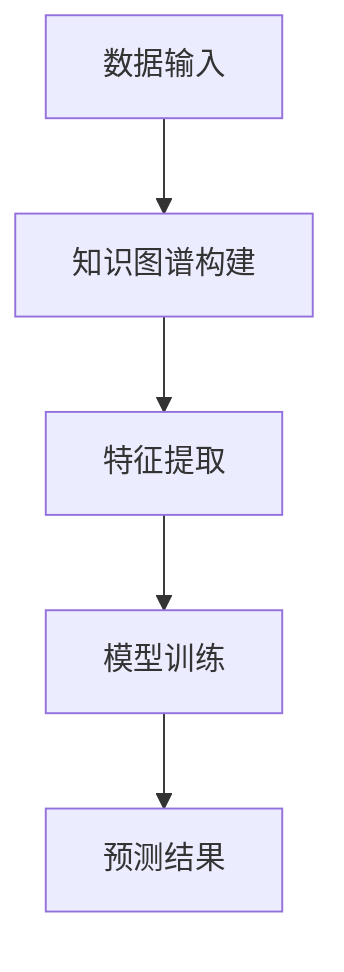
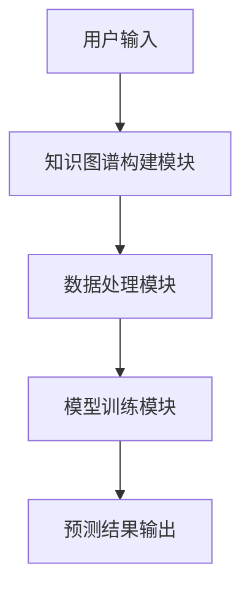
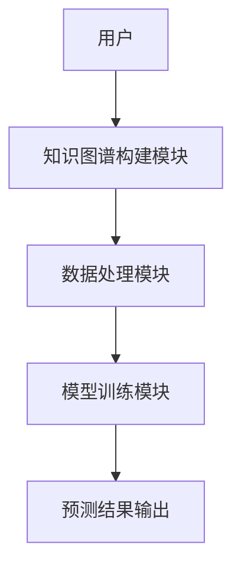

                 


# 构建基于知识图谱的金融监管沙盒测试结果预测平台

> 关键词：知识图谱，金融监管，机器学习，预测平台，监管沙盒

> 摘要：本文详细介绍了构建基于知识图谱的金融监管沙盒测试结果预测平台的方法，探讨了知识图谱与机器学习的结合，分析了系统架构设计，并通过实际案例展示了平台的实现与应用。

---

## 第1章: 问题背景与需求分析

### 1.1 问题背景

#### 1.1.1 金融监管的现状与挑战
金融监管是保障金融市场稳定运行的重要手段。传统的金融监管主要依赖人工审核和规则-based系统，存在以下问题：
- **信息孤岛**：金融机构的数据分散在不同的系统中，难以进行统一分析。
- **规则复杂**：金融监管规则繁多且不断变化，人工审核效率低。
- **风险滞后**：传统监管方法难以实时识别和预测潜在风险。

#### 1.1.2 金融监管沙盒的定义与作用
金融监管沙盒是一种创新监管工具，允许金融机构在受控环境中测试新产品、服务或流程，同时确保消费者权益和金融稳定。其作用包括：
- **风险控制**：在受控环境中测试新产品，降低风险。
- **创新支持**：为金融机构提供安全的创新空间。
- **数据积累**：通过沙盒测试积累数据，为后续监管提供参考。

#### 1.1.3 现有监管测试方法的局限性
现有监管测试方法主要依赖规则匹配和关键词匹配，存在以下问题：
- **覆盖率低**：无法覆盖所有可能的违规场景。
- **效率低下**：人工审核耗时长，且易出错。
- **缺乏关联性**：无法发现跨领域、跨业务的关联性问题。

### 1.2 问题描述

#### 1.2.1 金融监管沙盒测试的核心目标
金融监管沙盒测试的核心目标是通过实时监控和分析，识别潜在风险，并提供预测性的监管建议。

#### 1.2.2 知识图谱在金融监管中的应用潜力
知识图谱是一种以结构化方式表示知识的图数据，能够有效地表示实体之间的关系。其在金融监管中的应用潜力包括：
- **关联分析**：发现跨领域的关联性问题。
- **实时监控**：通过实时更新知识图谱，进行实时风险识别。
- **预测分析**：基于历史数据和关联关系，预测未来风险。

#### 1.2.3 构建预测平台的必要性与可行性
构建基于知识图谱的金融监管沙盒测试结果预测平台的必要性在于：
- **提升监管效率**：通过自动化分析，提高监管效率。
- **降低监管成本**：减少人工审核的工作量。
- **增强预测能力**：通过知识图谱和机器学习的结合，提升预测准确性。

### 1.3 问题解决与边界

#### 1.3.1 知识图谱如何解决监管测试问题
知识图谱通过以下方式解决监管测试问题：
- **关联分析**：发现跨领域的关联性问题。
- **实时监控**：通过实时更新知识图谱，进行实时风险识别。
- **预测分析**：基于历史数据和关联关系，预测未来风险。

#### 1.3.2 平台的边界与外延
平台的边界包括：
- **数据范围**：仅限于金融监管相关的数据。
- **功能范围**：仅限于监管沙盒测试结果的预测。

#### 1.3.3 核心概念与组成要素
核心概念包括：
- **知识图谱**：用于表示金融领域的实体及其关系。
- **机器学习模型**：用于基于知识图谱进行预测。

---

## 第2章: 知识图谱与机器学习基础

### 2.1 知识图谱原理

#### 2.1.1 知识图谱的定义与特点
知识图谱是一种以结构化方式表示知识的图数据，其特点包括：
- **结构化**：数据以实体和关系的形式表示。
- **可扩展性**：能够轻松添加新的实体和关系。
- **语义丰富**：能够表示复杂的语义关系。

#### 2.1.2 知识图谱的构建流程
知识图谱的构建流程包括：
1. 数据采集与预处理
2. 实体识别与抽取
3. 关系抽取与构建
4. 知识图谱存储与管理

#### 2.1.3 知识图谱的存储与查询
知识图谱的存储方式包括：
- **数据库存储**：使用图数据库（如Neo4j）存储。
- **文件存储**：将知识图谱表示为JSON或RDF文件。

知识图谱的查询方式包括：
- **SPARQL查询**：用于从知识图谱中获取信息。
- **图遍历查询**：用于查询实体之间的关系。

### 2.2 机器学习基础

#### 2.2.1 机器学习的核心概念
机器学习的核心概念包括：
- **监督学习**：基于标记数据进行学习。
- **无监督学习**：基于未标记数据进行学习。
- **强化学习**：通过与环境交互进行学习。

#### 2.2.2 监督学习、无监督学习与强化学习
- **监督学习**：适用于分类和回归任务。
- **无监督学习**：适用于聚类和降维任务。
- **强化学习**：适用于需要决策的任务。

#### 2.2.3 神经网络与深度学习简介
神经网络是一种模拟人脑神经网络的计算模型，深度学习是一种基于神经网络的机器学习方法，能够自动提取数据特征。

### 2.3 知识图谱与机器学习的结合

#### 2.3.1 知识图谱在机器学习中的应用
知识图谱在机器学习中的应用包括：
- **特征工程**：将知识图谱中的实体和关系作为特征。
- **数据增强**：通过知识图谱扩展训练数据。

#### 2.3.2 知识图谱增强的机器学习模型
知识图谱增强的机器学习模型包括：
- **知识图谱嵌入**：将实体和关系表示为向量。
- **图神经网络**：基于图结构进行学习。

#### 2.3.3 知识图谱与金融监管的结合场景
知识图谱与金融监管的结合场景包括：
- **风险预测**：基于知识图谱进行风险预测。
- **关联分析**：发现跨领域的关联性问题。

---

## 第3章: 知识图谱构建与实体关系分析

### 3.1 知识图谱构建流程

#### 3.1.1 数据采集与预处理
数据采集与预处理包括：
1. 数据源采集：从多个数据源采集数据。
2. 数据清洗：去除重复数据和噪声数据。

#### 3.1.2 实体识别与抽取
实体识别与抽取包括：
1. 实体识别：从文本中识别出实体。
2. 实体抽取：从文本中抽取实体信息。

#### 3.1.3 关系抽取与构建
关系抽取与构建包括：
1. 关系识别：从文本中识别出关系。
2. 关系抽取：从文本中抽取关系信息。

### 3.2 实体关系分析

#### 3.2.1 实体关系的类型与表示
实体关系的类型包括：
- **一对一关系**：例如“公司- CEO”。
- **一对多关系**：例如“公司-员工”。
- **多对多关系**：例如“员工-项目”。

实体关系的表示方式包括：
- **关系三元组**：(头实体，关系，尾实体)。
- **关系图**：通过图形化方式表示实体之间的关系。

#### 3.2.2 实体关系图的构建与可视化
实体关系图的构建与可视化包括：
1. 使用工具（如Neo4j）构建关系图。
2. 使用工具（如Gephi）进行可视化。

#### 3.2.3 实体关系图的存储与管理
实体关系图的存储与管理包括：
- **数据库存储**：使用图数据库存储关系图。
- **文件存储**：将关系图表示为JSON或RDF文件。

### 3.3 知识图谱的验证与优化

#### 3.3.1 知识图谱的质量评估
知识图谱的质量评估包括：
- **完整性**：知识图谱是否包含所有相关实体和关系。
- **准确性**：知识图谱中的信息是否准确。
- **一致性**：知识图谱中的信息是否一致。

#### 3.3.2 知识图谱的优化策略
知识图谱的优化策略包括：
- **去噪**：去除噪声数据。
- **补充**：补充缺失的数据。
- **更新**：根据新数据更新知识图谱。

#### 3.3.3 知识图谱的动态更新
知识图谱的动态更新包括：
1. 定期更新知识图谱。
2. 根据新数据动态更新知识图谱。

---

## 第4章: 机器学习算法与知识图谱结合的数学模型

### 4.1 知识图谱表示学习

#### 4.1.1 表示学习的核心思想
表示学习的核心思想是将实体和关系表示为向量，以便进行计算和分析。

#### 4.1.2 知识图谱表示学习的主流算法
知识图谱表示学习的主流算法包括：
- **TransE**：通过将关系表示为边向量，将实体表示为节点向量。
- **TransH**：通过将关系表示为边向量，将实体表示为节点向量。
- **RotatE**：通过将关系表示为旋转操作，将实体表示为向量。

#### 4.1.3 知识图谱表示学习的数学模型
TransE的数学模型如下：
$$
\text{score}(h, r, t) = \|h + r - t\|^2
$$

### 4.2 知识图谱增强的机器学习模型

#### 4.2.1 知识图谱嵌入的融合方法
知识图谱嵌入的融合方法包括：
- **简单平均**：将实体和关系的向量简单平均。
- **加权平均**：将实体和关系的向量加权平均。

#### 4.2.2 知识图谱增强的神经网络模型
知识图谱增强的神经网络模型包括：
- **图卷积网络（GCN）**：通过图卷积操作进行学习。
- **图注意力网络（GAT）**：通过注意力机制进行学习。

#### 4.2.3 知识图谱增强的注意力机制
知识图谱增强的注意力机制如下：
$$
\alpha_i = \frac{\exp(\text{sim}(h_i, h_j))}{\sum_{k} \exp(\text{sim}(h_i, h_k))}
$$

### 4.3 算法流程图



---

## 第5章: 系统架构与设计

### 5.1 系统功能设计

#### 5.1.1 知识图谱构建模块
知识图谱构建模块包括：
1. 数据采集与预处理。
2. 实体识别与抽取。
3. 关系抽取与构建。

#### 5.1.2 数据处理模块
数据处理模块包括：
1. 数据清洗。
2. 数据转换。
3. 数据存储。

#### 5.1.3 模型训练与预测模块
模型训练与预测模块包括：
1. 模型训练。
2. 模型预测。
3. 结果输出。

### 5.2 系统架构设计



### 5.3 系统接口设计

#### 5.3.1 输入接口
输入接口包括：
- **知识图谱构建模块**：接收原始数据。
- **数据处理模块**：接收预处理数据。

#### 5.3.2 输出接口
输出接口包括：
- **模型训练模块**：输出训练好的模型。
- **预测结果输出**：输出预测结果。

#### 5.3.3 数据接口
数据接口包括：
- **数据输入接口**：接收外部数据。
- **数据输出接口**：输出处理后的数据。

### 5.4 系统交互设计



---

## 第6章: 项目实战

### 6.1 环境安装

#### 6.1.1 安装Python
```bash
python --version
```

#### 6.1.2 安装依赖
```bash
pip install neo4j numpy pandas scikit-learn
```

### 6.2 系统核心实现源代码

#### 6.2.1 知识图谱构建代码
```python
from neo4j import GraphDatabase
from neo4j.exceptions import ServiceUnavailable

class KnowledgeGraph:
    def __init__(self, uri, user, password):
        self.driver = GraphDatabase.driver(uri, auth=(user, password))
    
    def close(self):
        self.driver.close()
    
    def add_entity(self, label, properties):
        with self.driver.session() as session:
            session.run("CREATE (n:%s {%s})" % (label, properties))
```

#### 6.2.2 模型训练代码
```python
from sklearn.linear_model import LogisticRegression
from sklearn.model_selection import train_test_split

# 数据准备
X = ...
y = ...

# 划分数据集
X_train, X_test, y_train, y_test = train_test_split(X, y, test_size=0.2)

# 训练模型
model = LogisticRegression()
model.fit(X_train, y_train)

# 预测结果
y_pred = model.predict(X_test)
```

### 6.3 代码应用解读与分析
- **知识图谱构建代码**：使用Neo4j数据库构建知识图谱。
- **模型训练代码**：使用逻辑回归模型进行训练和预测。

### 6.4 实际案例分析和详细讲解剖析
案例分析：假设我们有一个金融监管沙盒测试平台，我们需要预测某个金融产品的风险等级。

#### 6.4.1 数据准备
```python
import pandas as pd
data = pd.read_csv('data.csv')
```

#### 6.4.2 数据预处理
```python
from sklearn.preprocessing import StandardScaler
scaler = StandardScaler()
X_scaled = scaler.fit_transform(data)
```

#### 6.4.3 模型训练
```python
from sklearn.ensemble import RandomForestClassifier
model = RandomForestClassifier()
model.fit(X_scaled, y)
```

#### 6.4.4 模型预测
```python
y_pred = model.predict(X_new)
```

### 6.5 项目小结
通过实际案例分析，我们展示了如何利用知识图谱和机器学习模型进行金融监管沙盒测试结果预测。

---

## 第7章: 最佳实践 tips、小结、注意事项、拓展阅读

### 7.1 最佳实践 tips
1. **数据质量管理**：确保数据的准确性和完整性。
2. **模型调优**：通过网格搜索等方法优化模型性能。
3. **实时更新**：定期更新知识图谱和模型。

### 7.2 小结
本文详细介绍了构建基于知识图谱的金融监管沙盒测试结果预测平台的方法，包括知识图谱构建、机器学习算法、系统架构设计和项目实战。

### 7.3 注意事项
- **数据隐私**：注意保护数据隐私。
- **模型解释性**：确保模型的可解释性。

### 7.4 拓展阅读
- **知识图谱**：推荐阅读《知识图谱实战》。
- **机器学习**：推荐阅读《机器学习实战》。

---

## 参考文献
1. 《知识图谱实战》
2. 《机器学习实战》
3. 《深度学习入门》

---

通过以上内容，我们详细介绍了构建基于知识图谱的金融监管沙盒测试结果预测平台的方法，从理论到实践，为读者提供了一个完整的解决方案。

