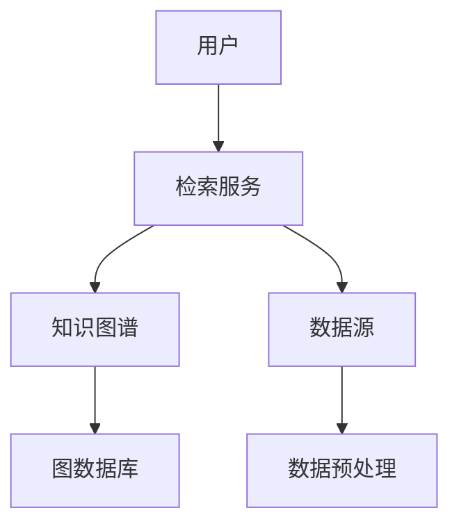

                 


# 第1章: 知识图谱的定义与特点

## 1.1 知识图谱的定义
知识图谱是一种以图结构形式表示知识的语义网络，通过节点（实体）和边（关系）来描述现实世界中的概念及其相互关系。它可以表示为三元组（头实体，关系，尾实体），例如（张三，是作者，这本书）。

## 1.2 知识图谱的核心特点
- **语义性**：通过实体和关系的组合，表达丰富的语义信息。
- **结构化**：数据以结构化的形式组织，便于计算机理解和推理。
- **可扩展性**：可以不断扩展和更新，适应新知识的加入。
- **语境无关性**：能够处理不同语境下的同一实体或关系。

## 1.3 知识图谱与传统数据库的区别
| 特性 | 知识图谱 | 传统数据库 |
|------|----------|-------------|
| 数据模型 | 图结构 | 行列式结构 |
| 数据关系 | 复杂关系 | 有限关系 |
| 数据规模 | 大规模 | 中小规模 |
| 数据语义 | 语义丰富 | 语义简单 |

# 第2章: 金融研报的特点与需求

## 2.1 金融研报的基本概念
金融研报是金融机构或分析师对金融市场的分析报告，通常包括行业分析、公司分析、市场趋势等内容。

## 2.2 金融研报的结构与内容
- **标题**：简明扼要地概括报告内容。
- **引言**：介绍背景和研究目的。
- **正文**：详细分析，包括数据、图表、案例等。
- **结论**：总结分析结果和建议。

## 2.3 金融研报检索的难点与痛点
- **信息过载**：大量报告难以快速筛选。
- **语义理解**：需要理解报告内容的深层含义。
- **关联性不足**：传统检索方法难以发现报告之间的关联。

# 第3章: 知识图谱在金融研报中的应用价值

## 3.1 知识图谱在金融领域的应用场景
- **智能检索**：快速找到相关报告。
- **知识关联**：发现报告之间的隐含关系。
- **智能推荐**：基于知识图谱进行个性化推荐。

## 3.2 知识图谱如何提升金融研报检索效率
- **语义检索**：通过理解上下文进行检索。
- **关联分析**：发现报告之间的潜在联系。
- **动态更新**：及时更新知识图谱，保持信息准确性。

## 3.3 金融知识图谱的构建与优化
- **数据收集**：从多种来源收集金融数据。
- **实体识别**：识别报告中的实体，如公司、行业。
- **关系抽取**：抽取实体之间的关系，如“影响”、“驱动”。
- **知识融合**：整合多来源数据，消除冗余和冲突。

# 第4章: 知识图谱的核心概念与属性

## 4.1 实体与关系的定义
- **实体**：现实世界中的具体事物，如公司、产品。
- **关系**：实体之间的关联，如“属于”、“影响”。

## 4.2 知识图谱的三元组表示法
知识图谱中的基本单位是三元组（头实体，关系，尾实体），例如（苹果，生产，iPhone）。

## 4.3 知识图谱的层次化结构
知识图谱可以分为多个层次，从高层次的类别到具体的实例，形成层次化的结构。

# 第5章: 知识图谱的构建流程

## 5.1 数据收集与预处理
- **数据收集**：从多种来源（如互联网、数据库）收集数据。
- **数据清洗**：去除冗余和错误数据，确保数据质量。

## 5.2 实体识别与抽取
- **实体识别**：使用自然语言处理技术识别文本中的实体。
- **实体链接**：将实体映射到知识图谱中的具体节点。

## 5.3 关系抽取与构建
- **关系抽取**：识别实体之间的关系，并表示为边。
- **关系推理**：通过推理发现隐含的关系。

## 5.4 知识图谱的存储与管理
- **存储方式**：使用图数据库（如Neo4j）存储知识图谱。
- **数据管理**：建立数据管理系统，确保数据的完整性和一致性。

# 第6章: 知识图谱的可视化与分析

## 6.1 知识图谱的可视化方法
- **节点和边的绘制**：使用图形库（如D3.js）绘制节点和边。
- **布局算法**：应用布局算法（如力导向布局）优化图的显示效果。

## 6.2 知识图谱的分析工具
- **工具介绍**：使用如Neo4j Browser等工具进行分析。
- **分析方法**：通过路径分析、社区检测等方法深入分析知识图谱的结构。

## 6.3 知识图谱的动态更新机制
- **数据流处理**：实时处理数据流，及时更新知识图谱。
- **版本控制**：记录每次更新，便于回溯和管理。

# 第7章: 传统检索方法的局限性

## 7.1 基于关键词的检索方法
- **实现方式**：通过关键词匹配查找相关内容。
- **局限性**：无法理解语义，容易漏检和误检。

## 7.2 基于向量的检索方法
- **实现方式**：将文本转换为向量，计算相似度。
- **局限性**：计算量大，实时性差。

## 7.3 传统检索方法的不足
- **语义理解不足**：无法深入理解文本含义。
- **关联性差**：难以发现文本之间的深层关联。

# 第8章: 基于知识图谱的检索算法

## 8.1 图结构检索的基本原理
- **遍历算法**：如广度优先搜索（BFS）、深度优先搜索（DFS）。
- **路径分析**：通过分析路径长度和权重，确定相关性。

## 8.2 基于相似度的检索方法
- **相似度计算**：使用余弦相似度、Jaccard相似度等方法。
- **检索过程**：将查询转化为向量，与知识图谱中的节点进行相似度计算。

## 8.3 基于路径的检索方法
- **路径分析**：找出查询与目标之间的最短路径。
- **权重计算**：根据边的权重调整结果的相关性。

# 第9章: 知识图谱检索的优化策略

## 9.1 索引优化技术
- **倒排索引**：建立索引结构，提高检索效率。
- **分块存储**：将图谱分块存储，减少检索范围。

## 9.2 查询优化技术
- **查询改写**：将复杂的查询转化为简单形式。
- **联合查询**：通过多表联合查询，提高准确性。

## 9.3 结果排序与过滤
- **排序算法**：如BM25、Okapi等，根据相关性排序。
- **过滤机制**：根据用户需求过滤无关结果。

# 第10章: 系统设计概述

## 10.1 系统目标与功能需求
- **目标**：构建金融研报智能检索系统。
- **需求**：支持语义检索、关联分析、动态更新等功能。

## 10.2 系统架构设计
- **分层架构**：分为数据层、逻辑层、表现层。
- **模块划分**：数据采集模块、知识构建模块、检索服务模块等。

## 10.3 系统模块划分
- **数据采集模块**：负责数据的收集和预处理。
- **知识构建模块**：进行实体识别、关系抽取。
- **检索服务模块**：提供检索接口，处理用户查询。

# 第11章: 系统架构设计

## 11.1 系统功能模块设计
- **功能模块**：数据采集、知识构建、检索服务、结果展示。
- **模块交互**：各模块协同工作，确保系统高效运行。

## 11.2 系统架构图（Mermaid）


## 11.3 系统接口设计
- **API接口**：提供RESTful API，供其他系统调用。
- **接口规范**：定义输入输出格式，确保兼容性。

# 第12章: 系统实现与测试

## 12.1 系统核心代码实现
```python
# 知识图谱构建示例代码
class KnowledgeGraph:
    def __init__(self):
        self.graph = {}

    def add_entity(self, entity):
        if entity not in self.graph:
            self.graph[entity] = []

    def add_relation(self, head, relation, tail):
        self.graph[head].append((relation, tail))

# 使用示例
kg = KnowledgeGraph()
kg.add_entity("公司A")
kg.add_entity("行业B")
kg.add_relation("公司A", "属于", "行业B")
```

## 12.2 系统实现与测试
- **测试用例**：设计多种测试用例，覆盖不同场景。
- **性能测试**：测试系统在高并发情况下的表现。
- **功能测试**：验证系统功能是否正常，如检索准确性、响应时间等。

# 总结与展望

通过构建基于知识图谱的金融研报智能检索系统，我们能够显著提升金融研报的检索效率和准确性。未来，随着技术的发展，知识图谱将更加智能化和动态化，为金融领域带来更多创新和突破。

---

### 附录: 知识图谱相关工具与资源
- **图数据库**：Neo4j、Apache Gremlin。
- **自然语言处理工具**：spaCy、NLTK。
- **可视化工具**：Gephi、Cytoscape。

### 参考文献
1. [参考文献1] 《知识图谱构建与应用》，某某出版社。
2. [参考文献2] 某某某，知识图谱在金融领域的应用研究。

---

通过以上章节的详细阐述，读者可以系统地了解如何构建基于知识图谱的金融研报智能检索系统，从理论到实践，逐步掌握相关技术和方法。

