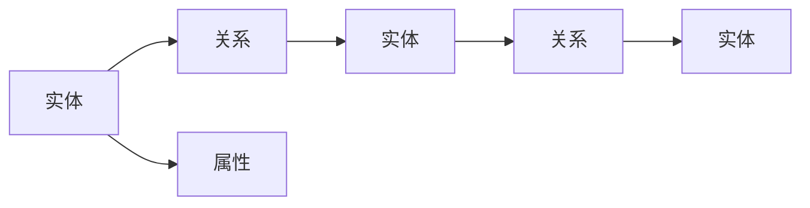
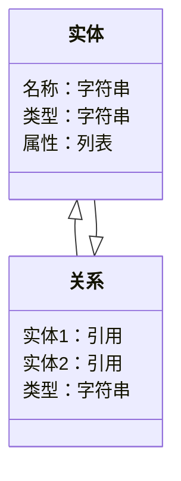
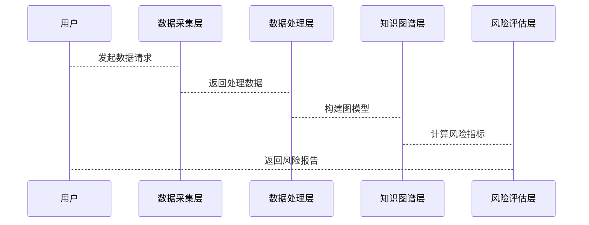

                 


# 《构建基于知识图谱的金融风险关联网络》

---

## 关键词：
- 知识图谱
- 金融风险
- 关联网络
- 图嵌入
- 网络分析

---

## 摘要：
本文详细探讨了如何利用知识图谱构建金融风险关联网络，分析了其在金融风险管理中的应用价值。通过系统化的构建方法、算法原理及实战案例，展示了如何利用图结构数据有效识别和量化金融风险，提升金融机构的风险防控能力。

---

# 目录大纲

## 第1章：知识图谱与金融风险概述

### 1.1 知识图谱的基本概念

#### 1.1.1 知识图谱的定义与特点

- 什么是知识图谱
- 知识图谱的三元组表示法
- 知识图谱的构建过程

#### 1.1.2 知识图谱在金融领域的应用背景

- 金融领域的复杂性与不确定性
- 知识图谱在金融信息处理中的优势

#### 1.1.3 金融风险关联网络的构建意义

- 提升风险预警能力
- 优化资源配置
- 支持决策制定

### 1.2 金融风险的基本概念

#### 1.2.1 金融风险的定义与分类

- 信用风险
- 市场风险
- 操作风险
- 流动性风险

#### 1.2.2 金融风险的传播机制

- 风险传染路径
- 风险放大效应

#### 1.2.3 金融风险的量化与评估

- 风险评估模型
- 风险指标体系

## 第2章：知识图谱与金融风险关联网络的背景与挑战

### 2.1 金融风险关联网络的构建背景

#### 2.1.1 传统金融风险分析的局限性

- 数据孤岛问题
- 分析维度不足
- 计算复杂性

#### 2.1.2 知识图谱在金融风险分析中的优势

- 全局视角
- 关联性分析
- 可视化能力

### 2.2 知识图谱构建中的主要挑战

#### 2.2.1 数据获取与整合的困难

- 数据来源多样性
- 数据格式不统一
- 数据质量控制

#### 2.2.2 知识抽取与关联的复杂性

- 实体识别的准确性
- 关系抽取的全面性
- 知识融合的协调性

#### 2.2.3 网络分析与可视化的技术难点

- 网络规模的处理
- 可视化工具的选择
- 交互设计的合理性

## 第3章：知识图谱与金融风险关联网络的核心概念与联系

### 3.1 知识图谱的核心概念

#### 3.1.1 实体与关系的定义

- 实体类型：公司、银行、投资者等
- 关系类型：控股、投资、借贷等

#### 3.1.2 知识图谱的构建流程

- 数据收集
- 数据清洗
- 知识抽取
- 知识融合
- 知识存储

#### 3.1.3 知识图谱的存储与查询

- 图数据库的选择（Neo4j、Allegro）
- 图查询语言（Cypher、SPARQL）

### 3.2 金融风险关联网络的构建框架

#### 3.2.1 网络结构的层次分析

- 个体层面：单一金融机构的风险
- 中观层面：金融机构之间的关联
- 宏观层面：整个金融系统的风险

#### 3.2.2 实体间关联关系的类型

- 直接关联：同一机构的多业务线风险
- 间接关联：通过其他机构传递的风险
- 复杂关联：多层嵌套的金融产品风险

#### 3.2.3 关联网络的动态演变

- 风险的传播路径
- 风险的放大机制
- 风险的缓解策略

### 3.3 知识图谱与金融风险关联网络的对比分析

#### 3.3.1 概念属性特征对比表格

| 概念 | 知识图谱 | 金融风险关联网络 |
|------|----------|-------------------|
| 核心目标 | 知识表示与推理 | 风险识别与预警 |
| 数据来源 | 多源异构数据 | 金融交易数据、舆情数据 |
| 主要挑战 | 数据整合、知识抽取 | 数据质量、关联建模 |
| 应用场景 | 智能问答、推荐系统 | 风险评估、危机管理 |

#### 3.3.2 ER实体关系图架构的Mermaid流程图



---

## 第4章：知识图谱构建的算法原理

### 4.1 知识抽取与表示学习

#### 4.1.1 基于图嵌入的节点表示方法

- Word2Vec在知识图谱中的应用
- 图嵌入算法（Node2Vec、DeepWalk）
- 基于监督学习的表示方法

#### 4.1.2 网络表示学习的数学模型

- 图嵌入的线性代数表示
- 表示学习的目标函数
- 正则化方法

#### 4.1.3 实例分析：Word2Vec在金融实体中的应用

- 词向量训练过程
- 实体向量的相似性计算
- 应用案例：相似实体识别

### 4.2 知识图谱构建的流程与优化

#### 4.2.1 知识抽取的步骤与算法选择

- 实体识别：NER技术
- 关系抽取：基于规则和机器学习的方法
- 属性抽取：数据清洗与特征提取

#### 4.2.2 知识融合的技术与挑战

- 同义词替换
- 知识对齐
- 矛盾检测与解决

#### 4.2.3 知识图谱优化的策略

- 去噪处理
- 稀疏性优化
- 模块化设计

### 4.3 算法实现与代码示例

#### 4.3.1 使用Python实现的图嵌入算法

```python
import numpy as np
from sklearn.decomposition import PCA

def compute_embeddings(matrix, n_components=2):
    pca = PCA(n_components)
    return pca.fit_transform(matrix)

# 示例数据矩阵
matrix = np.random.rand(10, 5)
embeddings = compute_embeddings(matrix)
print(embeddings)
```

#### 4.3.2 算法原理的数学模型

- 线性变换：$Y = XW$
- 奇异值分解：$X = U\Sigma V^T$
- 目标函数：$\min ||X - U\Sigma V^T||^2$

#### 4.3.3 实际案例分析

- 应用场景：机构间风险传播
- 算法选择：Node2Vec
- 实验结果：嵌入维度对准确率的影响

## 第5章：系统分析与架构设计方案

### 5.1 项目背景与需求分析

#### 5.1.1 项目背景介绍

- 金融风险关联网络的建设目的
- 项目目标与范围
- 项目参与者与职责

#### 5.1.2 需求分析

- 用户需求
- 功能需求
- 性能需求

### 5.2 系统功能设计

#### 5.2.1 领域模型设计

- 实体模型：客户、交易、风险指标
- 关系模型：投资、担保、借贷
- 属性模型：信用评分、资产规模



#### 5.2.2 系统架构设计

- 分层架构：数据层、计算层、应用层
- 组件设计：数据采集、知识抽取、网络分析、风险评估
- 模块交互：数据流、计算流、结果流


#### 5.2.3 接口设计与交互流程

- RESTful API设计
- HTTP请求与响应格式
- 数据流与计算流的同步与异步处理



## 第6章：项目实战与案例分析

### 6.1 环境搭建与数据准备

#### 6.1.1 开发环境的安装与配置

- 操作系统：Linux/Windows/MacOS
- 开发工具：PyCharm、VS Code
- 依赖库安装：networkx、py2neo、pandas、numpy

#### 6.1.2 数据来源与清洗

- 数据集获取：公开数据集、爬取数据
- 数据清洗：去重、补全、格式转换
- 数据预处理：特征提取、归一化

### 6.2 核心代码实现

#### 6.2.1 数据采集与预处理

```python
import requests
import pandas as pd

# 数据爬取示例
url = 'https://example.com/api'
response = requests.get(url)
data = response.json()
df = pd.DataFrame(data)
print(df.head())
```

#### 6.2.2 知识图谱构建

```python
from py2neo import Graph, Node, Relationship

# 连接Neo4j数据库
graph = Graph("bolt://localhost:7687", auth=("neo4j", "password"))

# 创建节点
node1 = Node('_Entity', name='Bank A')
node2 = Node('_Entity', name='Bank B')

# 创建关系
relationship = Relationship(node1, 'Invests', node2)

# 将关系添加到图中
graph.create(node1)
graph.create(node2)
graph.create(relationship)
```

#### 6.2.3 风险评估与可视化

```python
import networkx as nx
import matplotlib.pyplot as plt

# 创建图
G = nx.DiGraph()
G.add_nodes_from(['A', 'B', 'C'])
G.add_edges_from([('A', 'B'), ('B', 'C')])

# 绘制图
nx.draw(G, with_labels=True, edge_color='blue', node_color='lightgreen')
plt.show()
```

### 6.3 案例分析与结果解读

#### 6.3.1 案例背景

- 某银行的风险事件分析
- 数据来源：新闻、财报、监管报告

#### 6.3.2 案例实现步骤

- 数据采集与预处理
- 知识图谱构建
- 关联网络分析
- 风险评估与可视化

#### 6.3.3 结果解读与应用

- 风险源识别
- 关联路径分析
- 风险传播模拟
- 应急预案制定

## 第7章：总结与展望

### 7.1 最佳实践 tips

- 数据质量的重要性
- 算法选择的策略
- 系统设计的要点

### 7.2 小结

- 本文的核心内容回顾
- 知识图谱与金融风险关联网络的结合优势
- 实战项目的成功经验总结

### 7.3 注意事项

- 数据隐私与安全
- 算法的可解释性
- 系统的可扩展性

### 7.4 拓展阅读

- 推荐书籍：《图机器学习》、《金融风险管理》
- 推荐论文：相关领域的最新研究
- 推荐工具：知识图谱构建工具、网络分析工具

---

# 结语

构建基于知识图谱的金融风险关联网络是一项复杂的系统工程，需要结合专业知识与技术手段。通过本文的系统介绍与实战指导，读者可以全面掌握这一领域的核心方法与应用技巧。未来，随着人工智能和大数据技术的不断发展，知识图谱在金融风险防控中的应用将更加广泛和深入。

