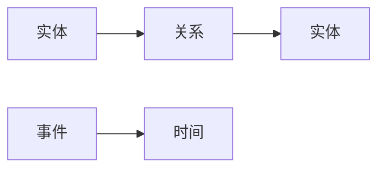

                 

# 构建基于知识图谱的金融风险关联网络动态演化系统

## 关键词：知识图谱、金融风险、关联网络、动态演化、系统架构

## 摘要：
本文旨在探讨如何利用知识图谱构建金融风险关联网络的动态演化系统。通过对知识图谱和风险关联网络的深入分析，结合动态演化算法和系统架构设计，提出了一套完整的解决方案，以实现金融风险的智能化监控与预警。

---

## 目录大纲

### 第一部分: 知识图谱与金融风险关联网络概述

#### 第1章: 问题背景与系统构建目标

##### 1.1 问题背景
- **1.1.1 金融风险关联网络的复杂性**：金融市场的复杂性导致风险传播难以预测，传统方法难以捕捉非线性关联。
- **1.1.2 知识图谱在金融风险分析中的应用价值**：知识图谱能够整合多源异构数据，揭示隐性关联。
- **1.1.3 当前金融风险管理的痛点与挑战**：数据孤岛、实时性不足、关联关系动态变化难以捕捉。

##### 1.2 系统构建目标
- **1.2.1 知识图谱构建的目标**：建立覆盖金融机构、资产、事件的知识网络。
- **1.2.2 风险关联网络动态演化的核心任务**：实时更新网络结构，捕捉风险传播路径。
- **1.2.3 系统功能与性能指标**：支持实时更新、高可用性、可扩展性。

##### 1.3 系统边界与外延
- **1.3.1 系统功能边界**：仅关注风险关联网络的构建与演化，不涉及具体的风险评估模型。
- **1.3.2 系统的输入输出范围**：输入为多源数据流，输出为动态风险网络图。
- **1.3.3 系统与其他模块的交互关系**：与数据采集模块、风险评估模块无缝对接。

##### 1.4 核心概念结构与组成
- **1.4.1 知识图谱的三元组表示**：实体-关系-实体。
- **1.4.2 风险关联网络的节点与边关系**：节点为风险事件，边为关联强度。
- **1.4.3 动态演化系统的组成要素**：数据源、知识抽取模块、动态更新模块。

##### 1.5 本章小结：简要总结本章内容，强调知识图谱在金融风险管理中的关键作用。

---

#### 第2章: 知识图谱与风险关联网络的核心概念

##### 2.1 知识图谱的基本原理
- **2.1.1 知识图谱的定义与特点**：语义网络，支持复杂关系表示。
- **2.1.2 知识图谱的构建流程**：数据清洗、实体识别、关系抽取。
- **2.1.3 知识图谱的存储与表示**：使用RDF或图数据库（如Neo4j）。

##### 2.2 风险关联网络的构建方法
- **2.2.1 风险关联网络的定义**：表示金融实体间的风险传播路径。
- **2.2.2 风险关联网络的构建步骤**：数据采集、特征提取、网络构建。
- **2.2.3 风险关联网络的动态演化特征**：实时更新、动态权重调整。

##### 2.3 知识图谱与风险关联网络的联系
- **2.3.1 知识图谱在风险关联网络中的应用**：提供语义支持，增强关联准确性。
- **2.3.2 知识图谱与风险关联网络的融合方法**：基于实体嵌入的网络融合。
- **2.3.3 知识图谱驱动风险关联网络动态演化的优势**：语义丰富，关联智能。

##### 2.4 核心概念属性特征对比表
| 概念 | 属性 | 特征 |
|------|------|------|
| 知识图谱 | 表示方式 | 三元组（实体-关系-实体） |
| 风险关联网络 | 节点类型 | 机构、资产、事件等 |
| 动态演化系统 | 演化机制 | 时间序列、事件驱动 |

##### 2.5 ER实体关系图架构

##### 2.6 本章小结：总结知识图谱与风险关联网络的核心概念及其联系。

---

#### 第3章: 知识图谱构建的算法原理

##### 3.1 知识图谱构建算法概述
- **3.1.1 知识抽取算法**：基于规则或深度学习的方法提取实体和关系。
- **3.1.2 实体识别算法**：如CRF、LSTM用于命名实体识别。
- **3.1.3 关系抽取算法**：基于句法分析或嵌入的方法识别关系。

##### 3.2 基于图嵌入的表示学习
- **3.2.1 图嵌入的基本原理**：将图结构转化为低维向量表示。
- **3.2.2 常见图嵌入算法**：Node2Vec、Word2Vec、TransE。
- **3.2.3 图嵌入在风险关联网络中的应用**：用于节点相似性计算和推荐。

##### 3.3 知识图谱动态更新算法
- **3.3.1 动态图的表示方法**：支持增量更新的图嵌入方法。
- **3.3.2 基于事件驱动的图更新算法**：实时更新图结构以反映最新事件。
- **3.3.3**

---

### 第四章: 风险关联网络动态演化算法

#### 4.1 网络演化机制
- **4.1.1 动态网络模型**：如ER模型、LSI模型。
- **4.1.2 时间序列分析**：使用ARIMA或LSTM预测网络演化趋势。
- **4.1.3 事件驱动的网络更新**：基于实时事件调整网络权重。

#### 4.2 关联规则挖掘
- **4.2.1 关联规则挖掘算法**：Apriori、FP-Growth用于发现关联模式。
- **4.2.2 关联规则在风险网络中的应用**：识别高风险关联路径。

#### 4.3 动态演化算法实现
- **4.3.1 基于社区检测的网络演化**：使用Louvain算法识别风险社区。
- **4.3.2 基于网络流的演化方法**：优化网络权重分布。

---

### 第五章: 系统架构与实现

#### 5.1 系统架构设计
- **5.1.1 系统功能模块**：数据采集、知识抽取、动态更新、可视化。
- **5.1.2 系统架构图**：展示各模块之间的交互关系。
- **5.1.3 接口设计**：定义模块间的数据接口。

#### 5.2 系统实现细节
- **5.2.1 数据预处理**：清洗和格式化数据。
- **5.2.2 知识图谱构建**：实现实体识别和关系抽取。
- **5.2.3 动态更新逻辑**：实现基于事件的网络演化。

#### 5.3 系统性能优化
- **5.3.1 并行处理**：优化数据处理效率。
- **5.3.2 模型轻量化**：减少计算资源消耗。

---

### 第六章: 项目实战与案例分析

#### 6.1 项目环境安装
- **6.1.1 安装依赖**：如Python、Neo4j、TensorFlow。

#### 6.2 核心代码实现
- **6.2.1 数据处理模块**：读取数据并清洗。
- **6.2.2 知识抽取模块**：实现实体识别和关系抽取。
- **6.2.3 动态更新模块**：实现网络演化算法。

#### 6.3 案例分析
- **6.3.1 数据来源**：如金融新闻、市场数据。
- **6.3.2 网络构建**：展示风险关联网络的可视化结果。
- **6.3.3 动态演化效果**：分析网络权重变化。

#### 6.4 项目小结：总结项目实现的关键点和成果。

---

### 第七章: 最佳实践与扩展阅读

#### 7.1 最佳实践
- **7.1.1 数据质量管理**：确保数据准确性和完整性。
- **7.1.2 系统可扩展性**：设计模块化架构便于扩展。

#### 7.2 小结：总结全文，强调知识图谱在金融风险管理中的重要性。

#### 7.3 注意事项：提醒读者注意数据隐私和系统安全。

#### 7.4 拓展阅读：推荐相关领域的书籍和论文。

---

### 参考文献：列出相关的学术论文、书籍和技术文档。

---

### 附录：提供完整的代码示例和技术细节补充说明。

