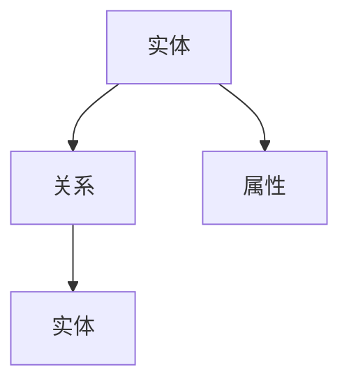
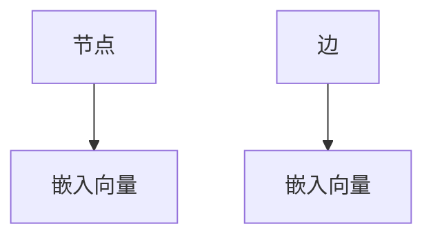
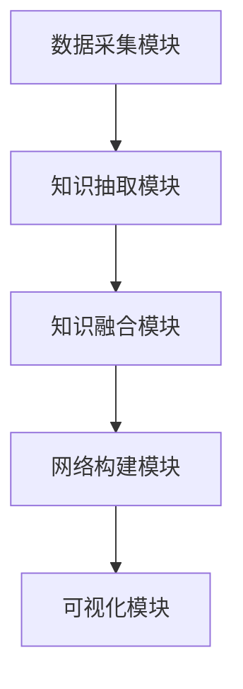

                 


# 构建基于知识图谱的金融风险关联网络可视化系统

> 关键词：知识图谱，金融风险，关联网络，可视化系统，图神经网络，系统架构设计

> 摘要：本文详细探讨了如何构建基于知识图谱的金融风险关联网络可视化系统。首先介绍了知识图谱和金融风险的基本概念，分析了构建该系统的背景和需求。接着，深入讲解了知识图谱与风险关联网络的核心概念，包括实体识别、关系抽取、图结构建模等。然后，详细阐述了构建系统的算法原理，包括知识抽取与融合算法、关联网络构建算法以及图嵌入技术。随后，设计了系统的架构，包括功能模块划分、系统接口设计和交互流程。最后，通过一个具体的金融风险案例，详细讲解了系统的实现过程，并总结了系统的优势和未来的发展方向。

---

## 第一部分: 背景与核心概念

### 第1章: 知识图谱与金融风险关联网络概述

#### 1.1 知识图谱的基本概念

知识图谱是一种以图结构形式表示知识的语义网络，由实体（概念）、关系（属性）和属性值组成。知识图谱的核心目标是通过结构化的数据描述现实世界中的各种实体及其之间的关系。

- 实体：知识图谱中的基本单元，代表具有独立存在意义的对象，例如“公司”、“股票”、“风险事件”等。
- 关系：描述实体之间的关联，例如“属于”、“影响”、“关联”等。
- 属性：描述实体的特征，例如“公司名称”、“成立时间”等。

知识图谱的构建流程包括知识抽取、知识融合和知识表示三个阶段。

#### 1.2 金融风险关联网络的定义与特点

金融风险关联网络是通过知识图谱技术构建的，用于分析金融市场的风险传播和关联关系的网络。其特点包括：

- **复杂性**：金融市场中的风险因素众多，涉及多个实体和复杂的关系。
- **动态性**：金融市场的风险关系会随着时间变化而变化。
- **关联性**：不同实体之间的风险可能相互影响，形成复杂的网络结构。

#### 1.3 知识图谱在金融风险中的应用

知识图谱在金融风险中的应用主要体现在以下几个方面：

1. **风险识别**：通过知识图谱可以识别潜在的风险源和风险事件。
2. **风险传播分析**：通过图结构分析风险在网络中的传播路径。
3. **风险预警**：通过实时监控风险关联网络的变化，提前预警潜在风险。

### 第2章: 问题背景与需求分析

#### 2.1 问题背景

传统的金融风险分析方法主要依赖于统计模型和历史数据分析，存在以下问题：

1. **数据孤岛**：不同数据源之间的数据难以有效整合。
2. **关系复杂**：金融市场中的实体和关系复杂多样，难以用简单的统计模型描述。
3. **实时性不足**：传统的分析方法难以实时捕捉市场中的最新动态。

知识图谱通过结构化数据和语义信息，能够有效解决上述问题。

#### 2.2 需求分析

金融风险关联网络可视化系统的需求包括：

1. **数据采集与处理**：能够从多种数据源采集金融数据，并进行清洗和预处理。
2. **知识抽取与融合**：能够从文本数据中抽取实体和关系，并进行知识融合。
3. **网络构建与分析**：能够构建风险关联网络，并进行风险传播分析。
4. **可视化展示**：能够以直观的方式展示风险关联网络，并支持交互式分析。

### 第3章: 知识图谱与金融风险关联网络的核心概念

#### 3.1 知识图谱的核心概念

知识图谱的核心概念包括实体、关系和属性。实体是知识图谱的基本单元，关系描述实体之间的关联，属性描述实体的特征。

#### 3.2 金融风险关联网络的构建原理

金融风险关联网络的构建包括以下几个步骤：

1. **实体识别**：识别与金融风险相关的实体，例如公司、股票、风险事件等。
2. **关系抽取**：抽取实体之间的关系，例如“公司A的股票受政策影响下跌”。
3. **网络构建**：将实体和关系构建为图结构，形成风险关联网络。

#### 3.3 知识图谱与风险网络的对比分析

表1 对比了知识图谱和风险网络的核心概念：

| 对比维度 | 知识图谱 | 风险网络 |
|----------|----------|----------|
| 核心目标 | 描述知识关系 | 分析风险传播 |
| 数据来源 | 多源异构数据 | 金融业务数据 |
| 分析目标 | 知识组织与检索 | 风险预警与控制 |

图1展示了知识图谱的ER实体关系图：



---

## 第二部分: 算法原理与数学模型

### 第4章: 知识图谱构建算法

#### 4.1 知识抽取算法

知识抽取包括实体识别、关系抽取和属性抽取。常用的方法包括基于规则的抽取和基于深度学习的抽取。

- **基于规则的抽取**：通过预定义的规则从文本中抽取实体和关系。
- **基于深度学习的抽取**：利用神经网络模型（如BERT）进行抽取。

#### 4.2 知识融合算法

知识融合包括实体对齐和知识合并。实体对齐的目标是将不同数据源中的实体进行统一标识。

- **实体对齐**：通过计算实体的相似度进行对齐。
- **知识合并**：将多个数据源中的知识进行整合，消除冗余。

### 第5章: 金融风险关联网络构建算法

#### 5.1 关联网络构建

关联网络的构建包括以下步骤：

1. **风险节点识别**：识别与金融风险相关的节点，例如公司、股票等。
2. **风险关系建模**：通过图结构描述节点之间的关系，例如“公司A的股票受政策影响下跌”。
3. **网络动态更新**：实时更新网络结构，反映最新的风险信息。

#### 5.2 图嵌入技术

图嵌入技术用于将图结构数据转化为低维向量，便于后续的分析和计算。

- **节点嵌入**：将节点表示为低维向量，例如Word2Vec。
- **边嵌入**：将边表示为低维向量。

图2展示了图嵌入技术的流程图：



### 第6章: 数学模型与公式

#### 6.1 知识图谱的表示

知识图谱可以用图结构表示，包括节点和边。节点表示实体，边表示关系。

数学公式：

$$
G = (V, E)
$$

其中，$V$ 表示节点集合，$E$ 表示边集合。

#### 6.2 风险传播模型

风险传播模型用于分析风险在网络中的传播路径。

数学公式：

$$
P(i, t+1) = \sum_{j} A_{ij} P(j, t)
$$

其中，$P(i, t)$ 表示节点$i$在时间$t$的风险概率，$A_{ij}$ 表示节点$i$和$j$之间的关联强度。

---

## 第三部分: 系统架构与实现

### 第7章: 系统架构设计

#### 7.1 功能模块划分

系统功能模块包括：

1. 数据采集模块：从多种数据源采集金融数据。
2. 知识抽取模块：从文本数据中抽取实体和关系。
3. 知识融合模块：对抽取的知识进行融合。
4. 网络构建模块：构建风险关联网络。
5. 可视化模块：以图形化方式展示网络结构。

#### 7.2 系统架构图

图3展示了系统的架构图：



### 第8章: 项目实战

#### 8.1 环境安装

需要安装以下工具和库：

1. Python 3.8+
2. Jupyter Notebook
3. NetworkX
4. matplotlib
5. spacy

#### 8.2 核心代码实现

以下是一个简单的金融风险关联网络构建的Python代码示例：

```python
import networkx as nx
import matplotlib.pyplot as plt

# 创建知识图谱
G = nx.Graph()

# 添加节点
G.add_nodes_from(["公司A", "公司B", "政策影响", "股价下跌"])

# 添加边
G.add_edges_from([("公司A", "政策影响"), ("政策影响", "股价下跌"), ("公司B", "股价下跌")])

# 可视化
nx.draw(G, node_size=1500, font_size=10, node_color="red")
plt.show()
```

#### 8.3 案例分析

以公司A和公司B为例，分析它们的风险关联网络：

1. 公司A受到政策影响，导致股价下跌。
2. 公司B也受到政策影响，导致股价下跌。
3. 因此，公司A和公司B之间存在风险关联。

### 第9章: 总结与展望

#### 9.1 总结

本文详细介绍了如何构建基于知识图谱的金融风险关联网络可视化系统，包括系统的背景、核心概念、算法原理、系统架构和项目实战。

#### 9.2 展望

未来的研究方向包括：

1. 提高知识抽取的准确性和效率。
2. 增强风险传播模型的预测能力。
3. 提升系统的实时性和交互性。

---

## 附录

### 附录A: 工具安装与配置

安装环境：

```bash
pip install networkx
pip install matplotlib
pip install spacy
```

### 附录B: 数据集介绍

推荐使用公开的金融数据集，例如：

1. [金融数据集1](https://example.com/dataset1)
2. [金融数据集2](https://example.com/dataset2)

---

以上是《构建基于知识图谱的金融风险关联网络可视化系统》的技术博客文章的大纲和内容。希望对您有所帮助！

