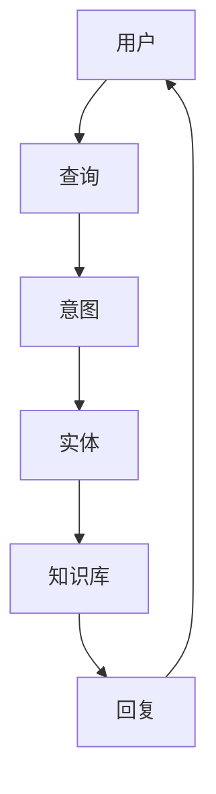

                 

# 构建投资理财智能助手的核心技术解析

> 关键词：投资理财、智能助手、自然语言处理、机器学习、知识图谱

> 摘要：本文详细解析了构建投资理财智能助手的核心技术，包括自然语言处理、机器学习、知识图谱等技术在投资理财中的应用，分析了智能助手的系统架构设计，并通过实际案例展示了如何实现这些技术。

---

## 第1章: 投资理财智能助手的背景与问题背景

### 1.1 投资理财行业的现状与挑战

#### 1.1.1 当前投资理财行业的痛点分析

投资理财行业近年来发展迅速，但仍然存在以下痛点：
- **信息过载**：投资者面对海量信息，难以快速筛选出有价值的内容。
- **决策复杂**：投资决策涉及多因素分析，普通投资者难以掌握。
- **个性化需求**：不同投资者的风险承受能力和收益目标差异大，需要个性化的服务。
- **服务成本高**：传统投资顾问服务成本高，难以覆盖更广泛的用户群体。

#### 1.1.2 传统投资理财服务的局限性

- **服务覆盖面有限**：传统投资顾问服务主要面向高净值客户，难以覆盖更广泛的用户群体。
- **服务效率低**：人工服务效率低，难以快速响应大量用户的需求。
- **缺乏智能化支持**：传统服务依赖人工经验，缺乏数据驱动的决策支持。

#### 1.1.3 智能化投资理财助手的需求与趋势

- **需求**：投资者需要一种高效、个性化的投资理财工具，能够快速获取信息、分析数据并提供决策建议。
- **趋势**：随着人工智能技术的成熟，智能化投资理财助手逐渐成为行业趋势，能够显著降低服务成本，提高服务效率。

### 1.2 智能助手在投资理财中的应用前景

#### 1.2.1 智能助手的核心价值

- **高效信息处理**：快速筛选和分析海量数据，为投资者提供实时信息。
- **个性化服务**：根据投资者的偏好和风险承受能力，提供定制化的投资建议。
- **24/7可用性**：智能助手可以全天候为投资者提供服务，无需人工值守。

#### 1.2.2 智能助手在投资理财中的潜在应用场景

- **智能问诊**：投资者可以通过对话形式获取投资建议。
- **数据可视化**：提供直观的投资数据图表，帮助投资者理解市场动态。
- **策略推荐**：基于数据分析，为投资者推荐合适的投资策略。
- **风险管理**：实时监控投资组合，提供风险预警。

#### 1.2.3 智能助手对投资理财行业的深远影响

- **服务成本降低**：通过自动化技术，显著降低人工服务成本。
- **用户体验提升**：投资者可以随时随地获得高效、个性化的服务。
- **行业创新推动**：智能化助手将推动投资理财行业的技术创新和服务模式创新。

### 1.3 问题背景与目标

#### 1.3.1 投资理财智能助手的核心问题

- 如何高效处理投资理财数据？
- 如何实现自然语言理解与生成？
- 如何构建个性化投资策略推荐系统？

#### 1.3.2 问题的边界与外延

- 系统需支持多语言交互（中文、英文等）。
- 支持多种投资品种（股票、基金、债券等）。
- 需考虑不同市场的数据源和接口。

#### 1.3.3 目标与实现路径

- **目标**：构建一个高效、智能、个性化的投资理财助手，能够为用户提供实时信息查询、投资建议和风险管理服务。
- **实现路径**：采用自然语言处理技术实现智能交互，结合机器学习构建投资策略推荐系统，并利用知识图谱进行信息组织与推理。

## 第2章: 投资理财智能助手的核心概念与技术基础

### 2.1 智能助手的核心概念

#### 2.1.1 自然语言处理（NLP）在智能助手中的应用

- **文本理解**：通过NLP技术，智能助手可以理解用户的查询意图。
- **文本生成**：生成自然流畅的回复，提升用户体验。
- **对话管理**：实现多轮对话，保持上下文一致性。

#### 2.1.2 机器学习与深度学习在投资理财中的作用

- **数据预测**：利用机器学习模型预测市场走势。
- **用户画像**：通过机器学习构建用户画像，提供个性化服务。
- **风险评估**：基于历史数据，评估投资组合的风险。

#### 2.1.3 知识图谱与语义理解的构建

- **知识图谱**：构建投资理财领域的知识图谱，包含术语、概念、实体关系等。
- **语义理解**：通过知识图谱实现语义理解，提升智能助手的准确性。

### 2.2 核心技术的联系与对比

#### 2.2.1 NLP、机器学习与知识图谱的协同工作

- **协同工作流程**：
  1. NLP技术处理用户输入，提取意图和实体。
  2. 知识图谱提供领域知识，帮助智能助手理解上下文。
  3. 机器学习模型基于历史数据生成投资建议。

#### 2.2.2 技术对比分析表格

| 技术 | 核心功能 | 优缺点 | 应用场景 |
|------|----------|--------|----------|
| NLP  | 文本理解与生成 | 需要大量标注数据，计算资源需求高 | 交互式对话 |
| 机器学习 | 数据分析与预测 | 数据依赖性强，模型更新周期长 | 投资策略生成 |
| 知识图谱 | 知识组织与推理 | 知识构建复杂，需要持续更新 | 语义理解 |

#### 2.2.3 ER实体关系图架构

---

通过以上分析，我们可以看到构建投资理财智能助手需要结合NLP、机器学习和知识图谱等多种技术，每个技术都有其独特的作用和挑战。下一章将深入探讨这些技术的算法原理，包括自然语言处理和机器学习模型的具体实现。

