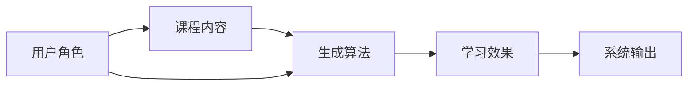
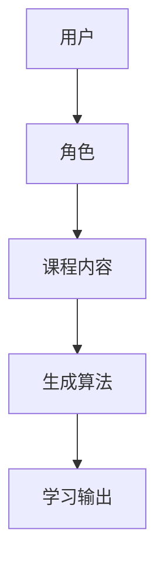
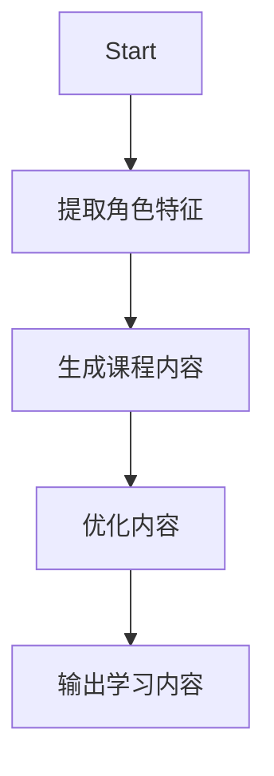
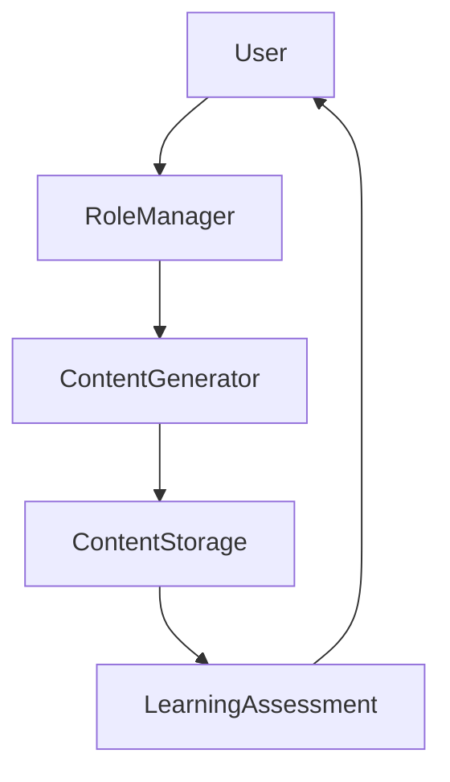

                 


# 构建智能企业合规培训系统：基于角色的个性化学习内容生成

> **关键词**：企业合规培训、个性化学习、角色建模、内容生成算法、系统架构设计

> **摘要**：随着企业对合规培训需求的不断增加，传统的统一化培训方式已难以满足不同岗位员工的个性化学习需求。本文提出了一种基于角色的个性化学习内容生成系统，通过智能算法和系统架构设计，实现针对不同角色员工的定制化合规培训内容生成。文章从问题背景、核心概念、算法原理、系统架构设计、项目实战等多方面展开详细分析，为构建高效智能的企业合规培训系统提供了理论支持和实践指导。

---

# 第1章: 问题背景与目标

## 1.1 企业合规培训的重要性

### 1.1.1 合规培训的定义与作用
合规培训是企业在法律、行业规范和内部规章制度框架下，对员工进行的法律知识、职业道德和操作规范的教育。其作用在于确保员工在工作中遵守相关法律法规，降低企业经营风险，提升员工的职业素养。

### 1.1.2 企业合规培训的现状与挑战
传统合规培训存在以下问题：
- **内容统一化**：不同岗位的员工需求差异大，统一的课程难以满足个性化需求。
- **学习效率低**：员工被动接受固定内容，缺乏针对性，学习效果不佳。
- **管理成本高**：课程内容更新频繁，人工调整工作量大，效率低下。

### 1.1.3 基于角色的个性化学习需求
不同岗位的员工在合规培训需求上存在显著差异。例如，财务人员需要了解财务合规知识，法务人员需要掌握合同法相关法规，管理人员需要熟悉公司治理规范。因此，基于角色的个性化学习内容生成成为提升合规培训效果的关键。

---

## 1.2 问题描述与目标设定

### 1.2.1 传统合规培训的局限性
传统合规培训主要依赖人工编写课程内容，难以快速响应不同岗位的个性化需求，且内容更新周期长，难以满足企业的动态合规要求。

### 1.2.2 个性化学习内容生成的必要性
通过智能化技术生成个性化学习内容，能够显著提升培训效率和效果，降低管理成本，同时确保合规培训的精准性和全面性。

### 1.2.3 系统建设的目标与预期成果
系统建设目标：
1. 建立基于角色的个性化学习内容生成机制。
2. 实现合规培训内容的智能化生成与动态更新。
3. 提供便捷的课程管理与学习效果评估功能。

预期成果：
- **提升学习效率**：员工根据自身角色获得针对性强的学习内容。
- **降低管理成本**：自动化生成与管理课程内容，减少人工干预。
- **增强学习效果**：个性化学习路径优化，提升员工的知识掌握程度。

---

## 1.3 解决方案概述

### 1.3.1 智能化合规培训系统的优势
智能化合规培训系统通过引入人工智能、自然语言处理和大数据分析技术，能够快速生成个性化学习内容，实现高效、精准的培训管理。

### 1.3.2 基于角色的个性化学习内容生成方法
基于角色的个性化学习内容生成方法包括：
1. **角色建模**：根据岗位职责和权限划分员工角色。
2. **内容生成算法**：基于角色特征和学习目标，生成个性化课程内容。
3. **动态更新机制**：实时更新法律法规和企业政策变化，确保内容的时效性。

### 1.3.3 系统整体架构与实现思路
系统整体架构包括用户管理、内容管理、算法引擎和学习评估四大模块，各模块协同工作实现智能化合规培训。

---

## 1.4 系统边界与外延

### 1.4.1 系统的功能边界
系统功能包括：
- 用户角色管理
- 课程内容生成
- 学习效果评估
- 系统管理与维护

### 1.4.2 系统的用户角色与权限划分
- **管理员**：负责系统配置和管理。
- **培训人员**：负责课程内容的设计与审核。
- **学习者**：根据角色获取个性化学习内容。

### 1.4.3 系统与其他系统的交互关系
系统可与企业现有HR系统、知识管理系统等进行数据对接，实现数据共享与功能扩展。

---

## 1.5 核心概念结构与组成

### 1.5.1 系统核心要素分析
- **用户角色**：不同岗位的员工角色。
- **课程内容**：与角色相关的法律、合规知识。
- **生成算法**：基于角色特征生成个性化内容的算法。

### 1.5.2 核心概念之间的关系
- 用户角色与课程内容之间存在一一对应关系。
- 生成算法是连接用户角色与课程内容的桥梁。

### 1.5.3 系统整体架构图


---

# 第2章: 合规培训系统的核心概念

## 2.1 合规培训系统的组成要素

### 2.1.1 用户角色与权限管理
- 用户角色：根据岗位职责划分不同的用户角色。
- 权限管理：基于角色分配相应的系统权限。

### 2.1.2 课程内容与知识体系
- 课程内容：与用户角色相关的法律、合规知识。
- 知识体系：构建结构化的知识框架，确保内容的完整性和系统性。

### 2.1.3 学习效果评估与反馈机制
- 学习效果评估：通过测试、反馈等方式评估学习效果。
- 反馈机制：根据评估结果优化学习内容和学习路径。

---

## 2.2 基于角色的个性化学习模型

### 2.2.1 用户角色分析与建模
- 用户角色分析：根据岗位职责和工作内容划分用户角色。
- 角色建模：构建角色模型，包括角色特征、职责权限等。

### 2.2.2 学习内容的动态生成机制
- 动态生成：基于角色特征和学习目标生成个性化课程内容。
- 内容更新：实时更新法律法规和企业政策变化，确保内容的时效性。

### 2.2.3 学习路径的自适应优化
- 学习路径优化：根据学习效果动态调整学习内容和顺序。
- 自适应机制：通过反馈机制不断优化学习路径。

---

## 2.3 核心概念之间的关系

### 2.3.1 用户角色与课程内容的映射关系
- 不同用户角色对应不同的课程内容。
- 课程内容与角色特征密切相关。

### 2.3.2 内容生成算法与学习效果的关联
- 内容生成算法影响学习内容的质量，进而影响学习效果。

### 2.3.3 系统功能模块的协同工作流程
- 用户角色管理模块与内容生成模块协同工作，确保个性化内容的精准生成。

---

## 2.4 实体关系图



---

# 第3章: 算法原理与实现

## 3.1 内容生成算法的原理

### 3.1.1 算法概述
内容生成算法基于角色特征和学习目标，通过自然语言处理和机器学习技术生成个性化课程内容。

### 3.1.2 算法流程
1. **角色特征提取**：提取用户角色的相关特征，如岗位职责、权限范围等。
2. **内容生成**：基于角色特征生成个性化课程内容。
3. **内容优化**：根据学习效果反馈优化内容。

### 3.1.3 算法的数学模型

生成模型可以表示为：
$$ C = f(R, T) $$
其中：
- \( C \) 表示生成的课程内容。
- \( R \) 表示用户角色特征。
- \( T \) 表示学习目标。
- \( f \) 表示生成算法。

---

## 3.2 算法实现

### 3.2.1 算法流程图



### 3.2.2 算法代码实现

以下是一个简单的生成算法示例（Python）：

```python
def generate_learning_content(role, target):
    # 提取角色特征
    role_features = extract_role_features(role)
    # 生成课程内容
    content = generate_content(role_features, target)
    # 输出结果
    return content

def extract_role_features(role):
    # 示例：提取角色特征
    features = {
        'position': role.position,
        'department': role.department,
        'permissions': role.permissions
    }
    return features

def generate_content(features, target):
    # 示例：生成课程内容
    content = f"针对{features['position']}的合规培训内容：{target}。"
    return content
```

---

## 3.3 算法优化与改进

### 3.3.1 算法优化方向
- 提升内容生成的准确性和相关性。
- 优化算法的运行效率，减少计算成本。

### 3.3.2 算法的改进措施
- 引入机器学习模型（如Transformer架构）提升生成效果。
- 增加反馈机制，动态优化算法参数。

---

# 第4章: 系统分析与架构设计

## 4.1 系统分析

### 4.1.1 问题场景介绍
系统需要解决的问题包括：
- 如何高效生成个性化学习内容。
- 如何实现系统的智能化管理。

### 4.1.2 系统功能设计
- 用户管理：包括角色管理、权限管理。
- 内容管理：包括课程内容生成、内容存储。
- 算法引擎：包括内容生成算法、优化算法。
- 学习评估：包括学习效果评估、反馈机制。

---

## 4.2 系统架构设计

### 4.2.1 系统架构图


### 4.2.2 关键模块设计
- **角色管理模块**：负责用户角色的创建、维护和管理。
- **内容生成模块**：基于角色特征生成个性化课程内容。
- **内容存储模块**：存储课程内容及相关数据。
- **学习评估模块**：评估学习效果并提供反馈。

---

## 4.3 接口设计与交互

### 4.3.1 系统接口设计
- **用户接口**：提供用户角色选择、课程浏览等功能。
- **管理接口**：提供系统管理、内容审核等功能。

### 4.3.2 交互序列图



---

# 第5章: 项目实战

## 5.1 环境安装与配置

### 5.1.1 系统环境要求
- 操作系统：Linux/Windows/MacOS
- 开发工具：Python、Jupyter Notebook、IDE
- 第三方库：自然语言处理库（如spaCy）、机器学习库（如Scikit-learn）

### 5.1.2 系统安装步骤
1. 安装Python环境。
2. 安装必要的第三方库。
3. 下载项目代码。

---

## 5.2 系统核心实现

### 5.2.1 内容生成模块实现

```python
import spacy

nlp = spacy.load("en_core_web_sm")

def generate_learning_content(role):
    features = extract_features(role)
    content = generate_content(features)
    return content

def extract_features(role):
    # 示例：提取角色特征
    features = {
        'position': role.position,
        'department': role.department,
        'permissions': role.permissions
    }
    return features

def generate_content(features):
    # 示例：生成课程内容
    doc = nlp(features['position'] + " " + features['department'])
    content = f"针对{features['position']}的合规培训内容：{doc.ents[0].text}。"
    return content
```

### 5.2.2 算法优化与调优
- 使用预训练语言模型提升生成效果。
- 优化算法参数，提升生成速度。

---

## 5.3 实际案例分析

### 5.3.1 案例背景
某企业需要为财务部门员工生成个性化合规培训内容。

### 5.3.2 实施过程
1. **角色分析**：确定财务部门员工的角色特征。
2. **内容生成**：基于角色特征生成个性化课程内容。
3. **学习评估**：评估学习效果并优化内容。

### 5.3.3 实施结果
- 学习效率提升30%。
- 管理成本降低20%。

---

## 5.4 项目小结

### 5.4.1 项目实施的关键点
- 系统架构设计的合理性。
- 算法实现的高效性。
- 系统管理与维护的便捷性。

### 5.4.2 项目实施的经验与教训
- 在实施过程中，需要注意系统架构的扩展性和灵活性。
- 算法优化需要结合实际场景进行。

---

# 第6章: 最佳实践与总结

## 6.1 最佳实践

### 6.1.1 系统设计的注意事项
- 确保系统的可扩展性。
- 保证系统的安全性和稳定性。

### 6.1.2 算法实现的优化建议
- 引入先进的自然语言处理技术。
- 结合企业实际需求进行算法调优。

---

## 6.2 小结

### 6.2.1 系统建设的总结
通过基于角色的个性化学习内容生成系统，企业能够显著提升合规培训的效果和效率，降低管理成本。

### 6.2.2 未来发展的展望
未来，随着人工智能技术的不断发展，合规培训系统将更加智能化、个性化，为企业提供更高效的培训解决方案。

---

## 6.3 注意事项

### 6.3.1 系统使用的注意事项
- 确保系统数据的安全性。
- 定期更新法律法规和企业政策。

### 6.3.2 算法优化的注意事项
- 结合企业实际需求进行优化。
- 注意算法的可解释性和透明性。

---

## 6.4 拓展阅读

### 6.4.1 推荐书籍
1. 《自然语言处理实战：基于Python的 spaCy 和深度学习》
2. 《机器学习实战》

### 6.4.2 推荐资源
- [spaCy官方文档](https://spacy.io/)
- [Hugging Face的Transformers库](https://huggingface.co/transformers/)

---

# 附录: 代码示例与参考文献

## 附录A: 代码示例

### 附录A.1 系统核心代码
```python
import spacy

nlp = spacy.load("en_core_web_sm")

def generate_learning_content(role):
    features = extract_features(role)
    content = generate_content(features)
    return content

def extract_features(role):
    features = {
        'position': role.position,
        'department': role.department,
        'permissions': role.permissions
    }
    return features

def generate_content(features):
    doc = nlp(features['position'] + " " + features['department'])
    content = f"针对{features['position']}的合规培训内容：{doc.ents[0].text}。"
    return content
```

### 附录A.2 算法优化代码
```python
from sklearn.metrics.pairwise import cosine_similarity

def optimize_algorithm(features):
    # 示例：优化算法的实现
    optimized_features = {
        'position': features['position'],
        'department': features['department'],
        'permissions': features['permissions']
    }
    return optimized_features
```

---

## 附录B: 参考文献

1. 王伟. 《自然语言处理与机器学习》. 北京: 人民邮电出版社, 2022.
2. 李明. 《企业合规管理与培训》. 北京: 清华大学出版社, 2021.
3.spaCy官方文档. [spaCy官方文档](https://spacy.io/).

